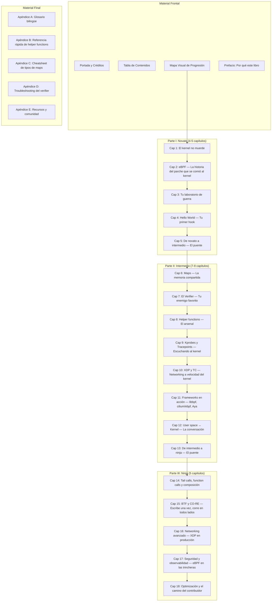

# Documento de Diseño

## Overview

Este documento define la arquitectura y el plan de escritura del libro **"eBPF: Macizo y Conciso"** — un libro técnico en español que lleva al lector desde cero conocimiento de eBPF hasta dominio avanzado del tema.

**Esto es un libro, no un proyecto de software.** El diseño describe:
- Cómo se organizan las partes, capítulos y secciones
- Qué temas cubre cada capítulo y en qué orden
- El formato de los ejercicios por nivel
- El manejo de terminología bilingüe
- Los elementos pedagógicos (diagramas, analogías, advertencias)
- La estructura del repositorio de código complementario
- El formato de escritura y herramientas de autoría
- Los apéndices y material de referencia

**Principios de diseño:**
- Tono directo, irreverente, punk pero honesto — cero relleno corporativo
- Código BPF siempre en C (no hay alternativa). User space en Go (cilium/ebpf) como lenguaje principal del libro
- Rust (Aya) se presenta como alternativa avanzada solo en el capítulo de frameworks
- Python/BCC se menciona brevemente como herramienta de scripting, pero no se usa en ejemplos
- Terminología técnica en inglés, explicaciones en español
- Progresión estricta: cada capítulo construye sobre el anterior
- Ejercicios que escalan en autonomía del lector
- Un solo stack principal (C + Go) para no perder foco — el lector no salta entre lenguajes

## Architecture

### Estructura General del Libro



### Distribución de Páginas

| Parte | Capítulos | Páginas estimadas | Porcentaje |
|-------|-----------|-------------------|------------|
| Novato | 5 (Caps 1-5) | 80-100 | ~25% |
| Intermedio | 8 (Caps 6-13) | 160-180 | ~45% |
| Ninja | 5 (Caps 14-18) | 100-120 | ~30% |
| **Total** | **18** | **340-400** | **100%** |

Esto cumple con los rangos requeridos: Novato 20-30%, Intermedio 40-50%, Ninja 25-35%.

### Formato de Escritura y Herramientas

**Formato principal:** Markdown (mdBook)

**Justificación:**
- mdBook genera HTML estático navegable — ideal para libro técnico con código
- Soporte nativo de syntax highlighting para C, Go y Rust
- Integración con el repositorio de código (puede incluir archivos externos)
- Exportable a PDF vía `mdbook-pdf` (usa Chromium headless)
- Permite custom CSS para los recuadros de Analogía, Advertencia, etc.
- Versionable en Git junto con el código de los ejercicios

**Estructura de archivos del libro:**

```
ebpf_macizo/
├── book.toml                    # Configuración de mdBook
├── src/
│   ├── SUMMARY.md              # Tabla de contenidos
│   ├── prefacio.md
│   ├── mapa-progresion.md
│   ├── parte-1-novato/
│   │   ├── intro.md
│   │   ├── cap01-kernel-no-muerde.md
│   │   ├── cap02-historia-ebpf.md
│   │   ├── cap03-laboratorio.md
│   │   ├── cap04-hello-world.md
│   │   └── cap05-puente-intermedio.md
│   ├── parte-2-intermedio/
│   │   ├── intro.md
│   │   ├── cap06-maps.md
│   │   ├── cap07-verifier.md
│   │   ├── cap08-helpers.md
│   │   ├── cap09-kprobes-tracepoints.md
│   │   ├── cap10-xdp-tc.md
│   │   ├── cap11-frameworks.md
│   │   ├── cap12-user-kernel.md
│   │   └── cap13-puente-ninja.md
│   ├── parte-3-ninja/
│   │   ├── intro.md
│   │   ├── cap14-tail-calls.md
│   │   ├── cap15-btf-core.md
│   │   ├── cap16-networking-avanzado.md
│   │   ├── cap17-seguridad-observabilidad.md
│   │   └── cap18-optimizacion-contribuidor.md
│   └── apendices/
│       ├── glosario.md
│       ├── helper-functions.md
│       ├── tipos-maps.md
│       ├── troubleshooting-verifier.md
│       └── recursos.md
├── code/                        # Repositorio de código complementario
│   └── (ver sección dedicada)
├── theme/                       # CSS personalizado para recuadros
│   └── custom.css
└── .kiro/                       # Specs del proyecto
```

## Components and Interfaces

### Componentes del Libro (Estructura Interna de cada Capítulo)

Cada capítulo sigue una plantilla consistente:

```markdown
# Capítulo N: [Título]

> [Cita punk o frase directa que define el tono del capítulo]

## Términos nuevos en este capítulo
- **term1** — explicación breve
- **term2** — explicación breve

## Objetivos
Al terminar este capítulo vas a poder:
1. [Capacidad observable 1]
2. [Capacidad observable 2]
3. [Capacidad observable 3]

## Prerrequisitos
- [Concepto del capítulo anterior requerido]
- [Otro concepto si aplica]

---

## [Sección 1: Contenido principal]

[Contenido con ejemplos de código, diagramas, y explicaciones]

{{#include ../code/capNN/ejemplo.c}}

> 🔥 **Advertencia**: [Error común y cómo evitarlo]

> 💡 **Analogía**: [Concepto técnico explicado con situación cotidiana]

## [Sección 2: Contenido principal]

[Más contenido...]

## [Sección N]

---

## Ejercicio: [Título del ejercicio]

[Formato según nivel — ver sección de ejercicios]

---

## Resumen

Lo que te llevas de este capítulo:
1. [Punto clave 1]
2. [Punto clave 2]
...

## Para saber más

- 📖 [Recurso de documentación oficial](url)
- 📝 [Artículo o blog post](url)
- 💻 [Repositorio de código relevante](url)
```

### Recuadros Pedagógicos (Custom CSS)

| Tipo | Ícono | Propósito |
|------|-------|-----------|
| Advertencia | 🔥 | Error común, trampa frecuente, comportamiento inesperado |
| Analogía | 💡 | Concepto abstracto explicado con metáfora cotidiana |
| Nota técnica | ⚙️ | Detalle de implementación para los más curiosos |
| Historia | 📜 | Contexto histórico o anécdota relevante del ecosistema |
| Cuidado | ☠️ | Puede causar crash del kernel o pérdida de datos si se hace mal |

### Diagramas

**Herramienta:** Mermaid (renderizado nativo en mdBook con plugin `mdbook-mermaid`)

Tipos de diagramas por uso:
- **Arquitectónicos** (flowchart): Relación entre componentes del kernel y programa eBPF
- **Flujo de datos** (sequence): Cómo fluyen los datos entre user space y kernel
- **Estados** (stateDiagram): Ciclo de vida de un programa eBPF (carga → verificación → attach → ejecución)
- **Jerarquías** (classDiagram): Tipos de programas, tipos de maps, taxonomías

Mínimo 1 diagrama por capítulo (requerimiento). En la práctica, los capítulos del nivel intermedio y ninja tendrán 2-4 diagramas cada uno.

## Data Models

### Modelo del Capítulo (Checklist de Completitud)

Cada capítulo debe cumplir con estos campos antes de considerarse "completo":

| Campo | Restricción | Nivel Novato | Nivel Intermedio | Nivel Ninja |
|-------|-------------|--------------|------------------|-------------|
| Título | Obligatorio | ✓ | ✓ | ✓ |
| Cita/frase de apertura | Obligatorio | ✓ | ✓ | ✓ |
| Términos nuevos | Lista al inicio | ✓ | ✓ | ✓ |
| Objetivos de aprendizaje | 2-4 capacidades observables | ✓ | ✓ | ✓ |
| Prerrequisitos | Del capítulo anterior | ✓ | ✓ | ✓ |
| Secciones | Mínimo 2 | ✓ | ✓ | ✓ |
| Código funcional | Por sección con tema técnico | C (BPF) + Go (user) | C (BPF) + Go (user) | C (BPF) + Go (user) |
| Diagrama(s) | Mínimo 1 | ✓ | ✓ | ✓ |
| Analogía(s) | Cuando hay abstracción nueva | ✓ | ✓ | Opcional |
| Advertencia(s) | Mínimo 1 | ✓ | ✓ | ✓ |
| Ejercicio | Según formato del nivel | Paso a paso | Esqueleto | Proyecto |
| Resumen | 3-7 puntos clave | ✓ | ✓ | ✓ |
| Para saber más | Mínimo 2 recursos | ✓ | ✓ | ✓ |
| Páginas | 10-40 | 15-20 | 20-30 | 20-35 |

### Modelo de Término Técnico

Cada término técnico se documenta con:

```
**attach point** (atach point) — lugar del kernel donde un programa eBPF se engancha
para interceptar eventos. Ej: "El kprobe es un attach point en la entrada de una función."
```

Formato: `**término_inglés** (pronunciación) — explicación 3-15 palabras. Ej: "uso en contexto."`

Si existe traducción en español validada: `**ring buffer** (ring báfer) — búfer circular para comunicación kernel→user space. También llamado "búfer circular" en algunos textos.`

### Modelo de Ejercicio por Nivel

**Nivel Novato — Paso a paso:**
```markdown
## Ejercicio: [Título]

📋 **Nivel:** Novato
📚 **Conceptos previos:** [lista]
🖥️ **Entorno:** [instrucciones de setup con container]

### Paso 1: [Acción]
```c
// código completo aquí
```
**Resultado esperado:**
```
[salida exacta en terminal]
```

### Paso 2: [Acción]
...

### Verificación final
[Qué debe ver el lector si todo salió bien]
```

**Nivel Intermedio — Esqueleto:**
```markdown
## Ejercicio: [Título]

📋 **Nivel:** Intermedio
📚 **Conceptos previos:** [lista]
🖥️ **Entorno:** [instrucciones]
🎯 **Problema:** [descripción del problema a resolver]

### Esqueleto de código
```c
// TODO: implementar la función que...
int handle_event(struct bpf_context *ctx) {
    // Tu código aquí
    // Pista: usa bpf_map_lookup_elem para...
}
```

### Criterios de éxito
- [ ] [criterio observable 1]
- [ ] [criterio observable 2]

### Pistas
1. [Pista parcial sin dar la solución]
2. [Otra pista]
3. [Pista más específica si te atoras]

### Caso de prueba
[Comando para validar la solución]
```

**Nivel Ninja — Proyecto:**
```markdown
## Ejercicio: [Título]

📋 **Nivel:** Ninja
📚 **Conceptos previos:** [lista]
🖥️ **Entorno:** [instrucciones]

### Escenario
[Descripción de un escenario con restricciones de producción]

### Requisitos funcionales
1. [requisito]
2. [requisito]

### Restricciones
- Latencia máxima: X µs por paquete
- Debe soportar: Y conexiones concurrentes
- [otra restricción de producción]

### Técnicas requeridas
- [técnica avanzada 1 del capítulo]
- [técnica avanzada 2]

### Nota
No hay una sola solución correcta. Diseña, implementa, y mide.
```

## Contenido Detallado por Capítulo

### PARTE I: NOVATO (Capítulos 1-5)

---

#### Capítulo 1: El kernel no muerde
**Páginas estimadas:** 15-20

**Objetivos:**
1. Explicar qué es el kernel y su rol en el sistema operativo
2. Identificar los subsistemas principales del kernel Linux (scheduler, networking, filesystem, memory)
3. Distinguir entre user space y kernel space

**Secciones:**
1. ¿Qué carajo es el kernel? — Desmitificando el monolito
2. User space vs kernel space — La muralla china de tu sistema
3. System calls — El teléfono rojo entre tu código y el kernel
4. ¿Por qué te debería importar? — El kernel como plataforma programable

**Diagrama:** Arquitectura simplificada del kernel Linux mostrando la separación user/kernel

**Analogía:** El kernel como el sistema nervioso del cuerpo — procesa todo sin que te des cuenta

**Advertencia:** "No, no necesitas recompilar el kernel para extenderlo. Eso era antes de eBPF."

**Ejercicio:** Usar `strace` para observar syscalls de un programa simple. Paso a paso completo.

---

#### Capítulo 2: eBPF — La historia del parche que se comió al kernel
**Páginas estimadas:** 15-20

**Objetivos:**
1. Narrar la evolución de BPF clásico a eBPF
2. Explicar el modelo de ejecución de eBPF en el kernel
3. Enumerar los casos de uso principales (networking, observabilidad, seguridad)

**Secciones:**
1. De BPF a eBPF — La evolución de un filtro de paquetes a una máquina virtual
2. El modelo de ejecución — Cómo corre código en el kernel sin matarlo
3. Hooks y attach points — Dónde puedes engancharte
4. El ecosistema en 2024+ — Quién usa eBPF y para qué

**Diagrama:** Línea de tiempo de BPF→eBPF con hitos clave. Diagrama del modelo de ejecución (compilar → cargar → verificar → JIT → ejecutar)

**Analogía:** eBPF como "plugins" para el kernel — igual que extensiones de un navegador pero para el sistema operativo

**Advertencia:** "eBPF no es un módulo del kernel. No puede crashear tu sistema (si el verifier hace su trabajo)."

**Ejercicio:** Explorar programas eBPF ya cargados en tu sistema con `bpftool prog list`. Paso a paso.

---

#### Capítulo 3: Tu laboratorio de guerra
**Páginas estimadas:** 18-22

**Objetivos:**
1. Configurar un entorno de desarrollo funcional para eBPF
2. Verificar que el kernel soporta las features necesarias
3. Compilar y cargar un programa eBPF mínimo con cada framework

**Secciones:**
1. Kernel mínimo y configuración — Qué versión necesitas y qué flags activar
2. El toolchain — clang, LLVM, bpftool, y amigos
3. Tres caminos: libbpf (C), cilium/ebpf (Go), Aya (Rust) — panorama rápido de cada uno
4. Tu primer "it works" — Compilar un esqueleto vacío con cilium/ebpf (Go)
5. Contenedores y VMs — Un lab portátil que funciona igual en todos lados

**Diagrama:** Flujo del toolchain: código fuente → compilación → bytecode BPF → carga al kernel

**Advertencia:** "Si tu kernel es < 5.x, vas a sufrir. Actualiza primero, llora después."

**Ejercicio:** Configurar el entorno completo usando el Vagrantfile/Dockerfile proporcionado y ejecutar el esqueleto en Go. Paso a paso con verificación.

---

#### Capítulo 4: Hello World — Tu primer hook
**Páginas estimadas:** 20-25

**Objetivos:**
1. Escribir un programa eBPF completo que se adjunte a un tracepoint
2. Observar la salida del programa via trace_pipe
3. Entender el ciclo completo: escribir → compilar → cargar → adjuntar → observar

**Secciones:**
1. El programa más simple del mundo — bpf_trace_printk y nada más
2. El lado del kernel — Escribiendo el programa BPF en C
3. El lado del user space — Cargando con cilium/ebpf (Go)
4. ¿Qué pasó por debajo? — Anatomía de la carga y verificación

**Diagrama:** Secuencia completa desde `open()` hasta ver output en trace_pipe

**Analogía:** Como poner un micrófono en una habitación — el programa escucha eventos sin interferir

**Advertencia:** "bpf_trace_printk es para debug, no para producción. Si lo usas en prod, te vas a enterar por la peor vía."

**Ejercicio:** Escribir un Hello World que imprima el PID y el nombre del proceso cada vez que se ejecuta un execve. Código completo en C (BPF) + Go (user space).

**Criterio de éxito (Hello World):** El programa se carga sin errores del verifier, se adjunta al tracepoint `sys_enter_execve`, y produce salida observable en `/sys/kernel/debug/tracing/trace_pipe`.

---

#### Capítulo 5: De novato a intermedio — El puente
**Páginas estimadas:** 12-15

**Objetivos:**
1. Consolidar los conceptos fundamentales del nivel novato
2. Identificar las limitaciones de lo aprendido hasta ahora
3. Preparar la mentalidad para programación activa con eBPF

**Secciones:**
1. Lo que ya sabes — Resumen ejecutivo del Nivel Novato
2. Lo que todavía no puedes hacer — Motivación para el siguiente nivel
3. El mapa de lo que viene — Preview del Nivel Intermedio

**Diagrama:** Mapa de conceptos aprendidos vs conceptos por aprender

**Ejercicio:** Auto-evaluación: lista de verificación de conceptos que el lector debe poder explicar antes de continuar.

---

### PARTE II: INTERMEDIO (Capítulos 6-13)

---

#### Capítulo 6: Maps — La memoria compartida
**Páginas estimadas:** 25-30

**Objetivos:**
1. Crear y manipular maps de diferentes tipos (hash, array, ring buffer, per-CPU)
2. Compartir datos entre programas eBPF y user space
3. Elegir el tipo de map correcto según el caso de uso

**Secciones:**
1. ¿Qué son los maps? — Estructuras de datos que viven en el kernel
2. Hash maps — Tu diccionario favorito, pero en kernel space
3. Array maps y per-CPU — Cuando necesitas velocidad bruta
4. Ring buffer — El canal de streaming kernel → user space
5. Operaciones CRUD — Lookup, update, delete desde ambos lados
6. Patrones de uso — Cuándo usar qué tipo de map

**Diagramas:** Diagrama de memoria mostrando dónde vive un map. Flujo de datos ring buffer.

**Analogía:** Maps como pizarras compartidas entre el kernel (que escribe) y tu programa en user space (que lee)

**Advertencia:** "Un map sin cleanup es un memory leak en kernel space. El kernel no tiene garbage collector."

**Ejercicio (Intermedio):** Implementar un contador de syscalls por proceso usando un hash map. Esqueleto proporcionado, el lector completa la lógica de lookup/update.

---

#### Capítulo 7: El Verifier — Tu enemigo favorito
**Páginas estimadas:** 22-28

**Objetivos:**
1. Entender las reglas del verifier y por qué existen
2. Diagnosticar y resolver errores comunes del verifier
3. Escribir código que pase verificación a la primera (o casi)

**Secciones:**
1. ¿Por qué existe el verifier? — Safety first en kernel space
2. Las reglas del juego — Bounded loops, valid pointers, stack limits
3. Los errores más comunes — Y cómo resolverlos
4. Trucos para hacer feliz al verifier — Patterns que funcionan
5. Cuando el verifier se equivoca — Falsos positivos y workarounds

**Diagramas:** Flujo de decisión del verifier. Árbol de estados del análisis estático.

**Analogía:** El verifier como un guardia de seguridad paranoico — mejor prevenir que crashear

**Advertencia:** "Si el verifier dice que tu loop es infinito, no discutas. Ponle un bound explícito."

**Ejercicio (Intermedio):** Se proporciona un programa que falla en el verifier con 3 errores distintos. El lector debe diagnosticar y corregir cada uno. Se dan pistas pero no la solución.

---

#### Capítulo 8: Helper functions — El arsenal
**Páginas estimadas:** 20-25

**Objetivos:**
1. Conocer las helper functions más usadas por categoría
2. Usar helpers para obtener información del contexto (PID, comm, timestamp)
3. Entender las restricciones de qué helpers están disponibles por tipo de programa

**Secciones:**
1. ¿Qué son las helper functions? — La API del kernel para programas BPF
2. Helpers de contexto — bpf_get_current_pid_tgid, bpf_get_current_comm, etc.
3. Helpers de maps — Las operaciones sobre mapas desde BPF
4. Helpers de networking — Manipulación de paquetes
5. Helpers de output — Perf events, ring buffer, trace_printk
6. La matriz de compatibilidad — Qué helpers van con qué tipo de programa

**Diagrama:** Matriz visual helpers × tipos de programa

**Advertencia:** "No todas las helpers están disponibles en todos los tipos de programa. El verifier te lo dirá, pero mejor saberlo antes."

**Ejercicio (Intermedio):** Escribir un programa que mida la latencia de syscalls usando `bpf_ktime_get_ns()`. Esqueleto con la estructura, el lector implementa la lógica de timing.

---

#### Capítulo 9: Kprobes y Tracepoints — Escuchando al kernel
**Páginas estimadas:** 25-30

**Objetivos:**
1. Adjuntar programas eBPF a kprobes y kretprobes
2. Usar tracepoints estáticos del kernel
3. Capturar argumentos de funciones del kernel

**Secciones:**
1. Kprobes — Interceptando cualquier función del kernel
2. Kretprobes — Capturando valores de retorno
3. Tracepoints — Los puntos de instrumentación oficiales
4. Fentry/Fexit — La evolución moderna (BTF-enabled)
5. Patrones prácticos — Tracing de syscalls, filesystem, scheduling

**Diagramas:** Diferencia visual entre kprobe (entrada) y kretprobe (salida). Flujo de un tracepoint.

**Analogía:** Kprobes como puntos de quiebre (breakpoints) del kernel, pero que no detienen la ejecución

**Advertencia:** "Los kprobes son inestables entre versiones del kernel. Si una función interna cambia de nombre, tu programa deja de funcionar. Usa tracepoints cuando puedas."

**Ejercicio (Intermedio):** Construir un tracer de operaciones de filesystem (open, read, write) que registre qué archivos abre cada proceso. Esqueleto + criterios de éxito.

---

#### Capítulo 10: XDP y TC — Networking a velocidad del kernel
**Páginas estimadas:** 25-30

**Objetivos:**
1. Escribir programas XDP que procesen paquetes antes del network stack
2. Usar TC (Traffic Control) para filtrado de tráfico
3. Parsear headers de paquetes (Ethernet, IP, TCP/UDP) en eBPF

**Secciones:**
1. XDP — El fast path más rápido que existe
2. Acciones XDP — PASS, DROP, TX, REDIRECT, ABORTED
3. TC (Traffic Control) — Filtrado después del network stack
4. Parseando paquetes — Ethernet → IP → TCP/UDP byte por byte
5. XDP vs TC — Cuándo usar cada uno

**Diagramas:** Posición de XDP y TC en el network stack. Flujo de un paquete con decisiones XDP.

**Analogía:** XDP como un portero de discoteca — decide quién entra antes de que lleguen al bar

**Advertencia:** "En XDP, un pointer que se sale del paquete = verifier reject. Siempre valida bounds antes de leer."

**Ejercicio (Intermedio):** Implementar un firewall XDP básico que bloquee tráfico de IPs específicas. Esqueleto con el parseo de headers, el lector implementa la lógica de decisión.

---

#### Capítulo 11: Frameworks en acción — cilium/ebpf, Aya, y el ecosistema
**Páginas estimadas:** 28-35

**Objetivos:**
1. Entender por qué Go (cilium/ebpf) es el framework principal del libro
2. Conocer Rust (Aya) como alternativa avanzada para proyectos que requieren safety garantizado
3. Tomar una decisión informada de framework según el proyecto

**Secciones:**
1. Por qué cilium/ebpf (Go) — El framework principal de este libro y por qué
2. El programa de referencia — Un contador de paquetes XDP con stats por protocolo (en Go)
3. El mismo programa en Aya (Rust) — Safety garantizado, moderno
4. Mención breve: libbpf (C) puro y BCC (Python) — Cuándo tienen sentido
5. Comparativa — Tabla de trade-offs (ergonomía, compilación, debugging, comunidad)
6. Guía de decisión — Árbol para elegir framework según tu proyecto

**Diagramas:** Arquitectura de cilium/ebpf y Aya mostrando las capas de abstracción

**Advertencia:** "No hay framework 'mejor'. Hay framework correcto para tu contexto. Elige según tu equipo y tu stack, no según lo que está de moda en Twitter."

**Ejercicio (Intermedio):** Extender el programa de referencia para agregar conteo por IP de destino usando cilium/ebpf. Esqueleto + criterios de éxito.

---

#### Capítulo 12: User space ↔ Kernel — La conversación
**Páginas estimadas:** 22-28

**Objetivos:**
1. Implementar comunicación bidireccional entre user space y programas BPF
2. Usar perf events, ring buffer, y maps para pasar datos
3. Diseñar protocolos eficientes de comunicación kernel→user

**Secciones:**
1. El problema — El kernel tiene datos, tu app los necesita
2. Perf events — La forma clásica
3. Ring buffer — La forma moderna y eficiente
4. Maps compartidos — Comunicación bidireccional vía maps
5. Patrones de diseño — Buffering, sampling, aggregación en kernel

**Diagramas:** Comparativa visual perf buffer vs ring buffer. Flujo de datos end-to-end.

**Analogía:** Como un sistema de tubos neumáticos — el kernel mete mensajes en el tubo, tu app los recibe al otro lado

**Advertencia:** "Si tu programa BPF genera eventos más rápido de lo que user space los consume, pierdes datos. Diseña con back-pressure en mente."

**Ejercicio (Intermedio):** Implementar un event logger que envíe eventos estructurados del kernel al user space via ring buffer. Esqueleto del programa BPF, el lector implementa el consumer en user space.

---

#### Capítulo 13: De intermedio a ninja — El puente
**Páginas estimadas:** 12-15

**Objetivos:**
1. Consolidar todo el conocimiento del nivel intermedio
2. Entender las limitaciones de los programas eBPF "simples"
3. Motivar las técnicas avanzadas del nivel ninja

**Secciones:**
1. Lo que ya dominas — Resumen del Nivel Intermedio
2. Las paredes que vas a golpear — Limitaciones de programas single-attach, sin composición
3. El siguiente nivel — Preview de tail calls, BTF/CO-RE, y producción

**Diagrama:** Mapa de conceptos completo hasta este punto

**Ejercicio:** Mini-proyecto integrador: construir un tool de observabilidad simple que combine kprobes + maps + ring buffer + user space consumer. El lector ya tiene todas las piezas.

---

### PARTE III: NINJA (Capítulos 14-18)

---

#### Capítulo 14: Tail calls, function calls y composición
**Páginas estimadas:** 22-28

**Objetivos:**
1. Usar tail calls para componer programas eBPF
2. Implementar function calls (BPF-to-BPF) para modularizar código
3. Diseñar pipelines de procesamiento con múltiples programas

**Secciones:**
1. El problema de la complejidad — Por qué un solo programa no basta
2. Tail calls — Llamando a otro programa BPF sin volver
3. BPF-to-BPF function calls — Modularización real
4. Combinando ambos — Arquitectura de programas complejos
5. Limitaciones y trade-offs — Stack depth, verifier complexity

**Diagramas:** Pipeline de tail calls. Comparación tail call vs function call.

**Integra conceptos previos:** Maps (Cap 6) para pasar contexto entre tail calls, Verifier (Cap 7) y sus reglas para función calls.

**Advertencia:** "Los tail calls no son recursión infinita. Hay un límite de 33 saltos. Diseña tu pipeline con eso en mente."

**Ejercicio (Ninja):** Diseñar e implementar un classifier de paquetes multi-protocolo que use tail calls para delegar a handlers especializados por tipo de protocolo. Requisitos funcionales + restricciones de latencia. Sin solución proporcionada.

---

#### Capítulo 15: BTF y CO-RE — Escribe una vez, corre en todos lados
**Páginas estimadas:** 22-28

**Objetivos:**
1. Entender el problema de portabilidad entre versiones de kernel
2. Usar BTF (BPF Type Format) para acceso type-safe a estructuras del kernel
3. Implementar programas CO-RE que funcionen en múltiples kernels

**Secciones:**
1. El infierno de las versiones — Por qué struct task_struct cambia entre kernels
2. BTF — Metadata de tipos para el kernel
3. CO-RE — Compile Once, Run Everywhere
4. vmlinux.h — El header que contiene todo el kernel
5. Relocations y field access — Cómo CO-RE resuelve offsets en runtime
6. Limitaciones — Cuándo CO-RE no puede salvarte

**Diagramas:** Problema sin CO-RE vs con CO-RE. Flujo de relocations en tiempo de carga.

**Integra conceptos previos:** Kprobes (Cap 9) como caso de uso principal de CO-RE, Frameworks (Cap 11) y su soporte de BTF.

**Advertencia:** "CO-RE necesita BTF habilitado en el kernel target. Si tu kernel de producción no lo tiene, necesitas un plan B."

**Limitaciones analizadas:** 1) Requiere kernel con BTF (>= 5.2 compilado con CONFIG_DEBUG_INFO_BTF). 2) No maneja cambios semánticos, solo estructurales. 

**Alternativa sin eBPF:** Para portabilidad de tracing, SystemTap o kernel modules versionados pueden ser más simples si solo necesitas soportar 2-3 versiones específicas.

**Ejercicio (Ninja):** Escribir un programa de observabilidad que funcione sin modificación en kernels 5.10, 5.15 y 6.1, accediendo a campos de task_struct que cambiaron de posición. Solo requisitos.

---

#### Capítulo 16: Networking avanzado — XDP en producción
**Páginas estimadas:** 25-30

**Objetivos:**
1. Implementar load balancing con XDP
2. Usar XDP redirect para forwarding entre interfaces
3. Diseñar soluciones de networking de alta performance

**Secciones:**
1. XDP en producción — De juguete a infraestructura crítica
2. Load balancing — IPVS en eBPF con XDP
3. DDoS mitigation — Filtrando millones de paquetes por segundo
4. XDP redirect y devmap — Forwarding entre interfaces
5. AF_XDP — Zero-copy networking para user space
6. Caso de estudio: Katran (Meta) — Load balancer XDP en producción

**Diagramas:** Arquitectura de un load balancer XDP. Flujo de XDP redirect.

**Integra conceptos previos:** XDP/TC (Cap 10) como base, Maps (Cap 6) para tablas de routing, CO-RE (Cap 15) para portabilidad.

**Casos de estudio:**
1. **Katran (Meta)** — Load balancer XDP que maneja billones de requests
2. **Cilium** — Networking y security para Kubernetes con eBPF
3. **Cloudflare** — DDoS mitigation con XDP en edge

**Limitaciones:** 1) XDP no soporta todos los NIC drivers. 2) Hardware offload limitado a NICs específicas. 

**Alternativa sin eBPF:** Para load balancing simple, IPVS o HAProxy siguen siendo más simples de operar y debuggear.

**Advertencia:** "XDP en modo native requiere soporte del driver. Si tu NIC no lo soporta, caes a generic mode y pierdes toda la ventaja de rendimiento."

**Ejercicio (Ninja):** Diseñar un load balancer L4 con health checks y consistent hashing. Restricciones: <5µs por paquete, soporte de 100k conexiones concurrentes. Solo especificación.

---

#### Capítulo 17: Seguridad y observabilidad — eBPF en las trincheras
**Páginas estimadas:** 25-30

**Objetivos:**
1. Implementar detección de intrusiones con eBPF
2. Construir pipelines de observabilidad en producción
3. Entender el modelo de seguridad de eBPF (capabilities, namespaces)

**Secciones:**
1. eBPF para seguridad — Runtime security sin overhead
2. LSM hooks — Security policies programables
3. Detección de comportamiento anómalo — Syscall monitoring en esteroides
4. Observabilidad a escala — Métricas, logs y traces con eBPF
5. El modelo de seguridad de eBPF — Quién puede cargar programas y por qué
6. Caso de estudio: Falco y Tetragon — Security runtime basado en eBPF

**Diagramas:** Arquitectura de un sistema de runtime security. Pipeline de observabilidad con eBPF.

**Integra conceptos previos:** Kprobes/Tracepoints (Cap 9) para monitoreo, Ring buffer (Cap 12) para streaming de eventos, Tail calls (Cap 14) para pipelines de detección.

**Casos de estudio:**
1. **Falco (Sysdig)** — Runtime security para containers con eBPF
2. **Tetragon (Isovalent/Cilium)** — Security observability and enforcement
3. **Pixie (New Relic)** — Auto-instrumentation de aplicaciones con eBPF

**Limitaciones:** 1) Los LSM hooks requieren kernel >= 5.7. 2) eBPF programs en security path añaden latencia que debe medirse.

**Alternativa sin eBPF:** Para auditoría simple, `auditd` + reglas puede ser suficiente y más fácil de operar.

**Advertencia:** "eBPF es powerful, pero CAP_BPF en manos equivocadas es un rootkit perfecto. Asegura el acceso a bpf()."

**Ejercicio (Ninja):** Diseñar un sistema de detección de container escapes que combine LSM hooks + syscall monitoring + alerting en tiempo real. Restricciones de latencia y false positive rate. Solo especificación.

---

#### Capítulo 18: Optimización y el camino del contribuidor
**Páginas estimadas:** 22-28

**Objetivos:**
1. Perfilar y optimizar programas eBPF para producción
2. Entender el proceso de contribución al kernel Linux (subsistema BPF)
3. Navegar la comunidad y los recursos para seguir aprendiendo

**Secciones:**
1. Profiling de programas BPF — bpftool, perf, y métricas de rendimiento
2. Optimización — Batching, per-CPU maps, inlining, reducir lookups
3. Testing de programas eBPF — BPF_PROG_TEST_RUN y unit testing
4. Contribuir al kernel — El proceso, los maintainers, la etiqueta
5. El ecosistema eBPF en 2024+ — Hacia dónde va todo esto
6. Tu siguiente paso — Proyectos recomendados para seguir creciendo

**Diagramas:** Pipeline de profiling. Mapa del ecosistema eBPF actual.

**Integra conceptos previos:** Verifier (Cap 7) entendiendo su costo, Maps per-CPU (Cap 6) como optimización, CO-RE (Cap 15) para distribución de tools.

**Caso de estudio:** Revisión de un parche real enviado al subsistema BPF del kernel Linux — proceso completo de un contribuidor.

**Limitaciones:** 1) BPF_PROG_TEST_RUN no soporta todos los tipos de programa. 2) El profiling añade overhead que puede alterar los resultados.

**Advertencia:** "Optimizar antes de medir es la fuente de todo sufrimiento en performance engineering. Mide primero."

**Ejercicio (Ninja):** Tomar uno de los ejercicios previos del libro, perfilarlo, identificar al menos 2 cuellos de botella, y optimizarlo con evidencia medida (before/after). Sin solución — el lector elige qué optimizar.

---

## Repositorio de Código Complementario

### Estructura

```
code/
├── README.md                    # Índice y cómo usar el repo
├── setup/
│   ├── Vagrantfile             # VM con kernel adecuado
│   ├── Dockerfile              # Container para desarrollo
│   └── check-env.sh           # Script de verificación del entorno
├── cap01-kernel/
│   └── ejercicio/
│       └── README.md           # Instrucciones del ejercicio
├── cap02-historia/
│   └── ejercicio/
│       └── README.md
├── cap03-laboratorio/
│   ├── bpf/
│   │   ├── Makefile
│   │   └── minimal.bpf.c
│   ├── go/
│   │   ├── go.mod
│   │   └── main.go
│   └── ejercicio/
│       └── README.md
├── cap04-hello-world/
│   ├── bpf/
│   │   └── hello.bpf.c
│   ├── go/
│   │   ├── go.mod
│   │   └── main.go
│   └── ejercicio/
│       ├── bpf/                # Programa BPF del ejercicio
│       ├── go/                 # Solución en Go
│       └── README.md
├── cap05-puente/
│   └── ejercicio/
│       └── README.md
├── cap06-maps/
│   ├── bpf/                    # Programas BPF de los ejemplos
│   ├── go/                     # User space en Go
│   └── ejercicio/
│       ├── esqueleto/          # Código parcial para el lector
│       ├── solucion/           # Solución de referencia
│       └── README.md
├── cap07-verifier/
│   ├── bpf/
│   │   ├── broken/             # Programas que fallan el verifier
│   │   └── fixed/              # Versiones corregidas
│   └── ejercicio/
│       └── ...
├── cap11-frameworks/
│   ├── go/                     # Implementación principal en cilium/ebpf
│   ├── rust/                   # Implementación alternativa en Aya (solo este capítulo)
│   └── bpf/
├── ...                          # Capítulos 8-18 siguen el patrón bpf/ + go/
└── apendices/
    ├── helper-functions/       # Ejemplos de referencia
    └── common/                 # Código compartido entre capítulos
```

### Convenciones del Repositorio

- Cada capítulo tiene su directorio `capNN-nombre/`
- `bpf/` contiene el código del lado kernel (siempre C)
- `go/` contiene el código del lado user space (cilium/ebpf)
- Solo el capítulo 11 tiene `rust/` con la implementación en Aya como comparación
- Cada ejercicio tiene `esqueleto/` (lo que recibe el lector) y `solucion/` (referencia)
- Todo el código compila y corre con el entorno de `setup/`
- Makefiles y scripts de build consistentes entre capítulos
- Los ejemplos están probados contra kernel 5.15+ (LTS) y 6.1+ (LTS)

### Lenguajes por Nivel

| Nivel | Código BPF (kernel side) | Código user space |
|-------|-------------------------|-------------------|
| Novato | C (siempre) | Go (cilium/ebpf) |
| Intermedio | C (siempre) | Go (cilium/ebpf) — Cap 11 también muestra Rust (Aya) |
| Ninja | C (siempre) | Go (cilium/ebpf) |

El código BPF siempre se escribe en C (restricción del compilador). El user space es consistentemente Go con cilium/ebpf, excepto en el capítulo 11 donde se compara con Aya (Rust).

## Apéndices

### Apéndice A: Glosario Bilingüe

Formato de cada entrada:
```
**attach point** — Punto del kernel donde un programa eBPF se engancha para
interceptar eventos. El programa se ejecuta cada vez que el código del kernel 
pasa por ese punto. [Introducido: Capítulo 2]
```

Organizado alfabéticamente por el término en inglés. Incluye todos los términos marcados como nuevos en cada capítulo (~80-120 términos esperados).

### Apéndice B: Referencia Rápida de Helper Functions

Organizado por tipo de programa:
- Helpers disponibles para XDP
- Helpers disponibles para TC
- Helpers disponibles para Kprobes/Tracepoints
- Helpers disponibles para LSM
- Helpers universales (disponibles en todos)

Cada entrada: nombre, firma, descripción de 1 línea, y kernel mínimo requerido.

### Apéndice C: Cheatsheet de Tipos de Maps

Tabla rápida: tipo de map × características (max entries, per-CPU, user-accessible, etc.)

### Apéndice D: Troubleshooting del Verifier

Los 20 errores más comunes del verifier con:
- Mensaje de error exacto
- Qué significa
- Cómo resolverlo
- Ejemplo de código antes/después

### Apéndice E: Recursos y Comunidad

- Documentación oficial del kernel
- Repositorios clave (libbpf, cilium/ebpf, aya)
- Conferencias (eBPF Summit, Linux Plumbers)
- Comunidades (eBPF Slack, listas de correo)
- Blogs y newsletters recomendados

## Error Handling

### Errores del Proceso de Escritura

Este libro es un proyecto de escritura. Los "errores" son problemas editoriales:

| Problema | Cómo detectarlo | Cómo resolverlo |
|----------|----------------|-----------------|
| Término usado antes de ser introducido | Revisión editorial del orden de términos | Mover la introducción antes, o agregar nota de referencia adelantada |
| Ejercicio no compila | CI del repo de código (Makefile por capítulo) | Fix del código antes de publicar |
| Capítulo excede 40 páginas | Conteo de palabras (~250 palabras/página) | Dividir en dos capítulos o mover contenido a apéndice |
| Diagrama incorrecto | Revisión técnica | Corregir el Mermaid source |
| Inconsistencia terminológica | Grep del término en todo el libro | Normalizar al primer uso |
| Ejemplo desactualizado | Probar contra kernel LTS actual | Actualizar código y output |

### CI del Repositorio de Código

El repositorio tiene CI que verifica:
- Todos los programas BPF compilan sin errores (C con clang)
- Todos los loaders en Go compilan (go build)
- El capítulo 11 compila también en Rust (cargo build)
- Los Makefiles producen binarios válidos
- Los programas BPF pasan el verifier (usando BPF_PROG_TEST_RUN donde sea posible)
- Las soluciones de ejercicios compilan

Esto garantiza que el código del libro nunca se pudre.

## Testing Strategy

### Esto es un libro, no software

**Property-based testing NO aplica aquí.** No hay funciones puras, no hay inputs/outputs programáticos, no hay código que testear con generadores aleatorios.

La estrategia de calidad del libro se basa en:

### 1. Verificación del Código (Automatizada)

- CI en el repositorio de código: compila todos los ejemplos y ejercicios
- Tests de los programas BPF contra kernel real (VM en CI)
- Verificación de que todos los comandos documentados producen el output mostrado

### 2. Revisión Editorial (Manual)

- Revisión de progresión: verificar que cada capítulo solo usa conceptos ya introducidos
- Revisión de terminología: consistencia de términos en todo el libro
- Revisión técnica: al menos 1 reviewer por cada nivel
- Revisión de estilo: tono consistente (directo, irreverente, sin relleno)

### 3. Beta Readers

- Grupo de beta readers por nivel (novatos reales, intermedios reales, ninjas reales)
- Feedback sobre claridad, ritmo, y ejercicios
- Iteración basada en dónde se atoran los lectores

### 4. Checklist de Completitud por Capítulo

Antes de considerar un capítulo "done":
- [ ] Tiene todos los elementos de la plantilla (términos, objetivos, prerrequisitos, etc.)
- [ ] Todo el código compila y corre
- [ ] El ejercicio es resoluble con solo lo explicado hasta ese punto
- [ ] Al menos 1 diagrama incluido
- [ ] Al menos 1 advertencia incluida
- [ ] Resumen con 3-7 puntos
- [ ] Al menos 2 recursos en "Para saber más"
- [ ] Revisado por al menos 1 persona del nivel target
