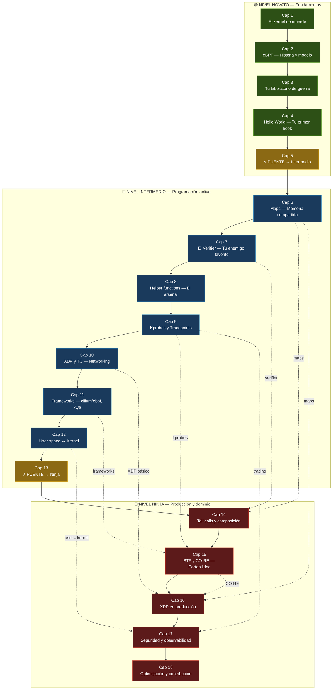

# Mapa de Progresión

> Tu ruta visual desde cero hasta ninja en eBPF. 18 capítulos, 3 niveles, sin atajos.

---

## La ruta completa

Este diagrama muestra el camino que vas a recorrer. Cada nodo es un capítulo. Las flechas indican dependencias — no puedes entender lo de abajo sin haber pasado por lo de arriba.

Los capítulos 5 y 13 son **puentes**: consolidan lo aprendido y te preparan para el siguiente nivel.

---

## Los tres niveles

| Nivel | Capítulos | Páginas | Qué aprendes |
|-------|:---------:|:-------:|--------------|
| 🟢 **Novato** | 1 — 5 | ~80-100 | Qué es el kernel, qué es eBPF, tu primer programa funcionando |
| 🔵 **Intermedio** | 6 — 13 | ~160-180 | Maps, verifier, helpers, networking, frameworks, comunicación kernel↔user |
| 🔴 **Ninja** | 14 — 18 | ~100-120 | Tail calls, CO-RE, XDP en prod, seguridad, optimización, contribución |

---

## Capítulo por capítulo

### 🟢 Nivel Novato

| # | Capítulo | Concepto clave | Ejercicio |
|---|----------|---------------|-----------|
| 1 | El kernel no muerde | user space vs kernel space | `strace` en acción |
| 2 | eBPF — La historia | modelo de ejecución, hooks | `bpftool prog list` |
| 3 | Tu laboratorio de guerra | toolchain, clang, cilium/ebpf | Montar el lab completo |
| 4 | Hello World | primer programa BPF + Go | Tracer de execve |
| 5 | **Puente** → Intermedio | consolidación | Auto-evaluación |

### 🔵 Nivel Intermedio

| # | Capítulo | Concepto clave | Ejercicio |
|---|----------|---------------|-----------|
| 6 | Maps | hash, array, ring buffer, per-CPU | Contador de syscalls |
| 7 | El Verifier | reglas, bounded loops, safety | Diagnosticar 3 errores |
| 8 | Helper functions | APIs del kernel para BPF | Medir latencia de syscalls |
| 9 | Kprobes y Tracepoints | instrumentación dinámica/estática | Tracer de filesystem |
| 10 | XDP y TC | networking en kernel | Firewall XDP básico |
| 11 | Frameworks | cilium/ebpf (Go) + Aya (Rust) | Extender programa de referencia |
| 12 | User space ↔ Kernel | perf events, ring buffer | Event logger |
| 13 | **Puente** → Ninja | integración | Mini-proyecto completo |

### 🔴 Nivel Ninja

| # | Capítulo | Concepto clave | Ejercicio |
|---|----------|---------------|-----------|
| 14 | Tail calls y composición | modularización de programas BPF | Classifier multi-protocolo |
| 15 | BTF y CO-RE | portabilidad entre kernels | Programa portable 5.10/5.15/6.1 |
| 16 | Networking avanzado | XDP en producción, load balancing | Load balancer L4 |
| 17 | Seguridad y observabilidad | LSM hooks, runtime security | Detección de container escapes |
| 18 | Optimización y contribución | profiling, parches al kernel | Perfilar y optimizar |

---

## Dependencias entre niveles

Las líneas punteadas en el diagrama muestran qué conceptos del nivel intermedio se reutilizan en el nivel ninja:

- **Cap 14** (Tail calls) requiere dominar maps (Cap 6) y verifier (Cap 7)
- **Cap 15** (BTF/CO-RE) requiere kprobes (Cap 9) y frameworks (Cap 11)
- **Cap 16** (XDP producción) requiere XDP básico (Cap 10), maps (Cap 6), y CO-RE (Cap 15)
- **Cap 17** (Seguridad) requiere tracing (Cap 9) y comunicación user↔kernel (Cap 12)

No hay atajos. La progresión es intencional.

---

## Prerrequisitos para empezar

Antes de abrir el Capítulo 1, asegúrate de que tienes:

- ✅ Línea de comandos Linux básica (cd, ls, grep, pipes)
- ✅ Programación elemental en C o Go (variables, funciones, punteros)
- ✅ Ganas de meter las manos al kernel

Si cumples eso, estás listo. Arrancamos.
