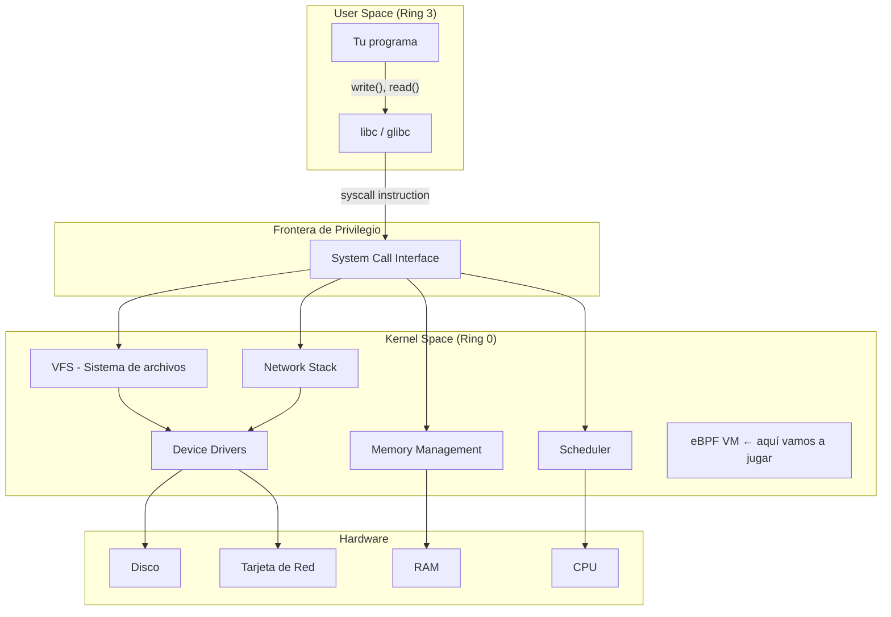

# Capítulo 1: El kernel no muerde

> "Todo lo que tu programa cree que puede hacer — abrir archivos, enviar paquetes, pedir memoria — es una mentira piadosa del kernel."

---

## Términos nuevos en este capítulo

- **kernel** (kérnel) — núcleo del sistema operativo que controla todo el hardware y los recursos. El jefe invisible de tu máquina.
- **user space** (iúser spéis) — zona de memoria donde corren tus programas normales (navegador, servidor web, tu script de Python). No tiene acceso directo al hardware.
- **kernel space** (kérnel spéis) — zona privilegiada de memoria donde corre el kernel y sus módulos. Aquí se toman las decisiones de verdad.
- **system call** (sístem col) — mecanismo por el cual un programa en user space le pide algo al kernel. También llamado "syscall". Es la única forma legítima de cruzar la frontera.
- **scheduler** (skédyuler) — subsistema del kernel que decide qué proceso corre en cada momento y por cuánto tiempo.
- **context switch** (cóntext suích) — cuando el kernel pausa un proceso y le da el CPU a otro. Cuesta tiempo, y por eso importa.
- **ring 0 / ring 3** (ring síro / ring trí) — niveles de privilegio del procesador. Ring 0 = kernel (todo permitido). Ring 3 = user space (permisos restringidos).
- **trap** (trap) — instrucción que causa una transición de user space a kernel space. Es el mecanismo de hardware detrás de las syscalls.

## Objetivos

Al terminar este capítulo vas a poder:

1. Explicar qué es el kernel y cuál es su rol como intermediario entre tu código y el hardware
2. Identificar los subsistemas principales del kernel Linux (scheduler, networking, filesystem, memory management)
3. Distinguir entre user space y kernel space, y entender por qué esa separación existe
4. Usar `strace` para observar las system calls que hace cualquier programa

## Prerrequisitos

Ninguno. Este es el primer capítulo. Solo necesitas:

- Saber abrir una terminal en Linux
- No tenerle miedo al texto en inglés (los términos técnicos están en inglés y así se quedan)

---

## 1.1 ¿Qué carajo es el kernel? — Desmitificando el monolito

Vamos directo al punto: el kernel es un programa. Nada más. Nada menos.

Es el primer programa que se ejecuta cuando prendes tu computadora (después del bootloader), y es el último en apagarse. Mientras tanto, se encarga de **todo** lo que tiene que ver con el hardware: discos, memoria RAM, interfaces de red, CPU, GPUs, dispositivos USB — todo pasa por él.

Tu navegador no sabe cómo hablar directamente con el disco duro. Tu servidor web no tiene idea de cómo manejar una tarjeta de red. Tu base de datos no puede reservar memoria RAM por su cuenta. Todos dependen del kernel para hacer su trabajo.

### El rol del kernel en 30 segundos

El kernel hace exactamente cuatro cosas fundamentales:

1. **Gestión de memoria** — Decide quién tiene cuánta RAM y protege que un proceso no lea la memoria de otro
2. **Gestión de procesos (scheduler)** — Decide qué programa corre en cada núcleo del CPU y por cuánto tiempo
3. **Sistema de archivos** — Organiza los datos en disco y controla quién puede leer o escribir qué
4. **Networking** — Maneja toda la comunicación de red: recibir paquetes, enviarlos, rutearlos

Eso es. Todo lo demás que hace el kernel es una variante o combinación de esas cuatro responsabilidades.

### Los subsistemas del kernel Linux

Linux no es un bloque monolítico de código impenetrable (bueno, técnicamente sí es un kernel monolítico en el sentido arquitectónico, pero eso es otra discusión). Internamente está organizado en subsistemas especializados:

| Subsistema | Qué hace | Ejemplo en la vida real |
|-----------|----------|------------------------|
| **Memory Management** | Asigna y libera memoria, maneja páginas virtuales | Cuando tu app pide `malloc(1024)` |
| **Process Scheduler** | Reparte tiempo de CPU entre procesos | Que tu música siga sonando mientras compilas |
| **VFS (Virtual File System)** | Abstrae sistemas de archivos (ext4, XFS, NFS...) | Cuando haces `open("/etc/hosts")` |
| **Network Stack** | TCP/IP, UDP, routing, filtrado de paquetes | Cada request HTTP que envías |
| **Device Drivers** | Habla con hardware específico | Tu teclado, tu GPU, tu NIC |
| **Security (LSM)** | Controla permisos y políticas de seguridad | SELinux decidiendo si puedes acceder a un archivo |

Cada subsistema tiene su propio código, sus propios maintainers, y sus propias reglas. Pero todos viven dentro del mismo binario: el kernel.

> 💡 **Analogía**: Piensa en el kernel como el **sistema nervioso** de tu cuerpo. Procesa millones de señales por segundo sin que te des cuenta — controla tu ritmo cardíaco, tu respiración, tus reflejos. No necesitas pensar "ahora voy a digerir la comida" igual que tu programa no necesita pensar "ahora voy a escribir bits en el plato magnético del disco". El kernel (como el sistema nervioso) se encarga de todo eso de forma transparente. Y cuando falla... te enteras de la peor manera.

### El kernel Linux en números

Para dimensionar la bestia que estamos por hackear:

- ~35 millones de líneas de código (sin contar drivers)
- ~1,700 contribuidores activos por release
- Un nuevo release cada ~9 semanas
- Corre en todo: desde un Raspberry Pi hasta el 100% de los supercomputers del TOP500
- Escrito casi enteramente en C (con algo de assembly y, recientemente, algo de Rust)

Y aquí está lo relevante para este libro: el kernel siempre fue extensible vía **kernel modules** — pedazos de código que podías cargar y descargar dinámicamente. Pero los módulos tienen acceso total al kernel space. Un bug en un módulo puede crashear todo el sistema.

eBPF cambió ese juego. Pero para eso, primero necesitas entender la frontera.

---

## 1.2 User space vs kernel space — La muralla china de tu sistema

Aquí está la pregunta que define toda la arquitectura de un sistema operativo moderno: **¿cómo evitas que un programa mal escrito (o malicioso) destruya todo el sistema?**

La respuesta: separación de privilegios.

### La arquitectura de anillos

Los procesadores x86 (y ARM, con su equivalente) implementan **niveles de privilegio** en hardware. No es una convención de software — el chip físicamente distingue entre código privilegiado y código restringido.

```
┌─────────────────────────────────────────────────┐
│              RING 3 (User Space)                 │
│                                                 │
│   Tu app    │  Navegador  │  Base de datos      │
│   Python    │  Chrome     │  PostgreSQL         │
│                                                 │
│   ⚠️  No puede:                                 │
│   - Acceder hardware directamente               │
│   - Leer memoria de otros procesos              │
│   - Modificar tablas de páginas                  │
│   - Desactivar interrupciones                   │
├─────────────────────────────────────────────────┤
│           ══ FRONTERA DE PRIVILEGIO ══           │
│          (solo se cruza con syscalls)            │
├─────────────────────────────────────────────────┤
│              RING 0 (Kernel Space)              │
│                                                 │
│   Scheduler │ Net Stack │ VFS │ Memory Mgmt     │
│   Drivers   │ Security  │ IPC │ eBPF VM         │
│                                                 │
│   ✅ Puede:                                     │
│   - Acceder TODO el hardware                    │
│   - Leer/escribir TODA la memoria               │
│   - Manejar interrupciones                      │
│   - Matar cualquier proceso                     │
└─────────────────────────────────────────────────┘
```

### ¿Por qué esta separación es tan estricta?

Porque sin ella, un programa buggy podría:

- Sobreescribir la memoria del kernel → **kernel panic** → reinicio forzoso
- Leer contraseñas de otros procesos → **vulnerabilidad de seguridad**
- Reprogramar el hardware → **daño físico** (sí, es posible en casos extremos)
- Desactivar interrupciones → **sistema completamente colgado**

La separación user/kernel es la razón por la cual tu sistema operativo no crashea cada vez que una app se cuelga. Cuando Chrome consume 8 GB de RAM y se muere, el resto del sistema sigue funcionando. Agradécele al kernel.

### ¿Cómo funciona en la práctica?

Cuando tu programa corre en user space, el procesador está en Ring 3. En este nivel:

- Tu programa tiene acceso a su propia memoria virtual (y nada más)
- Cualquier intento de ejecutar una instrucción privilegiada genera una excepción (el kernel lo mata con `SIGSEGV` o similar)
- Si necesita algo del hardware — abrir un archivo, enviar un paquete, reservar memoria — tiene que **pedírselo al kernel**

Esa "pedida" es la system call. Es la puerta, la ventana, el único punto de cruce legítimo.



Fíjate en algo clave del diagrama: **eBPF vive en kernel space**. Eso es lo que lo hace tan poderoso — y lo que hace que necesites entender esta frontera antes de meter código ahí dentro.

### El costo de cruzar la frontera

Cada vez que tu programa hace una syscall, pasa esto:

1. El programa ejecuta la instrucción `syscall` (x86_64) o `svc` (ARM)
2. El procesador cambia de Ring 3 a Ring 0
3. Se guarda el estado completo del proceso (registros, stack pointer, etc.)
4. El kernel ejecuta la función solicitada
5. Se restaura el estado del proceso
6. El procesador vuelve a Ring 3
7. Tu programa continúa como si nada hubiera pasado

Ese vaivén se llama **context switch** y no es gratis. Cada transición cuesta entre 1 y 10 microsegundos dependiendo del hardware. Parece poco hasta que tu servidor web hace 100,000 syscalls por segundo.

> 🔥 **Advertencia**: "No, no necesitas recompilar el kernel para extenderlo. Eso era antes de eBPF." Si alguien te dice que para programar el kernel necesitas descargar el source tree, aplicar parches, y compilar durante 45 minutos — esa información tiene 10 años de retraso. eBPF te permite inyectar código al kernel en caliente, sin reiniciar, sin recompilar, sin módulos. Ese es todo el punto de este libro.

---

## 1.3 System calls — El teléfono rojo entre tu código y el kernel

Ya sabes que user space y kernel space están separados. Ya sabes que la única forma de cruzar es una system call. Ahora veamos cómo funciona ese mecanismo en la práctica.

### ¿Qué es una system call exactamente?

Una system call (o **syscall**) es una función que tu programa invoca para pedirle un servicio al kernel. Pero no es una función normal — no la llamas con un simple `call` en assembly. Requires una instrucción especial que trigger una **trap**: una transición controlada de Ring 3 a Ring 0.

En x86_64, la instrucción es literalmente `syscall`. En ARM64, es `svc #0`. El procesador sabe que cuando ve esa instrucción, tiene que:

1. Guardar el contexto actual
2. Cambiar a Ring 0
3. Saltar al handler del kernel

### Las syscalls más comunes

Linux tiene ~450 syscalls definidas. En la práctica, el 90% de lo que hacen los programas se reduce a unas 30. Aquí las que vas a encontrar cuando empieces a usar `strace`:

| Syscall | Qué hace | Cuándo la ves |
|---------|----------|---------------|
| `open` / `openat` | Abre un archivo | Cada vez que tu app lee un config, un log, cualquier archivo |
| `read` | Lee bytes de un file descriptor | Lectura de archivos, sockets, pipes |
| `write` | Escribe bytes a un file descriptor | Escribir en archivos, stdout, sockets |
| `close` | Cierra un file descriptor | Cuando terminas de usar un recurso |
| `mmap` | Mapea memoria o un archivo al espacio de direcciones | Carga de librerías, archivos grandes |
| `brk` / `sbrk` | Extiende el heap del proceso | Cada `malloc()` eventualmente llega aquí |
| `execve` | Reemplaza el proceso actual con otro programa | Cuando lanzas un comando |
| `fork` / `clone` | Crea un nuevo proceso (o thread) | Cada vez que se lanza un proceso hijo |
| `socket` | Crea un socket de red | Toda comunicación de red empieza aquí |
| `connect` | Conecta un socket a una dirección | Cada conexión TCP que abre tu app |
| `sendto` / `recvfrom` | Envía/recibe datos por red | Transferencia de datos en red |
| `ioctl` | Operaciones de control sobre dispositivos | Configuración de interfaces de red, terminales |
| `epoll_wait` | Espera eventos en múltiples file descriptors | Servidores de alta concurrencia (nginx, etc.) |

### El camino de una syscall: de tu código al hardware

Vamos a seguir el camino completo de un simple `write(1, "hola\n", 5)`:

```
Tu código (C)          │  write(1, "hola\n", 5);
                       ▼
libc (glibc)           │  Pone argumentos en registros:
                       │    rax = 1 (número de syscall write)
                       │    rdi = 1 (fd: stdout)
                       │    rsi = puntero a "hola\n"
                       │    rdx = 5 (bytes a escribir)
                       │  Ejecuta instrucción: syscall
                       ▼
────────────── FRONTERA USER/KERNEL ──────────────
                       ▼
Kernel entry point     │  Guarda registros del proceso
                       │  Busca handler en sys_call_table[1]
                       │  → Encuentra: sys_write()
                       ▼
sys_write()            │  Valida el file descriptor
                       │  Verifica permisos de escritura
                       │  Llama al driver del dispositivo
                       ▼
Driver (tty)           │  Escribe "hola\n" al buffer de la terminal
                       ▼
Hardware               │  Los caracteres aparecen en tu pantalla
                       ▼
────────────── VUELTA A USER SPACE ───────────────
                       ▼
Tu código              │  write() retorna 5 (bytes escritos)
```

Cada paso de esa cadena es un lugar donde eBPF puede engancharse. Puedes interceptar la syscall antes de que se ejecute, después de que retorne, dentro del VFS, en el driver — hay hooks en todas partes. Pero eso es tema de capítulos posteriores.

### ¿Por qué te importan las syscalls para eBPF?

Tres razones concretas:

1. **Los tracepoints de syscalls son los hooks más comunes para empezar.** Tu primer programa eBPF (Capítulo 4) se va a enganchar a `sys_enter_execve` — el punto donde un programa nuevo se está por ejecutar.

2. **Entender syscalls te da visibilidad total sobre lo que hace un proceso.** Si sabes qué syscalls hace un programa, sabes exactamente qué recursos usa, qué archivos toca, con quién se comunica, y cuánta memoria consume.

3. **La optimización en producción frecuentemente se reduce a reducir syscalls.** Menos transiciones user/kernel = menos overhead = mejor rendimiento. eBPF te permite medir eso con precisión quirúrgica.

> ⚙️ **Nota técnica**: En Linux moderno, algunas syscalls se optimizan via **vDSO** (virtual Dynamic Shared Object) — un mapeo de código del kernel en user space que permite ejecutar ciertas funciones sin cruzar la frontera. `gettimeofday()` y `clock_gettime()` usan este mecanismo. El proceso ni siquiera hace una trap real.

---

## 1.4 ¿Por qué te debería importar? — El kernel como plataforma programable

OK, ya sabes qué es el kernel, dónde vive, y cómo se comunica con user space. La pregunta obvia: **¿por qué te cuento todo esto?**

Porque el kernel dejó de ser una caja negra intocable. Ahora es una **plataforma programable**.

### El problema histórico

Históricamente, si querías hacer algo que el kernel no soportaba nativamente, tenías tres opciones — todas malas:

1. **Escribir un módulo del kernel** — Acceso total pero peligroso. Un bug crashea todo. Requiere compilar contra headers del kernel específico. No hay sandboxing.

2. **Parchear el kernel** — Modificar el código fuente, recompilar, reiniciar. Inviable en producción. Inmantenible entre versiones.

3. **Hacer todo en user space** — Seguro, pero lento. Cada operación requiere context switches. No tienes acceso a los datos internos del kernel.

### La revolución eBPF (preview)

eBPF (que veremos en detalle en el Capítulo 2) resuelve este trilema:

- **Corre en kernel space** → velocidad máxima, acceso a datos internos del kernel
- **Es verificado antes de ejecutar** → no puede crashear el sistema
- **Se carga dinámicamente** → sin recompilar, sin reiniciar
- **Tiene sandboxing** → acceso controlado, no puede hacer lo que quiera

Es como tener un módulo del kernel con las ventajas de user space. O visto de otra forma: es la capacidad de meter **tu código** adentro del kernel, pero con un guardia de seguridad (el verifier) que se asegura de que no rompas nada.

### Casos de uso reales (que vamos a implementar en este libro)

| Capítulo | Lo que vamos a construir | Por qué necesita kernel space |
|----------|--------------------------|-------------------------------|
| Cap 4 | Tracer de procesos que se ejecutan | Interceptar `execve` antes de que corra |
| Cap 9 | Monitor de operaciones de filesystem | Ver qué archivos abre cada proceso en tiempo real |
| Cap 10 | Firewall XDP | Filtrar paquetes antes de que lleguen al network stack |
| Cap 16 | Load balancer L4 | Redirigir paquetes sin pasar por user space |
| Cap 17 | Detector de intrusiones | Monitorear syscalls sospechosas sin overhead |

Todo eso corre dentro del kernel, con latencia de microsegundos, sin riesgo de crash. Eso es lo que vamos a aprender.

### ¿Qué necesitas saber antes de seguir?

Para el resto de este libro, necesitas tener estos conceptos claros:

- ✅ El kernel es el intermediario obligatorio entre tu código y el hardware
- ✅ User space y kernel space están separados por hardware (no es solo convención)
- ✅ Las system calls son el único puente legítimo entre ambos mundos
- ✅ Cada syscall tiene un costo (context switch)
- ✅ eBPF permite meter código en kernel space de forma segura

Si esos cinco puntos te hacen sentido, estás listo para el siguiente capítulo donde conocemos a la bestia: eBPF.

---

## Ejercicio: Espiar syscalls con strace

📋 **Nivel:** Novato
📚 **Conceptos previos:** Saber qué es una syscall (lo acabas de aprender)
🖥️ **Entorno:** Cualquier máquina Linux (tu laptop, una VM, el lab del libro)

`strace` es una herramienta que intercepta y muestra todas las system calls que hace un programa. Es la forma más rápida de ver "la conversación" entre tu código y el kernel.

### Paso 1: Verificar que tienes strace instalado

```bash
strace --version
```

**Resultado esperado:**

```
strace -- version 5.x (o superior)
```

Si no lo tienes instalado:

```bash
# Debian/Ubuntu
sudo apt install strace

# Fedora/RHEL
sudo dnf install strace

# Arch
sudo pacman -S strace
```

### Paso 2: Tracear un comando simple

Ejecuta `strace` sobre un comando que ya conoces:

```bash
strace ls /tmp
```

**Resultado esperado (parcial — la salida real es mucho más larga):**

```
execve("/usr/bin/ls", ["ls", "/tmp"], 0x7ffd2e3b9e60 /* 56 vars */) = 0
brk(NULL)                               = 0x55d4a7c5f000
mmap(NULL, 8192, PROT_READ|PROT_WRITE, MAP_PRIVATE|MAP_ANONYMOUS, -1, 0) = 0x7f3a8c1e1000
access("/etc/ld.so.preload", R_OK)      = -1 ENOENT (No such file or directory)
openat(AT_FDCWD, "/etc/ld.so.cache", O_RDONLY|O_CLOEXEC) = 3
...
openat(AT_FDCWD, "/tmp", O_RDONLY|O_NONBLOCK|O_CLOEXEC|O_DIRECTORY) = 3
getdents64(3, /* 5 entries */, 32768)   = 152
getdents64(3, /* 0 entries */, 32768)   = 0
close(3)                                = 0
write(1, "archivo1.txt  archivo2.log\n", 28) = 28
close(1)                                = 0
exit_group(0)                           = ?
```

**Lo que estás viendo:** Cada línea es una syscall. El formato es:

```
nombre_syscall(argumentos) = valor_de_retorno
```

Observa: un simple `ls` hace decenas de syscalls — carga librerías (`mmap`), abre el directorio (`openat`), lee las entradas (`getdents64`), escribe el resultado (`write`), y se despide (`exit_group`).

### Paso 3: Filtrar por tipo de syscall

La salida completa es ruidosa. Filtremos solo las syscalls de archivos:

```bash
strace -e trace=openat ls /tmp
```

**Resultado esperado:**

```
openat(AT_FDCWD, "/etc/ld.so.cache", O_RDONLY|O_CLOEXEC) = 3
openat(AT_FDCWD, "/lib/x86_64-linux-gnu/libselinux.so.1", O_RDONLY|O_CLOEXEC) = 3
openat(AT_FDCWD, "/lib/x86_64-linux-gnu/libc.so.6", O_RDONLY|O_CLOEXEC) = 3
...
openat(AT_FDCWD, "/tmp", O_RDONLY|O_NONBLOCK|O_CLOEXEC|O_DIRECTORY) = 3
+++ exited with 0 +++
```

Ahora ves claramente todos los archivos que `ls` abre — incluidas las librerías compartidas que carga al inicio.

### Paso 4: Contar syscalls

¿Cuántas syscalls hace un programa? Usemos la flag `-c` para obtener un resumen estadístico:

```bash
strace -c ls /tmp
```

**Resultado esperado:**

```
% time     seconds  usecs/call     calls    errors syscall
------ ----------- ----------- --------- --------- ----------------
 25.00    0.000045           5         9           mmap
 18.75    0.000034           5         7           close
 12.50    0.000023           8         3           openat
 12.50    0.000023          11         2           read
  6.25    0.000011          11         1           write
  6.25    0.000011          11         1           execve
  ...
------ ----------- ----------- --------- --------- ----------------
100.00    0.000181           4        42         3 total
```

42 syscalls para listar un directorio. Tu CPU hizo 42 viajes de Ring 3 a Ring 0 y de vuelta. Ahora imagina un servidor web manejando miles de requests por segundo.

### Paso 5: Tracear un programa con red

Esto es más interesante. Veamos las syscalls de red:

```bash
strace -e trace=network curl -s https://example.com > /dev/null
```

**Resultado esperado (simplificado):**

```
socket(AF_INET6, SOCK_STREAM, IPPROTO_TCP) = 5
socket(AF_INET, SOCK_STREAM, IPPROTO_TCP) = 6
connect(6, {sa_family=AF_INET, sin_port=htons(443), sin_addr=inet_addr("93.184.216.34")}, 16) = -1 EINPROGRESS
getsockopt(6, SOL_SOCKET, SO_ERROR, [0], [4]) = 0
sendto(6, "\26\3\1\2\0\1\0\1\374...", 517, MSG_NOSIGNAL, NULL, 0) = 517
recvfrom(6, "\26\3\3\0z\2\0\0v...", 16384, 0, NULL, NULL) = 4957
...
```

Ahí está: `socket` crea la conexión, `connect` establece la conexión TCP, `sendto` envía el request HTTP (sobre TLS), y `recvfrom` recibe la respuesta. Todo expuesto. Todo trazable.

### Paso 6: Tracear un proceso ya corriendo

También puedes adjuntar `strace` a un proceso que ya está ejecutándose:

```bash
# En una terminal, busca el PID de un proceso (por ejemplo, tu shell)
echo $$
# Supongamos que devuelve 1234

# En otra terminal:
sudo strace -p 1234
```

Ahora cada comando que escribas en la primera terminal va a generar syscalls visibles en la segunda. Presiona `Ctrl+C` para detener el traceo.

### Verificación final

Si completaste todos los pasos, ya puedes:

- ✅ Ver todas las syscalls que hace cualquier programa
- ✅ Filtrar por tipo de syscall (`-e trace=...`)
- ✅ Obtener estadísticas de uso (`-c`)
- ✅ Adjuntar a un proceso ya existente (`-p PID`)

**Conexión con eBPF:** Lo que `strace` hace desde user space (interceptar syscalls usando `ptrace`, que es lento y tiene overhead), eBPF lo puede hacer desde kernel space — con cero overhead perceptible y sin necesidad de privilegios de root sobre el proceso tracedo. En el Capítulo 4 vamos a construir algo similar pero con eBPF.

---

## Resumen

Lo que te llevas de este capítulo:

1. **El kernel es el intermediario obligatorio** entre todo tu software y el hardware. No hay forma de esquivarlo.
2. **User space y kernel space** son zonas de memoria separadas por hardware (rings de privilegio del CPU). Esta separación protege la estabilidad del sistema.
3. **Las system calls son el único puente** entre tu código y el kernel. Cada syscall tiene un costo mensurable en microsegundos.
4. **El kernel Linux tiene subsistemas especializados** — scheduler, memory, network, filesystem, drivers — cada uno potencialmente instrumentable.
5. **eBPF convierte al kernel en una plataforma programable** — puedes inyectar código seguro en kernel space sin recompilar ni reiniciar.
6. **`strace` es tu primer tool de observabilidad** — te muestra exactamente qué le pide un programa al kernel, y es tu puerta de entrada a entender lo que eBPF va a hacer desde adentro.

---

## Para saber más

- 📖 [Linux kernel documentation — Overview](https://www.kernel.org/doc/html/latest/) — Documentación oficial del kernel. Densa pero definitiva.
- 📖 [man syscalls(2)](https://man7.org/linux/man-pages/man2/syscalls.2.html) — Lista completa de system calls de Linux con descripción breve de cada una.
- 📝 [Anatomy of a system call (LWN.net)](https://lwn.net/Articles/604287/) — Artículo técnico que explica cómo se implementan las syscalls internamente.
- 💻 [strace — homepage](https://strace.io/) — Documentación y código fuente de strace.
- 📝 [The Linux Kernel Module Programming Guide](https://sysprog21.github.io/lkmpg/) — Si quieres entender la forma "vieja" de extender el kernel (módulos), para contrastar con eBPF.
