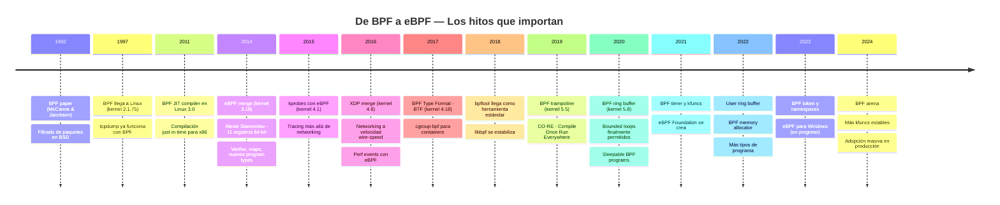
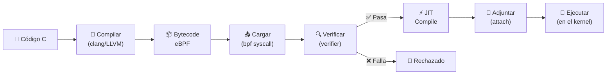

# Capítulo 2: eBPF — La historia del parche que se comió al kernel

> "Todo empezó con un filtro de paquetes. Veinte años después, ese filtro es una máquina virtual dentro del kernel que puede hacer casi cualquier cosa. Nadie lo vio venir."

---

## Términos nuevos en este capítulo

- **BPF** (bi-pi-ef) — Berkeley Packet Filter, el filtro de paquetes original de 1992. El abuelo de todo esto.
- **eBPF** (i-bi-pi-ef) — extended BPF, la evolución de BPF en una máquina virtual completa dentro del kernel. El protagonista de este libro.
- **bytecode** (báit-cod) — instrucciones intermedias que ejecuta la máquina virtual eBPF, como el assembly de Java pero para el kernel.
- **JIT** (yit) — Just-In-Time compiler, traduce bytecode eBPF a instrucciones nativas de tu CPU para que corra a velocidad máxima.
- **verifier** (véri-faier) — el componente del kernel que analiza tu programa eBPF antes de ejecutarlo y se asegura de que no vas a romper nada.
- **hook** (juk) — punto en el código del kernel donde puedes enganchar un programa eBPF para interceptar eventos.
- **attach point** (atach point) — lugar específico del kernel donde un programa eBPF se conecta. Ej: un tracepoint, un kprobe, la entrada de XDP.
- **program type** (prógram taip) — categoría de programa eBPF que define qué puede hacer y dónde se puede adjuntar.
- **helper function** (jélper fánkshon) — función proporcionada por el kernel que un programa eBPF puede llamar. Es la API del kernel para tu código BPF.
- **map** (map) — estructura de datos en kernel space que sirve para almacenar datos y comunicar programas eBPF con user space.

---

## Objetivos

Al terminar este capítulo vas a poder:

1. Contar la historia de BPF a eBPF sin sonar como un artículo de Wikipedia
2. Explicar cómo un programa eBPF pasa de código C a ejecución en el kernel (el pipeline completo)
3. Identificar los principales hooks donde puedes adjuntar programas eBPF
4. Nombrar al menos 5 proyectos del ecosistema eBPF y qué problema resuelven

## Prerrequisitos

- Saber qué es el kernel y para qué sirve (Capítulo 1)
- Entender la diferencia entre user space y kernel space (Capítulo 1)
- Saber qué es una system call (Capítulo 1)

---

## De BPF a eBPF — La evolución de un filtro de paquetes a una máquina virtual

### 1992: El nacimiento de BPF

La historia arranca en 1992, en los laboratorios de Berkeley. Steven McCanne y Van Jacobson publicaron un paper llamado *"The BSD Packet Filter: A New Architecture for User-level Packet Capture"*. El problema que resolvían era simple pero jodido: necesitaban una forma eficiente de filtrar paquetes de red en el kernel sin copiar todo el tráfico a user space.

Antes de BPF, si querías capturar tráfico de red, el kernel te copiaba **todos** los paquetes a tu proceso en user space. Tú filtrabas ahí. Imagina la cantidad de copias inútiles en una red saturada — la mayoría de los paquetes ni te interesaban, pero igual los copiabas. Un desperdicio de ciclos, de memoria, de todo.

BPF resolvió esto con una idea elegante: en vez de copiar todo, dejas que el kernel ejecute un **mini-programa** que filtra los paquetes **antes** de copiarlos. Solo los que pasan el filtro llegan a user space. El truco era que ese mini-programa corría en una máquina virtual dentro del kernel — un set de instrucciones limitado, seguro, que no podía romper nada.

```
┌─────────────────────────────────────────┐
│              USER SPACE                  │
│                                          │
│   tcpdump → solo recibe paquetes        │
│              que pasaron el filtro       │
├─────────────────────────────────────────┤
│              KERNEL SPACE                │
│                                          │
│   NIC → [Paquete] → BPF Filter → ¿Pasa? │
│                       │                  │
│                       ├─ Sí → copia a    │
│                       │       user space │
│                       └─ No → descarta   │
│                                          │
└─────────────────────────────────────────┘
```

Cuando usas `tcpdump -i eth0 'port 80'`, ese `'port 80'` se compila a instrucciones BPF que el kernel ejecuta por cada paquete. Solo los que van al puerto 80 llegan a tcpdump. Simple, elegante, brutalmente eficiente para su época.

La máquina virtual original de BPF era minimalista:
- 2 registros de 32 bits (A y X)
- Un set de instrucciones reducido (load, store, jump, arithmetic)
- Sin loops (por diseño — garantiza terminación)
- Acceso solo a los bytes del paquete de red

Y funcionó. BPF se integró a BSD, luego a Linux (1997, kernel 2.1.75), y se volvió el estándar para captura de paquetes durante **dos décadas**. Pero nadie imaginó lo que vendría después.

### 2014: La revolución — Alexei Starovoitov entra en escena

Durante 20 años, BPF fue "el filtro de paquetes". Hacía su trabajo y nadie lo tocaba. Hasta que en 2014, Alexei Starovoitov (en ese momento en PLUMgrid, ahora en Meta) propuso una serie de parches al kernel Linux que cambiaron todo.

La propuesta era audaz: tomar la idea de BPF — ejecutar código seguro dentro del kernel — y extenderla radicalmente:

- **Registros**: de 2 registros de 32 bits a 11 registros de 64 bits
- **Instrucciones**: set de instrucciones completamente rediseñado, compatible con arquitecturas modernas
- **Alcance**: ya no solo paquetes de red — ahora podías engancharte a **cualquier punto del kernel**
- **Comunicación**: mecanismos para compartir datos con user space (maps)
- **Verificación**: un verifier sofisticado que analiza cada camino de ejecución posible

El nombre: **extended BPF**, o eBPF. Y el "BPF" original pasó a llamarse "cBPF" (classic BPF) para diferenciarlo.

> 📜 **Historia**: El commit original de eBPF entró al kernel Linux 3.18 (diciembre 2014). Pero los features que lo hicieron realmente útil siguieron llegando durante los siguientes 5 años. eBPF no fue un big bang — fue una evolución constante de parches que, sumados, transformaron el kernel en una plataforma programable.

### La línea de tiempo que importa



Lo que ves en esa línea de tiempo es una historia de expansión constante. Cada año, eBPF ganó nuevas capacidades:

- **2014-2015**: La base — registros, verifier, maps, primeros program types
- **2016-2017**: Networking serio con XDP, soporte para containers
- **2018-2019**: Tooling maduro, portabilidad con CO-RE
- **2020-2022**: Features avanzados — loops, timers, ring buffers
- **2023-2024**: Producción a escala, multi-plataforma, ecosistema consolidado

### Por qué "se comió al kernel"

El título de este capítulo no es hipérbole. BPF empezó como un filtro de paquetes y terminó siendo la forma estándar de extender el kernel Linux en 2024. Mira los números:

- El subsistema BPF tiene más commits por release que la mayoría de subsistemas del kernel
- Más de 30 tipos de programas eBPF diferentes
- Más de 200 helper functions disponibles
- Empresas como Meta, Google, Cloudflare, Netflix basan infraestructura crítica en eBPF

No es una moda. No es un experimento. Es la plataforma de extensión del kernel Linux, punto.

---

## El modelo de ejecución — Cómo corre código en el kernel sin matarlo

Aquí es donde eBPF se pone interesante de verdad. Porque la pregunta obvia es: **¿cómo carajo dejas que código arbitrario corra dentro del kernel sin que todo explote?**

La respuesta es un pipeline de seguridad de múltiples etapas. Tu código pasa por un proceso completo antes de tocar una sola instrucción en kernel space.

### El pipeline completo



Vamos paso por paso, porque cada etapa tiene su razón de ser:

### Paso 1: Escribir — Tu código en C

Escribes tu programa eBPF en C. No en C completo — en un subconjunto restringido. No tienes acceso a libc, no puedes hacer malloc, no puedes llamar a funciones arbitrarias. Solo puedes usar helper functions que el kernel te ofrece.

```c
// Ejemplo mínimo: un programa que cuenta invocaciones
SEC("tracepoint/syscalls/sys_enter_execve")
int count_execve(struct trace_event_raw_sys_enter *ctx) {
    __u32 key = 0;
    __u64 *count;

    count = bpf_map_lookup_elem(&exec_counter, &key);
    if (count) {
        __sync_fetch_and_add(count, 1);
    }
    return 0;
}
```

Esto es C, pero con restricciones. Esas restricciones son lo que permite que el siguiente paso funcione.

### Paso 2: Compilar — clang/LLVM genera bytecode

Cuando compilas con `clang -target bpf`, no generas un ejecutable x86 o ARM. Generas **bytecode eBPF** — instrucciones para la máquina virtual eBPF del kernel. Es como compilar Java a bytecode JVM, pero para el kernel.

```bash
clang -O2 -target bpf -c programa.c -o programa.o
```

El archivo `.o` resultante es un ELF que contiene secciones con bytecode eBPF. Cada sección corresponde a un programa que puede ser cargado independientemente.

El bytecode eBPF tiene:
- 11 registros de 64 bits (`r0`-`r10`, donde `r10` es el frame pointer read-only)
- Instrucciones de 64 bits de ancho fijo
- Acceso a un stack de 512 bytes
- Operaciones aritméticas, saltos condicionales, llamadas a helpers

### Paso 3: Cargar — La syscall bpf()

Tu programa en user space (en nuestro caso, escrito en Go con cilium/ebpf) toma ese bytecode y lo envía al kernel usando la syscall `bpf()` con el comando `BPF_PROG_LOAD`.

```
user space                    kernel space
┌──────────┐                 ┌──────────────┐
│ Go app   │ ── bpf() ────> │ BPF subsystem│
│          │   PROG_LOAD    │              │
│ bytecode │ ─────────────> │ recibe el    │
│ en .o    │                │ bytecode     │
└──────────┘                 └──────────────┘
```

En este momento tu programa todavía no corre. Solo está en memoria del kernel, esperando ser validado.

### Paso 4: Verificar — El verifier analiza tu código

Aquí viene lo que hace que eBPF sea seguro. El **verifier** es un analizador estático que recorre **todos los caminos posibles** de tu programa y verifica que:

- **No hay loops infinitos** — todo loop debe tener un bound explícito
- **No hay accesos fuera de bounds** — cada lectura de memoria se valida
- **No hay punteros inválidos** — siempre verificas null antes de desreferenciar
- **Las helper functions son válidas** — solo puedes llamar helpers permitidas para tu program type
- **El programa termina** — hay un límite de instrucciones (1 millón actualmente)
- **El stack no se desborda** — máximo 512 bytes

Si tu programa falla alguna de estas verificaciones, **no se carga**. Punto. No hay forma de bypassear el verifier (salvo bugs en el verifier mismo, que los hay, y se parchean rápido).

> 🔥 **Advertencia**: eBPF no es un módulo del kernel. No puede crashear tu sistema (si el verifier hace su trabajo). Un módulo del kernel tiene acceso completo a toda la memoria, puede desreferenciar punteros nulos y causar kernel panics. Un programa eBPF verificado no puede hacer nada de eso. Si crashea algo, es un bug del kernel, no de tu programa.

El verifier es conservador. A veces rechaza código que técnicamente es seguro porque no puede probar que lo es. Eso es frustrante, pero es preferible a tener código inseguro corriendo en ring 0. Vas a aprender a lidiar con él en el Capítulo 7.

### Paso 5: JIT — De bytecode a código nativo

Una vez que el verifier dice "todo bien", el kernel compila el bytecode eBPF a instrucciones nativas de tu CPU — x86_64, ARM64, lo que sea. Este es el **JIT compiler** (Just-In-Time).

¿Por qué no interpretar el bytecode directamente? Porque sería lento. El JIT convierte cada instrucción eBPF en una o pocas instrucciones nativas. El resultado es código que corre a velocidad nativa — como si lo hubieras compilado directamente para tu CPU.

```
Bytecode eBPF          Código nativo (x86_64)
┌─────────────┐        ┌──────────────────────┐
│ r1 = r6     │  ───>  │ mov rdi, r13         │
│ call helper  │  ───>  │ call 0xffffffff...   │
│ if r0 == 0  │  ───>  │ test rax, rax        │
│   goto +4   │  ───>  │ je 0x...            │
└─────────────┘        └──────────────────────┘
```

El JIT está habilitado por defecto en kernels modernos. Puedes verificarlo:

```bash
cat /proc/sys/net/core/bpf_jit_enable
# 1 = habilitado, 2 = habilitado con debug output
```

### Paso 6: Adjuntar (attach) — Engancharse al kernel

Después del JIT, tu programa es código nativo listo para correr. Pero todavía no hace nada — necesitas **adjuntarlo** a un hook. Esto le dice al kernel: "cada vez que pase X evento, ejecuta mi programa".

```
bpf_prog_attach(fd, target, type, flags)
```

El "target" depende del tipo de programa:
- Un tracepoint específico del kernel
- Una función del kernel (kprobe)
- Una interfaz de red (XDP)
- Un cgroup

### Paso 7: Ejecutar — Tu código corre en el kernel

Una vez adjunto, tu programa corre cada vez que ocurre el evento al que está enganchado. Y corre rápido — es código nativo, ejecutado en el contexto del kernel, sin cambio de contexto a user space.

El programa recibe un **contexto** (un struct con información sobre el evento) y devuelve un valor que puede influir en el comportamiento del kernel:

- En XDP: "deja pasar este paquete" o "tíralo"
- En un tracepoint: generalmente retorna 0 (solo observa)
- En un LSM hook: "permite esta operación" o "deniégala"

> 💡 **Analogía**: Piensa en eBPF como un sistema de **plugins para el kernel**. Igual que instalas extensiones en tu navegador para bloquear ads o modificar páginas web, con eBPF instalas "extensiones" en el kernel para filtrar paquetes, observar syscalls, o modificar comportamiento de red. La diferencia es que tu navegador puede crashear si una extensión es mala — el kernel no te deja instalar una extensión que no haya pasado por el verifier. Es el navegador con la tienda de extensiones más estricta del universo.

### El modelo de seguridad — Por qué funciona

Lo que hace que todo esto sea viable es la combinación de restricciones:

| Restricción | Por qué existe |
|-------------|----------------|
| Sin acceso a memoria arbitraria | Previene lectura de datos sensibles |
| Sin loops infinitos | Garantiza que el programa termina |
| Stack limitado (512 bytes) | Previene stack overflow en kernel |
| Solo helper functions autorizadas | Control granular de capabilities |
| Límite de instrucciones (~1M) | Previene hogging de CPU |
| Sin llamadas a funciones externas | Aislamiento completo |

El kernel no confía en tu código. El kernel **prueba** que tu código es seguro antes de dejarlo correr. Esa es la diferencia fundamental entre eBPF y los módulos del kernel.

---

## Hooks y attach points — Dónde puedes engancharte

Ya sabes cómo funciona el pipeline de carga. Ahora la pregunta es: **¿dónde puedes meter tu código?** La respuesta corta: en casi cualquier parte del kernel.

### El mapa de hooks disponibles

eBPF tiene un catálogo de **program types** que determinan dónde y para qué puedes adjuntar un programa. Cada program type tiene sus propios hooks, su propio contexto, y sus propias helper functions disponibles.

```
┌─────────────────────────────────────────────────────────┐
│                    KERNEL LINUX                          │
│                                                         │
│  ┌─────────────┐  ┌──────────────┐  ┌───────────────┐  │
│  │  NETWORKING │  │   TRACING    │  │   SECURITY    │  │
│  │             │  │              │  │               │  │
│  │ • XDP       │  │ • kprobe     │  │ • LSM hooks   │  │
│  │ • TC        │  │ • kretprobe  │  │ • seccomp     │  │
│  │ • socket    │  │ • tracepoint │  │               │  │
│  │ • cgroup/   │  │ • fentry     │  │               │  │
│  │   skb       │  │ • fexit      │  │               │  │
│  │ • sk_msg    │  │ • USDT       │  │               │  │
│  │ • lwt       │  │ • perf event │  │               │  │
│  └─────────────┘  └──────────────┘  └───────────────┘  │
│                                                         │
│  ┌─────────────┐  ┌──────────────┐  ┌───────────────┐  │
│  │  SCHEDULING │  │    CGROUP    │  │    STORAGE    │  │
│  │             │  │              │  │               │  │
│  │ • sched_cls │  │ • cgroup/    │  │ • struct_ops  │  │
│  │ • sched_act │  │   sock_ops   │  │ • iter        │  │
│  │             │  │ • cgroup/    │  │               │  │
│  │             │  │   device     │  │               │  │
│  └─────────────┘  └──────────────┘  └───────────────┘  │
│                                                         │
└─────────────────────────────────────────────────────────┘
```

### Los hooks más importantes (y cuándo usarlos)

#### Networking: donde todo empezó

| Hook | Dónde se ejecuta | Para qué sirve |
|------|-------------------|----------------|
| **XDP** | Antes del network stack, lo más cercano al hardware | Filtrado ultra-rápido, DDoS mitigation, load balancing |
| **TC** (Traffic Control) | Después del network stack, en el scheduler de red | Shaping de tráfico, policy enforcement, NAT |
| **socket filter** | En sockets individuales | Filtrado por socket (como el BPF original) |
| **cgroup/skb** | En cgroups de red | Policy de red por container/pod |
| **sk_msg** | En mensajes de socket | Redirección de tráfico entre sockets |

XDP es el fast path más rápido que existe en Linux para procesar paquetes. Un programa XDP ve el paquete **antes** de que el kernel siquiera aloque un `sk_buff`. Eso lo hace ideal para casos donde necesitas tomar decisiones a velocidad de línea: ¿dejo pasar este paquete? ¿Lo tiro? ¿Lo redirijo a otra interfaz?

#### Tracing: observar sin interferir

| Hook | Dónde se ejecuta | Para qué sirve |
|------|-------------------|----------------|
| **kprobe** | Entrada de cualquier función del kernel | Tracing dinámico — puedes engancharte a lo que sea |
| **kretprobe** | Retorno de cualquier función del kernel | Capturar valores de retorno |
| **tracepoint** | Puntos de instrumentación estáticos del kernel | Tracing estable entre versiones |
| **fentry/fexit** | Entrada/salida de funciones (con BTF) | Como kprobe pero más eficiente y type-safe |
| **USDT** | Probes en código de user space | Tracing de aplicaciones sin recompilar |
| **perf event** | Eventos de hardware y software | Profiling, sampling |

Los kprobes son los más flexibles — te dejan engancharte a **cualquier** función del kernel. Pero son inestables: si una función cambia de nombre entre versiones del kernel, tu programa deja de funcionar. Los tracepoints son la alternativa estable — están definidos explícitamente en el código del kernel y se mantienen entre versiones.

#### Security: control de acceso programable

| Hook | Dónde se ejecuta | Para qué sirve |
|------|-------------------|----------------|
| **LSM** (Linux Security Modules) | Hooks de seguridad del kernel | Políticas de acceso personalizadas |
| **seccomp** | Filtrado de syscalls | Restringir qué syscalls puede hacer un proceso |

Los LSM hooks son una adición relativamente reciente (kernel 5.7). Te permiten escribir políticas de seguridad como programas eBPF — más flexibles que AppArmor o SELinux, pero programables.

### El contexto: qué recibe tu programa

Cada program type recibe un **contexto** diferente. Este contexto es un struct con la información relevante para ese hook:

- Un programa XDP recibe `struct xdp_md` con punteros al inicio y fin del paquete
- Un kprobe recibe `struct pt_regs` con los registros del CPU en ese momento
- Un tracepoint recibe el struct específico de ese tracepoint con los argumentos del evento
- Un programa LSM recibe los argumentos del hook de seguridad

No puedes acceder a información que no está en tu contexto. Esto es parte del modelo de seguridad — tu programa solo ve lo que el kernel decide mostrarle.

### Program types: la taxonomía completa

En el kernel 6.x hay más de 30 program types registrados. No necesitas conocerlos todos ahora — pero sí necesitas saber que existen categorías:

1. **Networking** (`BPF_PROG_TYPE_XDP`, `BPF_PROG_TYPE_SCHED_CLS`, etc.)
2. **Tracing** (`BPF_PROG_TYPE_KPROBE`, `BPF_PROG_TYPE_TRACEPOINT`, etc.)
3. **Security** (`BPF_PROG_TYPE_LSM`)
4. **cgroup** (`BPF_PROG_TYPE_CGROUP_SKB`, `BPF_PROG_TYPE_CGROUP_SOCK`, etc.)
5. **Infraestructura** (`BPF_PROG_TYPE_STRUCT_OPS`, `BPF_PROG_TYPE_ITER`)

A lo largo de este libro vamos a trabajar con los más relevantes. Por ahora, solo necesitas entender que el program type determina:
- **Dónde** puedes adjuntar tu programa
- **Qué contexto** recibe
- **Qué helpers** puede llamar
- **Qué valor de retorno** espera el kernel

---

## El ecosistema en 2024+ — Quién usa eBPF y para qué

eBPF dejó de ser una curiosidad de kernelhackers hace años. En 2024, es infraestructura crítica para algunas de las empresas más grandes del planeta. Vamos a ver quién está usando esto y para qué.

### Networking: reinventando el plano de datos

#### Cilium

**Qué es:** Un CNI (Container Network Interface) para Kubernetes basado completamente en eBPF.

**Qué reemplaza:** kube-proxy y las iptables rules que escalan como la mierda.

**Por qué importa:** En un cluster de Kubernetes con miles de servicios, las iptables rules crecen linealmente con cada servicio. Cilium reemplaza todo eso con programas eBPF que hacen lookup en maps — O(1) en vez de O(n). Google, AWS, y Azure lo ofrecen como opción default en sus managed Kubernetes.

#### Katran (Meta)

**Qué es:** Un load balancer L4 basado en XDP.

**Los números:** Maneja billones de requests. XDP procesa paquetes antes del network stack, entonces puede tomar decisiones de balanceo con latencia mínima.

#### Cloudflare

**Qué hace con eBPF:** DDoS mitigation en el edge. Filtra millones de paquetes por segundo con programas XDP sin tocar el CPU principal para tráfico legítimo.

### Observabilidad: ver todo sin overhead

#### Pixie (ahora parte de New Relic)

**Qué es:** Observabilidad auto-instrumentada para Kubernetes. No modifica tu código — usa eBPF para capturar métricas, traces y logs directamente del kernel.

**Por qué mola:** Zero-instrumentation monitoring. No necesitas SDKs, no necesitas sidecars de monitoreo. eBPF observa las syscalls y las conexiones de red y reconstruye las métricas.

#### Parca / Pyroscope

**Qué hacen:** Continuous profiling con eBPF. Toman muestras de stack traces con overhead mínimo (<1%) en producción.

#### bpftrace

**Qué es:** Un lenguaje de scripting de alto nivel para one-liners de eBPF tracing. Como awk, pero para el kernel.

```bash
# ¿Quién está abriendo archivos? Una línea:
bpftrace -e 'tracepoint:syscalls:sys_enter_openat { printf("%s %s\n", comm, str(args->filename)); }'
```

### Seguridad: runtime protection

#### Falco (Sysdig)

**Qué es:** Runtime security para containers. Detecta comportamiento anómalo (shells inesperadas, acceso a archivos sensibles, conexiones de red sospechosas) usando eBPF para monitorear syscalls en tiempo real.

#### Tetragon (Cilium/Isovalent)

**Qué es:** Security observability and runtime enforcement. Puede no solo detectar sino también **bloquear** comportamiento malicioso usando eBPF.

**Ejemplo:** Si un proceso en un container intenta ejecutar `curl` (que no debería existir en prod), Tetragon lo detecta y puede matarlo antes de que haga daño.

#### KubeArmor

**Qué es:** Runtime security enforcement para Kubernetes usando LSM hooks de eBPF.

### El mapa del ecosistema

```
┌────────────────────────────────────────────────────────┐
│                  ECOSISTEMA eBPF 2024+                  │
├────────────────┬──────────────────┬────────────────────┤
│   NETWORKING   │  OBSERVABILIDAD  │     SEGURIDAD      │
├────────────────┼──────────────────┼────────────────────┤
│ Cilium         │ Pixie            │ Falco              │
│ Katran         │ bpftrace         │ Tetragon           │
│ Cloudflare     │ Parca            │ KubeArmor          │
│ Calico eBPF    │ Hubble           │ Tracee (Aqua)      │
│ Meta LB       │ Beyla            │ seccomp-bpf        │
├────────────────┼──────────────────┼────────────────────┤
│   FRAMEWORKS   │    TOOLING       │    PLATAFORMAS     │
├────────────────┼──────────────────┼────────────────────┤
│ libbpf         │ bpftool          │ eBPF Foundation    │
│ cilium/ebpf    │ bpftrace         │ ebpf.io            │
│ Aya (Rust)     │ BCC              │ eBPF Summit        │
│ libbpf-rs      │ retsnoop         │ eBPF for Windows   │
└────────────────┴──────────────────┴────────────────────┘
```

### Por qué eBPF ganó

¿Por qué no módulos del kernel? ¿Por qué no DPDK? ¿Por qué no SystemTap? eBPF ganó porque resuelve la tensión fundamental entre **flexibilidad** y **seguridad**:

| Alternativa | Flexibilidad | Seguridad | Facilidad de deploy |
|-------------|:------------:|:---------:|:-------------------:|
| Módulos del kernel | ✅ Total | ❌ Pueden crashear el kernel | ❌ Necesitan reboot |
| DPDK | ✅ Networking | ⚠️ User space, dedicar cores | ⚠️ Requiere hardware específico |
| SystemTap | ⚠️ Solo tracing | ⚠️ Compila módulos | ❌ Lento de desplegar |
| **eBPF** | ✅ Multi-propósito | ✅ Verifier garantiza safety | ✅ Carga en caliente |

eBPF te da la velocidad de estar en el kernel, la seguridad de no poder romper nada, y la agilidad de cargar programas sin reiniciar. Es la combinación ganadora que ninguna alternativa ofrece completa.

### Lo que viene: eBPF más allá de Linux

- **eBPF para Windows**: Microsoft está portando el subsistema eBPF a Windows. No es broma. [ebpf-for-windows en GitHub](https://github.com/microsoft/ebpf-for-windows) existe y avanza.
- **eBPF Foundation**: Creada en 2021, busca estandarizar eBPF como tecnología independiente del kernel Linux.
- **Hardware offload**: NICs inteligentes que ejecutan programas eBPF directamente en el hardware, sin CPU.
- **Más program types**: Cada release del kernel trae nuevas formas de usar eBPF.

El ecosistema no para de crecer. Y todo lo que aprendas en este libro aplica directamente a los proyectos listados arriba — porque todos usan las mismas primitivas: programs, maps, helpers, attach points.

---

## Ejercicio: Explorar programas eBPF ya cargados en tu sistema

📋 **Nivel:** Novato
📚 **Conceptos previos:** eBPF pipeline (este capítulo), kernel space vs user space (Capítulo 1)
🖥️ **Entorno:** Cualquier Linux moderno (kernel >= 5.x) con `bpftool` instalado

### Objetivo

Vas a descubrir que tu sistema **ya tiene programas eBPF corriendo** sin que te hayas dado cuenta. Servicios de systemd, el runtime de containers, herramientas de monitoreo — todos usan eBPF por debajo. Vamos a verlos.

### Paso 1: Verificar que tienes bpftool

```bash
bpftool version
```

**Resultado esperado:**

```
bpftool v7.x.0
using libbpf v1.x
features: libbfd, libbpf_strict, skeletons
```

Si no lo tienes instalado:

```bash
# Ubuntu/Debian
sudo apt-get install linux-tools-common linux-tools-$(uname -r)

# Fedora
sudo dnf install bpftool

# Arch
sudo pacman -S bpf
```

> ⚙️ **Nota técnica**: `bpftool` es la herramienta oficial del kernel para inspeccionar y gestionar programas eBPF, maps, y links. Vive en el árbol de fuentes del kernel (`tools/bpf/bpftool/`) y se distribuye con los linux-tools de tu distro.

### Paso 2: Listar programas eBPF cargados

```bash
sudo bpftool prog list
```

**Resultado esperado** (varía según tu sistema, pero verás algo como):

```
6: cgroup_device  tag 13b0b1044b49e377  gpl
	loaded_at 2024-01-15T10:30:22+0000  uid 0
	xlated 504B  jitted 309B  memlock 4096B
	pids systemd(1)

10: cgroup_skb  tag 6deef7357e7b4530  gpl
	loaded_at 2024-01-15T10:30:22+0000  uid 0
	xlated 64B  jitted 54B  memlock 4096B
	pids systemd(1)

24: cgroup_device  tag 13b0b1044b49e377  gpl
	loaded_at 2024-01-15T10:30:45+0000  uid 0
	xlated 504B  jitted 309B  memlock 4096B

42: tracing  name sched_switch  tag a1bc2d3e4f5a6b7c  gpl
	loaded_at 2024-01-15T14:22:10+0000  uid 0
	xlated 2048B  jitted 1240B  memlock 4096B
	btf_id 150
```

### Paso 3: Entender qué estás viendo

Cada línea tiene información clave. Desmenucemos la primera:

```
6: cgroup_device  tag 13b0b1044b49e377  gpl
   │  │              │                    │
   │  │              │                    └── Licencia (GPL para acceso completo a helpers)
   │  │              └── Hash del programa (identificador único)
   │  └── Tipo de programa (program type)
   └── ID del programa (identificador numérico)
```

Y los detalles:

```
loaded_at 2024-01-15T10:30:22+0000  uid 0
xlated 504B  jitted 309B  memlock 4096B
pids systemd(1)
```

- **loaded_at**: Cuándo se cargó el programa
- **uid**: Quién lo cargó (0 = root)
- **xlated**: Tamaño del bytecode eBPF traducido
- **jitted**: Tamaño del código nativo después del JIT (más chico = más eficiente)
- **memlock**: Memoria bloqueada en kernel
- **pids**: Qué proceso lo cargó (si está disponible)

### Paso 4: Inspeccionar un programa en detalle

Elige un ID de la lista anterior y pide más detalles:

```bash
sudo bpftool prog show id 6 --json | python3 -m json.tool
```

**Resultado esperado:**

```json
{
    "id": 6,
    "type": "cgroup_device",
    "tag": "13b0b1044b49e377",
    "gpl_compatible": true,
    "loaded_at": 1705312222,
    "uid": 0,
    "bytes_xlated": 504,
    "jited": true,
    "bytes_jited": 309,
    "bytes_memlock": 4096,
    "nr_map_ids": 0,
    "pids": [
        {
            "pid": 1,
            "comm": "systemd"
        }
    ]
}
```

Nota que `jited: true` — el programa ya fue compilado a código nativo por el JIT.

### Paso 5: Ver los maps cargados

```bash
sudo bpftool map list
```

**Resultado esperado:**

```
2: hash  name cgroup_hash  flags 0x0
	key 8B  value 8B  max_entries 2048  memlock 167936B
5: array  name prog_array  flags 0x0
	key 4B  value 4B  max_entries 64  memlock 4864B
```

Cada map tiene un tipo (hash, array, etc.), un nombre, tamaño de keys y values, y uso de memoria. Los maps son el mecanismo de comunicación entre programas eBPF y entre kernel/user space — los vas a dominar en el Capítulo 6.

### Paso 6: Ver dónde están adjuntos (attached)

```bash
sudo bpftool net list
```

**Resultado esperado:**

```
xdp:

tc:
eth0(2) clsact/ingress id 47

flow_dissector:
```

Este comando muestra programas eBPF adjuntos a interfaces de red. Si ves algo en `xdp:` o `tc:`, significa que hay un programa procesando paquetes en esa interfaz.

```bash
sudo bpftool cgroup tree
```

Este otro comando muestra programas adjuntos a cgroups — que es cómo systemd y los runtimes de containers aplican políticas de red y dispositivos.

### Verificación final

Si completaste todos los pasos, ahora sabes:

- ✅ Que tu sistema ya tiene programas eBPF corriendo (probablemente desde el boot)
- ✅ Cómo listar e inspeccionar programas cargados
- ✅ Qué significan los campos: ID, type, tag, xlated, jitted
- ✅ Cómo ver maps y attach points activos
- ✅ Que systemd usa eBPF para políticas de cgroup (surprise!)

En el Capítulo 4 vas a escribir tu propio programa y verlo aparecer en esta lista. Pero primero, necesitas montar tu laboratorio (Capítulo 3).

---

## Resumen

Lo que te llevas de este capítulo:

1. **BPF nació en 1992** como filtro de paquetes. En 2014, Alexei Starovoitov lo extendió radicalmente y creó eBPF — una máquina virtual completa dentro del kernel.
2. **El modelo de ejecución** tiene 7 pasos: escribir → compilar → cargar → verificar → JIT → adjuntar → ejecutar. El verifier es la pieza clave de seguridad.
3. **El verifier garantiza safety** — analiza todos los caminos de tu programa y rechaza cualquier cosa que pueda causar daño. eBPF no puede crashear el kernel.
4. **Los hooks están en todas partes** — networking (XDP, TC), tracing (kprobes, tracepoints), seguridad (LSM), cgroups. Cada hook tiene su program type, contexto, y helpers disponibles.
5. **El ecosistema es masivo** — Cilium, Falco, Tetragon, Katran, bpftrace. Empresas como Meta, Google, Cloudflare usan eBPF en infraestructura crítica.
6. **eBPF ganó** porque ofrece flexibilidad + seguridad + facilidad de deploy. Ninguna alternativa (módulos, DPDK, SystemTap) combina las tres.
7. **Tu sistema ya usa eBPF** — bpftool te deja ver qué hay cargado en este momento.

---

## Para saber más

- 📖 [ebpf.io — Documentación oficial y recursos de la comunidad](https://ebpf.io) — El punto de entrada oficial al ecosistema eBPF
- 📖 [BPF and XDP Reference Guide (Cilium)](https://docs.cilium.io/en/latest/bpf/) — Guía técnica exhaustiva de Cilium sobre BPF/eBPF
- 📝 [The BSD Packet Filter (paper original de 1992)](https://www.tcpdump.org/papers/bpf-usenix93.pdf) — El paper que empezó todo
- 📝 [A thorough introduction to eBPF (LWN.net)](https://lwn.net/Articles/740157/) — Artículo histórico de LWN sobre la evolución de eBPF
- 💻 [bpftool documentation](https://man7.org/linux/man-pages/man8/bpftool.8.html) — Referencia de la herramienta que usaste en el ejercicio
- 💻 [eBPF for Windows (Microsoft)](https://github.com/microsoft/ebpf-for-windows) — El port de eBPF a Windows, en desarrollo activo
