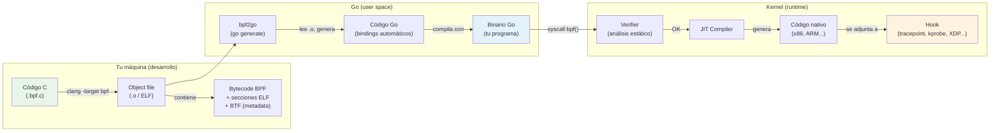

# Capítulo 3: Tu laboratorio de guerra

> "Un guerrero sin sus armas es solo un tipo parado. Configura tu entorno primero, pregunta después."

---

## Términos nuevos en este capítulo

- **clang** (clang) — compilador del proyecto LLVM capaz de generar bytecode BPF desde código C. Tu puerta de entrada para escribir programas que corren en el kernel.
- **LLVM** (el-el-vi-em) — infraestructura de compiladores que incluye el backend capaz de emitir instrucciones BPF. clang es su frontend para C.
- **bpftool** (bi-pi-ef-tul) — utilidad de línea de comandos para inspeccionar, cargar y gestionar programas BPF y maps en el kernel.
- **ELF** (elf) — Executable and Linkable Format, formato de archivo binario estándar en Linux. Los programas BPF compilados se empaquetan como objetos ELF.
- **object file** (óbject fail) — archivo `.o` resultado de compilar código C con clang. Contiene bytecode BPF empaquetado en formato ELF.
- **BTF** (bi-ti-ef) — BPF Type Format, metadata de tipos embebida en el binario que permite portabilidad entre versiones de kernel. Lo veremos a fondo en el Capítulo 15.
- **go generate** (gou yéneret) — comando de Go que ejecuta directivas `//go:generate` en tu código, usado por cilium/ebpf para generar bindings automáticos desde programas BPF.
- **bpf2go** (bi-pi-ef-tu-gou) — herramienta del proyecto cilium/ebpf que compila programas BPF en C y genera código Go para cargarlos y manejarlos.
- **toolchain** (tul-chéin) — conjunto de herramientas que transforman tu código fuente en un programa funcional cargado en el kernel. Incluye compilador, linker, y utilidades de gestión.
- **libbpf** (lib-bi-pi-ef) — biblioteca en C que simplifica la carga y gestión de programas BPF. Es la referencia de bajo nivel del ecosistema.
- **Aya** (áia) — framework en Rust para escribir programas BPF completos (kernel + user space) con safety garantizado por el type system.

## Objetivos

Al terminar este capítulo vas a poder:

1. Configurar un entorno de desarrollo funcional para eBPF (kernel, compilador, herramientas)
2. Verificar que tu kernel soporta las features BPF necesarias para el resto del libro
3. Compilar y cargar un programa eBPF mínimo usando cilium/ebpf (Go)

## Prerrequisitos

- Entender qué es el kernel y la separación user/kernel (Capítulo 1)
- Saber qué es eBPF, bytecode, el verifier, y hooks (Capítulo 2)
- Tener una máquina Linux disponible (o estar dispuesto a levantar una VM)

---

## 3.1 Kernel mínimo y configuración — Qué versión necesitas y qué flags activar

Antes de escribir una sola línea de código BPF, necesitas verificar que tu sistema está preparado. No todas las versiones del kernel soportan las mismas features, y las diferencias pueden ser la diferencia entre "funciona" y "error incomprensible a las 2am".

### La versión corta

| Kernel | ¿Sirve? | Notas |
|--------|---------|-------|
| < 4.x | ❌ No | eBPF apenas existía. Olvídalo. |
| 4.x | ⚠️ Parcial | Features muy limitadas. No lo recomiendo. |
| 5.0 – 5.14 | ⚠️ Funcional | Funciona, pero vas a encontrar limitaciones en features modernas. |
| 5.15 LTS | ✅ Mínimo | Es el mínimo para seguir este libro sin dolor. |
| 6.1 LTS | ✅✅ Recomendado | Soporte completo de todo lo que vamos a usar. BTF incluido por defecto. |
| 6.x+ | ✅✅✅ Ideal | Lo último y lo mejor. |

> 🔥 **Advertencia**: "Si tu kernel es < 5.x, vas a sufrir. Actualiza primero, llora después." En serio: muchas helper functions, tipos de maps, y features del verifier que usamos a partir del Capítulo 6 simplemente no existen en kernels viejos. No intentes seguir el libro con un kernel 4.x — vas a pelear contra errores que no tienen nada que ver con tu código.

### ¿Qué versión tienes?

```bash
uname -r
```

Si ves algo como `6.1.0-XX-generic` o `5.15.0-XX-generic`, estás bien. Si ves `4.x` — detente aquí y actualiza.

### CONFIG flags que necesitas

El kernel Linux es configurable. No todos los kernels se compilan con soporte BPF habilitado (aunque hoy en día casi todos los de distribución sí lo tienen). Estas son las flags críticas:

| Flag del kernel | Qué habilita | ¿Obligatoria? |
|-----------------|-------------|---------------|
| `CONFIG_BPF` | Subsistema BPF básico | ✅ Sí |
| `CONFIG_BPF_SYSCALL` | La syscall `bpf()` que permite cargar programas | ✅ Sí |
| `CONFIG_BPF_JIT` | Compilación JIT (bytecode → código nativo) | ✅ Sí (para rendimiento) |
| `CONFIG_HAVE_EBPF_JIT` | JIT disponible para tu arquitectura | ✅ Sí |
| `CONFIG_BPF_EVENTS` | Adjuntar BPF a tracepoints y kprobes | ✅ Sí (desde Cap 4) |
| `CONFIG_DEBUG_INFO_BTF` | Información de tipos BTF embebida en el kernel | ⚠️ Recomendada (obligatoria desde Cap 15) |

### ¿Cómo verifico qué flags tiene mi kernel?

```bash
# Opción 1: /proc/config.gz (si existe)
zcat /proc/config.gz | grep CONFIG_BPF

# Opción 2: config en /boot (distribuciones basadas en Debian)
grep CONFIG_BPF /boot/config-$(uname -r)

# Opción 3: la forma rápida
cat /boot/config-$(uname -r) | grep -E "CONFIG_BPF|CONFIG_DEBUG_INFO_BTF"
```

**Resultado esperado (kernel compatible):**

```
CONFIG_BPF=y
CONFIG_BPF_SYSCALL=y
CONFIG_BPF_JIT=y
CONFIG_HAVE_EBPF_JIT=y
CONFIG_BPF_EVENTS=y
CONFIG_DEBUG_INFO_BTF=y
```

<!-- [INSERTA IMAGEN AQUI: Captura de terminal mostrando la salida de grep CONFIG_BPF en el config del kernel con todas las flags en =y] -->

Si ves `=y` en las primeras cinco, estás listo para este capítulo y los siguientes. `CONFIG_DEBUG_INFO_BTF` es un bonus que necesitarás a partir del Capítulo 15 (BTF y CO-RE) — si tu kernel no lo tiene ahora, no te preocupes todavía.

> ⚙️ **Nota técnica**: Las distribuciones modernas (Ubuntu 22.04+, Fedora 38+, Debian 12+) incluyen todas estas flags habilitadas por defecto. Si usas el kernel de tu distribución sin modificar, probablemente ya las tienes. El problema aparece con kernels custom o distribuciones minimalistas.

### Si necesitas actualizar tu kernel

**Ubuntu/Debian:**
```bash
# Instalar el kernel HWE (Hardware Enablement) más reciente
sudo apt install linux-image-generic-hwe-22.04 linux-headers-generic-hwe-22.04
sudo reboot
```

**Fedora:**
```bash
sudo dnf upgrade --refresh
sudo dnf install kernel kernel-devel
sudo reboot
```

**O la opción nuclear:** Usa la VM del libro (siguiente sección) que ya viene con kernel 6.1 y todo configurado.

---

## 3.2 El toolchain — clang, LLVM, bpftool, y amigos

Un programa eBPF no se escribe, compila y ejecuta como un programa normal. El camino desde tu código fuente hasta la ejecución en el kernel tiene varios pasos y herramientas involucradas. Entender este pipeline es fundamental para no perderte cuando algo falle.

### El flujo completo



Desglosemos cada pieza:

### clang y LLVM — El compilador

**clang** es el frontend de C/C++ del proyecto LLVM. Lo usamos porque tiene un backend que emite bytecode BPF — es decir, sabe traducir tu código C a las instrucciones que entiende la máquina virtual eBPF del kernel.

El comando mágico:

```bash
clang -O2 -target bpf -g -c tu_programa.bpf.c -o tu_programa.bpf.o
```

Desglose de flags:

| Flag | Qué hace |
|------|----------|
| `-O2` | Optimización nivel 2. Necesaria para que el verifier acepte el código (sin optimizar, genera código ineficiente que puede fallar verificación) |
| `-target bpf` | Genera bytecode BPF en vez de código x86/ARM |
| `-g` | Incluye información de debug (y BTF si está habilitado) |
| `-c` | Solo compila, no linkea (genera .o) |

**Versión mínima:** clang 12. Recomendado: 15+.

### bpftool — Tu navaja suiza

`bpftool` es la herramienta de línea de comandos para interactuar con el subsistema BPF del kernel. Con ella puedes:

- Listar programas BPF cargados: `bpftool prog list`
- Ver maps activos: `bpftool map list`
- Inspeccionar bytecode: `bpftool prog dump xlated id <ID>`
- Ver código JIT generado: `bpftool prog dump jited id <ID>`
- Cargar programas manualmente: `bpftool prog load prog.o /sys/fs/bpf/mi_prog`
- Generar vmlinux.h: `bpftool btf dump file /sys/kernel/btf/vmlinux format c > vmlinux.h`

Ya la usaste brevemente en el Capítulo 2. A partir de ahora va a ser tu compañera constante de debugging.

### El object file ELF — El paquete

Cuando clang compila tu programa BPF, el resultado es un archivo `.o` en formato ELF. Pero no es un ELF ejecutable normal — contiene:

- **Secciones de código BPF** — el bytecode real, organizado por punto de adjunto (ej: `SEC("tracepoint/syscalls/sys_enter_execve")`)
- **Secciones de maps** — definiciones de las estructuras de datos que tu programa usa
- **Sección BTF** — metadata de tipos (si compilaste con `-g` y tu clang lo soporta)
- **Sección de relocaciones** — información para que el loader resuelva referencias en tiempo de carga

Puedes inspeccionar el contenido con:

```bash
# Ver secciones del ELF
llvm-objdump -h tu_programa.bpf.o

# Ver bytecode BPF desensamblado
llvm-objdump -d tu_programa.bpf.o

# Ver información BTF
bpftool btf dump file tu_programa.bpf.o
```

### Headers del kernel — Los planos del edificio

Para compilar programas BPF que accedan a estructuras del kernel (casi todos), necesitas los headers. Hay dos formas de obtenerlos:

1. **Paquete de headers de tu distribución** — `linux-headers-$(uname -r)`
2. **vmlinux.h generado con BTF** — un solo archivo header que contiene TODAS las definiciones de tipos del kernel

Para los primeros capítulos usaremos los headers de la distribución. A partir del Capítulo 15 (BTF/CO-RE) usaremos vmlinux.h.

### Resumen del toolchain mínimo

| Herramienta | Versión mínima | Instalar (Ubuntu/Debian) |
|-------------|---------------|--------------------------|
| clang | 12 | `apt install clang` |
| LLVM (llc, llvm-objdump) | 12 | `apt install llvm` |
| bpftool | cualquiera | `apt install linux-tools-$(uname -r)` |
| Go | 1.21 | [go.dev/dl](https://go.dev/dl/) |
| make | cualquiera | `apt install build-essential` |
| libelf | cualquiera | `apt install libelf-dev` |
| headers del kernel | tu versión | `apt install linux-headers-$(uname -r)` |

---

## 3.3 Tres caminos: libbpf (C), cilium/ebpf (Go), Aya (Rust)

Para escribir la parte de user space — el programa que compila, carga, adjunta y se comunica con tu programa BPF — tienes varias opciones. Aquí las tres principales del ecosistema.

### libbpf (C) — El camino canónico

**libbpf** es la biblioteca oficial de bajo nivel para trabajar con BPF desde C. Está desarrollada dentro del repositorio del kernel Linux y es la referencia contra la cual se miden todos los demás frameworks.

```c
// Pseudocódigo simplificado con libbpf
struct bpf_object *obj = bpf_object__open("prog.bpf.o");
bpf_object__load(obj);
struct bpf_link *link = bpf_program__attach(prog);
// ... manejar eventos ...
bpf_link__destroy(link);
bpf_object__close(obj);
```

**Pros:** Control total, mínimo overhead, documentación del kernel.
**Contras:** Verboso, manejo manual de memoria, ergonomía de C.

### cilium/ebpf (Go) — El camino pragmático (nuestro elegido)

**cilium/ebpf** es una biblioteca Go pura para trabajar con BPF. No depende de CGo ni de libbpf — implementa todo desde cero usando la syscall bpf() directamente. Es mantenida por el equipo de Cilium (Isovalent/Cisco).

```go
// Pseudocódigo simplificado con cilium/ebpf
spec, _ := loadMyProgram()      // generado por bpf2go
objs := myProgramObjects{}
spec.LoadAndAssign(&objs, nil)
link, _ := link.Tracepoint("syscalls", "sys_enter_execve", objs.MyFunc, nil)
defer link.Close()
// ... manejar eventos ...
```

**Pros:** Ergonomía de Go, generación automática de bindings (bpf2go), sin CGo, excelente para servicios de producción, type-safe.
**Contras:** Menos control de bajo nivel que libbpf puro, documentación más dispersa.

**Este es el framework que usamos a lo largo de todo el libro.** Las razones:

1. Go es un lenguaje mainstream con buen tooling
2. `bpf2go` automatiza la generación de código (menos boilerplate)
3. cilium/ebpf es production-grade (Cilium, Tetragon, y docenas de proyectos lo usan)
4. El manejo de errores de Go es más explícito que el de C
5. Compilación estática = un binario que distribuyes sin dependencias

### Aya (Rust) — El camino moderno

**Aya** es un framework Rust que permite escribir tanto el programa BPF como el user space en Rust. Promete safety garantizado por el type system y zero-copy.

```rust
// Pseudocódigo simplificado con Aya
let mut bpf = Bpf::load(include_bytes_aligned!("prog.bpf.o"))?;
let program: &mut TracePoint = bpf.program_mut("my_func").try_into()?;
program.load()?;
program.attach("syscalls", "sys_enter_execve")?;
// ... manejar eventos ...
```

**Pros:** Type safety, no necesita C para BPF (puede escribir BPF en Rust), ergonomía moderna.
**Contras:** Ecosistema más joven, menos documentación, compilación más lenta, curva de aprendizaje de Rust.

> ⚙️ **Nota técnica**: Aya es una opción legítima y en crecimiento. No la usamos como framework principal del libro simplemente por pragmatismo: Go tiene una comunidad más amplia en infraestructura, y cilium/ebpf es el framework más testeado en producción a escala. Si ya sabes Rust, explorar Aya por tu cuenta es una excelente idea. Volvemos a Aya con más detalle en el Capítulo 11.

### ¿Y Python/BCC?

BCC (BPF Compiler Collection) es un toolkit basado en Python que fue muy popular entre 2015-2019 para herramientas de tracing. Compila programas BPF sobre la marcha usando LLVM embebido.

**Estado actual:** Funciona, pero no se recomienda para proyectos nuevos. Requiere tener clang/LLVM en runtime, no soporta CO-RE (portabilidad), y el modelo de compilación en runtime es frágil. Las herramientas `bcc-tools` siguen siendo útiles para inspección rápida, pero para código nuevo, cilium/ebpf o Aya son mejores opciones.

Lo mencionamos porque lo vas a encontrar en tutorials viejos y en herramientas de tu distribución (`opensnoop`, `tcplife`, etc.). Pero no lo usamos en este libro.

### La tabla de decisión

| Criterio | libbpf (C) | cilium/ebpf (Go) | Aya (Rust) |
|----------|------------|-------------------|------------|
| Madurez | ⭐⭐⭐ | ⭐⭐⭐ | ⭐⭐ |
| Ergonomía | ⭐ | ⭐⭐⭐ | ⭐⭐⭐ |
| Rendimiento user space | ⭐⭐⭐ | ⭐⭐ | ⭐⭐⭐ |
| Documentación | ⭐⭐ | ⭐⭐ | ⭐ |
| Producción probada | ⭐⭐⭐ | ⭐⭐⭐ | ⭐⭐ |
| Deploy (binario estático) | ⭐⭐ | ⭐⭐⭐ | ⭐⭐⭐ |

> 💡 **Analogía**: Piensa en estos frameworks como formas de viajar. libbpf (C) es conducir un auto manual — control total pero requiere más atención. cilium/ebpf (Go) es un automático con GPS — llegas al mismo destino con menos esfuerzo cognitivo. Aya (Rust) es un auto eléctrico de última generación — moderno y seguro, pero a veces las estaciones de carga son difíciles de encontrar.

---

## 3.4 Tu primer "it works" — Compilar un esqueleto vacío con cilium/ebpf (Go)

Basta de teoría. Vamos a compilar algo que se cargue en el kernel — aunque no haga nada útil todavía. El objetivo aquí es verificar que todo el toolchain funciona end-to-end.

### El programa BPF más simple del mundo

Crea un archivo `minimal.bpf.c`:

```c
//go:build ignore

#include <linux/bpf.h>
#include <bpf/bpf_helpers.h>

// SEC define en qué sección del ELF va este programa.
// El nombre de la sección indica el tipo y el attach point.
SEC("tracepoint/syscalls/sys_enter_execve")
int minimal_prog(void *ctx) {
    // No hace nada. Solo existe para demostrar que el toolchain funciona.
    return 0;
}

// Todos los programas BPF necesitan esta línea.
char LICENSE[] SEC("license") = "GPL";
```

Esto es un programa BPF completamente válido. No hace nada — retorna 0 inmediatamente. Pero pasa por todo el pipeline: compilación con clang, verificación por el verifier, y carga al kernel.

### El lado Go: bpf2go y generación de código

En el mundo cilium/ebpf, el flujo es:

1. Escribes tu programa BPF en C (como arriba)
2. Usas `bpf2go` para compilarlo y generar código Go automáticamente
3. Tu programa Go importa ese código generado para cargar y manejar el programa BPF

Primero, el archivo Go con la directiva de generación. Crea `main.go`:

```go
package main

//go:generate go run github.com/cilium/ebpf/cmd/bpf2go -target amd64 minimal minimal.bpf.c

import (
	"fmt"
	"log"
	"os"
	"os/signal"
	"syscall"

	"github.com/cilium/ebpf/link"
)

func main() {
	// Cargar los objetos BPF generados por bpf2go
	objs := minimalObjects{}
	if err := loadMinimalObjects(&objs, nil); err != nil {
		log.Fatalf("Error cargando objetos BPF: %v", err)
	}
	defer objs.Close()

	// Adjuntar al tracepoint sys_enter_execve
	tp, err := link.Tracepoint("syscalls", "sys_enter_execve", objs.MinimalProg, nil)
	if err != nil {
		log.Fatalf("Error adjuntando tracepoint: %v", err)
	}
	defer tp.Close()

	fmt.Println("✅ Programa BPF cargado y adjuntado a sys_enter_execve")
	fmt.Println("   (no hace nada, pero demuestra que el toolchain funciona)")
	fmt.Println("   Presiona Ctrl+C para salir...")

	// Esperar señal de salida
	sig := make(chan os.Signal, 1)
	signal.Notify(sig, syscall.SIGINT, syscall.SIGTERM)
	<-sig

	fmt.Println("\n👋 Limpiando y saliendo...")
}
```

### El go.mod

```
module github.com/ebpf-macizo/cap03-minimal

go 1.22

require github.com/cilium/ebpf v0.16.0
```

### El comando mágico: go generate

```bash
# Esto compila el .bpf.c y genera archivos Go con los bindings
go generate ./...
```

Lo que hace `go generate` al encontrar la directiva `//go:generate`:

1. Ejecuta `bpf2go` con los argumentos dados
2. `bpf2go` invoca `clang -target bpf` para compilar `minimal.bpf.c`
3. Genera `minimal_bpfel.go` y `minimal_bpfel.o` (o `_bpfeb` para big-endian)
4. El código Go generado contiene funciones para cargar y acceder a los programas y maps

Después:

```bash
# Compilar el binario final
go build -o minimal .

# Ejecutar (requiere root o CAP_BPF)
sudo ./minimal
```

**Resultado esperado:**

```
✅ Programa BPF cargado y adjuntado a sys_enter_execve
   (no hace nada, pero demuestra que el toolchain funciona)
   Presiona Ctrl+C para salir...
```

<!-- [INSERTA IMAGEN AQUI: Captura de terminal mostrando la ejecución exitosa de sudo ./minimal con el mensaje de programa BPF cargado] -->

Si ves eso, tu toolchain completo funciona. El programa BPF:
- Se compiló de C a bytecode BPF ✓
- Se empaquetó en un ELF ✓
- Se embebió en tu binario Go ✓
- Pasó el verifier del kernel ✓
- Se adjuntó a un tracepoint ✓

Bienvenido al juego.

---

## 3.5 Contenedores y VMs — Un lab portátil que funciona igual en todos lados

Hay un problema con todo lo anterior: necesitas un kernel Linux con las features correctas. Si estás en macOS o Windows, no tienes un kernel Linux nativo. Y si estás en Linux pero con un kernel viejo o sin los CONFIG flags, tampoco te sirve.

La solución: un entorno controlado y reproducible.

> ☠️ **Cuidado — macOS**: eBPF es una tecnología del kernel **Linux**. No existe en macOS. No puedes compilar ni ejecutar programas BPF en tu Mac sin una VM Linux corriendo de verdad. Docker Desktop en Mac **no sirve** para esto — su VM interna tiene un kernel limitado sin soporte BPF completo. Necesitas una VM Linux real con kernel ≥ 5.15. Lee las opciones abajo.

### La realidad según tu sistema operativo

| Tu OS | ¿Puedes hacer eBPF directo? | Solución |
|-------|:---------------------------:|----------|
| **Linux nativo** (kernel ≥ 5.15) | ✅ Sí | Instala las herramientas y listo |
| **Linux nativo** (kernel viejo) | ❌ No | Actualiza kernel o usa VM |
| **macOS Intel** | ❌ No | Lima/Colima o instancia en la nube |
| **macOS Apple Silicon (M1/M2/M3)** | ❌ No | **Lima** (recomendado) o instancia en la nube |
| **Windows** | ❌ No | WSL2 (con kernel reciente) o instancia en la nube |

### El directorio code/setup/

El repositorio del libro incluye todo lo necesario en `code/setup/`:

```
code/setup/
├── lima.yaml       # Configuración de Lima para macOS (recomendado)
├── Vagrantfile     # VM Ubuntu + kernel 6.1 (solo Mac Intel / Linux)
├── Dockerfile      # Contenedor para compilación (NO para ejecutar BPF)
├── check-env.sh   # Script que verifica tu entorno
└── README.md       # Instrucciones detalladas
```

### Opción 1: Lima (recomendada para macOS)

**Lima** corre VMs Linux nativas sobre el hypervisor de Apple (Virtualization.framework). En Mac con Apple Silicon, esto te da una VM ARM64 con rendimiento nativo y kernel reciente. Es la mejor opción para hacer eBPF en Mac.

**Instalar Lima:**

```bash
# Con Homebrew
brew install lima
```

**Levantar el lab:**

```bash
cd code/setup/

# Crear y arrancar la VM (primera vez: ~5 min)
limactl start --name=ebpf lima.yaml

# Entrar a la VM
limactl shell ebpf

# Dentro de la VM, el repo está montado automáticamente
cd /Users/<tu-usuario>/Desktop/ebpf_macizo/code
./setup/check-env.sh
```

**¿Por qué Lima y no VirtualBox?**

| | VirtualBox | Lima |
|---|---|---|
| Mac Apple Silicon (M1/M2/M3) | ❌ No funciona | ✅ Nativo ARM64 |
| Mac Intel | ⚠️ Funciona, lento | ✅ Funciona |
| Rendimiento | Emulación | Virtualización nativa |
| Kernel | Tienes que configurar | Ya viene con kernel reciente |
| Setup | 10+ min, pesado | 5 min, ligero |

> ⚙️ **Nota técnica**: Lima usa QEMU + Virtualization.framework en macOS. En Mac Apple Silicon, la VM corre ARM64 de forma nativa (sin emulación). El kernel de la VM es un Ubuntu reciente con soporte BPF completo. Colima (`brew install colima`) es una alternativa con interfaz más simple si ya lo usas para Docker.

### Opción 2: Vagrant (Mac Intel o Linux)

Si estás en Mac Intel o en Linux y prefieres Vagrant/VirtualBox:

```bash
cd code/setup/

# Levantar la VM (primera vez: ~10 min)
vagrant up

# Reiniciar para arrancar con kernel 6.1
vagrant reload

# Entrar a la VM
vagrant ssh

# Dentro de la VM, el repo está en /vagrant/
cd /vagrant/code
```

> 🔥 **Advertencia**: VirtualBox **no funciona** en Mac con Apple Silicon (M1/M2/M3/M4). Si tienes un Mac reciente, usa Lima (Opción 1) o una instancia en la nube (Opción 4).

### Opción 3: Docker (solo para compilar, NO para ejecutar BPF)

Docker sirve para compilar programas BPF (generar los `.bpf.o`), pero **no para cargarlos al kernel** — a menos que estés en Linux nativo con `--privileged`.

```bash
cd code/setup/

# Construir la imagen
docker build -t ebpf-macizo .

# Solo compilar (funciona en cualquier OS)
docker run -it --rm -v $(pwd)/../..:/workspace ebpf-macizo

# Compilar Y ejecutar (SOLO en Linux nativo con kernel >= 5.15)
docker run -it --rm --privileged \
  -v /sys/kernel/debug:/sys/kernel/debug \
  -v /sys/fs/bpf:/sys/fs/bpf \
  -v $(pwd)/../..:/workspace \
  ebpf-macizo
```

> ☠️ **Cuidado**: Docker Desktop en macOS y Windows corre una VM Linux interna con un kernel que **no tiene soporte BPF completo**. El `--privileged` no te va a salvar. Solo funciona para compilar, no para ejecutar `sudo ./hello`. Usa Lima o una instancia en la nube para la ejecución.

### Opción 4: Instancia en la nube (la alternativa universal)

Si nada de lo anterior te convence, o quieres un entorno limpio sin tocar tu máquina, levanta una instancia Linux en cualquier proveedor cloud. Es la opción que **siempre funciona**, sin importar tu sistema operativo.

**Lo que necesitas:** Una instancia Ubuntu 22.04+ (o cualquier distro con kernel ≥ 5.15). Las instancias más baratas sirven (2 vCPU, 4 GB RAM es suficiente).

| Proveedor | Tipo de instancia | Costo aprox. |
|-----------|-------------------|--------------|
| AWS | t3.medium (Ubuntu 22.04) | ~$0.04/hora |
| GCP | e2-medium (Ubuntu 22.04) | ~$0.03/hora |
| DigitalOcean | Basic Droplet 4GB | ~$0.03/hora |
| Hetzner | CX21 (Ubuntu 22.04) | ~€0.01/hora |
| Linode | Nanode 2GB | ~$0.02/hora |

**Setup rápido en una instancia cloud:**

```bash
# Conectarte
ssh usuario@tu-instancia

# Instalar herramientas (Ubuntu 22.04)
sudo apt update
sudo apt install -y clang llvm libelf-dev libbpf-dev \
  linux-headers-$(uname -r) linux-tools-$(uname -r) \
  build-essential gcc-multilib git

# Instalar Go
wget -q https://go.dev/dl/go1.22.4.linux-amd64.tar.gz
sudo tar -C /usr/local -xzf go1.22.4.linux-amd64.tar.gz
echo 'export PATH=$PATH:/usr/local/go/bin' >> ~/.bashrc
source ~/.bashrc

# Clonar el repo
git clone https://github.com/mercadoalex/ebpf_macizo.git
cd ebpf_macizo/code

# Verificar
./setup/check-env.sh
```

Las instancias cloud tienen la ventaja de kernel reciente con todas las CONFIG flags habilitadas por defecto. No hay virtualization overhead para BPF. Es la experiencia más limpia posible.

> 💡 **Tip**: Si solo quieres probar sin gastar dinero, la capa gratuita de AWS (t2.micro con Ubuntu 22.04) tiene kernel con soporte BPF básico. Para los capítulos avanzados (XDP, BTF/CO-RE) necesitas algo con más recursos, pero para el Nivel Novato una instancia gratuita alcanza.

### ¿Cuál elegir? — Guía de decisión

| Tu situación | Recomendación |
|-------------|---------------|
| Mac Apple Silicon (M1/M2/M3/M4) | **Lima** o instancia en la nube |
| Mac Intel | Lima, Vagrant, o instancia en la nube |
| Windows | WSL2 (kernel ≥ 5.15) o instancia en la nube |
| Linux con kernel ≥ 5.15 | Directo en tu máquina (la mejor experiencia) |
| Linux con kernel viejo | Actualiza kernel, o instancia en la nube |
| No quieres instalar nada local | Instancia en la nube |
| Quieres el entorno más reproducible | Instancia en la nube o Lima |

### Verificar tu entorno

Sin importar qué opción elijas, el paso final es correr el script de verificación:

```bash
./code/setup/check-env.sh
```

Este script revisa:
1. Versión del kernel (≥ 5.15)
2. clang/LLVM disponible
3. bpftool instalado
4. Go instalado (≥ 1.21)
5. Headers del kernel presentes
6. CONFIG flags de BPF habilitadas

Si todo pasa, ves:

```
╔══════════════════════════════════════════════╗
║  eBPF: Macizo y Conciso — Check de Entorno  ║
╚══════════════════════════════════════════════╝

[1/6] Kernel Linux
  ✓ Kernel 6.1.0-XX-generic (>= 6.1 recomendado)

[2/6] Clang / LLVM
  ✓ clang versión 15 (>= 12)
  ✓ llc disponible (versión 15)

[3/6] bpftool
  ✓ bpftool disponible (bpftool v7.x)

[4/6] Go
  ✓ Go versión 1.22 (>= 1.21)

[5/6] Headers del kernel
  ✓ Headers disponibles en /lib/modules/6.1.0-XX-generic/build

[6/6] Soporte BPF en el kernel
  ✓ /sys/fs/bpf montado (bpffs disponible)
  ✓ CONFIG_BPF=y habilitado en el kernel
  ✓ CONFIG_BPF_SYSCALL=y habilitado
  ✓ CONFIG_DEBUG_INFO_BTF=y habilitado (BTF/CO-RE disponible)

═══════════════════════════════════
 Resumen
═══════════════════════════════════
  ✓ Pasaron:     10
  ⚠ Advertencias: 0
  ✗ Fallaron:    0

🤘 Entorno perfecto. Estás listo para eBPF.
```

<!-- [INSERTA IMAGEN AQUI: Captura de terminal mostrando la ejecución completa de check-env.sh con todos los checks pasando en verde] -->

Si algo falla, el script te dice exactamente qué instalar y cómo.

---

## Ejercicio: Montar tu laboratorio y ejecutar el esqueleto en Go

📋 **Nivel:** Novato
📚 **Conceptos previos:** Toolchain BPF (este capítulo), compilación C, conceptos básicos de Go
🖥️ **Entorno:** El lab del libro (Vagrant o Docker con privilegios)

Este ejercicio te lleva desde cero hasta un programa BPF corriendo en el kernel. Paso a paso, con verificación en cada etapa.

### Paso 1: Levantar el entorno

**Si usas Vagrant (recomendado para primera vez):**

```bash
cd code/setup/
vagrant up
vagrant reload   # necesario para arrancar con kernel 6.1
vagrant ssh
cd /vagrant/code
```

**Si usas Docker (solo en Linux con kernel >= 5.15):**

```bash
cd code/setup/
docker build -t ebpf-macizo .
docker run -it --rm --privileged \
  -v /sys/kernel/debug:/sys/kernel/debug \
  -v /sys/fs/bpf:/sys/fs/bpf \
  -v $(pwd)/../..:/workspace \
  ebpf-macizo
cd /workspace/code
```

**Resultado esperado:** Un shell dentro del entorno con todas las herramientas disponibles.

### Paso 2: Verificar el entorno

```bash
./setup/check-env.sh
```

**Resultado esperado:** Todos los checks en verde (✓). Si algo falla, sigue las instrucciones que el script te da.

### Paso 3: Crear el directorio del proyecto

```bash
mkdir -p cap03-laboratorio/ejercicio/solucion
cd cap03-laboratorio/ejercicio/solucion
```

### Paso 4: Escribir el programa BPF en C

Crea el archivo `minimal.bpf.c`:

```c
//go:build ignore

#include <linux/bpf.h>
#include <bpf/bpf_helpers.h>

SEC("tracepoint/syscalls/sys_enter_execve")
int minimal_prog(void *ctx) {
    return 0;
}

char LICENSE[] SEC("license") = "GPL";
```

**Verificación:** El archivo debe tener exactamente esas líneas. `SEC("license")` es obligatoria — sin ella el verifier rechaza el programa.

### Paso 5: Crear go.mod

```bash
go mod init github.com/ebpf-macizo/cap03-minimal
go get github.com/cilium/ebpf@latest
```

**Resultado esperado:**

```
go: creating new go.mod: module github.com/ebpf-macizo/cap03-minimal
go: added github.com/cilium/ebpf v0.16.0
```

(La versión exacta de cilium/ebpf puede variar.)

### Paso 6: Escribir main.go

Crea `main.go`:

```go
package main

//go:generate go run github.com/cilium/ebpf/cmd/bpf2go -target amd64 minimal minimal.bpf.c

import (
	"fmt"
	"log"
	"os"
	"os/signal"
	"syscall"

	"github.com/cilium/ebpf/link"
)

func main() {
	objs := minimalObjects{}
	if err := loadMinimalObjects(&objs, nil); err != nil {
		log.Fatalf("Error cargando objetos BPF: %v", err)
	}
	defer objs.Close()

	tp, err := link.Tracepoint("syscalls", "sys_enter_execve", objs.MinimalProg, nil)
	if err != nil {
		log.Fatalf("Error adjuntando tracepoint: %v", err)
	}
	defer tp.Close()

	fmt.Println("✅ Programa BPF cargado y adjuntado exitosamente")
	fmt.Println("   Hook: tracepoint/syscalls/sys_enter_execve")
	fmt.Println("   Presiona Ctrl+C para salir...")

	sig := make(chan os.Signal, 1)
	signal.Notify(sig, syscall.SIGINT, syscall.SIGTERM)
	<-sig

	fmt.Println("\n👋 Programa BPF removido. Adiós.")
}
```

### Paso 7: Generar los bindings

```bash
go generate ./...
```

**Resultado esperado:** Sin errores. Se crean archivos `minimal_bpfel.go` y `minimal_bpfel.o` (o `minimal_bpfeb.*` si estás en big-endian).

```bash
ls minimal_bpf*
```

Deberías ver:

```
minimal_bpfel.go  minimal_bpfel.o
```

> ⚙️ **Nota técnica**: `bpfel` significa "BPF little-endian". En arquitecturas x86 y ARM modernas, siempre usas little-endian. El archivo `.o` es tu programa BPF compilado, y el `.go` contiene las funciones Go generadas para cargarlo.

### Paso 8: Compilar el binario

```bash
go build -o minimal .
```

**Resultado esperado:** Sin errores. Se crea un binario `minimal`.

```bash
ls -la minimal
```

```
-rwxr-xr-x 1 vagrant vagrant 4.2M ... minimal
```

Un binario estático de ~4 MB que contiene tu programa BPF embebido. Puedes copiarlo a cualquier máquina Linux con kernel compatible y ejecutarlo — sin dependencias.

### Paso 9: Ejecutar

```bash
sudo ./minimal
```

**Resultado esperado:**

```
✅ Programa BPF cargado y adjuntado exitosamente
   Hook: tracepoint/syscalls/sys_enter_execve
   Presiona Ctrl+C para salir...
```

Si ves eso — **felicidades**. Acabas de cargar tu primer programa eBPF en el kernel.

### Paso 10: Verificar que está cargado (en otra terminal)

Abre otra terminal (o `vagrant ssh` en otra ventana):

```bash
sudo bpftool prog list
```

**Resultado esperado (entre otros):**

```
42: tracepoint  name minimal_prog  tag d35f8b0d4a53e1f5  gpl
        loaded_at 2024-01-15T10:30:00+0000  uid 0
        xlated 16B  jited 28B  memlock 4096B
```

Ahí está tu programa: `minimal_prog`, tipo `tracepoint`, con licencia GPL, 16 bytes de bytecode traducidos a 28 bytes de código JIT nativo.

<!-- [INSERTA IMAGEN AQUI: Captura de terminal mostrando la salida de sudo bpftool prog list con el programa minimal_prog cargado, tipo tracepoint, con su tag y tamaño de bytecode] -->

### Paso 11: Limpiar

Presiona `Ctrl+C` en la terminal donde corre el programa:

```
^C
👋 Programa BPF removido. Adiós.
```

Verifica con `bpftool prog list` que el programa ya no aparece.

### Verificación final

Si completaste todos los pasos, confirmaste que:

- ✅ Tu entorno tiene kernel ≥ 5.15 con soporte BPF
- ✅ clang compila código C a bytecode BPF
- ✅ bpf2go genera bindings Go automáticamente
- ✅ Go compila un binario con el programa BPF embebido
- ✅ El verifier del kernel acepta tu programa
- ✅ El programa se adjunta a un tracepoint
- ✅ `bpftool` puede ver el programa cargado
- ✅ Al salir, el programa se limpia correctamente

<!-- [INSERTA IMAGEN AQUI: Captura de terminal mostrando la secuencia completa: ejecución de sudo ./minimal, el mensaje de éxito, y luego Ctrl+C con el mensaje de limpieza] -->

**Conexión con lo que viene:** Este esqueleto vacío es la base sobre la que construimos todo. En el Capítulo 4 le vamos a agregar lógica real — un Hello World que imprime información cada vez que se ejecuta un programa nuevo en el sistema.

---

## Resumen

Lo que te llevas de este capítulo:

1. **Kernel ≥ 5.15 es el mínimo** para seguir este libro. 6.1 LTS es lo recomendado. Las CONFIG flags (CONFIG_BPF, CONFIG_BPF_SYSCALL, CONFIG_DEBUG_INFO_BTF) determinan qué puedes hacer.

2. **El toolchain BPF tiene un pipeline claro**: código C → clang (con -target bpf) → object file ELF con bytecode → carga al kernel vía syscall bpf() → verificación → JIT → ejecución.

3. **cilium/ebpf (Go) es nuestro framework**: `bpf2go` compila tu programa BPF y genera código Go para cargarlo. Un binario estático que distribuyes sin dependencias.

4. **libbpf (C), Aya (Rust), y BCC (Python) son alternativas** legítimas con diferentes trade-offs. Pero en este libro usamos Go para mantener el foco en un solo stack.

5. **Vagrant o Docker** te dan un entorno reproducible. `check-env.sh` verifica que todo está en orden antes de empezar a codear.

6. **Un programa BPF funcional no necesita hacer nada útil** para validar tu toolchain. Si se carga sin errores del verifier, tu entorno funciona.

---

## Para saber más

- 📖 [cilium/ebpf — Getting Started](https://ebpf-go.dev/guides/getting-started/) — Tutorial oficial de cilium/ebpf para Go. El punto de partida para profundizar.
- 📖 [BPF and XDP Reference Guide (Cilium docs)](https://docs.cilium.io/en/stable/bpf/) — Guía exhaustiva del subsistema BPF. Densa pero definitiva.
- 💻 [github.com/cilium/ebpf](https://github.com/cilium/ebpf) — Repositorio del framework que usamos. Ejemplos, issues, y el código de bpf2go.
- 📝 [libbpf-bootstrap](https://github.com/libbpf/libbpf-bootstrap) — Si quieres explorar el camino de libbpf puro (C), este repo tiene templates.
- 💻 [Aya Book](https://aya-rs.dev/book/) — Documentación de Aya si quieres explorar el camino Rust.
- 📖 [Kernel BPF documentation](https://www.kernel.org/doc/html/latest/bpf/) — Documentación oficial del subsistema BPF en el kernel.
