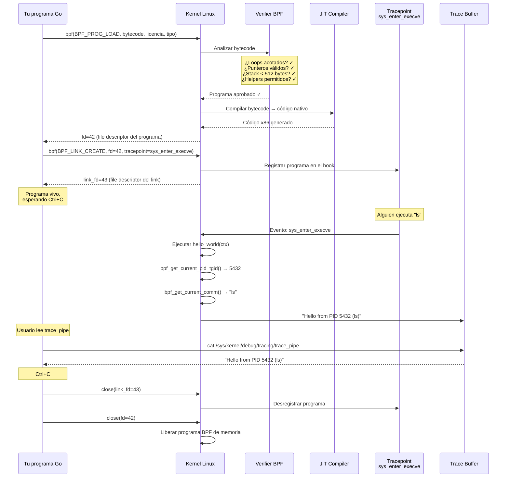

# Capítulo 4: Hello World — Tu primer hook

> "El primer programa que escribes siempre es basura. Pero basura que funciona es mejor que una obra maestra que no compila."

---

## Términos nuevos en este capítulo

- **bpf_trace_printk** (bi-pi-ef tréis príntk) — helper function que imprime mensajes de debug al trace buffer del kernel. Es el `printf` de eBPF, pero con limitaciones severas (y no apto para producción).
- **trace_pipe** (tréis páip) — archivo virtual en `/sys/kernel/debug/tracing/trace_pipe` donde aparecen los mensajes emitidos por `bpf_trace_printk`. Tu ventana al kernel.
- **SEC** (sec, de "section") — macro de C que coloca una función o variable en una sección específica del ELF. Le dice al loader qué tipo de programa es y dónde adjuntarlo.
- **__u32** (unsigned terty-tu) — tipo de 32 bits sin signo definido en los headers del kernel. Alias de `uint32_t` pero específico del ecosistema BPF/kernel.
- **__u64** (unsigned sixti-for) — tipo de 64 bits sin signo definido en los headers del kernel. Alias de `uint64_t` en contexto BPF.
- **bpf_get_current_pid_tgid** (bi-pi-ef get current pid ti-yi-ai-di) — helper function que retorna el PID y TGID del proceso actual combinados en un valor de 64 bits. Los 32 bits altos son el TGID (el PID que ves en `ps`), los 32 bits bajos son el TID (thread ID).
- **bpf_get_current_comm** (bi-pi-ef get current com) — helper function que copia el nombre del proceso actual (el campo `comm` del task_struct) a un buffer que tú proporcionas. Máximo 16 caracteres.
- **tracepoint** (tréis-point) — punto de instrumentación estático definido en el código fuente del kernel. Son estables entre versiones (a diferencia de los kprobes) y tienen formato documentado.

## Objetivos

Al terminar este capítulo vas a poder:

1. Escribir un programa eBPF completo que se adjunte a un tracepoint del kernel
2. Observar la salida del programa vía trace_pipe
3. Entender el ciclo completo: escribir → compilar → cargar → adjuntar → observar

## Prerrequisitos

- Entorno de desarrollo funcional con clang, Go, y cilium/ebpf (Capítulo 3)
- Saber qué es el toolchain BPF y el flujo código → bytecode → kernel (Capítulo 3)
- Entender qué son los hooks y attach points (Capítulo 2)

---

## 4.1 El programa más simple del mundo — bpf_trace_printk y nada más

En el capítulo anterior cargaste un programa BPF que no hacía nada. Retornaba cero y se iba a dormir. Era un esqueleto — la prueba de que el toolchain funciona.

Ahora le vamos a dar vida.

El programa eBPF más simple que *hace algo observable* usa una sola helper function: `bpf_trace_printk`. Es el equivalente de `printf` en el mundo BPF — pero con restricciones que te van a hacer llorar si vienes de user space.

### ¿Qué es bpf_trace_printk?

Es una helper function que escribe un mensaje al trace buffer del kernel. Ese mensaje luego aparece en `/sys/kernel/debug/tracing/trace_pipe` cuando lo lees.

```c
// La firma (simplificada):
long bpf_trace_printk(const char *fmt, __u32 fmt_size, ...);
```

La usas así:

```c
bpf_trace_printk("Hello, eBPF!\n", sizeof("Hello, eBPF!\n"));
```

O con la macro más humana (disponible en headers modernos):

```c
bpf_printk("Hello, eBPF!");
```

`bpf_printk` es un wrapper macro que calcula el tamaño del formato por ti. Usamos esta forma a lo largo del libro porque es menos verbosa y menos propensa a errores de tamaño.

### Las limitaciones que duelen

`bpf_trace_printk` no es `printf`. Tiene restricciones brutales:

| Limitación | Detalle |
|-----------|---------|
| Máximo 3 argumentos | No puedes pasar más de 3 valores además del formato |
| Sin %f (floats) | Solo enteros y strings (%d, %u, %x, %s, %lld, %llu, %llx) |
| Sin formato dinámico | El string de formato debe ser constante (literal en el código) |
| Performance horrible | Escribe a un buffer global con lock. Bajo carga, mata rendimiento |
| Salida solo en trace_pipe | No hay forma de redirigirla a tu aplicación directamente |

> 💡 **Analogía**: Piensa en `bpf_trace_printk` como poner un micrófono en una habitación. El programa BPF está dentro del kernel escuchando eventos sin interferir en lo que pasa — solo reporta lo que oye. Pero el micrófono es viejo, analógico, y solo graba en un casete que tienes que ir a buscar manualmente (`trace_pipe`). Funciona para verificar que las cosas están pasando, pero no es un sistema de grabación profesional.

### ¿Dónde se ve la salida?

Todo lo que `bpf_trace_printk` escribe va a parar al trace buffer del kernel. Lo lees así:

```bash
sudo cat /sys/kernel/debug/tracing/trace_pipe
```

Este archivo es un stream — se bloquea esperando nuevos mensajes. Cada línea que aparece viene de un programa BPF (o de ftrace) que escribió algo.

El formato de cada línea:

```
       <PROCESO>-<PID>   [<CPU>] d..1  <TIMESTAMP>: bpf_trace_printk: <TU MENSAJE>
```

Ejemplo real:

```
           bash-1234    [003] d..1  1234.567890: bpf_trace_printk: Hello, eBPF!
```

Esto te dice: el proceso `bash` con PID 1234, corriendo en la CPU 3, disparó tu programa BPF que imprimió "Hello, eBPF!".

> 🔥 **Advertencia**: `bpf_trace_printk` es para debug, no para producción. Si lo usas en prod, te vas a enterar por la peor vía. El trace buffer es un recurso compartido del kernel con un lock global. Si tu programa se dispara 10,000 veces por segundo (algo trivial con tracepoints de syscalls), vas a saturar el buffer, perder mensajes, y degradar el rendimiento del sistema entero. A partir del Capítulo 6 aprenderás a usar maps y ring buffers — la forma correcta de comunicar datos del kernel a user space.

### El Hello World completo

Aquí está el programa más simple del mundo que produce output observable:

```c
//go:build ignore

#include <linux/bpf.h>
#include <bpf/bpf_helpers.h>

SEC("tracepoint/syscalls/sys_enter_execve")
int hello_world(void *ctx) {
    bpf_printk("Hello, eBPF! Un proceso ejecutó execve.");
    return 0;
}

char LICENSE[] SEC("license") = "GPL";
```

Cinco líneas de lógica. Eso es todo.

Cada vez que *cualquier* proceso en el sistema ejecuta un `execve` (la syscall que inicia un nuevo programa), tu código imprime un mensaje. Es tu primer programa eBPF que hace algo visible.

Pero antes de correrlo, entendamos cada pieza.

---

## 4.2 El lado del kernel — Escribiendo el programa BPF en C

Vamos a escribir un programa BPF real, línea por línea. No es largo — pero cada línea tiene un propósito.

### El archivo: hello.bpf.c

```c
//go:build ignore

#include <linux/bpf.h>
#include <bpf/bpf_helpers.h>

SEC("tracepoint/syscalls/sys_enter_execve")
int hello_world(void *ctx) {
    __u64 pid_tgid = bpf_get_current_pid_tgid();
    __u32 pid = pid_tgid >> 32;

    char comm[16];
    bpf_get_current_comm(&comm, sizeof(comm));

    bpf_printk("Hello from PID %d (%s)", pid, comm);
    return 0;
}

char LICENSE[] SEC("license") = "GPL";
```

### Anatomía línea por línea

#### `//go:build ignore`

```c
//go:build ignore
```

Esto no es C ni BPF — es una directiva de Go. Le dice al compilador de Go que ignore este archivo cuando compila tu proyecto. Es necesario porque `bpf2go` espera que el archivo `.bpf.c` viva en el mismo directorio que tu código Go, pero Go se confundiría si intentara compilarlo como parte del package.

#### Los includes

```c
#include <linux/bpf.h>
#include <bpf/bpf_helpers.h>
```

`linux/bpf.h` define las constantes y tipos del subsistema BPF del kernel (`BPF_PROG_TYPE_*`, `__u32`, `__u64`, etc.).

`bpf/bpf_helpers.h` define las helper functions disponibles para tu programa BPF (`bpf_trace_printk`, `bpf_get_current_pid_tgid`, `bpf_get_current_comm`, etc.) y macros como `SEC()` y `bpf_printk`.

Estos headers vienen con tu instalación de libbpf o con los headers del kernel. Si usas el entorno del libro, ya los tienes.

#### La macro SEC

```c
SEC("tracepoint/syscalls/sys_enter_execve")
```

`SEC` es una macro que coloca la función que sigue en una sección específica del archivo ELF compilado. El nombre de la sección le dice al loader (cilium/ebpf en nuestro caso) dos cosas:

1. **Qué tipo de programa es** — la primera parte (`tracepoint`) indica que es un programa de tipo tracepoint
2. **A qué hook adjuntarlo** — la segunda parte (`syscalls/sys_enter_execve`) indica el tracepoint específico

El formato general es:

```
SEC("<tipo>/<categoría>/<nombre>")
```

Para tracepoints, los disponibles están en:

```bash
# Ver todos los tracepoints del sistema
sudo ls /sys/kernel/debug/tracing/events/

# Los de syscalls (que usamos aquí):
sudo ls /sys/kernel/debug/tracing/events/syscalls/
```

`sys_enter_execve` se dispara cada vez que un proceso llama a `execve()` — la syscall que reemplaza el programa actual por uno nuevo. Cada vez que escribes un comando en bash, hay un `execve`.

#### La función del programa

```c
int hello_world(void *ctx) {
```

Tu programa BPF es simplemente una función C. Recibe un `ctx` (contexto) que contiene información del evento que lo disparó. Para tracepoints, el contexto tiene los argumentos de la syscall — pero en este ejemplo no lo usamos todavía.

El nombre `hello_world` es el nombre que verás en `bpftool prog list` cuando esté cargado.

**Regla:** Un programa BPF debe retornar un entero. Para tracepoints, el valor de retorno no tiene efecto (no puedes modificar la syscall). En otros tipos de programa (XDP, TC), el retorno determina la acción a tomar.

#### Obteniendo el PID

```c
__u64 pid_tgid = bpf_get_current_pid_tgid();
__u32 pid = pid_tgid >> 32;
```

`bpf_get_current_pid_tgid()` retorna un valor de 64 bits con dos campos empaquetados:

```
|--- 32 bits altos (TGID) ---|--- 32 bits bajos (PID/TID) ---|
```

En el mundo del kernel Linux:
- **TGID** (Thread Group ID) = lo que `ps` muestra como PID. Es el identificador del proceso.
- **PID** (del kernel) = el Thread ID (TID). En un proceso single-threaded, TGID == PID.

Nosotros queremos el TGID (lo que la gente normal llama "PID"), así que hacemos shift right de 32 bits para extraerlo:

```c
__u32 pid = pid_tgid >> 32;  // Extrae los 32 bits altos (TGID)
```

#### Obteniendo el nombre del proceso

```c
char comm[16];
bpf_get_current_comm(&comm, sizeof(comm));
```

`bpf_get_current_comm()` copia el nombre del proceso actual al buffer que le pasas. El campo `comm` del kernel tiene un máximo de 16 bytes (incluido el null terminator) — por eso declaramos `char comm[16]`.

Ejemplo: si el proceso es `/usr/bin/ls`, `comm` contendrá `"ls"`. Si es `/usr/bin/my-long-name-binary`, se trunca a 15 caracteres + null.

#### Imprimiendo el mensaje

```c
bpf_printk("Hello from PID %d (%s)", pid, comm);
```

Aquí usamos la macro `bpf_printk` con dos argumentos de formato: `%d` para el PID (entero) y `%s` para el nombre del proceso (string).

Recuerda: máximo 3 argumentos. Aquí usamos 2 — estamos dentro del límite.

#### La licencia

```c
char LICENSE[] SEC("license") = "GPL";
```

Esta línea es **obligatoria**. El kernel verifica la licencia antes de permitir el uso de ciertas helper functions. Si no declaras `"GPL"`, muchas helpers (incluida `bpf_trace_printk`) no estarán disponibles y el verifier rechazará tu programa con un error críptico.

¿Por qué? Porque el kernel Linux es GPL, y las helper functions son parte de la API interna del kernel. Si tu programa usa esas helpers, debe ser compatible con GPL. Es una restricción legal, no técnica.

> ⚙️ **Nota técnica**: Técnicamente puedes poner `"Dual BSD/GPL"` o `"GPL v2"` y funciona igual. Lo que NO puedes poner es una licencia propietaria si usas helpers GPL-only. La mayoría de la gente simplemente pone `"GPL"` y sigue adelante.

---

## 4.3 El lado del user space — Cargando con cilium/ebpf (Go)

El programa BPF por sí solo no hace nada. Es bytecode empaquetado en un ELF. Necesita un programa en user space que:

1. Abra el archivo ELF con el bytecode
2. Lo cargue al kernel vía la syscall `bpf()`
3. Lo adjunte al hook (tracepoint) deseado
4. Se mantenga vivo mientras el programa BPF deba seguir corriendo
5. Limpie todo al salir

Ese programa lo escribimos en Go con cilium/ebpf.

### El archivo: main.go

```go
package main

//go:generate go run github.com/cilium/ebpf/cmd/bpf2go -target amd64 hello hello.bpf.c

import (
	"fmt"
	"log"
	"os"
	"os/signal"
	"syscall"

	"github.com/cilium/ebpf/link"
)

func main() {
	// 1. Cargar los objetos BPF compilados (programa + maps)
	objs := helloObjects{}
	if err := loadHelloObjects(&objs, nil); err != nil {
		log.Fatalf("Error cargando objetos BPF: %v", err)
	}
	defer objs.Close()

	// 2. Adjuntar el programa al tracepoint
	tp, err := link.Tracepoint("syscalls", "sys_enter_execve", objs.HelloWorld, nil)
	if err != nil {
		log.Fatalf("Error adjuntando al tracepoint: %v", err)
	}
	defer tp.Close()

	fmt.Println("✅ Programa BPF cargado y adjuntado a sys_enter_execve")
	fmt.Println("   Cada vez que un proceso haga execve, verás output en trace_pipe.")
	fmt.Println("")
	fmt.Println("   Para ver la salida:")
	fmt.Println("   sudo cat /sys/kernel/debug/tracing/trace_pipe")
	fmt.Println("")
	fmt.Println("   Presiona Ctrl+C para salir...")

	// 3. Esperar señal de terminación
	sig := make(chan os.Signal, 1)
	signal.Notify(sig, syscall.SIGINT, syscall.SIGTERM)
	<-sig

	fmt.Println("\n👋 Programa BPF removido del kernel. Hasta la próxima.")
}
```

### Desglose línea por línea

#### La directiva go:generate

```go
//go:generate go run github.com/cilium/ebpf/cmd/bpf2go -target amd64 hello hello.bpf.c
```

Cuando ejecutas `go generate ./...`, Go busca comentarios que empiecen con `//go:generate` y ejecuta el comando que sigue. En este caso:

- `go run github.com/cilium/ebpf/cmd/bpf2go` — ejecuta la herramienta bpf2go
- `-target amd64` — genera código para arquitectura x86_64
- `hello` — el prefijo para los nombres generados (funciones y tipos empiezan con `hello`)
- `hello.bpf.c` — el archivo fuente BPF a compilar

bpf2go hace internamente:
1. Invoca `clang -target bpf -O2 -g -c hello.bpf.c -o hello_bpfel.o`
2. Parsea el ELF resultante
3. Genera `hello_bpfel.go` con tipos y funciones Go para cargar el programa

Los nombres generados siguen el patrón:
- `helloObjects` — struct con todos los programas y maps
- `loadHelloObjects()` — función que carga todo al kernel
- `objs.HelloWorld` — referencia al programa BPF (nombre en CamelCase del nombre C `hello_world`)

#### Cargando al kernel

```go
objs := helloObjects{}
if err := loadHelloObjects(&objs, nil); err != nil {
    log.Fatalf("Error cargando objetos BPF: %v", err)
}
defer objs.Close()
```

`loadHelloObjects` hace todo el trabajo pesado:

1. Lee el bytecode BPF embebido en el binario Go
2. Llama a la syscall `bpf(BPF_PROG_LOAD, ...)` para cargarlo al kernel
3. El kernel pasa el bytecode por el verifier
4. Si el verifier aprueba, el programa queda cargado en memoria del kernel
5. Retorna un file descriptor que referencia al programa cargado

El `defer objs.Close()` asegura que cuando tu programa Go termine, los file descriptors se cierran y el kernel libera los recursos BPF.

#### Adjuntando al tracepoint

```go
tp, err := link.Tracepoint("syscalls", "sys_enter_execve", objs.HelloWorld, nil)
if err != nil {
    log.Fatalf("Error adjuntando al tracepoint: %v", err)
}
defer tp.Close()
```

Cargar no es lo mismo que adjuntar. Un programa BPF cargado está en memoria del kernel pero no se ejecuta. Para que empiece a recibir eventos, necesitas **adjuntarlo** (attach) a un hook.

`link.Tracepoint` recibe:
- `"syscalls"` — la categoría del tracepoint (directorio bajo `/sys/kernel/debug/tracing/events/`)
- `"sys_enter_execve"` — el nombre del tracepoint específico
- `objs.HelloWorld` — referencia a tu programa BPF cargado
- `nil` — opciones adicionales (ninguna por ahora)

Una vez adjuntado, cada vez que el kernel ejecuta el tracepoint `sys_enter_execve`, tu función `hello_world` se ejecuta.

`defer tp.Close()` desadjunta el programa cuando sales. Sin esto, el programa seguiría ejecutándose en el kernel hasta que se destruya el link de otra forma.

#### Esperando la señal

```go
sig := make(chan os.Signal, 1)
signal.Notify(sig, syscall.SIGINT, syscall.SIGTERM)
<-sig
```

Tu programa Go necesita mantenerse vivo mientras quieras que el programa BPF siga corriendo. Este patrón idiomático en Go bloquea hasta recibir Ctrl+C (SIGINT) o SIGTERM.

Cuando el programa Go termina, los `defer` se ejecutan en orden inverso:
1. `tp.Close()` — desadjunta del tracepoint
2. `objs.Close()` — cierra file descriptors, kernel libera el programa BPF

### El go.mod

```
module github.com/ebpf-macizo/cap04-hello

go 1.22

require github.com/cilium/ebpf v0.16.0
```

### Compilar y ejecutar

```bash
# Paso 1: Generar bindings
go generate ./...

# Paso 2: Compilar el binario
go build -o hello .

# Paso 3: Ejecutar (requiere root)
sudo ./hello
```

En otra terminal:

```bash
# Ver la salida del programa BPF
sudo cat /sys/kernel/debug/tracing/trace_pipe
```

Ahora ejecuta algunos comandos (ls, cat, whoami) y verás:

```
              ls-5432    [001] d..1  2345.678901: bpf_trace_printk: Hello from PID 5432 (ls)
             cat-5433    [000] d..1  2345.789012: bpf_trace_printk: Hello from PID 5433 (cat)
          whoami-5434    [003] d..1  2345.890123: bpf_trace_printk: Hello from PID 5434 (whoami)
```

<!-- [INSERTA IMAGEN AQUI: Captura de terminal mostrando la salida de sudo cat /sys/kernel/debug/tracing/trace_pipe con líneas de bpf_trace_printk mostrando PIDs y nombres de procesos interceptados en tiempo real] -->

Cada línea es tu programa BPF reportando un evento. Estás *viendo* los procesos nacer en tiempo real.

---

## 4.4 ¿Qué pasó por debajo? — Anatomía de la carga y verificación

Cuando ejecutaste `sudo ./hello`, pasaron muchas cosas entre tu binario Go y la primera línea en trace_pipe. Veamos el flujo completo.

### Diagrama de secuencia



### Fase 1: Carga (BPF_PROG_LOAD)

Cuando cilium/ebpf llama a `bpf(BPF_PROG_LOAD, ...)`, pasa al kernel:

- El bytecode BPF (las instrucciones de tu programa)
- El tipo de programa (`BPF_PROG_TYPE_TRACEPOINT`)
- La licencia (`"GPL"`)
- Información BTF (metadata de tipos, si está disponible)

El kernel no ejecuta tu programa todavía. Primero lo analiza.

### Fase 2: Verificación

El verifier es un analizador estático que recorre **todos** los caminos posibles de tu programa para garantizar que:

1. **No hay loops infinitos** — todos los loops deben tener un bound explícito (o usar bounded loops del kernel 5.3+)
2. **Todos los accesos a memoria son válidos** — no puedes desreferenciar punteros que podrían ser NULL sin verificar primero
3. **El stack no se desborda** — máximo 512 bytes de stack por programa
4. **Solo usas helpers permitidos** — cada tipo de programa tiene un subconjunto de helpers disponibles
5. **El programa termina** — siempre llega a un `return`

Para nuestro Hello World, la verificación es trivial:
- No hay loops
- No hay accesos a punteros arbitrarios
- `bpf_get_current_pid_tgid` y `bpf_get_current_comm` son helpers permitidos para tracepoints
- `bpf_printk` está permitido (licencia GPL)
- El stack usa menos de 512 bytes (16 bytes para `comm` + unos pocos para variables)

Si algo falla, recibes un error del verifier con una traza de cuál instrucción lo violó. Lo veremos en detalle en el Capítulo 7.

### Fase 3: JIT (Just-In-Time Compilation)

Después de pasar el verifier, el kernel compila el bytecode BPF a código nativo de tu arquitectura (x86_64, ARM64, etc.). Esto elimina el overhead de interpretación — tu programa corre a velocidad nativa.

Puedes ver el código JIT generado con:

```bash
sudo bpftool prog dump jited id <ID>
```

### Fase 4: Attach (adjuntar al hook)

`bpf(BPF_LINK_CREATE, ...)` conecta tu programa al tracepoint. A partir de este momento, cada vez que el kernel pasa por `sys_enter_execve`, ejecuta tu función.

El link es un objeto del kernel con un file descriptor. Mientras ese fd exista, el programa sigue adjuntado. Cuando lo cierras, se desadjunta.

### Fase 5: Ejecución

Cuando un proceso ejecuta `execve`:

1. El kernel llega al tracepoint `sys_enter_execve`
2. Ve que hay un programa BPF registrado
3. Ejecuta tu función `hello_world` con el contexto del evento
4. Tu función llama a las helpers y escribe en el trace buffer
5. El kernel continúa con la ejecución normal de `execve`

Tu programa **no bloquea** al proceso. Se ejecuta síncrónamente (dentro del contexto del evento), pero es tan rápido (nanosegundos) que el impacto es imperceptible.

### Fase 6: Cleanup

Cuando cierras el file descriptor del link, el kernel desregistra tu programa del tracepoint. Cuando cierras el fd del programa, el kernel libera la memoria. Todo limpio.

Si tu programa Go crashea sin hacer `Close()`, el kernel limpia automáticamente cuando el proceso muere (los fds se cierran con el proceso). No dejas basura en el kernel.

> ⚙️ **Nota técnica**: Hay una excepción: si "pinneas" un programa o map en el BPF filesystem (`/sys/fs/bpf/`), persiste incluso después de que tu proceso muere. Esto es intencional para daemons de largo plazo. No lo hacemos en este capítulo — lo verás más adelante.

---

## Ejercicio: Hello World que imprime PID y nombre en cada execve

📋 **Nivel:** Novato
📚 **Conceptos previos:** Toolchain BPF (Capítulo 3), compilación con bpf2go, tracepoints
🖥️ **Entorno:** El lab del libro (Vagrant o Docker con privilegios)

Vas a escribir un programa completo que intercepte la syscall `execve` e imprima el PID y nombre del proceso que la invocó. Es tu primer programa eBPF funcional de principio a fin.

### Criterio de éxito

Tu programa es exitoso cuando cumple estas tres condiciones:

- ✅ Se carga en el kernel sin errores del verifier
- ✅ Se adjunta al tracepoint `sys_enter_execve`
- ✅ Produce salida observable en `/sys/kernel/debug/tracing/trace_pipe`

### Paso 1: Crear el directorio del proyecto

```bash
mkdir -p cap04-hello-world/ejercicio/solucion
cd cap04-hello-world/ejercicio/solucion
```

### Paso 2: Inicializar el módulo Go

```bash
go mod init github.com/ebpf-macizo/cap04-hello
go get github.com/cilium/ebpf@latest
```

**Resultado esperado:**

```
go: creating new go.mod: module github.com/ebpf-macizo/cap04-hello
go: added github.com/cilium/ebpf v0.16.0
```

### Paso 3: Escribir el programa BPF en C

Crea el archivo `hello.bpf.c`:

```c
//go:build ignore

#include <linux/bpf.h>
#include <bpf/bpf_helpers.h>

// Este programa se adjunta al tracepoint que se dispara
// cada vez que un proceso llama a execve().
SEC("tracepoint/syscalls/sys_enter_execve")
int hello_world(void *ctx) {
    // Obtener el PID del proceso actual.
    // bpf_get_current_pid_tgid() retorna TGID (32 bits altos) | PID (32 bits bajos).
    // El TGID es lo que normalmente llamamos "PID" en user space.
    __u64 pid_tgid = bpf_get_current_pid_tgid();
    __u32 pid = pid_tgid >> 32;

    // Obtener el nombre del proceso (campo "comm" del task_struct).
    // Máximo 16 caracteres incluyendo el null terminator.
    char comm[16];
    bpf_get_current_comm(&comm, sizeof(comm));

    // Imprimir al trace buffer.
    // bpf_printk soporta hasta 3 argumentos de formato.
    bpf_printk("execve: PID=%d COMM=%s", pid, comm);

    return 0;
}

// Licencia obligatoria. Sin esto, el verifier rechaza el programa
// porque bpf_printk y otras helpers requieren licencia GPL.
char LICENSE[] SEC("license") = "GPL";
```

**Verificación:** El archivo tiene ~25 líneas. Cada línea de código está comentada explicando qué hace.

### Paso 4: Escribir el loader en Go

Crea el archivo `main.go`:

```go
package main

//go:generate go run github.com/cilium/ebpf/cmd/bpf2go -target amd64 hello hello.bpf.c

import (
	"fmt"
	"log"
	"os"
	"os/signal"
	"syscall"

	"github.com/cilium/ebpf/link"
)

func main() {
	// Cargar todos los objetos BPF (programas y maps) al kernel.
	// loadHelloObjects fue generado automáticamente por bpf2go.
	objs := helloObjects{}
	if err := loadHelloObjects(&objs, nil); err != nil {
		log.Fatalf("Error cargando objetos BPF: %v", err)
	}
	defer objs.Close()

	// Adjuntar el programa al tracepoint sys_enter_execve.
	// A partir de aquí, cada execve() dispara nuestro programa BPF.
	tp, err := link.Tracepoint("syscalls", "sys_enter_execve", objs.HelloWorld, nil)
	if err != nil {
		log.Fatalf("Error adjuntando al tracepoint: %v", err)
	}
	defer tp.Close()

	fmt.Println("🤘 Hello World BPF cargado y adjuntado a sys_enter_execve")
	fmt.Println("")
	fmt.Println("   Para ver la salida del programa BPF, en otra terminal ejecuta:")
	fmt.Println("   sudo cat /sys/kernel/debug/tracing/trace_pipe")
	fmt.Println("")
	fmt.Println("   Luego ejecuta cualquier comando (ls, cat, whoami) y verás")
	fmt.Println("   el PID y nombre del proceso en la salida de trace_pipe.")
	fmt.Println("")
	fmt.Println("   Presiona Ctrl+C para detener y limpiar.")

	// Bloquear hasta recibir Ctrl+C o SIGTERM.
	sig := make(chan os.Signal, 1)
	signal.Notify(sig, syscall.SIGINT, syscall.SIGTERM)
	<-sig

	fmt.Println("\n👋 Programa BPF removido. Los defers cierran el link y los objetos.")
}
```

### Paso 5: Generar los bindings con bpf2go

```bash
go generate ./...
```

**Resultado esperado:** Sin errores. Se generan los archivos:

```bash
ls hello_bpf*
```

```
hello_bpfel.go  hello_bpfel.o
```

Si ves un error de compilación, verifica:
- ¿Tienes clang instalado? (`clang --version`)
- ¿Tienes los headers del kernel? (`ls /usr/include/linux/bpf.h`)
- ¿El archivo `hello.bpf.c` tiene exactamente el contenido de arriba?

### Paso 6: Compilar el binario Go

```bash
go build -o hello .
```

**Resultado esperado:** Sin errores. Se crea el binario `hello`:

```bash
ls -lh hello
```

```
-rwxr-xr-x 1 user user 4.3M ... hello
```

Un binario estático de ~4MB. Contiene el bytecode BPF embebido — puedes copiarlo a cualquier máquina Linux con kernel compatible.

### Paso 7: Ejecutar el programa

Necesitas dos terminales.

**Terminal 1 — Tu programa:**

```bash
sudo ./hello
```

**Resultado esperado:**

```
🤘 Hello World BPF cargado y adjuntado a sys_enter_execve

   Para ver la salida del programa BPF, en otra terminal ejecuta:
   sudo cat /sys/kernel/debug/tracing/trace_pipe

   Luego ejecuta cualquier comando (ls, cat, whoami) y verás
   el PID y nombre del proceso en la salida de trace_pipe.

   Presiona Ctrl+C para detener y limpiar.
```

<!-- [INSERTA IMAGEN AQUI: Captura de terminal mostrando la ejecución de sudo ./hello con el mensaje de bienvenida e instrucciones para observar trace_pipe] -->

**Terminal 2 — Observar la salida:**

```bash
sudo cat /sys/kernel/debug/tracing/trace_pipe
```

Este comando se bloquea esperando output. Ahora ve a cualquier otra terminal (o la misma) y ejecuta comandos:

```bash
ls
whoami
cat /etc/hostname
```

### Paso 8: Observar el output

En la Terminal 2 (trace_pipe) deberías ver algo como:

```
              ls-6789    [002] d..1  3456.123456: bpf_trace_printk: execve: PID=6789 COMM=ls
          whoami-6790    [001] d..1  3456.234567: bpf_trace_printk: execve: PID=6790 COMM=whoami
             cat-6791    [000] d..1  3456.345678: bpf_trace_printk: execve: PID=6791 COMM=cat
```

<!-- [INSERTA IMAGEN AQUI: Captura de terminal mostrando trace_pipe con múltiples líneas de execve interceptados mientras se ejecutan comandos como ls, whoami y cat] -->

Cada línea es un execve interceptado por tu programa BPF. Estás viendo procesos nacer en tiempo real.

**¿No ves nada?** Posibles causas:
- ¿Estás ejecutando `sudo ./hello` con root? (necesario para cargar BPF)
- ¿El trace_pipe está limpio? Ejecuta `sudo echo > /sys/kernel/debug/tracing/trace` para limpiarlo
- ¿Estás ejecutando comandos nuevos? (no vale escribir texto — tiene que ser un nuevo programa)

### Paso 9: Verificar con bpftool

Mientras tu programa corre, en otra terminal:

```bash
sudo bpftool prog list | grep -A3 hello_world
```

**Resultado esperado:**

```
55: tracepoint  name hello_world  tag a1b2c3d4e5f6g7h8  gpl
        loaded_at 2024-01-15T11:00:00+0000  uid 0
        xlated 112B  jited 89B  memlock 4096B
        btf_id 123
```

Esto confirma que tu programa está cargado en el kernel:
- Tipo: `tracepoint`
- Nombre: `hello_world`
- Licencia: `gpl`
- Tamaño: 112 bytes de bytecode, 89 bytes de código JIT nativo

<!-- [INSERTA IMAGEN AQUI: Captura de terminal mostrando sudo bpftool prog list con el programa hello_world cargado, confirmando tipo tracepoint y tamaño de bytecode/JIT] -->

### Paso 10: Limpiar

En la Terminal 1, presiona `Ctrl+C`:

```
^C
👋 Programa BPF removido. Los defers cierran el link y los objetos.
```

Verifica que ya no está cargado:

```bash
sudo bpftool prog list | grep hello_world
```

**Resultado esperado:** Sin output (el programa ya no existe en el kernel).

### Verificación final

Si completaste todos los pasos, confirmaste los criterios de éxito:

- ✅ **Se carga sin errores del verifier** — `loadHelloObjects` no falló
- ✅ **Se adjunta a sys_enter_execve** — `link.Tracepoint` no falló, y `bpftool` muestra el programa
- ✅ **Produce salida en trace_pipe** — ves las líneas con PID y COMM cada vez que un proceso hace execve

**Felicidades.** Acabas de escribir tu primer programa eBPF funcional. Desde aquí, todo es escalar la complejidad — pero el ciclo fundamental (escribir → compilar → cargar → adjuntar → observar) ya lo dominas.

<!-- [INSERTA IMAGEN AQUI: Captura mostrando las dos terminales lado a lado: una con sudo ./hello corriendo y la otra con trace_pipe mostrando eventos interceptados en tiempo real] -->

---

## Resumen

Lo que te llevas de este capítulo:

1. **`bpf_trace_printk` es tu herramienta de debug** — escribe al trace buffer del kernel, y lo lees con `cat /sys/kernel/debug/tracing/trace_pipe`. Soporta hasta 3 argumentos con formato limitado.

2. **Un programa BPF en C necesita: includes, SEC(), función, y licencia.** La macro `SEC` define el tipo y el attach point. La licencia `"GPL"` es obligatoria para usar helpers como `bpf_printk`.

3. **El user space (Go) carga y adjunta.** `bpf2go` genera código Go desde tu programa C. `loadObjects()` carga al kernel, `link.Tracepoint()` adjunta al hook. Los `defer Close()` limpian al salir.

4. **El ciclo de vida es: cargar → verificar → JIT → adjuntar → ejecutar → limpiar.** El verifier analiza todos los caminos antes de permitir la ejecución. El JIT compila a código nativo. El cleanup es automático cuando cierras los file descriptors.

5. **`bpf_get_current_pid_tgid()` y `bpf_get_current_comm()`** son las dos helpers más básicas para identificar *quién* disparó tu programa. Las vas a usar constantemente.

6. **`bpf_trace_printk` NO es para producción.** Tiene un lock global, buffer compartido, y rendimiento horrible bajo carga. Es solo para desarrollo y debug. En el Capítulo 6 aprenderás alternativas reales (maps y ring buffers).

---

## Para saber más

- 📖 [Kernel tracepoints documentation](https://www.kernel.org/doc/html/latest/trace/tracepoints.html) — Documentación oficial del subsistema de tracepoints del kernel. Explica el formato y cómo listarlos.
- 📖 [cilium/ebpf examples — tracepoint](https://github.com/cilium/ebpf/tree/main/examples/tracepoint) — Ejemplo oficial de cilium/ebpf adjuntando a un tracepoint. Código mínimo y funcional.
- 📝 [BPF helper functions reference](https://man7.org/linux/man-pages/man7/bpf-helpers.7.html) — Manual de referencia de todas las helper functions disponibles. Útil para saber qué puedes llamar desde tu programa BPF.
- 💻 [bpf2go documentation](https://pkg.go.dev/github.com/cilium/ebpf/cmd/bpf2go) — Documentación del generador de código. Todas las opciones y flags disponibles.
- 📝 [trace_pipe explained (LWN)](https://lwn.net/Articles/365835/) — Artículo de LWN.net que explica el trace buffer y trace_pipe en profundidad.
