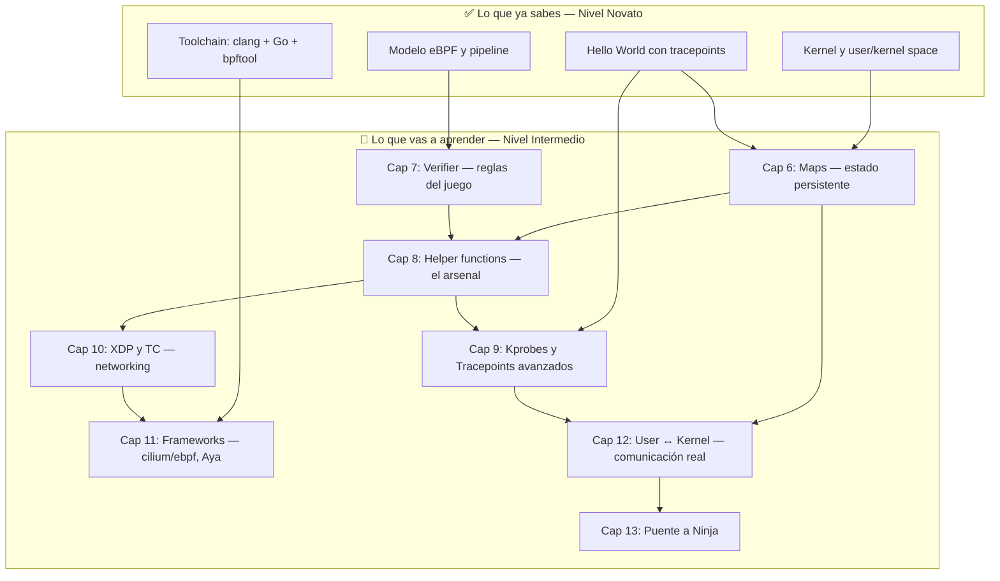

# Capítulo 5: De novato a intermedio — El puente

> "Ya viste la luz al otro lado de la pared. Ahora toca escalar."

---

## Términos nuevos en este capítulo

Este capítulo no introduce términos nuevos. Es un punto de consolidación. Todos los términos que aparecen aquí fueron definidos en los capítulos 1-4. Si alguno te suena ajeno, vuelve atrás antes de continuar.

---

## Objetivos

Al terminar este capítulo vas a poder:

1. Articular con claridad los conceptos fundamentales de eBPF que ya dominas
2. Identificar exactamente qué limitaciones tiene lo que sabes hasta ahora
3. Entender qué herramientas y conceptos necesitas para escribir programas eBPF útiles de verdad

## Prerrequisitos

- Haber completado los capítulos 1 al 4 sin saltarte ninguno
- Tener tu laboratorio funcional (Capítulo 3)
- Haber ejecutado exitosamente el Hello World (Capítulo 4)

---

## Lo que ya sabes — Resumen ejecutivo del Nivel Novato

Paremos un momento. En cuatro capítulos pasaste de no saber qué era el kernel a tener un programa corriendo dentro de él. Eso no es trivial.

Esto es lo que ahora puedes hacer y explicar:

### El kernel y su arquitectura

Sabes que el kernel es el intermediario entre tu código y el hardware. Entiendes la separación entre user space y kernel space — no como algo abstracto, sino como una frontera real con consecuencias reales. Sabes que las system calls son el único canal legítimo para cruzar esa frontera, y usaste `strace` para observarlas en acción.

### El modelo eBPF

Entiendes que eBPF es una máquina virtual dentro del kernel que permite ejecutar código custom de forma segura. Conoces el pipeline completo:

1. Escribir código en C (lado BPF)
2. Compilar a bytecode con clang/LLVM
3. El verifier analiza tu programa
4. El JIT lo compila a instrucciones nativas
5. Se adjunta a un hook
6. Se ejecuta cada vez que el hook se dispara

Sabes que el verifier existe para garantizar que tu código no va a crashear el kernel. Sabes que hay diferentes tipos de programas y diferentes hooks donde adjuntarlos.

### El toolchain

Tienes un entorno funcional con:
- clang/LLVM para compilar código BPF
- Go con cilium/ebpf para el lado user space
- `bpftool` para inspeccionar programas cargados
- Un kernel con soporte eBPF habilitado

### Tu primer programa

Escribiste un programa BPF en C que se adjunta a un tracepoint, usaste `bpf_trace_printk` para generar output, cargaste ese programa desde Go con cilium/ebpf, y observaste la salida en `trace_pipe`.

El ciclo completo: escribir → compilar → cargar → adjuntar → observar.

> 💡 **Perspectiva**: Si puedes explicar estos cuatro bloques a otro desarrollador sin mirar notas, estás listo para el siguiente nivel. Si alguno te genera dudas, vuelve al capítulo correspondiente. No hay vergüenza en repasar.

---

## Lo que todavía no puedes hacer — Motivación para el siguiente nivel

Ahora las malas noticias. Lo que sabes es suficiente para entender eBPF conceptualmente y ejecutar programas de juguete. Pero no es suficiente para hacer nada útil en producción. Veamos las paredes:

### No tienes estado persistente

Tu programa Hello World se ejecuta, imprime algo, y se olvida de todo. No puede contar cuántas veces se disparó. No puede recordar qué PIDs vio antes. No puede acumular datos.

**¿Por qué?** Porque no sabes usar **maps** — las estructuras de datos que viven en kernel space y permiten a tu programa BPF almacenar información entre ejecuciones y compartirla con user space.

Sin maps, tu programa es un eco: entra un evento, sale un string, fin de la historia.

### No puedes comunicar datos estructurados

`bpf_trace_printk` es un mecanismo de debug. Imprime texto plano a un buffer compartido por todos los programas BPF del sistema. No escala. No es parseable de forma confiable. No sirve para producción.

**¿Qué necesitas?** Perf events y ring buffers — mecanismos diseñados para pasar datos estructurados del kernel al user space de forma eficiente y sin pérdida.

### El verifier te va a rechazar código real

En el Hello World, el verifier te dejó pasar porque tu programa era trivial. En cuanto intentes hacer algo no trivial — loops, acceso a estructuras del kernel, aritmética de punteros — el verifier va a decir que no.

**¿Qué necesitas?** Entender las reglas del verifier, los patrones que lo hacen feliz, y los trucos para escribir código que pase verificación sin sacrificar funcionalidad.

### Tu arsenal de funciones es patético

Solo conoces `bpf_trace_printk`. El kernel ofrece decenas de helper functions: obtener timestamps, leer memoria de procesos, manipular paquetes de red, interactuar con maps, generar números aleatorios, y mucho más.

**¿Qué necesitas?** Un tour por las helper functions organizadas por caso de uso, con la matriz de compatibilidad que te dice cuáles están disponibles en cada tipo de programa.

### No puedes instrumentar funciones específicas del kernel

Hasta ahora usaste un tracepoint genérico. Pero el poder real de eBPF está en poder engancharte a funciones específicas del kernel — kprobes, kretprobes, fentry/fexit — para observar exactamente lo que te interesa.

**¿Qué necesitas?** Entender los diferentes tipos de attach points, sus trade-offs de estabilidad, y cómo acceder a los argumentos de las funciones instrumentadas.

### Networking es territorio desconocido

XDP (eXpress Data Path) permite procesar paquetes de red antes de que lleguen al network stack del kernel. TC (Traffic Control) permite filtrar tráfico después. Ambos son casos de uso enormes de eBPF en producción — y no sabes nada de ellos.

**¿Qué necesitas?** Aprender a parsear headers de paquetes en eBPF, las acciones de XDP (PASS, DROP, REDIRECT), y cuándo usar XDP vs TC.

> 🔥 **Advertencia**: No intentes saltarte al Nivel Intermedio sin asegurarte de que tu base es sólida. Los capítulos 6-13 asumen que dominas todo lo anterior. Si te quedan dudas, resuelve las ahora. Después es más caro.

---

## El mapa de lo que viene — Preview del Nivel Intermedio

El Nivel Intermedio son 8 capítulos (6 al 13) que te llevan de "entiendo eBPF" a "puedo escribir programas eBPF útiles". Esta es la ruta:

### La secuencia tiene lógica

**Capítulo 6 (Maps)** va primero porque sin estado persistente no puedes hacer nada interesante. Todo lo demás depende de maps.

**Capítulo 7 (Verifier)** va segundo porque en cuanto empieces a escribir código real con maps y punteros, el verifier te va a detener. Mejor entenderlo temprano.

**Capítulo 8 (Helper functions)** amplía tu vocabulario de lo que puedes hacer dentro de un programa BPF.

**Capítulos 9 y 10 (Kprobes/Tracepoints y XDP/TC)** son los dos grandes dominios de aplicación: observabilidad y networking.

**Capítulo 11 (Frameworks)** es donde ves el ecosistema completo y por qué Go con cilium/ebpf es nuestra elección principal (y Aya como alternativa en Rust).

**Capítulo 12 (Comunicación User↔Kernel)** cierra el ciclo: datos estructurados fluyendo del kernel a tu aplicación de forma eficiente.

**Capítulo 13** es otro puente — como este — que te preparará para el Nivel Ninja.

### Lo que va a cambiar

A partir del Capítulo 6, los ejercicios ya no son paso a paso. Se te da un esqueleto de código con secciones marcadas como TODO, criterios de éxito para validar tu solución, y pistas parciales — pero no la solución completa.

Esto es intencional. En el Nivel Novato aprendiste siguiendo instrucciones. En el Nivel Intermedio empiezas a pensar por tu cuenta. Ese es el salto.

---

## Ejercicio: Auto-evaluación — ¿Estás listo para el siguiente nivel?

📋 **Nivel:** Novato (consolidación)
📚 **Conceptos previos:** Capítulos 1-4 completos

### Checklist de conceptos

Marca cada punto que puedas explicar sin consultar el libro. Sé honesto — esto es para ti, no para nadie más.

**Kernel y arquitectura (Capítulo 1):**

- [ ] Puedo explicar qué hace el kernel y por qué existe la separación user/kernel space
- [ ] Puedo describir qué es una system call y por qué es necesaria
- [ ] Sé usar `strace` para ver qué syscalls hace un programa
- [ ] Puedo nombrar al menos 3 subsistemas del kernel (scheduler, networking, filesystem, memory)

**eBPF conceptual (Capítulo 2):**

- [ ] Puedo explicar la diferencia entre BPF clásico y eBPF
- [ ] Puedo describir el pipeline completo: escribir → compilar → verificar → JIT → adjuntar → ejecutar
- [ ] Sé qué hace el verifier y por qué es necesario
- [ ] Puedo nombrar al menos 3 tipos de hooks donde se adjuntan programas eBPF
- [ ] Puedo nombrar al menos 3 proyectos del ecosistema eBPF

**Toolchain (Capítulo 3):**

- [ ] Tengo un entorno funcional con clang/LLVM, Go, y bpftool
- [ ] Puedo compilar un programa BPF con clang y verificar que genera bytecode
- [ ] Puedo usar `bpftool prog list` para ver programas cargados en el kernel
- [ ] Entiendo por qué usamos Go con cilium/ebpf como stack principal

**Programación BPF (Capítulo 4):**

- [ ] Puedo escribir un programa BPF mínimo en C que se adjunte a un tracepoint
- [ ] Puedo escribir un loader en Go que cargue y adjunte ese programa
- [ ] Sé qué es `bpf_trace_printk` y puedo observar su output en trace_pipe
- [ ] Entiendo que trace_printk es solo para debug, no para producción
- [ ] Puedo identificar las dos partes de un programa eBPF: kernel side (C) y user space (Go)

### Evaluación

**16-18 puntos marcados:** Estás sólido. Avanza al Capítulo 6 con confianza.

<!-- [INSERTA IMAGEN AQUI: Diagrama visual tipo roadmap mostrando el camino del libro desde Novato (caps 1-5) hasta Intermedio (caps 6-13) y Ninja, con las dependencias entre conceptos] -->

**12-15 puntos:** Tienes gaps. Identifica qué capítulos necesitas repasar y dedícales 30 minutos antes de continuar.

**Menos de 12:** Vuelve a los capítulos 1-4. No es una derrota — es inversión. El Nivel Intermedio asume que todo esto es segunda naturaleza.

---

## Resumen

Lo que te llevas de este capítulo:

1. **Ya tienes una base real** — kernel, modelo eBPF, toolchain, y un programa funcional
2. **Lo que sabes no es suficiente** — sin maps, helper functions, y comunicación real kernel↔user, no puedes escribir programas útiles
3. **El Nivel Intermedio sigue un orden lógico** — maps primero, verifier segundo, luego se expande a dominios específicos
4. **Los ejercicios van a cambiar** — de paso a paso a esqueletos con TODOs. Tú completas la lógica
5. **La auto-evaluación es tu herramienta** — si hay gaps, es mejor resolverlos ahora que arrastrarlos

---

## Para saber más

- 📖 [eBPF Documentation — What is eBPF?](https://ebpf.io/what-is-ebpf/) — revisión rápida del modelo si necesitas refrescar conceptos
- 📝 [Brendan Gregg — BPF Performance Tools](https://www.brendangregg.com/bpf-performance-tools-book.html) — referencia complementaria con enfoque en observabilidad
- 💻 [cilium/ebpf — Getting Started](https://ebpf-go.dev/guides/getting-started/) — documentación oficial del framework que usamos, punto de partida para el Nivel Intermedio
