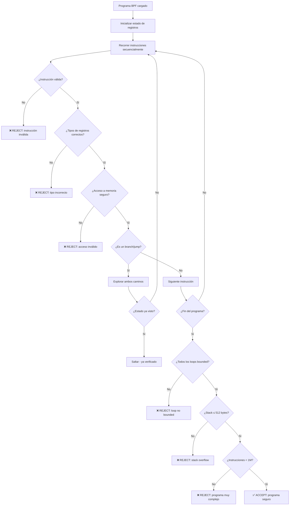
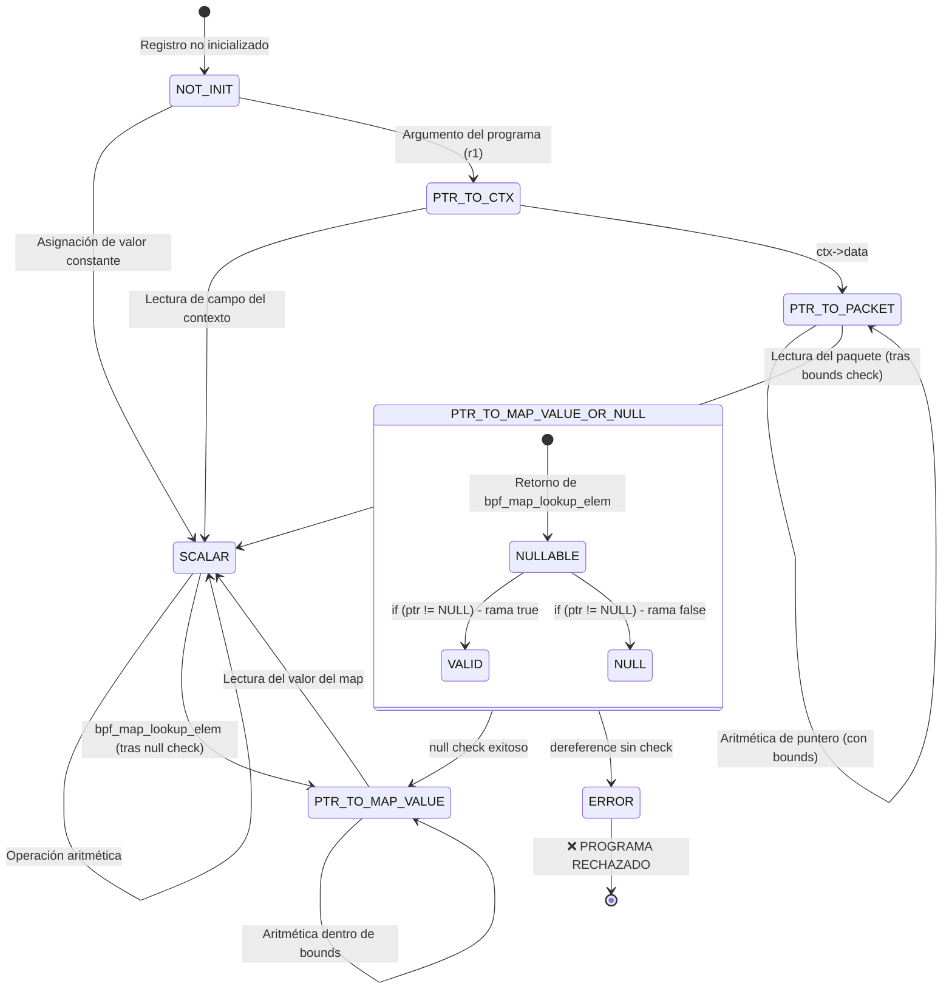

# Capítulo 7: El Verifier — Tu enemigo favorito

> "El verifier no es tu enemigo. Es el tipo que te impide meter un cuchillo en el enchufe. Odialo todo lo que quieras, pero está ahí por una razón."

---

## Términos nuevos en este capítulo

- **verifier** (véri-faier) — componente del kernel que analiza estáticamente cada programa BPF antes de permitir su ejecución. Si no pasa el verifier, no corre. Así de simple.
- **bounded loop** (báunded lup) — loop con un número máximo de iteraciones conocido en tiempo de compilación. El verifier solo acepta loops que puede demostrar que terminan.
- **stack limit** (stak límit) — límite de 512 bytes para la pila de un programa BPF. No hay heap, no hay malloc. Lo que cabe en la pila es todo lo que tienes.
- **pointer validity** (póinter valíditi) — propiedad que el verifier verifica para cada puntero: que no sea NULL, que no apunte fuera de los bounds del objeto, y que se haya verificado antes de usarse.
- **dead code** (ded coud) — instrucciones en tu programa que el verifier determina que nunca se ejecutarán. Antes del kernel 5.x el verifier las rechazaba. Ahora las tolera, pero mejor no las tengas.
- **register state** (réyister stéit) — estado que el verifier mantiene para cada uno de los 11 registros BPF (r0-r10) durante el análisis estático. Cada registro puede ser: NOT_INIT, SCALAR, PTR_TO_MAP_VALUE, PTR_TO_CTX, etc.
- **pruning** (prúning) — optimización del verifier que evita re-analizar caminos ya verificados. Si un estado es equivalente a uno ya visto, corta el análisis ahí.
- **complexity limit** (compléxiti límit) — número máximo de instrucciones que el verifier analiza antes de rechazar el programa (1 millón en kernels modernos). Programas demasiado complejos no pasan.
- **helper function signature** (hélper fánkshon sígnacher) — tipo de retorno y tipos de argumentos que el verifier conoce para cada helper. Si le pasas un tipo incorrecto, te rechaza.

## Objetivos

Al terminar este capítulo vas a poder:

1. Entender las reglas del verifier y por qué existen — no es sadismo, es supervivencia del kernel
2. Diagnosticar y resolver los errores más comunes del verifier
3. Escribir código que pase verificación a la primera (o casi)

## Prerrequisitos

- Haber escrito y cargado un programa BPF funcional (Capítulo 4)
- Entender qué son los maps y cómo se opera sobre ellos (Capítulo 6)
- Saber que el ciclo BPF es: escribir → compilar → **verificar** → JIT → ejecutar (Capítulo 2)

---

## 7.1 ¿Por qué existe el verifier? — Safety first en kernel space

Vamos a empezar con la pregunta obvia: ¿por qué carajo necesitamos un verifier?

La respuesta es corta: **porque tu código corre en el kernel**.

No en un sandbox. No en una VM con garbage collector. No en un container. En el *kernel*. El mismo código que maneja tu red, tu filesystem, tu memoria. Si tu programa BPF tiene un bug — un puntero inválido, un loop infinito, un acceso fuera de bounds — no obtienes un segfault amigable. Obtienes un **kernel panic**. O peor: corrupción silenciosa de memoria que te explota tres días después.

### El contrato del kernel

El kernel de Linux tiene un contrato no negociable con el hardware y con user space:

1. **No se cuelga** — un loop infinito en kernel space congela la máquina entera
2. **No corrompe memoria** — un puntero salvaje en kernel space puede sobreescribir cualquier cosa
3. **No leakea información** — un acceso fuera de bounds puede exponer datos de otros procesos

Los módulos del kernel (los `.ko` de toda la vida) no tienen estas garantías. Los escribes, los cargas, y si tiene un bug... buena suerte. Por eso cargar un módulo requiere `CAP_SYS_MODULE` y básicamente root. Estás confiando ciegamente en que el código es correcto.

eBPF cambia las reglas del juego. Dice: "Te dejo meter código en el kernel, pero **primero demuestro matemáticamente que no puede hacer daño**."

Eso es el verifier. Un analizador estático que examina cada instrucción de tu programa antes de dejarlo correr.

### ¿Qué garantiza el verifier?

El verifier te garantiza (y le garantiza al kernel) que tu programa:

| Propiedad | Significado |
|-----------|-------------|
| **Termina** | Todo camino de ejecución llega a un `return` en tiempo finito |
| **No accede memoria inválida** | Cada puntero se verifica antes de dereferenciarse |
| **No leakea punteros** | No puedes pasar un puntero del kernel a user space |
| **Usa helpers correctamente** | Cada helper recibe los tipos de argumentos que espera |
| **Respeta el stack** | Nunca usa más de 512 bytes de pila |
| **No tiene código inalcanzable** | (en kernels viejos) Cada instrucción es accesible |

> 💡 **Analogía**: El verifier es como un guardia de seguridad paranoico en la puerta de un datacenter. No le importa quién eres ni qué tan buenas sean tus intenciones. Revisa tu mochila, tu identidad, tu ruta planeada, y si algo no cuadra, no pasas. ¿Es molesto? Sí. ¿Previene desastres? Absolutamente. Mejor un guardia paranoico que un incendio en la sala de servidores.

### El análisis estático — Cómo lo hace

El verifier no *ejecuta* tu programa. Lo *simula*. Recorre cada posible camino de ejecución, manteniendo un estado abstracto de cada registro y cada posición de memoria.

Imagina que eres el verifier. Ves esta instrucción:

```c
value = bpf_map_lookup_elem(&my_map, &key);
```

¿Qué sabes del retorno? Que puede ser:
- Un puntero válido a un valor en el map, **o**
- `NULL` si la key no existe

Entonces el verifier marca `value` como "puede ser NULL". Si la siguiente instrucción es:

```c
*value = 42;  // DEREFERENCING sin null check
```

**BOOM**. Rechazado. El verifier sabe que `value` puede ser NULL y no le permitiste verificarlo primero.

Esto es análisis estático conservador. El verifier asume el peor caso siempre. Si *puede* fallar, *va a* rechazarlo.

### El verifier en números

| Parámetro | Valor (kernel 6.x) |
|-----------|---------------------|
| Máximo de instrucciones analizadas | 1,000,000 |
| Tamaño máximo del stack | 512 bytes |
| Número de registros | 11 (r0-r10) |
| Máximo tail calls encadenados | 33 |
| Máximo profundidad de subprogramas | 8 |

---

## 7.2 Las reglas del juego — Bounded loops, valid pointers, stack limits

Ahora que entiendes *por qué* existe el verifier, veamos las reglas específicas. Son pocas pero estrictas.

### Regla 1: Todo loop debe ser bounded

Esta es la regla que más frustra a los principiantes. El verifier necesita *demostrar* que tu programa termina. Eso significa que cada loop debe tener un límite conocido en tiempo de verificación.

**Antes del kernel 5.3:**

No había loops. Punto. Tenías que desenrollar todo a mano con `#pragma unroll` o directamente copiar-pegar. Era una pesadilla.

**Kernel 5.3+:**

Se introdujeron bounded loops. Puedes escribir:

```c
for (int i = 0; i < 100; i++) {
    // El verifier sabe que esto ejecuta máximo 100 veces
}
```

Pero **no puedes** escribir:

```c
int limit = get_dynamic_value();
for (int i = 0; i < limit; i++) {
    // El verifier NO sabe cuántas veces esto ejecuta
    // RECHAZADO
}
```

**Kernel 5.17+:**

Se introdujo `bpf_loop()` helper para loops más complejos:

```c
static int callback(u32 index, void *ctx) {
    // lógica del loop
    return 0;  // 0 = continuar, 1 = break
}

SEC("tracepoint/syscalls/sys_enter_read")
int my_prog(void *ctx) {
    bpf_loop(1000, callback, NULL, 0);  // máximo 1000 iteraciones
    return 0;
}
```

> 🔥 **Advertencia**: Si el verifier dice que tu loop es infinito, no discutas. Ponle un bound explícito. No hay negociación posible. El verifier no entiende de "pero en la práctica nunca va a llegar a más de 50". Le importa el *máximo teórico*, no tu intuición.

### Regla 2: Todos los punteros deben validarse antes de usarse

El verifier mantiene un "tipo" para cada registro. Cuando una helper function retorna un puntero, ese puntero está marcado como "puede ser NULL" hasta que hagas un check explícito.

**Patrón correcto:**

```c
struct value *val = bpf_map_lookup_elem(&my_map, &key);
if (!val) {           // <- check explícito
    return 0;
}
val->counter += 1;   // <- ahora el verifier sabe que val != NULL
```

**Patrón que explota:**

```c
struct value *val = bpf_map_lookup_elem(&my_map, &key);
val->counter += 1;   // ERROR: val puede ser NULL
```

El verifier te va a gritar algo como:

```
R0 invalid mem access 'map_value_or_null'
```

Ese `map_value_or_null` te dice exactamente qué pasa: el registro R0 puede contener un valor válido *o* null, y no verificaste cuál de los dos es.

### Regla 3: El stack tiene 512 bytes. No hay más.

512 bytes. Eso es todo el stack que tienes. No hay `malloc`. No hay heap dinámico. Si necesitas un buffer grande, tienes que usar un map (típicamente un per-CPU array map como scratch space).

```c
// ESTO EXPLOTA - excede el stack
SEC("kprobe/do_sys_open")
int too_much_stack(void *ctx) {
    char buffer[1024];  // 1024 > 512, RECHAZADO
    // ...
    return 0;
}
```

Error típico del verifier:

```
combined stack size of 2 calls is 528. Too large
```

**Solución:** Usar un per-CPU array como scratch buffer:

```c
struct {
    __uint(type, BPF_MAP_TYPE_PERCPU_ARRAY);
    __uint(max_entries, 1);
    __type(key, __u32);
    __type(value, char[1024]);
} scratch SEC(".maps");

SEC("kprobe/do_sys_open")
int with_map_buffer(void *ctx) {
    __u32 zero = 0;
    char *buffer = bpf_map_lookup_elem(&scratch, &zero);
    if (!buffer)
        return 0;
    // Ahora tienes 1024 bytes sin usar stack
    return 0;
}
```

### Regla 4: Accesos a paquetes deben verificar bounds

Si estás en un programa XDP o TC que parsea paquetes, **cada acceso** al contenido del paquete debe ir precedido de una verificación de bounds. El verifier necesita saber que no estás leyendo más allá del final del paquete.

```c
SEC("xdp")
int parse_packet(struct xdp_md *ctx) {
    void *data = (void *)(long)ctx->data;
    void *data_end = (void *)(long)ctx->data_end;

    struct ethhdr *eth = data;

    // CHECK OBLIGATORIO: ¿hay espacio para un ethernet header?
    if ((void *)(eth + 1) > data_end) {
        return XDP_DROP;
    }

    // Ahora puedes acceder a eth->h_proto, eth->h_source, etc.
    // Sin el check anterior, el verifier te rechaza

    struct iphdr *ip = (void *)(eth + 1);

    // OTRO CHECK: ¿hay espacio para un IP header?
    if ((void *)(ip + 1) > data_end) {
        return XDP_DROP;
    }

    // Ahora puedes acceder a ip->saddr, ip->protocol, etc.
    return XDP_PASS;
}
```

Si te olvidas de uno solo de esos checks:

```
invalid access to packet, off=14 size=20, R2(id=0,off=0,r=14)
R2 offset is outside of the packet
```

### Regla 5: No puedes filtrar punteros del kernel a user space

Los punteros del kernel son secretos. Contienen información sobre el layout de memoria del kernel (KASLR). Si los filtras a user space, le das a un atacante las llaves del reino.

```c
// ESTO NO PASA
bpf_perf_event_output(ctx, &events, BPF_F_CURRENT_CPU,
                      &some_kernel_ptr, sizeof(some_kernel_ptr));
// ERROR: no puedes enviar un puntero del kernel a user space
```

### Regla 6: Cada helper recibe tipos correctos

El verifier conoce la firma exacta de cada helper function. Si le pasas un tipo incorrecto, te rechaza.

```c
// bpf_map_lookup_elem espera: (map*, key*)
// Si le pasas un integer donde espera un puntero a map:
bpf_map_lookup_elem(42, &key);  // RECHAZADO: 42 no es un puntero a map
```

En la práctica este error es más sutil — suele pasar cuando usas el puntero equivocado o cuando el tipo del value del map no coincide con lo que esperas.

### El diagrama completo: Flujo de decisión del verifier



---

## 7.3 Los errores más comunes — Y cómo resolverlos

Aquí viene lo práctico. Estos son los errores que vas a ver una y otra vez. Para cada uno: el mensaje del verifier, qué lo causa, y cómo arreglarlo.

### Error #1: "R0 invalid mem access 'map_value_or_null'"

**El mensaje completo típico:**

```
0: (85) call bpf_map_lookup_elem#1
1: (79) r1 = *(u64 *)(r0 +0)
R0 invalid mem access 'map_value_or_null'
```

**Qué significa:** Estás intentando dereferenciar el resultado de `bpf_map_lookup_elem` sin verificar si es NULL.

**Código que lo causa:**

```c
struct data *val = bpf_map_lookup_elem(&my_map, &key);
val->field = 123;  // R0 puede ser NULL
```

**Fix:**

```c
struct data *val = bpf_map_lookup_elem(&my_map, &key);
if (!val)
    return 0;
val->field = 123;  // Ahora el verifier sabe que val != NULL
```

**Frecuencia:** Altísima. Es probablemente el error #1 que vas a encontrar al empezar.

---

### Error #2: "invalid access to packet"

**El mensaje completo típico:**

```
7: (71) r3 = *(u8 *)(r2 +14)
invalid access to packet, off=14 size=1, R2(id=0,off=0,r=14)
R2 offset is outside of the packet
```

**Qué significa:** Estás accediendo a un byte del paquete sin haber verificado que el paquete es lo suficientemente grande.

**Código que lo causa:**

```c
SEC("xdp")
int bad_parse(struct xdp_md *ctx) {
    void *data = (void *)(long)ctx->data;
    void *data_end = (void *)(long)ctx->data_end;

    struct ethhdr *eth = data;
    // Falta: if ((void *)(eth + 1) > data_end) return XDP_DROP;

    __u16 proto = eth->h_proto;  // BOOM: no verificaste bounds
    return XDP_PASS;
}
```

**Fix:**

```c
SEC("xdp")
int good_parse(struct xdp_md *ctx) {
    void *data = (void *)(long)ctx->data;
    void *data_end = (void *)(long)ctx->data_end;

    struct ethhdr *eth = data;
    if ((void *)(eth + 1) > data_end)  // bounds check
        return XDP_DROP;

    __u16 proto = eth->h_proto;  // Ahora es seguro
    return XDP_PASS;
}
```

**Frecuencia:** Muy alta en programas XDP/TC. Cada capa del protocolo necesita su propio bounds check.

---

### Error #3: "back-edge from insn X to Y" (loop no bounded)

**El mensaje completo típico:**

```
back-edge from insn 8 to 4
BPF program is too large. Processed 0 insn
```

O en kernels más nuevos:

```
the loop at insn 4 is not bounded. Try using bpf_loop or bounded iteration.
```

**Qué significa:** Tienes un loop que el verifier no puede demostrar que termina.

**Código que lo causa:**

```c
SEC("tracepoint/syscalls/sys_enter_read")
int unbounded(void *ctx) {
    int i = 0;
    while (get_condition()) {  // condición dinámica = no bounded
        i++;
        do_something(i);
    }
    return 0;
}
```

**Fix:** Ponle un bound explícito:

```c
SEC("tracepoint/syscalls/sys_enter_read")
int bounded(void *ctx) {
    #pragma unroll
    for (int i = 0; i < 100; i++) {  // bound explícito
        if (!get_condition())
            break;
        do_something(i);
    }
    return 0;
}
```

O usa `bpf_loop` (kernel 5.17+):

```c
static int loop_body(__u32 index, void *ctx) {
    if (!get_condition())
        return 1;  // break
    do_something(index);
    return 0;  // continuar
}

SEC("tracepoint/syscalls/sys_enter_read")
int with_bpf_loop(void *ctx) {
    bpf_loop(100, loop_body, NULL, 0);
    return 0;
}
```

---

### Error #4: "combined stack size of N calls is XXX. Too large"

**El mensaje completo típico:**

```
combined stack size of 2 calls is 544. Too large
```

**Qué significa:** La suma del stack de tu programa más las funciones que llama excede 512 bytes.

**Código que lo causa:**

```c
static __always_inline void process_event(void) {
    char buf1[256];
    // ... lógica con buf1
}

SEC("kprobe/do_sys_open")
int my_prog(void *ctx) {
    char buf2[300];
    process_event();  // buf1(256) + buf2(300) = 556 > 512
    return 0;
}
```

**Fix:** Usa per-CPU maps como scratch space:

```c
struct {
    __uint(type, BPF_MAP_TYPE_PERCPU_ARRAY);
    __uint(max_entries, 1);
    __type(key, __u32);
    __type(value, char[512]);
} heap SEC(".maps");

SEC("kprobe/do_sys_open")
int my_prog(void *ctx) {
    __u32 zero = 0;
    char *buf = bpf_map_lookup_elem(&heap, &zero);
    if (!buf)
        return 0;
    // Usa buf como tu buffer sin consumir stack
    return 0;
}
```

---

### Error #5: "program is too complex" / "processed 1000001 insn"

**El mensaje completo típico:**

```
BPF program is too large. Processed 1000001 insn
```

O:

```
verification time X usec, stack depth Y, states_processed Z
program is too complex (exceeded complexity limit)
```

**Qué significa:** Tu programa tiene demasiados caminos de ejecución posibles. El verifier tiene un límite de 1 millón de instrucciones analizadas.

**Causas comunes:**
- Muchos branches anidados (if dentro de if dentro de if)
- Loops con bounds muy altos combinados con condicionales internos
- Código generado por macros que se expande demasiado

**Fix:** Simplifica la lógica, usa tail calls para dividir el programa, o reduce bounds de loops:

```c
// ANTES: un monstruo monolítico
SEC("xdp")
int monolith(struct xdp_md *ctx) {
    // 500 líneas de parseo y lógica
    // El verifier explora cada combinación posible
    return XDP_PASS;
}

// DESPUÉS: dividido con tail calls
SEC("xdp")
int stage1_parse_l2(struct xdp_md *ctx) {
    // Parseo L2, guarda estado en map
    bpf_tail_call(ctx, &jmp_table, STAGE2_L3);
    return XDP_DROP;
}

SEC("xdp")
int stage2_parse_l3(struct xdp_md *ctx) {
    // Parseo L3, guarda estado en map
    bpf_tail_call(ctx, &jmp_table, STAGE3_DECISION);
    return XDP_DROP;
}
```

---

### Error #6: "invalid indirect read from stack"

**El mensaje completo típico:**

```
invalid indirect read from stack R2 off -48+20 size 48
```

**Qué significa:** Estás pasando un puntero a un buffer del stack que no ha sido completamente inicializado. El verifier detecta que parte del buffer contiene datos basura.

**Código que lo causa:**

```c
SEC("kprobe/do_sys_open")
int leaky(void *ctx) {
    struct event e;  // no inicializada
    e.pid = bpf_get_current_pid_tgid() >> 32;
    // e.comm no está inicializado!
    bpf_perf_event_output(ctx, &events, BPF_F_CURRENT_CPU,
                          &e, sizeof(e));  // ERROR: e no está completamente inicializada
    return 0;
}
```

**Fix:** Inicializa toda la estructura:

```c
SEC("kprobe/do_sys_open")
int safe(void *ctx) {
    struct event e = {};  // inicialización a cero
    e.pid = bpf_get_current_pid_tgid() >> 32;
    bpf_get_current_comm(&e.comm, sizeof(e.comm));
    bpf_perf_event_output(ctx, &events, BPF_F_CURRENT_CPU,
                          &e, sizeof(e));  // OK: toda la estructura está inicializada
    return 0;
}
```

La clave es ese `= {}` al declarar la struct. Un cambio trivial que resuelve un error críptico.

---

### Error #7: "math between pkt pointer and register with unbounded min value"

**El mensaje completo típico:**

```
math between pkt pointer and register with unbounded min value is not allowed
```

**Qué significa:** Estás haciendo aritmética con un puntero a paquete usando un valor que el verifier no puede probar que esté dentro de los bounds.

**Código que lo causa:**

```c
SEC("xdp")
int variable_offset(struct xdp_md *ctx) {
    void *data = (void *)(long)ctx->data;
    void *data_end = (void *)(long)ctx->data_end;

    __u8 *ptr = data;
    __u32 offset = some_dynamic_value();  // valor dinámico

    ptr += offset;  // ERROR: offset no tiene bound conocido
    if ((void *)(ptr + 1) > data_end)
        return XDP_DROP;

    __u8 val = *ptr;
    return XDP_PASS;
}
```

**Fix:** Asegura que el offset tiene un bound máximo conocido:

```c
SEC("xdp")
int bounded_offset(struct xdp_md *ctx) {
    void *data = (void *)(long)ctx->data;
    void *data_end = (void *)(long)ctx->data_end;

    __u8 *ptr = data;
    __u32 offset = some_dynamic_value();

    // Bound explícito con AND mask
    offset &= 0xFF;  // ahora el verifier sabe que offset <= 255

    ptr += offset;
    if ((void *)(ptr + 1) > data_end)
        return XDP_DROP;

    __u8 val = *ptr;
    return XDP_PASS;
}
```

El truco del `& mask` es fundamental: le dice al verifier "este valor nunca puede ser mayor que la máscara".

---

## 7.4 Trucos para hacer feliz al verifier — Patterns que funcionan

Después de pelear mil veces con el verifier, empiezas a desarrollar patrones que siempre funcionan. Aquí van los más útiles.

### Truco 1: El null-check inmediato

Cada vez que una helper retorna un puntero, verifica NULL **inmediatamente**. No hagas lógica intermedia. No guardes el puntero para después. Check y sigue.

```c
// PATRÓN GANADOR:
struct value *val = bpf_map_lookup_elem(&my_map, &key);
if (!val)
    return 0;
// A partir de aquí, val es seguro
```

### Truco 2: Inicializa SIEMPRE las structs con `= {}`

```c
struct event e = {};  // SIEMPRE así
// Nunca:
// struct event e;  // basura en el stack
```

Cuesta cero en rendimiento real (el compilador optimiza) y te ahorra el error de "indirect read from stack".

### Truco 3: El bounds check en XDP con patrón telescópico

Para parsear paquetes, verifica capa por capa. Nunca intentes verificar todo de una vez:

```c
SEC("xdp")
int telescopic_parse(struct xdp_md *ctx) {
    void *data = (void *)(long)ctx->data;
    void *data_end = (void *)(long)ctx->data_end;

    // Capa 1: Ethernet
    struct ethhdr *eth = data;
    if ((void *)(eth + 1) > data_end)
        return XDP_DROP;

    // Capa 2: IP (solo si es IPv4)
    if (eth->h_proto != bpf_htons(ETH_P_IP))
        return XDP_PASS;

    struct iphdr *ip = (void *)(eth + 1);
    if ((void *)(ip + 1) > data_end)
        return XDP_DROP;

    // Capa 3: TCP (solo si es TCP)
    if (ip->protocol != IPPROTO_TCP)
        return XDP_PASS;

    struct tcphdr *tcp = (void *)ip + (ip->ihl * 4);
    if ((void *)(tcp + 1) > data_end)
        return XDP_DROP;

    // Ahora puedes acceder a tcp->source, tcp->dest, etc.
    return XDP_PASS;
}
```

### Truco 4: `& mask` para acotar valores dinámicos

Cuando necesitas usar un valor dinámico como índice o offset, acota su rango con una máscara AND:

```c
__u32 index = dynamic_value & (MAX_ENTRIES - 1);  // si MAX_ENTRIES es potencia de 2
// O:
__u32 index = dynamic_value % MAX_ENTRIES;  // el compilador puede o no convencer al verifier
```

La versión con `&` es más clara para el verifier porque el resultado está *matemáticamente* acotado.

### Truco 5: Variables volátiles para evitar que el compilador "ayude" demasiado

A veces el compilador de clang optimiza tu código de una forma que confunde al verifier. La directiva `volatile` puede ayudar:

```c
// Sin volatile, clang puede reordenar o eliminar el check
volatile __u64 len = data_end - data;
if (len < sizeof(struct ethhdr))
    return XDP_DROP;
```

Úsalo con moderación — es un parche, no una solución.

### Truco 6: `__always_inline` para funciones auxiliares

Las funciones que defines en tu programa BPF deben marcarse como `__always_inline` o como funciones BPF-to-BPF (sin inline). Si el compilador decide no inlinearlas, el verifier puede quejarse:

```c
static __always_inline int parse_ip_header(void *data, void *data_end) {
    // lógica de parseo
    return 0;
}
```

### Truco 7: Per-CPU maps como heap

Cuando necesitas más de 512 bytes de espacio temporal:

```c
struct {
    __uint(type, BPF_MAP_TYPE_PERCPU_ARRAY);
    __uint(max_entries, 1);
    __type(key, __u32);
    __type(value, struct big_buffer);  // puede ser de varios KB
} tmp_storage SEC(".maps");

// Uso:
__u32 zero = 0;
struct big_buffer *buf = bpf_map_lookup_elem(&tmp_storage, &zero);
if (!buf) return 0;
// buf es tu "heap" temporal, seguro por ser per-CPU
```

### El diagrama: Árbol de estados del análisis estático



---

## 7.5 Cuando el verifier se equivoca — Falsos positivos y workarounds

El verifier es conservador. Eso significa que a veces rechaza código que *es* seguro. El verifier no puede razonar sobre semántica — solo sobre propiedades sintácticas y de tipo. Si tu código es seguro por una razón que el verifier no puede demostrar formalmente, tienes un falso positivo.

### Caso 1: Correlación entre variables

```c
__u32 len = data_end - data;
__u32 offset = calculate_something();

// Tú SABES que offset < len porque calculate_something()
// solo retorna valores menores al tamaño del paquete.
// Pero el verifier NO lo sabe.

if (data + offset > data_end)  // este check "sobra" según tu lógica
    return XDP_DROP;           // pero el verifier lo necesita
```

**Workaround:** Agrega el check aunque "sobre". Es código defensivo que hace feliz al verifier sin costar rendimiento real (el compilador puede eliminarlo si el branch es predecible).

### Caso 2: Evolución entre versiones del kernel

El verifier mejora con cada versión del kernel. Código que no pasaba en 5.4 puede pasar en 5.15 sin cambios. Y al revés: actualizaciones del verifier a veces rompen programas que antes funcionaban (raro, pero pasa).

**Ejemplos de mejoras históricas:**

| Kernel | Mejora del verifier |
|--------|---------------------|
| 5.3 | Soporte de bounded loops |
| 5.7 | Funciones BPF-to-BPF con punteros a contexto |
| 5.10 | Mejor tracking de estados de registros |
| 5.13 | Atomic operations |
| 5.17 | bpf_loop() helper |
| 6.0 | Mejoras en pruning y complejidad |
| 6.1 | Open-coded iterators (bpf_for) |

**Workaround:** Documenta la versión mínima de kernel que tu programa requiere. Prueba en múltiples versiones si necesitas portabilidad.

### Caso 3: El verifier no entiende memcpy parciales

```c
struct event e = {};
// Copias solo los primeros N bytes de comm
bpf_probe_read_kernel_str(&e.comm, 8, src);
// El verifier puede quejarse de que los bytes 8-15 no están inicializados
// aunque inicializaste con = {}
```

**Workaround:** En kernels viejos, usa `__builtin_memset` explícito antes del read parcial. En kernels modernos (5.10+) esto está mayormente resuelto.

### Caso 4: Aritmética de punteros "obvia" que no es obvia para el verifier

```c
void *ptr = data + 14;  // sabes que es después del eth header
// Pero ¿el verifier sabe que ya verificaste eth?
// Depende de CÓMO hayas escrito el bounds check
```

**Workaround:** Usa tipos explícitos con struct casting en vez de aritmética raw:

```c
// MEJOR: el verifier entiende el tamaño del struct
struct iphdr *ip = (struct iphdr *)(eth + 1);
if ((void *)(ip + 1) > data_end)
    return XDP_DROP;

// PEOR: aritmética raw puede confundir al verifier
void *ip_start = (void *)eth + sizeof(*eth);
```

### Caso 5: El compilador reorganiza tu código

A veces clang, en su infinita sabiduría optimizadora, reordena instrucciones de una forma que rompe las invariantes que el verifier necesita. El bounds check termina *después* del acceso en el bytecode generado, aunque en tu código C estaba antes.

**Workaround:** Usa `barrier()` o `asm volatile("" ::: "memory")` para evitar reordenamientos:

```c
if ((void *)(eth + 1) > data_end)
    return XDP_DROP;

asm volatile("" ::: "memory");  // barrera del compilador

// Acceso seguro — el compilador no puede mover esto antes del check
__u16 proto = eth->h_proto;
```

### Herramientas para debuggear el verifier

Cuando el verifier te rechaza y no entiendes por qué, tienes opciones:

**1. Log del verifier (verbose mode):**

Desde user space (Go con cilium/ebpf):

```go
spec, err := ebpf.LoadCollectionSpec("program.o")
// ...
opts := ebpf.CollectionOptions{
    Programs: ebpf.ProgramOptions{
        LogLevel: ebpf.LogLevelInstruction,
        LogSize:  1024 * 1024, // 1MB de log
    },
}
coll, err := ebpf.NewCollectionWithOptions(spec, opts)
if err != nil {
    // err contiene el log del verifier
    fmt.Println(err)
}
```

**2. Leer el bytecode:**

```bash
llvm-objdump -d program.o
```

Te muestra las instrucciones BPF. Útil para correlacionar el error del verifier (que referencia números de instrucción) con tu código C.

**3. `bpftool prog dump`:**

Si necesitas ver el bytecode de un programa ya cargado:

```bash
bpftool prog dump xlated id <PROG_ID>
```

---

## Ejercicio: Diagnostica y corrige al verifier

📋 **Nivel:** Intermedio
📚 **Conceptos previos:** Maps (Cap 6), Verifier (este capítulo), programas XDP
🖥️ **Entorno:** Lab con kernel 6.1+ y cilium/ebpf configurado (Cap 3)
🎯 **Problema:** Se te da un programa BPF que falla en la verificación con 3 errores distintos. Tu trabajo: diagnosticar cada error, entender la causa, y corregirlo.

### El programa roto

El siguiente programa intenta contar paquetes TCP por IP de origen usando XDP. Tiene **3 errores** que el verifier va a rechazar. Tu trabajo es encontrarlos y arreglarlos.

```c
// verifier_challenge.bpf.c
#include "vmlinux.h"
#include <bpf/bpf_helpers.h>
#include <bpf/bpf_endian.h>

struct packet_count {
    __u64 count;
    __u64 bytes;
    char last_payload[256];
};

struct {
    __uint(type, BPF_MAP_TYPE_HASH);
    __uint(max_entries, 1024);
    __type(key, __u32);
    __type(value, struct packet_count);
} stats SEC(".maps");

SEC("xdp")
int count_tcp_packets(struct xdp_md *ctx) {
    void *data = (void *)(long)ctx->data;
    void *data_end = (void *)(long)ctx->data_end;

    // ERROR 1: ¿Qué falta aquí?
    struct ethhdr *eth = data;

    if (eth->h_proto != bpf_htons(ETH_P_IP))
        return XDP_PASS;

    struct iphdr *ip = (void *)(eth + 1);
    if ((void *)(ip + 1) > data_end)
        return XDP_DROP;

    if (ip->protocol != IPPROTO_TCP)
        return XDP_PASS;

    __u32 src_ip = ip->saddr;

    // ERROR 2: ¿Qué pasa con el retorno de lookup?
    struct packet_count *counter = bpf_map_lookup_elem(&stats, &src_ip);
    counter->count += 1;
    counter->bytes += (data_end - data);

    // ERROR 3: ¿Qué tiene de malo este struct en el stack?
    struct packet_count new_entry;
    new_entry.count = 1;
    new_entry.bytes = (data_end - data);

    // Intenta copiar payload
    int payload_len = data_end - (void *)(ip + 1);
    int copy_len = payload_len;
    if (copy_len > 256)
        copy_len = 256;

    bpf_probe_read_kernel(&new_entry.last_payload, copy_len,
                          (void *)(ip + 1));

    if (!counter) {
        bpf_map_update_elem(&stats, &src_ip, &new_entry, BPF_ANY);
    }

    return XDP_PASS;
}

char _license[] SEC("license") = "GPL";
```

### Criterios de éxito

- [ ] Identificar los 3 errores del verifier (escribir qué mensaje darías tú si fueras el verifier)
- [ ] Corregir cada error sin cambiar la funcionalidad del programa
- [ ] El programa corregido se carga sin errores con `bpftool prog load` o via cilium/ebpf
- [ ] El programa efectivamente cuenta paquetes TCP por IP de origen

### Pistas

1. **Error 1:** El verifier necesita saber que hay espacio suficiente *antes* de leer cualquier campo. ¿Qué estás leyendo sin verificar primero?

2. **Error 2:** Repasa la sección 7.3, Error #1. El verifier es muy estricto con lo que puede ser NULL. ¿En qué orden estás haciendo las cosas?

3. **Error 3:** El verifier necesita que toda la memoria que pasas a una helper esté inicializada. ¿Cuántos bytes tiene `struct packet_count`? ¿Cuántos inicializaste explícitamente?

### Reto extra

Si corregiste los 3 errores y el programa carga, intenta esta variante: en vez de copiar payload al stack (que consume 256 bytes de tus preciosos 512), usa un per-CPU array map como scratch buffer. ¿Cuántos bytes de stack liberas?

---

## Resumen

Lo que te llevas de este capítulo:

1. **El verifier existe para proteger al kernel** — no es sadismo, es la razón por la que puedes meter código en el kernel sin ser root con módulos
2. **Analiza estáticamente cada camino de ejecución** — simula tu programa sin ejecutarlo, asumiendo siempre el peor caso
3. **Bounded loops son obligatorios** — si no puede demostrar que tu loop termina, te rechaza
4. **Null checks después de cada lookup son sagrados** — `bpf_map_lookup_elem` puede retornar NULL, siempre
5. **El stack tiene 512 bytes** — usa per-CPU maps como heap cuando necesites más
6. **Los bounds checks en paquetes van capa por capa** — un check por header, sin excepciones
7. **El verifier mejora con cada versión del kernel** — lo que no pasa en 5.4 puede pasar en 6.1

---

## Para saber más

- 📖 [Documentación oficial del BPF verifier](https://docs.kernel.org/bpf/verifier.html) — la fuente de verdad, directamente del kernel
- 📖 [BPF Design Q&A](https://docs.kernel.org/bpf/bpf_design_QA.html) — preguntas frecuentes sobre diseño de BPF incluyendo decisiones del verifier
- 💻 [kernel/bpf/verifier.c](https://github.com/torvalds/linux/blob/master/kernel/bpf/verifier.c) — el código fuente del verifier (~20,000 líneas de C puro). Si quieres entender de verdad cómo funciona, aquí está
- 📝 [Cilium BPF Reference — Verifier](https://docs.cilium.io/en/latest/bpf/architecture/#bpf-verifier) — guía práctica del verifier desde la perspectiva de cilium
- 📝 [Nakryiko's Blog — BPF tips and tricks](https://nakryiko.com/posts/bpf-tips-01/) — tips prácticos del mantenedor de libbpf para sobrevivir al verifier
