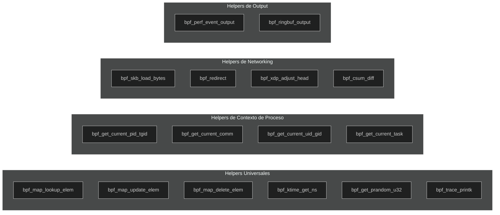

# Capítulo 8: Helper functions — El arsenal

> "No escribes un programa eBPF para demostrar que puedes. Lo escribes para preguntarle cosas al kernel. Las helper functions son las preguntas."

---

## Términos nuevos en este capítulo

- **helper function** (jélper fánkshon) — función proporcionada por el kernel que los programas eBPF pueden invocar. Es la única forma que tiene un programa BPF de interactuar con el mundo exterior (obtener datos, manipular maps, emitir eventos).
- **bpf_ktime_get_ns** (bi-pi-ef k-táim get nano-ése) — helper que retorna el tiempo monotónico del kernel en nanosegundos. Tu cronómetro dentro del kernel.
- **bpf_get_current_pid_tgid** (bi-pi-ef get current pid ti-yi-ai-di) — helper que retorna PID y TGID del proceso actual empaquetados en 64 bits. Los 32 bits altos son el TGID (lo que ves en `ps`), los bajos son el TID (thread ID).
- **bpf_get_current_comm** (bi-pi-ef get current com) — helper que copia el nombre del ejecutable del proceso actual (campo `comm` del `task_struct`) a un buffer. Máximo 16 caracteres.
- **bpf_map_lookup_elem** (bi-pi-ef map lúkap élem) — helper para buscar un valor en un map por clave. Retorna un puntero al valor o NULL si no existe.
- **bpf_map_update_elem** (bi-pi-ef map ápdeit élem) — helper para insertar o actualizar un par clave-valor en un map.
- **bpf_map_delete_elem** (bi-pi-ef map delít élem) — helper para eliminar una entrada de un map por clave.
- **bpf_perf_event_output** (bi-pi-ef perf ivént áutput) — helper para enviar datos a un perf event buffer en user space. La forma clásica de comunicar eventos kernel→user.
- **bpf_ringbuf_output** (bi-pi-ef ring-baf áutput) — helper para escribir datos en un ring buffer. La forma moderna y eficiente de comunicar eventos kernel→user.
- **bpf_skb_load_bytes** (bi-pi-ef es-ká-bi lóud báits) — helper para leer bytes de un socket buffer (paquete de red) de forma segura.
- **bpf_redirect** (bi-pi-ef ri-dáirekt) — helper para redirigir un paquete a otra interfaz de red o a un socket.
- **bpf_xdp_adjust_head** (bi-pi-ef ex-di-pi adyást jed) — helper para mover el puntero de inicio del paquete en programas XDP (para encapsular o desencapsular).

## Objetivos

Al terminar este capítulo vas a poder:

1. Conocer las helper functions más usadas organizadas por categoría
2. Usar helpers para obtener información del contexto de ejecución (PID, nombre del proceso, timestamp)
3. Entender las restricciones de qué helpers están disponibles para cada tipo de programa

## Prerrequisitos

- Saber crear y manipular maps de diferentes tipos (Capítulo 6)
- Entender las reglas del verifier y por qué existen (Capítulo 7)
- Haber escrito y cargado al menos un programa eBPF funcional (Capítulo 4)

---

## 8.1 ¿Qué son las helper functions? — La API del kernel para programas BPF

Un programa eBPF vive en una jaula. El verifier se asegura de que no puedas derreferenciar punteros inválidos, hacer loops infinitos, o acceder a memoria fuera de tu stack. Esas restricciones son el precio de correr dentro del kernel sin destruirlo.

Pero un programa en una jaula no sirve para nada si no puede interactuar con el mundo exterior. Aquí entran las helper functions.

### La interfaz entre tu programa y el kernel

Las helper functions son funciones **proporcionadas por el kernel** que tus programas BPF pueden llamar. Son la **única** forma legítima de:

- Obtener información del contexto de ejecución (¿qué proceso disparó este evento? ¿qué hora es?)
- Manipular maps (buscar, actualizar, borrar entradas)
- Emitir datos hacia user space (perf events, ring buffer)
- Manipular paquetes de red (leer bytes, redirigir, modificar headers)
- Generar números aleatorios, calcular checksums, y un largo etcétera

No puedes llamar funciones arbitrarias del kernel. No puedes invocar `printk` (la versión real del kernel). No puedes llamar `kmalloc`. Solo puedes usar las helpers que el kernel explícitamente exporta para programas BPF.

<!-- [INSERTA IMAGEN AQUI: Diagrama visual mostrando un programa BPF dentro de una jaula/sandbox con flechas saliendo solo hacia las helper functions permitidas, mientras las funciones del kernel prohibidas están marcadas con X] -->

### La mecánica por debajo

Cuando escribes esto en tu programa BPF:

```c
__u64 ts = bpf_ktime_get_ns();
```

Lo que realmente pasa es:

1. El compilador genera una instrucción `call` con un ID numérico que identifica a `bpf_ktime_get_ns`
2. El verifier valida que tu tipo de programa tiene permiso de llamar esa helper
3. En runtime, el JIT traduce ese ID a un salto directo a la implementación en el kernel

Cada helper tiene un número asignado en `include/uapi/linux/bpf.h`. Al momento de escribir esto, hay más de **200 helpers** registradas. No las vas a usar todas. La mayoría son para casos específicos. Pero hay un core de ~20 que vas a usar en casi todos los programas.

### Firma genérica

Todas las helpers siguen una convención de llamada de 5 argumentos máximo (registros R1-R5) y retornan un valor en R0:

```c
long bpf_helper_name(arg1, arg2, arg3, arg4, arg5);
```

Los tipos de los argumentos y el valor de retorno varían según la helper. El verifier conoce la firma exacta de cada una y valida que le pases los tipos correctos.

> 💡 **Analogía**: Imagina que estás en una celda de alta seguridad (el kernel). No puedes salir. Pero tienes un teléfono con números predefinidos — cada número es una helper function. Puedes llamar al "número 14" para saber qué hora es (`bpf_ktime_get_ns`), al "número 1" para preguntar en qué celda hay un paquete (`bpf_map_lookup_elem`), o al "número 25" para mandar un mensaje afuera (`bpf_perf_event_output`). Pero no puedes marcar un número que no esté en la lista. El guardia (verifier) corta la llamada.

### ¿Dónde se documenta todo?

La referencia canónica vive en la página de manual del kernel:

```bash
man 7 bpf-helpers
```

Si no la tienes instalada:

```bash
# En sistemas con manpages de linux:
sudo apt install linux-doc
# O directamente desde el fuente del kernel:
# https://github.com/torvalds/linux/blob/master/include/uapi/linux/bpf.h
```

El archivo `include/uapi/linux/bpf.h` en el código fuente del kernel tiene un comentario docblock encima de cada helper con la firma, descripción, y tipos de programa que la soportan.

---

## 8.2 Helpers de contexto — Preguntando "¿quién?" y "¿cuándo?"

Las helpers de contexto te dan información sobre el evento que disparó tu programa. Son las que más vas a usar en programas de tracing y observabilidad.

### bpf_get_current_pid_tgid

La helper más popular. Retorna un `__u64` donde:
- Los **32 bits altos** son el TGID (Thread Group ID) — esto es lo que `ps` te muestra como PID
- Los **32 bits bajos** son el PID real del kernel (que es el Thread ID)

```c
SEC("tracepoint/syscalls/sys_enter_openat")
int trace_open(struct trace_event_raw_sys_enter *ctx) {
    __u64 pid_tgid = bpf_get_current_pid_tgid();
    __u32 pid  = pid_tgid >> 32;   // Lo que la gente llama "PID"
    __u32 tid  = pid_tgid & 0xFFFFFFFF; // Thread ID

    bpf_printk("openat: pid=%d tid=%d", pid, tid);
    return 0;
}
```

> 🔥 **Advertencia**: El "PID" del kernel (`task->pid`) es el thread ID. El "PID" que ves en `ps` es el TGID (`task->tgid`). Esta confusión de nombres es histórica y no va a cambiar. Siempre usa los 32 bits altos (`>> 32`) si quieres el PID "normal" que un humano reconoce.

### bpf_get_current_comm

Copia el nombre del ejecutable del proceso actual a un buffer que tú proporcionas. El nombre viene del campo `comm` del `task_struct` — máximo 16 bytes incluyendo el null terminator.

```c
SEC("tracepoint/syscalls/sys_enter_execve")
int trace_exec(struct trace_event_raw_sys_enter *ctx) {
    char comm[16];
    bpf_get_current_comm(&comm, sizeof(comm));

    __u32 pid = bpf_get_current_pid_tgid() >> 32;
    bpf_printk("exec: pid=%d comm=%s", pid, comm);
    return 0;
}
```

### bpf_ktime_get_ns

Retorna el tiempo monotónico del kernel en nanosegundos. Es tu cronómetro de alta resolución dentro del kernel. No se ve afectado por cambios de hora del sistema (NTP, `date -s`, etc.).

```c
SEC("kprobe/do_sys_openat2")
int trace_open_latency(struct pt_regs *ctx) {
    __u64 start = bpf_ktime_get_ns();

    // ... hacer algo ...

    __u64 end = bpf_ktime_get_ns();
    __u64 delta_ns = end - start;

    bpf_printk("operación tomó %llu ns", delta_ns);
    return 0;
}
```

La magia real de `bpf_ktime_get_ns` aparece cuando combinas kprobe + kretprobe: guardas el timestamp de entrada en un map, lo recuperas en la salida, y calculas la diferencia. Ese patrón es el ejercicio de este capítulo.

### bpf_get_current_uid_gid

Retorna UID y GID del proceso actual empaquetados en 64 bits. Similar a `pid_tgid`:
- Los 32 bits bajos: UID
- Los 32 bits altos: GID

```c
SEC("tracepoint/syscalls/sys_enter_unlinkat")
int trace_delete(struct trace_event_raw_sys_enter *ctx) {
    __u64 uid_gid = bpf_get_current_uid_gid();
    __u32 uid = uid_gid & 0xFFFFFFFF;
    __u32 gid = uid_gid >> 32;

    if (uid == 0) {
        bpf_printk("root está borrando archivos!");
    }
    return 0;
}
```

### bpf_get_current_task

Retorna un puntero al `task_struct` del proceso actual. Es más poderosa que las anteriores porque te da acceso a toda la estructura del proceso — pero necesitas BTF habilitado para acceder a los campos de forma portátil.

```c
#include <vmlinux.h>

SEC("kprobe/do_exit")
int trace_exit(struct pt_regs *ctx) {
    struct task_struct *task = (struct task_struct *)bpf_get_current_task();

    // Con BTF, puedes acceder a campos directamente:
    int exit_code = BPF_CORE_READ(task, exit_code);
    bpf_printk("proceso salió con código %d", exit_code >> 8);
    return 0;
}
```

> ⚙️ **Nota técnica**: `bpf_get_current_task` retorna un `unsigned long` que necesitas castear a `struct task_struct *`. Para acceder a campos sin BTF, tendrías que usar `bpf_probe_read_kernel`. Con BTF y CO-RE (que veremos en el Capítulo 15), puedes usar `BPF_CORE_READ` que es mucho más limpio.

### bpf_get_current_cgroup_id

Retorna el ID del cgroup v2 al que pertenece el proceso actual. Útil para filtrar por contenedor o pod en Kubernetes.

```c
SEC("tracepoint/syscalls/sys_enter_connect")
int trace_connect(struct trace_event_raw_sys_enter *ctx) {
    __u64 cgroup_id = bpf_get_current_cgroup_id();
    __u32 pid = bpf_get_current_pid_tgid() >> 32;

    bpf_printk("pid=%d cgroup=%llu connect()", pid, cgroup_id);
    return 0;
}
```

### Ejemplo completo: un mini-profiler de procesos

Combinando varias helpers de contexto, puedes construir un pequeño profiler que registra quién hace qué:

```c
//go:build ignore

#include <linux/bpf.h>
#include <bpf/bpf_helpers.h>

struct event {
    __u32 pid;
    __u32 uid;
    __u64 timestamp_ns;
    char  comm[16];
};

struct {
    __uint(type, BPF_MAP_TYPE_RINGBUF);
    __uint(max_entries, 256 * 1024);
} events SEC(".maps");

SEC("tracepoint/syscalls/sys_enter_execve")
int trace_execve(void *ctx) {
    struct event *e;

    e = bpf_ringbuf_reserve(&events, sizeof(*e), 0);
    if (!e)
        return 0;

    e->pid = bpf_get_current_pid_tgid() >> 32;
    e->uid = bpf_get_current_uid_gid() & 0xFFFFFFFF;
    e->timestamp_ns = bpf_ktime_get_ns();
    bpf_get_current_comm(&e->comm, sizeof(e->comm));

    bpf_ringbuf_submit(e, 0);
    return 0;
}

char LICENSE[] SEC("license") = "GPL";
```

Y el loader en Go:

```go
package main

import (
    "bytes"
    "encoding/binary"
    "fmt"
    "log"
    "os"
    "os/signal"

    "github.com/cilium/ebpf/link"
    "github.com/cilium/ebpf/ringbuf"
    "github.com/cilium/ebpf/rlimit"
)

//go:generate go run github.com/cilium/ebpf/cmd/bpf2go -target amd64 profiler profiler.bpf.c

type Event struct {
    PID         uint32
    UID         uint32
    TimestampNs uint64
    Comm        [16]byte
}

func main() {
    if err := rlimit.RemoveMemlock(); err != nil {
        log.Fatal(err)
    }

    objs := profilerObjects{}
    if err := loadProfilerObjects(&objs, nil); err != nil {
        log.Fatal(err)
    }
    defer objs.Close()

    tp, err := link.Tracepoint("syscalls", "sys_enter_execve", objs.TraceExecve, nil)
    if err != nil {
        log.Fatal(err)
    }
    defer tp.Close()

    rd, err := ringbuf.NewReader(objs.Events)
    if err != nil {
        log.Fatal(err)
    }
    defer rd.Close()

    sig := make(chan os.Signal, 1)
    signal.Notify(sig, os.Interrupt)

    go func() {
        <-sig
        rd.Close()
    }()

    fmt.Println("Esperando eventos execve... (Ctrl+C para salir)")
    for {
        record, err := rd.Read()
        if err != nil {
            break
        }

        var event Event
        if err := binary.Read(bytes.NewReader(record.RawSample), binary.LittleEndian, &event); err != nil {
            continue
        }

        comm := string(bytes.TrimRight(event.Comm[:], "\x00"))
        fmt.Printf("[%d ns] PID=%-6d UID=%-4d CMD=%s\n",
            event.TimestampNs, event.PID, event.UID, comm)
    }
}
```

---

## 8.3 Helpers de maps — Las operaciones sobre mapas desde BPF

Ya conoces los maps del Capítulo 6. Ahora vamos a ver las helpers que los manipulan desde el lado BPF. Estas helpers son universales — funcionan en **todos** los tipos de programa.

### bpf_map_lookup_elem

Busca un valor en un map por clave. Retorna un puntero directo al valor dentro del map, o `NULL` si la clave no existe.

```c
struct {
    __uint(type, BPF_MAP_TYPE_HASH);
    __uint(max_entries, 1024);
    __type(key, __u32);
    __type(value, __u64);
} counters SEC(".maps");

SEC("tracepoint/syscalls/sys_enter_read")
int count_reads(void *ctx) {
    __u32 pid = bpf_get_current_pid_tgid() >> 32;
    __u64 *count;

    count = bpf_map_lookup_elem(&counters, &pid);
    if (count) {
        __sync_fetch_and_add(count, 1);
    } else {
        __u64 init = 1;
        bpf_map_update_elem(&counters, &pid, &init, BPF_ANY);
    }
    return 0;
}
```

> 🔥 **Advertencia**: El puntero que retorna `bpf_map_lookup_elem` apunta **directamente** al valor dentro del map. Eso significa que si otro CPU modifica el valor mientras tú lo lees, vas a ver datos parcialmente actualizados. Para contadores atómicos, usa `__sync_fetch_and_add`. Para datos más complejos, considera per-CPU maps.

### El chequeo de NULL es obligatorio

El verifier **requiere** que verifiques si el resultado es `NULL` antes de usarlo. Esto no compila:

```c
// ❌ ESTO NO PASA EL VERIFIER
__u64 *count = bpf_map_lookup_elem(&counters, &pid);
*count += 1;  // ERROR: posible derreferencia de NULL
```

Siempre:

```c
// ✅ CORRECTO
__u64 *count = bpf_map_lookup_elem(&counters, &pid);
if (count) {
    *count += 1;
}
```

### bpf_map_update_elem

Inserta o actualiza un par clave-valor. El cuarto argumento controla el comportamiento:

| Flag | Valor | Comportamiento |
|------|-------|---------------|
| `BPF_ANY` | 0 | Crea o actualiza (upsert) |
| `BPF_NOEXIST` | 1 | Solo crea. Falla si la clave ya existe |
| `BPF_EXIST` | 2 | Solo actualiza. Falla si la clave no existe |

```c
SEC("tracepoint/syscalls/sys_enter_execve")
int track_exec(void *ctx) {
    __u32 pid = bpf_get_current_pid_tgid() >> 32;
    __u64 ts = bpf_ktime_get_ns();

    // Registra cuándo ejecutó algo este PID por primera vez
    bpf_map_update_elem(&first_exec, &pid, &ts, BPF_NOEXIST);
    return 0;
}
```

`bpf_map_update_elem` retorna 0 en éxito y un valor negativo en error (típicamente `-EEXIST` con `BPF_NOEXIST` si la clave ya existía, o `-ENOENT` con `BPF_EXIST` si no existía).

### bpf_map_delete_elem

Elimina una entrada del map por clave. Retorna 0 en éxito, `-ENOENT` si la clave no existía.

```c
SEC("tracepoint/sched/sched_process_exit")
int cleanup_on_exit(void *ctx) {
    __u32 pid = bpf_get_current_pid_tgid() >> 32;

    // Limpia los datos de este proceso cuando termina
    bpf_map_delete_elem(&counters, &pid);
    bpf_map_delete_elem(&first_exec, &pid);
    return 0;
}
```

> 💡 **Analogía**: Los maps son como una pizarra compartida. `bpf_map_lookup_elem` es mirar si hay algo escrito bajo un nombre. `bpf_map_update_elem` es escribir (o reescribir) algo en la pizarra. `bpf_map_delete_elem` es borrar una entrada con el borrador. Y el verifier es el profesor que te obliga a verificar que el nombre está escrito antes de intentar leerlo — porque si miras un hueco vacío de la pizarra y actúas como si hubiera información, te va a ir mal.

### Patrón completo: contador con cleanup

```c
//go:build ignore

#include <linux/bpf.h>
#include <bpf/bpf_helpers.h>

struct {
    __uint(type, BPF_MAP_TYPE_HASH);
    __uint(max_entries, 10240);
    __type(key, __u32);
    __type(value, __u64);
} syscall_count SEC(".maps");

SEC("tracepoint/raw_syscalls/sys_enter")
int count_syscalls(void *ctx) {
    __u32 pid = bpf_get_current_pid_tgid() >> 32;
    __u64 *count;

    count = bpf_map_lookup_elem(&syscall_count, &pid);
    if (count) {
        __sync_fetch_and_add(count, 1);
    } else {
        __u64 init = 1;
        bpf_map_update_elem(&syscall_count, &pid, &init, BPF_ANY);
    }
    return 0;
}

SEC("tracepoint/sched/sched_process_exit")
int cleanup_exit(void *ctx) {
    __u32 pid = bpf_get_current_pid_tgid() >> 32;
    bpf_map_delete_elem(&syscall_count, &pid);
    return 0;
}

char LICENSE[] SEC("license") = "GPL";
```

Este patrón — contar en entry, limpiar en exit — es fundamental. Lo vas a usar constantemente.

---

## 8.4 Helpers de networking — Manipulación de paquetes

Las helpers de networking son el dominio de los programas XDP y TC. Te permiten leer, modificar, y redirigir paquetes de red directamente en el kernel.

### bpf_skb_load_bytes

Lee bytes de un socket buffer (skb) de forma segura. Es la forma correcta de acceder a contenido de paquetes en programas TC (Traffic Control).

```c
SEC("classifier")
int parse_packet(struct __sk_buff *skb) {
    unsigned char dst_mac[6];

    // Lee los primeros 6 bytes del paquete (MAC destino)
    if (bpf_skb_load_bytes(skb, 0, dst_mac, 6) < 0)
        return TC_ACT_OK;  // Error leyendo, dejar pasar

    bpf_printk("dst MAC: %02x:%02x:%02x...",
               dst_mac[0], dst_mac[1], dst_mac[2]);
    return TC_ACT_OK;
}
```

### bpf_skb_store_bytes

La contraparte de escritura. Modifica bytes dentro del paquete. Necesitas recalcular checksums después de modificar headers.

```c
SEC("classifier")
int modify_ttl(struct __sk_buff *skb) {
    // Posición del TTL en un paquete IPv4 (offset 22 desde inicio Ethernet)
    __u8 new_ttl = 64;

    if (bpf_skb_store_bytes(skb, ETH_HLEN + 8, &new_ttl, 1, 0) < 0)
        return TC_ACT_OK;

    // Recalcular checksum IP es necesario después de modificar
    return TC_ACT_OK;
}
```

### bpf_redirect

Redirige un paquete a otra interfaz de red. Es la base de load balancers y routers XDP.

```c
SEC("xdp")
int xdp_redirect(struct xdp_md *ctx) {
    // Redirige todo el tráfico a la interfaz con ifindex 2
    return bpf_redirect(2, 0);
}
```

Los flags del segundo argumento controlan el comportamiento:
- `0`: Redirect normal
- `BPF_F_INGRESS`: Redirige al path de ingress de la interfaz destino

En la práctica, usarás `bpf_redirect_map` con un `devmap` para redirecciones eficientes entre múltiples interfaces:

```c
struct {
    __uint(type, BPF_MAP_TYPE_DEVMAP);
    __uint(max_entries, 64);
    __type(key, __u32);
    __type(value, __u32);
} tx_port SEC(".maps");

SEC("xdp")
int xdp_lb(struct xdp_md *ctx) {
    __u32 port_idx = 0;  // Seleccionar puerto de destino
    return bpf_redirect_map(&tx_port, port_idx, XDP_DROP);
}
```

### bpf_xdp_adjust_head

Mueve el puntero de inicio del paquete en programas XDP. Es esencial para encapsulación (agregar headers) y desencapsulación (quitar headers).

```c
SEC("xdp")
int encap_vxlan(struct xdp_md *ctx) {
    int hdr_size = sizeof(struct vxlan_hdr) +
                   sizeof(struct udphdr) +
                   sizeof(struct iphdr) +
                   sizeof(struct ethhdr);

    // Mover data_start hacia atrás para hacer espacio
    if (bpf_xdp_adjust_head(ctx, -hdr_size) < 0)
        return XDP_DROP;

    // Ahora ctx->data apunta al nuevo inicio
    // Escribir los headers de encapsulación aquí...
    void *data = (void *)(long)ctx->data;
    void *data_end = (void *)(long)ctx->data_end;

    if (data + hdr_size > data_end)
        return XDP_DROP;

    // Llenar los headers...
    return XDP_TX;
}
```

> 🔥 **Advertencia**: Después de llamar a `bpf_xdp_adjust_head`, los punteros `ctx->data` y `ctx->data_end` cambian. **Debes** volver a validar bounds antes de acceder a cualquier byte del paquete. Si usas punteros calculados antes del ajuste, el verifier te va a rechazar — y con razón, porque esos punteros ya no son válidos.

### bpf_csum_diff

Calcula la diferencia de checksum entre dos bloques de datos. Imprescindible cuando modificas headers IP o TCP y necesitas actualizar el checksum sin recalcularlo desde cero.

```c
SEC("classifier")
int update_ip(struct __sk_buff *skb) {
    __be32 old_addr = /* dirección original */;
    __be32 new_addr = /* nueva dirección */;

    // Calcula el delta del checksum
    __s64 csum = bpf_csum_diff(&old_addr, 4, &new_addr, 4, 0);

    // Actualiza el checksum L3 (IP)
    bpf_l3_csum_replace(skb, IP_CSUM_OFFSET, 0, csum, 0);
    // Actualiza el checksum L4 (TCP/UDP)
    bpf_l4_csum_replace(skb, L4_CSUM_OFFSET, 0, csum, BPF_F_PSEUDO_HDR);

    return TC_ACT_OK;
}
```

### Ejemplo práctico: packet counter por protocolo

```c
//go:build ignore

#include <linux/bpf.h>
#include <linux/if_ether.h>
#include <linux/ip.h>
#include <bpf/bpf_helpers.h>
#include <bpf/bpf_endian.h>

struct {
    __uint(type, BPF_MAP_TYPE_HASH);
    __uint(max_entries, 256);
    __type(key, __u8);    // protocolo IP (TCP=6, UDP=17, ICMP=1)
    __type(value, __u64); // contador
} proto_count SEC(".maps");

SEC("xdp")
int count_protocols(struct xdp_md *ctx) {
    void *data = (void *)(long)ctx->data;
    void *data_end = (void *)(long)ctx->data_end;

    // Validar que hay espacio para header Ethernet
    struct ethhdr *eth = data;
    if ((void *)(eth + 1) > data_end)
        return XDP_PASS;

    // Solo IPv4
    if (eth->h_proto != bpf_htons(ETH_P_IP))
        return XDP_PASS;

    // Validar que hay espacio para header IP
    struct iphdr *ip = (void *)(eth + 1);
    if ((void *)(ip + 1) > data_end)
        return XDP_PASS;

    __u8 proto = ip->protocol;
    __u64 *count = bpf_map_lookup_elem(&proto_count, &proto);
    if (count) {
        __sync_fetch_and_add(count, 1);
    } else {
        __u64 init = 1;
        bpf_map_update_elem(&proto_count, &proto, &init, BPF_ANY);
    }

    return XDP_PASS;
}

char LICENSE[] SEC("license") = "GPL";
```

---

## 8.5 Helpers de output — Comunicando datos a user space

Los programas BPF necesitan enviar datos al mundo exterior. Las helpers de output son el mecanismo para pasar información del kernel a tu aplicación en user space.

### bpf_trace_printk (solo para debug)

Ya la conoces del Capítulo 4. Escribe al trace buffer del kernel. Es rápida de usar pero pésima para producción.

```c
bpf_printk("evento: pid=%d latencia=%llu ns", pid, delta);
```

**Cuándo usarla**: Solo durante desarrollo y debugging. Nunca en producción.

**Por qué no en producción**: Lock global, buffer compartido con ftrace, formato limitado a 3 argumentos, output solo via `trace_pipe`.

### bpf_perf_event_output — La forma clásica

Envía un bloque de datos a un perf event buffer que user space está leyendo. Es la forma que existió primero y sigue siendo ampliamente usada.

```c
struct {
    __uint(type, BPF_MAP_TYPE_PERF_EVENT_ARRAY);
    __uint(key_size, sizeof(__u32));
    __uint(value_size, sizeof(__u32));
} events SEC(".maps");

struct event_data {
    __u32 pid;
    __u64 timestamp;
    char  comm[16];
};

SEC("tracepoint/syscalls/sys_enter_write")
int trace_write(struct trace_event_raw_sys_enter *ctx) {
    struct event_data data = {};

    data.pid = bpf_get_current_pid_tgid() >> 32;
    data.timestamp = bpf_ktime_get_ns();
    bpf_get_current_comm(&data.comm, sizeof(data.comm));

    bpf_perf_event_output(ctx, &events, BPF_F_CURRENT_CPU,
                          &data, sizeof(data));
    return 0;
}
```

**Características de perf event output:**
- Un buffer por CPU (per-CPU)
- User space debe poll cada CPU individualmente
- Si el buffer se llena, los eventos nuevos se descartan
- Necesitas un `BPF_MAP_TYPE_PERF_EVENT_ARRAY` como intermediario

### bpf_ringbuf_output / bpf_ringbuf_reserve + submit — La forma moderna

El ring buffer (introducido en kernel 5.8) resuelve las limitaciones del perf buffer: buffer compartido entre CPUs, API más simple, mejor rendimiento bajo contención.

**Forma 1: output directo (copia los datos)**

```c
struct {
    __uint(type, BPF_MAP_TYPE_RINGBUF);
    __uint(max_entries, 256 * 1024); // 256 KB
} rb SEC(".maps");

struct event {
    __u32 pid;
    __u64 ts;
};

SEC("tracepoint/syscalls/sys_enter_openat")
int trace_open(void *ctx) {
    struct event e = {};
    e.pid = bpf_get_current_pid_tgid() >> 32;
    e.ts = bpf_ktime_get_ns();

    bpf_ringbuf_output(&rb, &e, sizeof(e), 0);
    return 0;
}
```

**Forma 2: reserve + submit (zero-copy, más eficiente)**

```c
SEC("tracepoint/syscalls/sys_enter_openat")
int trace_open_v2(void *ctx) {
    struct event *e;

    e = bpf_ringbuf_reserve(&rb, sizeof(*e), 0);
    if (!e)
        return 0;  // Ring buffer lleno

    e->pid = bpf_get_current_pid_tgid() >> 32;
    e->ts = bpf_ktime_get_ns();

    bpf_ringbuf_submit(e, 0);
    return 0;
}
```

La forma reserve+submit es preferida porque:
1. Evita la copia de datos (escribes directo al buffer)
2. El verifier sabe que el puntero retornado por `bpf_ringbuf_reserve` es válido
3. Puedes hacer `bpf_ringbuf_discard(e, 0)` si decides no enviar el evento

> 💡 **Analogía**: Piensa en el perf buffer como un sistema de casilleros postales — uno por CPU, y el cartero (user space) tiene que revisar cada casillero individualmente. El ring buffer es una única cinta transportadora circular donde todos los CPUs depositan paquetes y el cartero solo necesita estar parado al final de la cinta recogiendo todo.

### Comparativa: perf buffer vs ring buffer

| Aspecto | Perf Buffer | Ring Buffer |
|---------|------------|-------------|
| Kernel mínimo | 4.x | 5.8 |
| Buffers | 1 por CPU | 1 compartido |
| Polling en user space | Uno por CPU | Uno solo |
| Overhead en multi-CPU | Mayor (wakeups por CPU) | Menor (wakeup centralizado) |
| Garantía de orden | Solo por CPU | Global (FIFO) |
| API | `bpf_perf_event_output` | `bpf_ringbuf_reserve`+`submit` |
| Back-pressure | Descarta silencioso | `reserve` retorna NULL |

**Recomendación**: Si tu kernel es 5.8+, usa ring buffer. Siempre. Es más simple, más eficiente, y más fácil de consumir desde user space.

<!-- [INSERTA IMAGEN AQUI: Diagrama visual comparando perf buffer (múltiples buffers por CPU, polling individual) vs ring buffer (un buffer compartido FIFO, un solo consumer), mostrando el flujo de datos desde el programa BPF hasta user space] -->

### El consumer en Go (ring buffer)

```go
rd, err := ringbuf.NewReader(objs.Rb)
if err != nil {
    log.Fatal(err)
}
defer rd.Close()

for {
    record, err := rd.Read()
    if err != nil {
        if errors.Is(err, ringbuf.ErrClosed) {
            break
        }
        continue
    }

    var event Event
    if err := binary.Read(
        bytes.NewReader(record.RawSample),
        binary.LittleEndian,
        &event,
    ); err != nil {
        continue
    }

    fmt.Printf("PID=%d timestamp=%d\n", event.PID, event.Ts)
}
```

---

## 8.6 La matriz de compatibilidad — Qué helpers van con qué tipo de programa

Aquí está la verdad que nadie te cuenta hasta que el verifier te grita: **no todas las helpers están disponibles en todos los tipos de programa**.

Cada tipo de programa eBPF tiene un conjunto específico de helpers que puede usar. Si intentas llamar una helper que tu tipo de programa no soporta, el verifier te rechaza con un error críptico.

> 🔥 **Advertencia**: No todas las helpers están disponibles en todos los tipos de programa. El verifier te lo dirá, pero mejor saberlo antes. La primera vez que veas `"unknown func bpf_skb_load_bytes#26"` en un programa kprobe, vas a entender por qué este capítulo existe.

### ¿Por qué la restricción?

Las restricciones existen por seguridad y porque no todas las helpers tienen sentido en todos los contextos:

- `bpf_skb_load_bytes` necesita un socket buffer — no existe en un kprobe
- `bpf_redirect` solo tiene sentido si estás procesando un paquete (XDP/TC)
- `bpf_get_current_pid_tgid` no funciona en programas de interrupción (softirq) donde no hay un "proceso actual"

### La matriz



Y en formato tabla (la referencia rápida que querrás tener a mano):

| Helper | Kprobe/Kretprobe | Tracepoint | XDP | TC (cls_bpf) | cgroup/sock | LSM |
|--------|:---:|:---:|:---:|:---:|:---:|:---:|
| `bpf_map_lookup_elem` | ✅ | ✅ | ✅ | ✅ | ✅ | ✅ |
| `bpf_map_update_elem` | ✅ | ✅ | ✅ | ✅ | ✅ | ✅ |
| `bpf_map_delete_elem` | ✅ | ✅ | ✅ | ✅ | ✅ | ✅ |
| `bpf_ktime_get_ns` | ✅ | ✅ | ✅ | ✅ | ✅ | ✅ |
| `bpf_get_prandom_u32` | ✅ | ✅ | ✅ | ✅ | ✅ | ✅ |
| `bpf_trace_printk` | ✅ | ✅ | ✅ | ✅ | ✅ | ✅ |
| `bpf_get_current_pid_tgid` | ✅ | ✅ | ❌ | ❌ | ✅ | ✅ |
| `bpf_get_current_comm` | ✅ | ✅ | ❌ | ❌ | ✅ | ✅ |
| `bpf_get_current_uid_gid` | ✅ | ✅ | ❌ | ❌ | ✅ | ✅ |
| `bpf_get_current_task` | ✅ | ✅ | ❌ | ❌ | ✅ | ✅ |
| `bpf_get_current_cgroup_id` | ✅ | ✅ | ❌ | ❌ | ✅ | ✅ |
| `bpf_perf_event_output` | ✅ | ✅ | ✅ | ✅ | ❌ | ✅ |
| `bpf_ringbuf_output` | ✅ | ✅ | ✅ | ✅ | ✅ | ✅ |
| `bpf_ringbuf_reserve` | ✅ | ✅ | ✅ | ✅ | ✅ | ✅ |
| `bpf_skb_load_bytes` | ❌ | ❌ | ❌ | ✅ | ❌ | ❌ |
| `bpf_skb_store_bytes` | ❌ | ❌ | ❌ | ✅ | ❌ | ❌ |
| `bpf_redirect` | ❌ | ❌ | ✅ | ✅ | ❌ | ❌ |
| `bpf_redirect_map` | ❌ | ❌ | ✅ | ✅ | ❌ | ❌ |
| `bpf_xdp_adjust_head` | ❌ | ❌ | ✅ | ❌ | ❌ | ❌ |
| `bpf_xdp_adjust_tail` | ❌ | ❌ | ✅ | ❌ | ❌ | ❌ |
| `bpf_csum_diff` | ❌ | ❌ | ✅ | ✅ | ❌ | ❌ |
| `bpf_l3_csum_replace` | ❌ | ❌ | ❌ | ✅ | ❌ | ❌ |
| `bpf_l4_csum_replace` | ❌ | ❌ | ❌ | ✅ | ❌ | ❌ |
| `bpf_probe_read_kernel` | ✅ | ✅ | ❌ | ❌ | ❌ | ✅ |
| `bpf_probe_read_user` | ✅ | ✅ | ❌ | ❌ | ❌ | ✅ |

### Reglas generales para memorizar

En vez de memorizar la tabla completa, internaliza estas reglas:

1. **Helpers de maps y utilidades** (`bpf_map_*`, `bpf_ktime_get_ns`, `bpf_trace_printk`) → Disponibles en **todos** los tipos de programa
2. **Helpers de contexto de proceso** (`bpf_get_current_*`) → Solo en tipos de programa que corren en contexto de proceso (kprobe, tracepoint, LSM, cgroup). **No** en XDP ni TC porque ahí no hay "proceso actual" — estás en softirq
3. **Helpers de manipulación de paquetes** (`bpf_skb_*`, `bpf_redirect`, `bpf_xdp_*`) → Solo en programas de networking (XDP, TC)
4. **Helpers de output** (`bpf_perf_event_output`, `bpf_ringbuf_*`) → Casi universales, con excepciones menores

### ¿Cómo saber exactamente qué helpers soporta tu tipo de programa?

```bash
# Consultar la lista de helpers para un tipo de programa:
bpftool feature probe kernel | grep "eBPF helpers"

# O más específico, desde el código del kernel:
# Busca la función xxx_func_proto() para tu tipo de programa
# en kernel/bpf/ o net/core/filter.c
```

En el código fuente del kernel, cada tipo de programa define una función `*_func_proto()` que retorna la firma de cada helper soportada. Por ejemplo, `kprobe_prog_func_proto()` en `kernel/trace/bpf_trace.c` define qué helpers pueden usar los kprobes.

### El error cuando te equivocas

Si intentas usar `bpf_get_current_pid_tgid` en un programa XDP:

```
libbpf: prog 'xdp_prog': BPF program load failed: Permission denied
libbpf: prog 'xdp_prog': -- BEGIN PROG LOAD LOG --
0: (85) call bpf_get_current_pid_tgid#14
unknown func bpf_get_current_pid_tgid#14
processed 1 insns (limit 1000000) max_states_per_insn 0...
-- END PROG LOAD LOG --
```

El `unknown func` no significa que la helper no existe — significa que no está disponible para tu tipo de programa. El verifier simplemente pretende que no la conoce.

> ⚙️ **Nota técnica**: La razón por la que `bpf_get_current_pid_tgid` no funciona en XDP es técnica: los programas XDP corren en el contexto de softirq (interrupción de software) del driver de red. En ese contexto, `current` puede apuntar al proceso idle o a un proceso aleatorio que fue interrumpido — no al proceso que "envió" el paquete. El kernel podría darte un valor, pero sería basura, así que directamente te lo prohíbe.

---

## Ejercicio: Medir latencia de syscalls con bpf_ktime_get_ns

📋 **Nivel:** Intermedio
📚 **Conceptos previos:** Helper functions (este capítulo), Maps hash (Capítulo 6), Kprobes básicos (Capítulo 4)
🖥️ **Entorno:** VM o contenedor con kernel 5.8+ y el lab del Capítulo 3
🎯 **Problema:** Medir cuánto tiempo tarda el kernel en ejecutar la syscall `openat` (abrir un archivo), y reportar la latencia por proceso.

### Contexto

El patrón para medir latencia de una operación con eBPF es:

1. **En la entrada** (kprobe): guardar `bpf_ktime_get_ns()` en un hash map, usando el TID como clave
2. **En la salida** (kretprobe): recuperar el timestamp de entrada del map, calcular la diferencia con `bpf_ktime_get_ns()` actual, y emitir el resultado

Este patrón funciona porque el mismo thread que entra a la syscall es el que sale. El TID es la clave perfecta para correlacionar entrada con salida.

### Esqueleto de código BPF

```c
//go:build ignore

#include <linux/bpf.h>
#include <bpf/bpf_helpers.h>

// Estructura para el evento de latencia
struct latency_event {
    __u32 pid;
    __u64 delta_ns;
    char  comm[16];
};

// Map para guardar timestamps de entrada (TID -> timestamp)
struct {
    __uint(type, BPF_MAP_TYPE_HASH);
    __uint(max_entries, 10240);
    __type(key, __u32);      // TID (thread ID)
    __type(value, __u64);    // timestamp de entrada en ns
} start_times SEC(".maps");

// Ring buffer para enviar eventos a user space
struct {
    __uint(type, BPF_MAP_TYPE_RINGBUF);
    __uint(max_entries, 256 * 1024);
} events SEC(".maps");

SEC("kprobe/do_sys_openat2")
int trace_openat_entry(struct pt_regs *ctx) {
    // TODO: Obtener el TID del thread actual
    // Pista: bpf_get_current_pid_tgid() & 0xFFFFFFFF te da el TID

    // TODO: Obtener el timestamp actual con bpf_ktime_get_ns()

    // TODO: Guardar el timestamp en el map 'start_times' usando TID como clave
    // Pista: bpf_map_update_elem(&start_times, &tid, &ts, BPF_ANY)

    return 0;
}

SEC("kretprobe/do_sys_openat2")
int trace_openat_exit(struct pt_regs *ctx) {
    // TODO: Obtener el TID del thread actual

    // TODO: Buscar el timestamp de entrada en el map 'start_times'
    // Pista: bpf_map_lookup_elem(&start_times, &tid)

    // TODO: Si no existe, retornar 0 (el entry no se registró)

    // TODO: Calcular delta = bpf_ktime_get_ns() - *start_ts

    // TODO: Limpiar la entrada del map (bpf_map_delete_elem)

    // TODO: Reservar espacio en el ring buffer
    // Pista: bpf_ringbuf_reserve(&events, sizeof(struct latency_event), 0)

    // TODO: Llenar el evento con pid, delta_ns, y comm
    // Pista: bpf_get_current_comm para el nombre del proceso

    // TODO: Enviar el evento con bpf_ringbuf_submit

    return 0;
}

char LICENSE[] SEC("license") = "GPL";
```

### Esqueleto del loader en Go

```go
package main

import (
    "bytes"
    "encoding/binary"
    "fmt"
    "log"
    "os"
    "os/signal"

    "github.com/cilium/ebpf/link"
    "github.com/cilium/ebpf/ringbuf"
    "github.com/cilium/ebpf/rlimit"
)

//go:generate go run github.com/cilium/ebpf/cmd/bpf2go -target amd64 latency latency.bpf.c

type LatencyEvent struct {
    PID     uint32
    DeltaNs uint64
    Comm    [16]byte
}

func main() {
    if err := rlimit.RemoveMemlock(); err != nil {
        log.Fatal(err)
    }

    objs := latencyObjects{}
    if err := loadLatencyObjects(&objs, nil); err != nil {
        log.Fatalf("cargando objetos BPF: %v", err)
    }
    defer objs.Close()

    // TODO: Adjuntar kprobe a do_sys_openat2
    // Pista: link.Kprobe("do_sys_openat2", objs.TraceOpenatEntry, nil)

    // TODO: Adjuntar kretprobe a do_sys_openat2
    // Pista: link.Kretprobe("do_sys_openat2", objs.TraceOpenatExit, nil)

    // TODO: Crear reader del ring buffer
    // Pista: ringbuf.NewReader(objs.Events)

    sig := make(chan os.Signal, 1)
    signal.Notify(sig, os.Interrupt)

    // TODO: En un goroutine, esperar la señal y cerrar el reader

    fmt.Println("Midiendo latencia de openat... (Ctrl+C para salir)")
    fmt.Printf("%-8s %-16s %s\n", "PID", "COMM", "LATENCIA")

    // TODO: Loop leyendo eventos del ring buffer
    // Para cada evento:
    //   1. Decodificar con binary.Read
    //   2. Imprimir PID, nombre del proceso, y latencia en µs
    //      (dividir DeltaNs entre 1000 para microsegundos)
}
```

### Criterios de éxito

- [ ] El programa se carga sin errores del verifier
- [ ] Se adjunta correctamente a kprobe y kretprobe de `do_sys_openat2`
- [ ] Al ejecutar `ls`, `cat`, o cualquier comando que abra archivos, aparecen eventos con latencia medida
- [ ] La latencia reportada está en un rango razonable (típicamente 1-100 µs para operaciones locales)
- [ ] Los eventos muestran el PID correcto y el nombre del proceso

<!-- [INSERTA IMAGEN AQUI: Captura de terminal mostrando el programa de latencia de openat ejecutándose mientras se corren comandos cat y ls en otra terminal, con las mediciones de latencia visibles] -->

### Pistas

1. El TID se obtiene con `bpf_get_current_pid_tgid() & 0xFFFFFFFF` (los 32 bits bajos). El PID (para mostrar) se obtiene con `>> 32` (los 32 bits altos).
2. Siempre verifica que `bpf_map_lookup_elem` no retornó NULL antes de derreferenciar. El verifier te lo va a exigir.
3. Borra la entrada del map después de leerla (`bpf_map_delete_elem`). Si no lo haces, el map crece indefinidamente con entradas de threads que ya terminaron su syscall.
4. Si `bpf_ringbuf_reserve` retorna NULL, el ring buffer está lleno. Simplemente retorna 0 y pierde el evento — es mejor perder datos que crashear.

### Caso de prueba

Con tu programa corriendo en una terminal:

```bash
# En otra terminal, genera actividad de openat:
for i in $(seq 1 10); do cat /etc/hostname; done
```

Deberías ver algo como:

```
Midiendo latencia de openat... (Ctrl+C para salir)
PID      COMM             LATENCIA
1234     cat              12 µs
1234     cat              8 µs
1235     cat              15 µs
...
```

<!-- [INSERTA IMAGEN AQUI: Captura de terminal mostrando la salida del programa de medición de latencia con eventos de openat mostrando PID, nombre del proceso y latencia en microsegundos] -->

Si la latencia es 0 µs para todo, probablemente estás leyendo mal el timestamp de entrada (verifica que estás usando el TID como clave, no el PID).

Si no ves eventos, verifica que el kprobe está adjunto a la función correcta. En kernels modernos es `do_sys_openat2`. En algunos más antiguos puede ser `do_sys_open`.

---

## Resumen

Lo que te llevas de este capítulo:

1. Las helper functions son la **única interfaz** entre tu programa BPF y el kernel — son la API que te permite hacer cosas útiles desde la jaula del verifier
2. Las helpers de **contexto** (`bpf_get_current_pid_tgid`, `bpf_get_current_comm`, `bpf_ktime_get_ns`) son tu pan de cada día para tracing y observabilidad
3. Las helpers de **maps** (`bpf_map_lookup_elem`, `bpf_map_update_elem`, `bpf_map_delete_elem`) son universales y siempre requieren chequeo de NULL en el lookup
4. Las helpers de **networking** (`bpf_skb_load_bytes`, `bpf_redirect`, `bpf_xdp_adjust_head`) solo están disponibles en programas XDP y TC
5. Las helpers de **output** favorecen ring buffer (`bpf_ringbuf_reserve` + `submit`) sobre perf events en kernels 5.8+
6. **No todas las helpers funcionan en todos los tipos de programa** — la restricción es por diseño (seguridad + semántica), y el verifier te la va a hacer cumplir

---

## Para saber más

- 📖 [man 7 bpf-helpers](https://man7.org/linux/man-pages/man7/bpf-helpers.7.html) — La referencia oficial de todas las helper functions con firmas y descripciones
- 📖 [BPF Helper Function Reference — kernel.org](https://docs.kernel.org/bpf/helper_funcs.html) — Documentación del kernel con detalles de implementación
- 💻 [include/uapi/linux/bpf.h](https://github.com/torvalds/linux/blob/master/include/uapi/linux/bpf.h) — El archivo fuente con todas las helpers, sus IDs, y los comentarios de documentación
- 📝 [BPF ring buffer — Andrii Nakryiko](https://nakryiko.com/posts/bpf-ringbuf/) — Artículo del creador del ring buffer BPF explicando el diseño y las ventajas sobre perf buffer
- 💻 [cilium/ebpf examples](https://github.com/cilium/ebpf/tree/main/examples) — Ejemplos prácticos de uso de helpers con cilium/ebpf en Go
