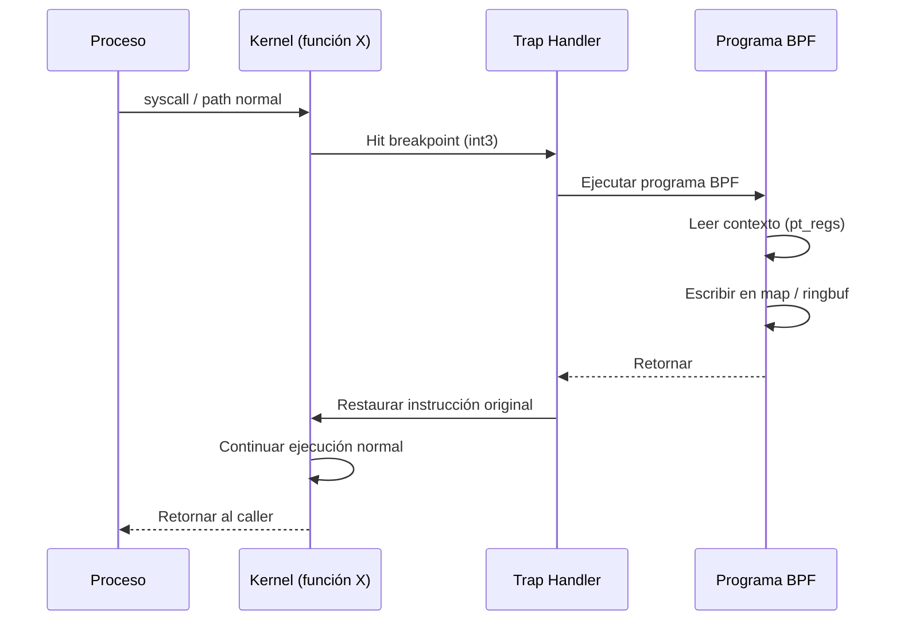
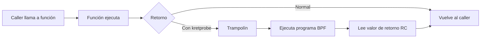

# Capítulo 9: Kprobes y Tracepoints — Escuchando al kernel

> "Cada función del kernel es una puerta. Con kprobes, pones un micrófono detrás de cada una. Con tracepoints, el kernel mismo te invita a escuchar."

---

## Términos nuevos en este capítulo

- **kprobe** (kéi-proub) — mecanismo de instrumentación dinámica que permite interceptar la entrada a cualquier función del kernel. Se instala en runtime y no requiere modificar el código fuente del kernel.
- **kretprobe** (kéi-ret-proub) — variante de kprobe que intercepta el punto de retorno de una función del kernel. Te permite capturar el valor de retorno.
- **tracepoint** (tréis-point) — punto de instrumentación estático definido en el código fuente del kernel. Es estable entre versiones y tiene una interfaz documentada.
- **fentry** (ef-éntri) — mecanismo moderno de instrumentación de entrada a funciones del kernel basado en BTF. Más eficiente que kprobes y con acceso type-safe a argumentos.
- **fexit** (ef-éxit) — mecanismo moderno de instrumentación de retorno de funciones del kernel basado en BTF. Equivalente a kretprobe pero con acceso a los argumentos originales y al valor de retorno.
- **uprobe** (iú-proub) — similar a kprobe pero para funciones en user space. Intercepta la entrada a funciones en binarios o bibliotecas compartidas.
- **struct pt_regs** (pi-ti-régs) — estructura que contiene los registros del procesador en el punto donde se disparó un kprobe. Es el contexto de ejecución que recibe tu programa BPF.
- **attach point** (atach point) — lugar específico del kernel (función, tracepoint, hook de red) donde un programa eBPF se adjunta para ejecutarse. También llamado "punto de enganche".
- **dynamic tracing** (dainámik tréising) — instrumentación que se instala en runtime sin recompilar ni reiniciar el kernel. Kprobes son el ejemplo canónico.
- **static tracing** (státik tréising) — instrumentación predefinida en el código fuente del kernel con interfaces estables. Tracepoints son el ejemplo canónico.

## Objetivos

Al terminar este capítulo vas a poder:

1. Adjuntar programas eBPF a kprobes y kretprobes para interceptar funciones del kernel
2. Usar tracepoints estáticos para instrumentar eventos del kernel con interfaces estables
3. Capturar argumentos de funciones del kernel y valores de retorno
4. Elegir entre kprobes, tracepoints y fentry/fexit según tu caso de uso

## Prerrequisitos

- Saber crear y manipular maps de diferentes tipos (Capítulo 6)
- Conocer las helper functions de contexto y maps (Capítulo 8)
- Haber escrito y cargado un programa eBPF funcional (Capítulo 4)
- Entender las reglas del verifier (Capítulo 7)

---

## 9.1 Kprobes — Interceptando cualquier función del kernel

Un kprobe es un breakpoint que no detiene la ejecución. Se instala en runtime sobre **cualquier función del kernel** — sí, cualquiera — y ejecuta tu programa eBPF cada vez que esa función se invoca. Es la navaja suiza del tracing dinámico.

### Cómo funciona por debajo

Cuando adjuntas un kprobe a una función del kernel:

1. El kernel guarda la instrucción original en la dirección de entrada de la función
2. Reemplaza esa instrucción con una trampa (breakpoint trap o `int3` en x86)
3. Cuando la CPU ejecuta esa dirección, se dispara el trap handler
4. El trap handler ejecuta tu programa eBPF
5. Se restaura el flujo normal — la función original continúa como si nada

Todo esto ocurre de forma atómica. La función del kernel ni se entera de que la están observando.



### El contexto: struct pt_regs

Cuando tu programa BPF se ejecuta en un kprobe, recibe un puntero a `struct pt_regs` — los registros del procesador en el momento del trap. Esto te da acceso a los **argumentos de la función** que estás interceptando.

En x86_64, los argumentos de funciones van en estos registros:
- Argumento 1: `rdi` (o `PT_REGS_PARM1(ctx)`)
- Argumento 2: `rsi` (o `PT_REGS_PARM2(ctx)`)
- Argumento 3: `rdx` (o `PT_REGS_PARM3(ctx)`)
- Argumento 4: `rcx` (o `PT_REGS_PARM4(ctx)`)
- Argumento 5: `r8` (o `PT_REGS_PARM5(ctx)`)

```c
#include <linux/bpf.h>
#include <bpf/bpf_helpers.h>
#include <bpf/bpf_tracing.h>

SEC("kprobe/do_sys_openat2")
int trace_openat(struct pt_regs *ctx) {
    // do_sys_openat2(int dfd, const char __user *filename, struct open_how *how)
    // Argumento 2 = filename (en rsi)
    const char *filename = (const char *)PT_REGS_PARM2(ctx);

    char buf[64];
    bpf_probe_read_user_str(buf, sizeof(buf), filename);

    __u32 pid = bpf_get_current_pid_tgid() >> 32;
    bpf_printk("pid=%d open: %s", pid, buf);
    return 0;
}

char LICENSE[] SEC("license") = "GPL";
```

### La macro SEC y el nombre de la función

La sección `SEC("kprobe/nombre_funcion")` le dice a cilium/ebpf (y a libbpf) a qué función del kernel adjuntar el kprobe:

```c
SEC("kprobe/tcp_connect")        // Se adjunta a tcp_connect()
SEC("kprobe/vfs_read")           // Se adjunta a vfs_read()
SEC("kprobe/do_sys_openat2")     // Se adjunta a do_sys_openat2()
```

¿Cómo sabes qué funciones están disponibles? Con `/proc/kallsyms`:

```bash
# Buscar funciones de filesystem
cat /proc/kallsyms | grep -i "vfs_" | head -20

# Buscar funciones de TCP
cat /proc/kallsyms | grep -i "tcp_" | head -20

# ¿Existe do_sys_openat2 en tu kernel?
cat /proc/kallsyms | grep do_sys_openat2
```

> 💡 **Analogía**: Imagina que el kernel es un edificio de oficinas con miles de puertas. Un kprobe es como pegar un sensor de movimiento en el marco de cualquier puerta — cada vez que alguien pasa (la función se ejecuta), el sensor se activa y tu programa recibe una señal. No necesitas permiso del dueño de la oficina, no necesitas modificar la puerta, y la persona que pasa ni se entera de que la están detectando.

### El loader en Go

```go
package main

import (
    "fmt"
    "log"
    "os"
    "os/signal"
    "time"

    "github.com/cilium/ebpf/link"
    "github.com/cilium/ebpf/rlimit"
)

//go:generate go run github.com/cilium/ebpf/cmd/bpf2go -target amd64 kprobe kprobe_openat.bpf.c

func main() {
    if err := rlimit.RemoveMemlock(); err != nil {
        log.Fatal(err)
    }

    objs := kprobeObjects{}
    if err := loadKprobeObjects(&objs, nil); err != nil {
        log.Fatalf("cargando objetos BPF: %v", err)
    }
    defer objs.Close()

    // Adjuntar kprobe a do_sys_openat2
    kp, err := link.Kprobe("do_sys_openat2", objs.TraceOpenat, nil)
    if err != nil {
        log.Fatalf("adjuntando kprobe: %v", err)
    }
    defer kp.Close()

    fmt.Println("Kprobe adjuntado a do_sys_openat2. Ctrl+C para salir.")
    fmt.Println("Mira la salida en: sudo cat /sys/kernel/debug/tracing/trace_pipe")

    sig := make(chan os.Signal, 1)
    signal.Notify(sig, os.Interrupt)

    ticker := time.NewTicker(5 * time.Second)
    defer ticker.Stop()

    for {
        select {
        case <-sig:
            fmt.Println("\nSaliendo...")
            return
        case <-ticker.C:
            fmt.Println("... escuchando (Ctrl+C para salir)")
        }
    }
}
```

<!-- [INSERTA IMAGEN AQUI: Captura de terminal mostrando el programa de kprobe ejecutándose, con la salida de trace_pipe en otra terminal mostrando los eventos de openat con PID y nombre de archivo] -->

### ¿Qué funciones puedes interceptar?

Técnicamente, **cualquier función exportada en `/proc/kallsyms`**. En la práctica, eso incluye:

- Funciones de syscalls (`do_sys_openat2`, `__x64_sys_read`, etc.)
- Funciones del VFS (`vfs_read`, `vfs_write`, `vfs_open`)
- Funciones de networking (`tcp_connect`, `tcp_sendmsg`, `ip_rcv`)
- Funciones del scheduler (`schedule`, `wake_up_process`)
- Funciones de memoria (`do_page_fault`, `__alloc_pages`)
- Miles más...

```bash
# Total de funciones instrumentables en un kernel típico:
wc -l /proc/kallsyms
# ~150,000+ en un kernel moderno
```

> 🔥 **Advertencia**: Las funciones internas del kernel pueden **cambiar de nombre, firma, o desaparecer** entre versiones del kernel. Tu kprobe que funciona perfecto en kernel 6.1 puede fallar silenciosamente en kernel 6.5 si la función se renombró o se refactorizó. Esto es el precio del dynamic tracing: poder sin garantías de estabilidad. Si necesitas estabilidad, usa tracepoints (sección 9.3).

---

## 9.2 Kretprobes — Capturando valores de retorno

Un kretprobe es el complemento del kprobe: se ejecuta cuando la función del kernel **retorna**. Te da acceso al valor de retorno — fundamental para saber si una operación tuvo éxito o falló.

### El mecanismo

Cuando adjuntas un kretprobe:

1. El kernel modifica la dirección de retorno en el stack (trampolín)
2. Cuando la función hace `ret`, en vez de volver a su caller, salta al trampolín del kretprobe
3. El trampolín ejecuta tu programa BPF
4. Después restaura la dirección de retorno original y continúa el flujo normal



### Accediendo al valor de retorno

El valor de retorno está en el registro `rax` (x86_64) o puedes usar la macro `PT_REGS_RC(ctx)`:

```c
#include <linux/bpf.h>
#include <bpf/bpf_helpers.h>
#include <bpf/bpf_tracing.h>

SEC("kretprobe/do_sys_openat2")
int trace_openat_ret(struct pt_regs *ctx) {
    // El valor de retorno es el file descriptor (o error negativo)
    long ret = PT_REGS_RC(ctx);

    __u32 pid = bpf_get_current_pid_tgid() >> 32;

    if (ret < 0) {
        bpf_printk("pid=%d openat FALLÓ: %ld", pid, ret);
    } else {
        bpf_printk("pid=%d openat OK: fd=%ld", pid, ret);
    }
    return 0;
}

char LICENSE[] SEC("license") = "GPL";
```

### El patrón kprobe + kretprobe: medición de latencia

El caso de uso más común es combinar ambos para medir cuánto tardó una función:

```c
//go:build ignore

#include <linux/bpf.h>
#include <bpf/bpf_helpers.h>
#include <bpf/bpf_tracing.h>

struct event {
    __u32 pid;
    __u64 delta_ns;
    long  ret;
    char  comm[16];
};

struct {
    __uint(type, BPF_MAP_TYPE_HASH);
    __uint(max_entries, 10240);
    __type(key, __u32);
    __type(value, __u64);
} start SEC(".maps");

struct {
    __uint(type, BPF_MAP_TYPE_RINGBUF);
    __uint(max_entries, 256 * 1024);
} events SEC(".maps");

SEC("kprobe/tcp_connect")
int trace_tcp_connect_entry(struct pt_regs *ctx) {
    __u32 tid = bpf_get_current_pid_tgid() & 0xFFFFFFFF;
    __u64 ts = bpf_ktime_get_ns();
    bpf_map_update_elem(&start, &tid, &ts, BPF_ANY);
    return 0;
}

SEC("kretprobe/tcp_connect")
int trace_tcp_connect_exit(struct pt_regs *ctx) {
    __u32 tid = bpf_get_current_pid_tgid() & 0xFFFFFFFF;

    __u64 *start_ts = bpf_map_lookup_elem(&start, &tid);
    if (!start_ts)
        return 0;

    __u64 delta = bpf_ktime_get_ns() - *start_ts;
    bpf_map_delete_elem(&start, &tid);

    struct event *e = bpf_ringbuf_reserve(&events, sizeof(*e), 0);
    if (!e)
        return 0;

    e->pid = bpf_get_current_pid_tgid() >> 32;
    e->delta_ns = delta;
    e->ret = PT_REGS_RC(ctx);
    bpf_get_current_comm(&e->comm, sizeof(e->comm));

    bpf_ringbuf_submit(e, 0);
    return 0;
}

char LICENSE[] SEC("license") = "GPL";
```

Este patrón — guardar timestamp en entry, calcular delta en exit — es **el** patrón fundamental del tracing de latencia. Lo vas a usar cada vez que necesites responder "¿cuánto tarda X?".

### El loader en Go con ring buffer

```go
package main

import (
    "bytes"
    "encoding/binary"
    "fmt"
    "log"
    "os"
    "os/signal"

    "github.com/cilium/ebpf/link"
    "github.com/cilium/ebpf/ringbuf"
    "github.com/cilium/ebpf/rlimit"
)

//go:generate go run github.com/cilium/ebpf/cmd/bpf2go -target amd64 tcpLatency tcp_latency.bpf.c

type Event struct {
    PID     uint32
    DeltaNs uint64
    Ret     int64
    Comm    [16]byte
}

func main() {
    if err := rlimit.RemoveMemlock(); err != nil {
        log.Fatal(err)
    }

    objs := tcpLatencyObjects{}
    if err := loadTcpLatencyObjects(&objs, nil); err != nil {
        log.Fatalf("cargando objetos: %v", err)
    }
    defer objs.Close()

    kp, err := link.Kprobe("tcp_connect", objs.TraceTcpConnectEntry, nil)
    if err != nil {
        log.Fatalf("kprobe: %v", err)
    }
    defer kp.Close()

    krp, err := link.Kretprobe("tcp_connect", objs.TraceTcpConnectExit, nil)
    if err != nil {
        log.Fatalf("kretprobe: %v", err)
    }
    defer krp.Close()

    rd, err := ringbuf.NewReader(objs.Events)
    if err != nil {
        log.Fatalf("ring buffer: %v", err)
    }
    defer rd.Close()

    sig := make(chan os.Signal, 1)
    signal.Notify(sig, os.Interrupt)
    go func() {
        <-sig
        rd.Close()
    }()

    fmt.Println("Midiendo latencia de tcp_connect... (Ctrl+C para salir)")
    fmt.Printf("%-8s %-16s %-12s %s\n", "PID", "COMM", "LATENCIA", "RESULTADO")

    for {
        record, err := rd.Read()
        if err != nil {
            break
        }

        var event Event
        if err := binary.Read(bytes.NewReader(record.RawSample), binary.LittleEndian, &event); err != nil {
            continue
        }

        comm := string(bytes.TrimRight(event.Comm[:], "\x00"))
        resultado := "OK"
        if event.Ret < 0 {
            resultado = fmt.Sprintf("ERROR(%d)", event.Ret)
        }
        fmt.Printf("%-8d %-16s %-12s %s\n",
            event.PID, comm,
            fmt.Sprintf("%d µs", event.DeltaNs/1000),
            resultado)
    }
}
```

**Resultado esperado:**

```
Midiendo latencia de tcp_connect... (Ctrl+C para salir)
PID      COMM             LATENCIA     RESULTADO
1542     curl             234 µs       OK
1543     wget             189 µs       OK
892      firefox          45 µs        OK
1544     curl             15023 µs     ERROR(-110)
```

<!-- [INSERTA IMAGEN AQUI: Captura de terminal mostrando el programa de medición de latencia de tcp_connect con eventos en tiempo real mostrando PID, proceso, latencia y resultado] -->

> ⚙️ **Nota técnica**: Un kretprobe tiene una limitación: no puedes acceder a los argumentos originales de la función desde el kretprobe — solo tienes el valor de retorno. Si necesitas correlacionar argumentos con el resultado, guarda los argumentos en un map durante el kprobe de entrada y recupéralos en el kretprobe. Esto es exactamente lo que hace fentry/fexit de forma transparente (sección 9.4).

---

## 9.3 Tracepoints — Los puntos de instrumentación oficiales

Los tracepoints son diferentes a los kprobes en un aspecto fundamental: están **definidos explícitamente en el código fuente del kernel**. Son puntos de instrumentación estáticos que el equipo de desarrollo del kernel mantiene como parte de la interfaz estable.

### La diferencia clave

| Aspecto | Kprobes | Tracepoints |
|---------|---------|-------------|
| Tipo | Dinámicos (se instalan en runtime) | Estáticos (definidos en el código fuente) |
| Cobertura | Cualquier función del kernel | Solo donde el kernel los define |
| Estabilidad | Puede romperse entre versiones | Interfaz estable (kernel ABI) |
| Rendimiento | Overhead del trap (int3) | Overhead de branch condicional (NOP → jump) |
| Argumentos | Via registros (pt_regs) | Estructura definida con campos nombrados |
| Documentación | Firma de la función C | Formato documentado en /sys/kernel/tracing |

### ¿Dónde están los tracepoints?

```bash
# Listar todas las categorías de tracepoints
ls /sys/kernel/tracing/events/

# Listar tracepoints de syscalls
ls /sys/kernel/tracing/events/syscalls/

# Listar tracepoints del scheduler
ls /sys/kernel/tracing/events/sched/

# Ver el formato de un tracepoint específico
cat /sys/kernel/tracing/events/sched/sched_process_exec/format
```

El formato te dice exactamente qué campos tiene el evento:

```
name: sched_process_exec
ID: 316
format:
    field:unsigned short common_type;         offset:0;  size:2; signed:0;
    field:unsigned char common_flags;         offset:2;  size:1; signed:0;
    field:unsigned int common_pid;            offset:4;  size:4; signed:1;
    field:int __data_loc char[] filename;     offset:8;  size:4; signed:1;
    field:pid_t pid;                          offset:12; size:4; signed:1;
    field:pid_t old_pid;                      offset:16; size:4; signed:1;
```

### Usando tracepoints en eBPF

La sección SEC para tracepoints sigue el formato `SEC("tracepoint/categoría/nombre")`:

```c
//go:build ignore

#include <linux/bpf.h>
#include <bpf/bpf_helpers.h>

// Estructura que mapea los campos del tracepoint
struct trace_event_raw_sched_process_exec {
    // Campos comunes (siempre presentes)
    unsigned short common_type;
    unsigned char  common_flags;
    unsigned char  common_preempt_count;
    int            common_pid;
    // Campos específicos del evento
    int            __data_loc_filename;
    int            pid;
    int            old_pid;
};

SEC("tracepoint/sched/sched_process_exec")
int trace_exec(struct trace_event_raw_sched_process_exec *ctx) {
    __u32 pid = bpf_get_current_pid_tgid() >> 32;
    char comm[16];
    bpf_get_current_comm(&comm, sizeof(comm));

    bpf_printk("exec: pid=%d comm=%s", pid, comm);
    return 0;
}

char LICENSE[] SEC("license") = "GPL";
```

### Tracepoints de syscalls — Los más usados

Los tracepoints bajo `syscalls/` son extremadamente útiles porque cubren **todas** las syscalls del sistema:

```c
// Entrada a la syscall write
SEC("tracepoint/syscalls/sys_enter_write")
int trace_write_enter(struct trace_event_raw_sys_enter *ctx) {
    // ctx->args[0] = fd
    // ctx->args[1] = buf (puntero user space)
    // ctx->args[2] = count (tamaño)
    int fd = ctx->args[0];
    size_t count = ctx->args[2];

    __u32 pid = bpf_get_current_pid_tgid() >> 32;
    bpf_printk("pid=%d write(fd=%d, count=%lu)", pid, fd, count);
    return 0;
}

// Salida de la syscall write (con valor de retorno)
SEC("tracepoint/syscalls/sys_exit_write")
int trace_write_exit(struct trace_event_raw_sys_exit *ctx) {
    long ret = ctx->ret;

    if (ret < 0) {
        __u32 pid = bpf_get_current_pid_tgid() >> 32;
        bpf_printk("pid=%d write FAILED: %ld", pid, ret);
    }
    return 0;
}
```

La ventaja de `sys_enter_*` y `sys_exit_*` es que el kernel los define para **todas** las syscalls. No necesitas adivinar el nombre de la función interna.

### Ejemplo completo: monitor de procesos nuevos

```c
//go:build ignore

#include <linux/bpf.h>
#include <bpf/bpf_helpers.h>

struct exec_event {
    __u32 pid;
    __u32 ppid;
    __u32 uid;
    char  comm[16];
};

struct {
    __uint(type, BPF_MAP_TYPE_RINGBUF);
    __uint(max_entries, 256 * 1024);
} events SEC(".maps");

// Estructura simplificada del tracepoint sched_process_exec
struct sched_process_exec_args {
    unsigned short common_type;
    unsigned char  common_flags;
    unsigned char  common_preempt_count;
    int            common_pid;
    int            __data_loc_filename;
    int            pid;
    int            old_pid;
};

SEC("tracepoint/sched/sched_process_exec")
int trace_exec(struct sched_process_exec_args *ctx) {
    struct exec_event *e;

    e = bpf_ringbuf_reserve(&events, sizeof(*e), 0);
    if (!e)
        return 0;

    __u64 pid_tgid = bpf_get_current_pid_tgid();
    e->pid = pid_tgid >> 32;
    e->uid = bpf_get_current_uid_gid() & 0xFFFFFFFF;
    bpf_get_current_comm(&e->comm, sizeof(e->comm));

    // Obtener el PPID (parent PID) desde task_struct
    struct task_struct *task = (struct task_struct *)bpf_get_current_task();
    bpf_probe_read_kernel(&e->ppid, sizeof(e->ppid),
                          &task->real_parent->tgid);

    bpf_ringbuf_submit(e, 0);
    return 0;
}

char LICENSE[] SEC("license") = "GPL";
```

Y su loader en Go:

```go
package main

import (
    "bytes"
    "encoding/binary"
    "fmt"
    "log"
    "os"
    "os/signal"

    "github.com/cilium/ebpf/link"
    "github.com/cilium/ebpf/ringbuf"
    "github.com/cilium/ebpf/rlimit"
)

//go:generate go run github.com/cilium/ebpf/cmd/bpf2go -target amd64 execmon execmon.bpf.c

type ExecEvent struct {
    PID  uint32
    PPID uint32
    UID  uint32
    Comm [16]byte
}

func main() {
    if err := rlimit.RemoveMemlock(); err != nil {
        log.Fatal(err)
    }

    objs := execmonObjects{}
    if err := loadExecmonObjects(&objs, nil); err != nil {
        log.Fatalf("cargando objetos: %v", err)
    }
    defer objs.Close()

    tp, err := link.Tracepoint("sched", "sched_process_exec", objs.TraceExec, nil)
    if err != nil {
        log.Fatalf("tracepoint: %v", err)
    }
    defer tp.Close()

    rd, err := ringbuf.NewReader(objs.Events)
    if err != nil {
        log.Fatalf("ring buffer: %v", err)
    }
    defer rd.Close()

    sig := make(chan os.Signal, 1)
    signal.Notify(sig, os.Interrupt)
    go func() {
        <-sig
        rd.Close()
    }()

    fmt.Println("Monitoreando procesos nuevos... (Ctrl+C para salir)")
    fmt.Printf("%-8s %-8s %-6s %s\n", "PID", "PPID", "UID", "COMM")

    for {
        record, err := rd.Read()
        if err != nil {
            break
        }

        var event ExecEvent
        if err := binary.Read(bytes.NewReader(record.RawSample), binary.LittleEndian, &event); err != nil {
            continue
        }

        comm := string(bytes.TrimRight(event.Comm[:], "\x00"))
        fmt.Printf("%-8d %-8d %-6d %s\n", event.PID, event.PPID, event.UID, comm)
    }
}
```

**Resultado esperado:**

```
Monitoreando procesos nuevos... (Ctrl+C para salir)
PID      PPID     UID    COMM
4521     1832     1000   ls
4522     1832     1000   cat
4523     4520     0      sudo
4524     4523     0      apt
```

<!-- [INSERTA IMAGEN AQUI: Captura de terminal mostrando el monitor de procesos ejecutándose mientras se lanzan comandos en otra terminal, con PID, PPID, UID y nombre del proceso visibles] -->

> 💡 **Analogía**: Si kprobes son micrófonos que tú pegas donde quieras (instalación propia, sin garantías), los tracepoints son bocinas oficiales del edificio. Están instaladas por el equipo de mantenimiento (los desarrolladores del kernel), tienen un formato documentado de lo que transmiten, y no van a desaparecer de un día para otro. Son menos flexibles (no puedes poner una bocina en cualquier pasillo) pero infinitamente más confiables.

### Categorías de tracepoints más útiles

| Categoría | Ejemplos | Uso típico |
|-----------|----------|------------|
| `syscalls/` | `sys_enter_*`, `sys_exit_*` | Monitoreo de syscalls por proceso |
| `sched/` | `sched_process_exec`, `sched_switch`, `sched_process_exit` | Tracking de procesos, scheduling |
| `net/` | `net_dev_xmit`, `netif_receive_skb` | Tracing de networking a nivel device |
| `block/` | `block_rq_issue`, `block_rq_complete` | I/O de disco |
| `fs/` | Varía por filesystem | Operaciones de filesystem |
| `tcp/` | `tcp_retransmit_skb`, `tcp_probe` | Diagnóstico TCP |
| `signal/` | `signal_generate`, `signal_deliver` | Tracking de señales |
| `raw_syscalls/` | `sys_enter`, `sys_exit` | Todas las syscalls (genérico) |

```bash
# Contar tracepoints disponibles en tu kernel:
find /sys/kernel/tracing/events -name "format" | wc -l
# Típicamente 1000-2000+ en un kernel moderno
```

---

## 9.4 Fentry/Fexit — La evolución moderna (BTF-enabled)

Fentry y fexit son la versión moderna de kprobes y kretprobes. Requieren que el kernel tenga BTF habilitado (kernel 5.5+, con `CONFIG_DEBUG_INFO_BTF`), pero a cambio te dan:

1. **Acceso type-safe a los argumentos** — no necesitas andar pescando de `pt_regs`
2. **Menor overhead** — no usan el mecanismo de breakpoint trap
3. **En fexit, tienes los argumentos originales Y el valor de retorno** — no necesitas un map intermedio
4. **Portabilidad con CO-RE** — los tipos se resuelven en tiempo de carga

### Fentry: la entrada elegante

```c
//go:build ignore

#include "vmlinux.h"
#include <bpf/bpf_helpers.h>
#include <bpf/bpf_tracing.h>

SEC("fentry/tcp_connect")
int BPF_PROG(trace_tcp_connect, struct sock *sk) {
    // ¡Acceso directo al argumento con su tipo!
    // No más PT_REGS_PARM1 ni casts oscuros

    __u32 pid = bpf_get_current_pid_tgid() >> 32;
    __u16 dport = BPF_CORE_READ(sk, __sk_common.skc_dport);

    bpf_printk("pid=%d tcp_connect: dport=%d", pid, __builtin_bswap16(dport));
    return 0;
}

char LICENSE[] SEC("license") = "GPL";
```

Observa la diferencia:
- **Kprobe**: `SEC("kprobe/tcp_connect")` + `struct pt_regs *ctx` + extraer argumento de registros
- **Fentry**: `SEC("fentry/tcp_connect")` + `BPF_PROG(nombre, struct sock *sk)` + argumento con tipo directamente

La macro `BPF_PROG` desempaqueta los argumentos del contexto raw a las variables tipadas que declaras. Es azúcar sintáctica que el preprocesador expande.

### Fexit: retorno con contexto completo

La killer feature de fexit: **tienes acceso a los argumentos originales Y al valor de retorno en el mismo programa**.

```c
SEC("fexit/tcp_connect")
int BPF_PROG(trace_tcp_connect_ret, struct sock *sk, int ret) {
    // sk = argumento original de tcp_connect
    // ret = valor de retorno de tcp_connect

    if (ret != 0) {
        __u32 pid = bpf_get_current_pid_tgid() >> 32;
        __u16 dport = BPF_CORE_READ(sk, __sk_common.skc_dport);
        bpf_printk("pid=%d tcp_connect FALLÓ: dport=%d ret=%d",
                   pid, __builtin_bswap16(dport), ret);
    }
    return 0;
}
```

Con kprobe + kretprobe necesitabas un map para pasar información de la entrada a la salida. Con fexit, todo está disponible en un solo programa. Menos código, menos maps, menos posibilidad de bugs.

### Comparación: kprobe vs fentry

| Aspecto | kprobe/kretprobe | fentry/fexit |
|---------|------------------|--------------|
| Kernel mínimo | 4.x | 5.5+ (con BTF) |
| Acceso a argumentos | Via `pt_regs` (posición en registros) | Type-safe (tipos de C) |
| Retorno + argumentos | Necesita map intermedio | Disponibles juntos en fexit |
| Overhead | ~100-200ns (trap int3) | ~30-50ns (trampolín directo) |
| Portabilidad | Depende de ABI | CO-RE (con vmlinux.h) |
| Funciones inline | No (solo funciones no-inline) | No (misma limitación) |

### El loader en Go para fentry/fexit

```go
// Adjuntar fentry
fe, err := link.AttachTracing(link.TracingOptions{
    Program: objs.TraceTcpConnect,
})
if err != nil {
    log.Fatalf("fentry: %v", err)
}
defer fe.Close()

// Adjuntar fexit
fx, err := link.AttachTracing(link.TracingOptions{
    Program: objs.TraceTcpConnectRet,
})
if err != nil {
    log.Fatalf("fexit: %v", err)
}
defer fx.Close()
```

> ⚙️ **Nota técnica**: Fentry/fexit requieren que tu kernel tenga BTF (`/sys/kernel/btf/vmlinux` debe existir). Sin BTF, no hay información de tipos para que el kernel sepa cómo desempaquetar los argumentos. Verifica con: `ls /sys/kernel/btf/vmlinux`. Si no existe, necesitas un kernel compilado con `CONFIG_DEBUG_INFO_BTF=y`. La mayoría de distribuciones modernas (Ubuntu 20.10+, Fedora 31+, Debian 12+) ya lo incluyen.

### ¿Cuándo usar fentry/fexit vs kprobes?

**Usa fentry/fexit cuando:**
- Tu kernel target tiene BTF (5.5+, la mayoría de distros modernas)
- Necesitas acceso type-safe a argumentos (menos propenso a errores)
- Necesitas argumentos Y valor de retorno juntos (fexit)
- Quieres portabilidad CO-RE entre versiones de kernel

**Usa kprobes clásicos cuando:**
- Necesitas soportar kernels viejos (<5.5) sin BTF
- La función que quieres tracear no es traceable via fentry (raro, pero posible)
- Estás haciendo prototipos rápidos y no quieres lidiar con vmlinux.h

---

## 9.5 Patrones prácticos — Tracing de syscalls, filesystem, scheduling

Ahora que conoces las herramientas, veamos los patrones que vas a usar en la vida real.

### Patrón 1: Tracing de syscalls con filtrado

Interceptar una syscall específica y filtrar por proceso o usuario:

```c
//go:build ignore

#include <linux/bpf.h>
#include <bpf/bpf_helpers.h>

// Filtrar solo un PID específico (configurable via map)
struct {
    __uint(type, BPF_MAP_TYPE_ARRAY);
    __uint(max_entries, 1);
    __type(key, __u32);
    __type(value, __u32);  // PID a filtrar (0 = todos)
} filter SEC(".maps");

struct {
    __uint(type, BPF_MAP_TYPE_RINGBUF);
    __uint(max_entries, 256 * 1024);
} events SEC(".maps");

struct syscall_event {
    __u32 pid;
    __u32 syscall_nr;
    __u64 timestamp_ns;
    char  comm[16];
};

SEC("tracepoint/raw_syscalls/sys_enter")
int trace_syscall(struct trace_event_raw_sys_enter *ctx) {
    __u32 pid = bpf_get_current_pid_tgid() >> 32;

    // Chequear filtro
    __u32 zero = 0;
    __u32 *target_pid = bpf_map_lookup_elem(&filter, &zero);
    if (target_pid && *target_pid != 0 && *target_pid != pid)
        return 0;

    struct syscall_event *e = bpf_ringbuf_reserve(&events, sizeof(*e), 0);
    if (!e)
        return 0;

    e->pid = pid;
    e->syscall_nr = ctx->id;
    e->timestamp_ns = bpf_ktime_get_ns();
    bpf_get_current_comm(&e->comm, sizeof(e->comm));

    bpf_ringbuf_submit(e, 0);
    return 0;
}

char LICENSE[] SEC("license") = "GPL";
```

Este patrón es la base de herramientas como `strace` implementado con eBPF — pero sin el overhead de `ptrace`.

### Patrón 2: Tracing de filesystem con kprobes

Interceptar operaciones de lectura/escritura a nivel del VFS:

```c
//go:build ignore

#include <linux/bpf.h>
#include <bpf/bpf_helpers.h>
#include <bpf/bpf_tracing.h>

struct fs_event {
    __u32 pid;
    __u64 bytes;
    char  comm[16];
    char  op;  // 'R' = read, 'W' = write
};

struct {
    __uint(type, BPF_MAP_TYPE_RINGBUF);
    __uint(max_entries, 256 * 1024);
} events SEC(".maps");

SEC("kprobe/vfs_read")
int trace_vfs_read(struct pt_regs *ctx) {
    // vfs_read(struct file *file, char __user *buf, size_t count, loff_t *pos)
    size_t count = PT_REGS_PARM3(ctx);

    struct fs_event *e = bpf_ringbuf_reserve(&events, sizeof(*e), 0);
    if (!e)
        return 0;

    e->pid = bpf_get_current_pid_tgid() >> 32;
    e->bytes = count;
    e->op = 'R';
    bpf_get_current_comm(&e->comm, sizeof(e->comm));

    bpf_ringbuf_submit(e, 0);
    return 0;
}

SEC("kprobe/vfs_write")
int trace_vfs_write(struct pt_regs *ctx) {
    // vfs_write(struct file *file, const char __user *buf, size_t count, loff_t *pos)
    size_t count = PT_REGS_PARM3(ctx);

    struct fs_event *e = bpf_ringbuf_reserve(&events, sizeof(*e), 0);
    if (!e)
        return 0;

    e->pid = bpf_get_current_pid_tgid() >> 32;
    e->bytes = count;
    e->op = 'W';
    bpf_get_current_comm(&e->comm, sizeof(e->comm));

    bpf_ringbuf_submit(e, 0);
    return 0;
}

char LICENSE[] SEC("license") = "GPL";
```

### Patrón 3: Tracing de scheduling con tracepoints

Monitorear cambios de contexto del scheduler:

```c
//go:build ignore

#include <linux/bpf.h>
#include <bpf/bpf_helpers.h>

struct switch_event {
    __u32 prev_pid;
    __u32 next_pid;
    __u64 timestamp_ns;
    char  prev_comm[16];
    char  next_comm[16];
};

struct {
    __uint(type, BPF_MAP_TYPE_RINGBUF);
    __uint(max_entries, 512 * 1024);
} events SEC(".maps");

// Estructura que mapea los campos de sched_switch
struct sched_switch_args {
    // Campos comunes del tracepoint
    unsigned short common_type;
    unsigned char  common_flags;
    unsigned char  common_preempt_count;
    int            common_pid;
    // Campos específicos
    char           prev_comm[16];
    int            prev_pid;
    int            prev_prio;
    long           prev_state;
    char           next_comm[16];
    int            next_pid;
    int            next_prio;
};

SEC("tracepoint/sched/sched_switch")
int trace_context_switch(struct sched_switch_args *ctx) {
    struct switch_event *e = bpf_ringbuf_reserve(&events, sizeof(*e), 0);
    if (!e)
        return 0;

    e->prev_pid = ctx->prev_pid;
    e->next_pid = ctx->next_pid;
    e->timestamp_ns = bpf_ktime_get_ns();

    // Copiar nombres de los procesos
    __builtin_memcpy(e->prev_comm, ctx->prev_comm, 16);
    __builtin_memcpy(e->next_comm, ctx->next_comm, 16);

    bpf_ringbuf_submit(e, 0);
    return 0;
}

char LICENSE[] SEC("license") = "GPL";
```

> ☠️ **Cuidado**: El tracepoint `sched_switch` se dispara **en cada cambio de contexto del scheduler**. En un sistema ocupado, eso son decenas de miles de eventos por segundo. Si no filtras o agregas datos en kernel, vas a inundar tu ring buffer y perder eventos. Siempre piensa en el volumen antes de instrumentar hot paths del kernel.

### Guía rápida: ¿kprobe, tracepoint, o fentry?

```mermaid
flowchart TD
    A[¿Qué quieres tracear?] --> B{¿Existe un tracepoint?}
    B -->|Sí| C[Usa tracepoint]
    B -->|No| D{¿Tu kernel tiene BTF?}
    D -->|Sí >= 5.5| E[Usa fentry/fexit]
    D -->|No < 5.5| F[Usa kprobe/kretprobe]

    C --> G[✅ Estable entre versiones]
    E --> H[✅ Type-safe + eficiente]
    F --> I[⚠️ Puede romperse entre versiones]

    style C fill:#2d5016
    style E fill:#1a4d6e
    style F fill:#6e3a1a
```



**La regla de oro:** Tracepoint > Fentry > Kprobe (en orden de preferencia).

Usa tracepoints cuando existan. Son la interfaz estable del kernel. Si no hay un tracepoint para lo que necesitas, usa fentry/fexit si tu kernel lo soporta. Recurre a kprobes solo como última opción o cuando necesitas instrumentar funciones internas sin equivalente estático.

---

## 9.6 Kprobes vs Tracepoints — La comparativa definitiva

Ya los conoces individualmente. Ahora veamos cuándo elegir uno sobre el otro en la práctica.

### Estabilidad: el factor decisivo

El kernel Linux no da garantías de estabilidad sobre sus funciones internas. Entre el kernel 6.1 y el 6.5, una función puede:
- Cambiar de nombre (`do_sys_open` → `do_sys_openat2`)
- Cambiar de firma (agregar o quitar argumentos)
- Ser eliminada (código refactorizado)
- Ser inlineada (desaparece como función llamable)

Los tracepoints, en cambio, son parte del **ABI estable** del kernel. Si un tracepoint existe en 6.1, va a existir en 6.5 con el mismo formato. Los desarrolladores del kernel tratan los cambios a tracepoints como breaking changes que requieren un proceso de deprecación.

### Ejemplo real: el caso de openat

```c
// Esto funciona en kernel 5.6-6.0:
SEC("kprobe/do_sys_open")
// Esto funciona en kernel 6.0+:
SEC("kprobe/do_sys_openat2")
// Esto funciona en TODOS los kernels con tracepoints habilitados:
SEC("tracepoint/syscalls/sys_enter_openat")
```

Si tu programa necesita correr en múltiples versiones de kernel, los tracepoints son tu aliado.

### Performance: overhead medido

En benchmarks típicos:

| Método | Overhead por invocación | Notas |
|--------|-------------------------|-------|
| Tracepoint (inactivo) | ~0 ns | NOP instruction, cero costo |
| Tracepoint (activo) | ~50-100 ns | Branch + ejecución del programa |
| Kprobe | ~100-200 ns | Trap int3 + handler |
| Fentry | ~30-50 ns | Trampolín directo, sin trap |

Los tracepoints inactivos (sin programa adjunto) tienen **cero overhead** — el kernel compila un `NOP` en su lugar. Los kprobes siempre tienen el overhead del breakpoint trap, esté el programa adjunto o no (una vez instalados).

### ¿Cuándo usar kprobes necesariamente?

1. **Cuando no existe un tracepoint** para lo que quieres observar
2. **Funciones internas** del kernel que nunca tendrán tracepoint (helpers del allocator, paths internos del scheduler)
3. **Debugging rápido** — durante desarrollo, un kprobe es más rápido de escribir que esperar un nuevo tracepoint en el kernel
4. **Instrumentación temporal** — no necesitas estabilidad a largo plazo

### ¿Cuándo usar tracepoints necesariamente?

1. **Producción** — cualquier cosa que corra 24/7 necesita estabilidad
2. **Herramientas distribuidas** — si tu programa debe correr en múltiples kernels
3. **Syscall tracing** — los tracepoints de syscalls son perfectos y cubren todo
4. **Cuando la interfaz estable importa** — open source, herramientas compartidas entre equipos

> 🔥 **Advertencia**: Los kprobes son **inestables entre versiones del kernel**. Si una función interna cambia de nombre o se refactoriza, tu programa deja de funcionar sin aviso. No te dará un error bonito — simplemente no adjunta el probe y tu tracing desaparece silenciosamente. Si vas a producción con kprobes, necesitas un mecanismo para detectar cuando dejan de funcionar.

---

## Ejercicio: Construir un tracer de operaciones de filesystem

📋 **Nivel:** Intermedio
📚 **Conceptos previos:** Kprobes y tracepoints (este capítulo), Maps hash (Capítulo 6), Ring buffer (Capítulo 8), Helper functions de contexto (Capítulo 8)
🖥️ **Entorno:** VM o contenedor con kernel 5.8+ y el lab del Capítulo 3
🎯 **Problema:** Construir una herramienta que registre qué archivos abre cada proceso, cuánto tiempo tarda la operación, y si tuvo éxito o falló.

### Contexto

Vas a combinar:
- Un **kprobe** en la entrada de `do_sys_openat2` (para capturar el nombre del archivo)
- Un **kretprobe** en la salida de `do_sys_openat2` (para capturar el fd o error de retorno)
- Un **hash map** para correlacionar entrada con salida (usando TID como clave)
- Un **ring buffer** para enviar los eventos completos a user space

El resultado es un mini-`opensnoop` — una de las herramientas de tracing más útiles que existen.

### Esqueleto de código BPF

```c
//go:build ignore

#include <linux/bpf.h>
#include <bpf/bpf_helpers.h>
#include <bpf/bpf_tracing.h>

#define MAX_FILENAME_LEN 128

// Evento completo que se envía a user space
struct open_event {
    __u32 pid;
    __u32 uid;
    __u64 delta_ns;
    int   ret;       // fd si éxito, errno negativo si error
    char  comm[16];
    char  filename[MAX_FILENAME_LEN];
};

// Datos temporales guardados en el kprobe de entrada
struct start_data {
    __u64 ts;
    char  filename[MAX_FILENAME_LEN];
};

// Map para correlacionar entry con exit (TID -> datos de entrada)
struct {
    __uint(type, BPF_MAP_TYPE_HASH);
    __uint(max_entries, 10240);
    __type(key, __u32);               // TID
    __type(value, struct start_data);  // timestamp + filename
} inflight SEC(".maps");

// Ring buffer para enviar eventos a user space
struct {
    __uint(type, BPF_MAP_TYPE_RINGBUF);
    __uint(max_entries, 256 * 1024);
} events SEC(".maps");

SEC("kprobe/do_sys_openat2")
int trace_open_entry(struct pt_regs *ctx) {
    // TODO: Obtener el TID (bpf_get_current_pid_tgid & 0xFFFFFFFF)

    // TODO: Crear un struct start_data en el stack
    //   - Guardar timestamp: bpf_ktime_get_ns()
    //   - Leer el filename del user space:
    //     const char *fname = (const char *)PT_REGS_PARM2(ctx);
    //     bpf_probe_read_user_str(data.filename, sizeof(data.filename), fname);

    // TODO: Guardar start_data en el map 'inflight' con TID como clave

    return 0;
}

SEC("kretprobe/do_sys_openat2")
int trace_open_exit(struct pt_regs *ctx) {
    // TODO: Obtener el TID

    // TODO: Buscar los datos de entrada en 'inflight'
    //   Si no existen, retornar 0

    // TODO: Calcular delta = bpf_ktime_get_ns() - data->ts

    // TODO: Borrar la entrada del map (cleanup)

    // TODO: Reservar espacio en el ring buffer para un struct open_event

    // TODO: Llenar el evento:
    //   - pid (bpf_get_current_pid_tgid >> 32)
    //   - uid (bpf_get_current_uid_gid & 0xFFFFFFFF)
    //   - delta_ns
    //   - ret = PT_REGS_RC(ctx)
    //   - comm (bpf_get_current_comm)
    //   - filename (copiar del start_data)

    // TODO: Enviar con bpf_ringbuf_submit

    return 0;
}

char LICENSE[] SEC("license") = "GPL";
```

### Esqueleto del loader en Go

```go
package main

import (
    "bytes"
    "encoding/binary"
    "fmt"
    "log"
    "os"
    "os/signal"

    "github.com/cilium/ebpf/link"
    "github.com/cilium/ebpf/ringbuf"
    "github.com/cilium/ebpf/rlimit"
)

//go:generate go run github.com/cilium/ebpf/cmd/bpf2go -target amd64 opensnoop opensnoop.bpf.c

type OpenEvent struct {
    PID      uint32
    UID      uint32
    DeltaNs  uint64
    Ret      int32
    Comm     [16]byte
    Filename [128]byte
}

func main() {
    if err := rlimit.RemoveMemlock(); err != nil {
        log.Fatal(err)
    }

    objs := opensnoopObjects{}
    if err := loadOpensnoopObjects(&objs, nil); err != nil {
        log.Fatalf("cargando objetos: %v", err)
    }
    defer objs.Close()

    // TODO: Adjuntar kprobe a do_sys_openat2
    // TODO: Adjuntar kretprobe a do_sys_openat2
    // TODO: Crear reader del ring buffer

    sig := make(chan os.Signal, 1)
    signal.Notify(sig, os.Interrupt)
    // TODO: Goroutine que cierra el reader al recibir señal

    fmt.Println("Tracing openat... (Ctrl+C para salir)")
    fmt.Printf("%-8s %-16s %-6s %-10s %-6s %s\n",
        "PID", "COMM", "UID", "LATENCIA", "RET", "FILENAME")

    // TODO: Loop leyendo eventos del ring buffer
    // Para cada evento, imprimir:
    //   PID, COMM, UID, latencia en µs, fd o error, y filename
}
```

### Criterios de éxito

- [ ] El programa se carga sin errores del verifier
- [ ] Se adjuntan kprobe y kretprobe a `do_sys_openat2`
- [ ] Al ejecutar `ls`, `cat /etc/hostname`, o abrir cualquier archivo, aparecen eventos
- [ ] Los eventos muestran el nombre del archivo correcto
- [ ] La latencia está en un rango razonable (1-100 µs para archivos locales)
- [ ] Los archivos que fallan (no existen) muestran un valor de retorno negativo

### Pistas

1. El segundo argumento de `do_sys_openat2` es un puntero a string en user space. Usa `bpf_probe_read_user_str` (no `bpf_probe_read_kernel_str`) para leerlo.
2. El `struct start_data` es grande (>128 bytes). Decláralo como variable local — el verifier permite hasta ~512 bytes de stack. Si te da problemas, reduce `MAX_FILENAME_LEN`.
3. No olvides borrar la entrada del map `inflight` después de leerla en el kretprobe. Si no, el map crece indefinidamente.
4. En Go, el campo `Ret` necesita ser `int32` (no `uint32`) porque los errores son negativos.

### Caso de prueba

Con el programa corriendo:

```bash
# En otra terminal:
cat /etc/hostname
cat /archivo/que/no/existe
ls /tmp
```

Deberías ver:

```
Tracing openat... (Ctrl+C para salir)
PID      COMM             UID    LATENCIA   RET    FILENAME
5431     cat              1000   12 µs      3      /etc/hostname
5432     cat              1000   8 µs       -2     /archivo/que/no/existe
5433     ls               1000   15 µs      3      /tmp
```

<!-- [INSERTA IMAGEN AQUI: Captura de terminal mostrando el tracer de filesystem ejecutándose con eventos de open mostrando PID, proceso, UID, latencia, resultado y nombre de archivo] -->

El valor `-2` en RET corresponde a `ENOENT` (archivo no existe). Los fd positivos (3, 4, 5...) son file descriptors válidos — la apertura fue exitosa.

---

## Resumen

Lo que te llevas de este capítulo:

1. Los **kprobes** te permiten interceptar **cualquier función del kernel** en runtime — es instrumentación dinámica sin límites de cobertura, pero sin garantías de estabilidad entre versiones
2. Los **kretprobes** capturan el valor de retorno de funciones del kernel — combinados con kprobes forman el patrón fundamental de medición de latencia (timestamp en entrada, delta en salida)
3. Los **tracepoints** son puntos de instrumentación estáticos definidos en el código fuente del kernel — son estables entre versiones y la opción preferida para producción
4. **Fentry/fexit** son la evolución moderna (kernel 5.5+ con BTF) — más eficientes, type-safe, y en fexit tienes argumentos + retorno sin necesidad de maps intermedios
5. La **regla de oro** es: tracepoint > fentry > kprobe (en orden de preferencia). Usa tracepoints cuando existan, fentry cuando no, y kprobes como último recurso
6. El **patrón kprobe + kretprobe + map** es la base de toda herramienta de latencia: guardas datos en la entrada, los recuperas en la salida, calculas el delta, y emites el evento

---

## Para saber más

- 📖 [Kernel Probes (Kprobes) — kernel.org](https://docs.kernel.org/trace/kprobes.html) — Documentación oficial del mecanismo de kprobes en el kernel Linux
- 📖 [Using the Linux Kernel Tracepoints — kernel.org](https://docs.kernel.org/trace/tracepoints.html) — Guía oficial de tracepoints con ejemplos de uso
- 📝 [BPF Tracing and Observability — Brendan Gregg](https://www.brendangregg.com/blog/2019-01-01/learn-ebpf-tracing.html) — Artículo del referente en tracing sobre cómo usar eBPF para observabilidad del kernel
- 💻 [cilium/ebpf examples: kprobe](https://github.com/cilium/ebpf/tree/main/examples/kprobe) — Ejemplo oficial de kprobe con cilium/ebpf en Go
- 💻 [bcc tools: opensnoop](https://github.com/iovisor/bcc/blob/master/tools/opensnoop.py) — La implementación de referencia de opensnoop (Python/BCC) — útil para comparar con tu solución en Go
- 📖 [fentry/fexit programs — kernel.org](https://docs.kernel.org/bpf/prog_fentry_fexit.html) — Documentación oficial de los programas fentry/fexit basados en BTF
