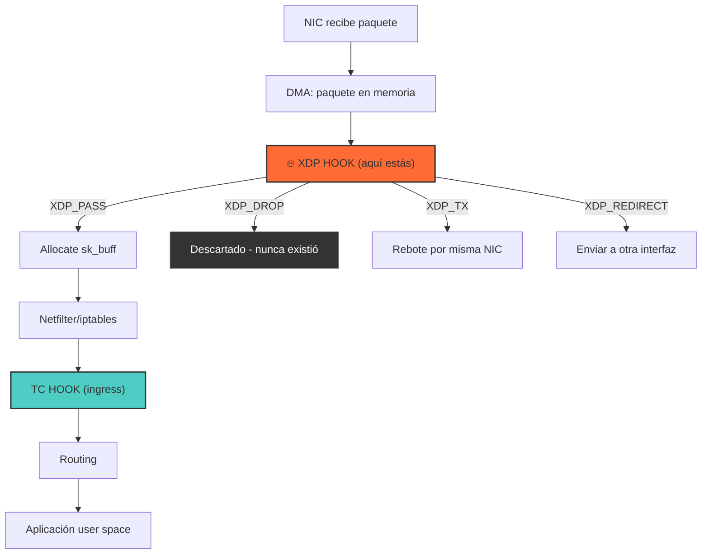
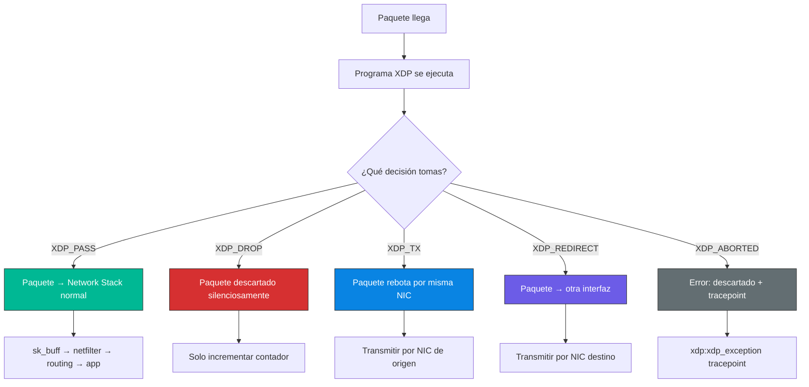
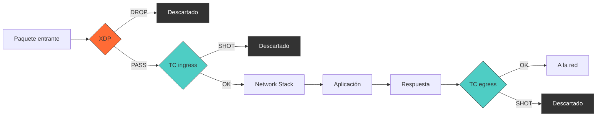

# Capítulo 10: XDP y TC — Networking a velocidad del kernel

> "Los paquetes de red no tienen tiempo para tu burocracia. XDP los intercepta antes de que el kernel siquiera se entere de que llegaron."

---

## Términos nuevos en este capítulo

- **XDP** (ex-di-pi) — eXpress Data Path. Hook de procesamiento de paquetes que se ejecuta en el driver de la NIC, antes de que el paquete entre al network stack del kernel. El punto más temprano donde puedes tocar un paquete.
- **TC** (ti-si) — Traffic Control. Subsistema del kernel Linux para controlar el tráfico de red. Permite adjuntar programas eBPF como filtros en ingress o egress.
- **xdp_md** (ex-di-pi em-di) — estructura de contexto que recibe un programa XDP. Contiene punteros al inicio y fin del paquete, y metadata como el índice de la interfaz de red.
- **sk_buff** (es-ká-baf) — socket buffer, la estructura central del networking en Linux. Los programas TC reciben un `__sk_buff` que es una vista eBPF-safe de esta estructura.
- **XDP_PASS** — acción XDP que deja pasar el paquete al network stack normal. "Adelante, pasa."
- **XDP_DROP** — acción XDP que descarta el paquete silenciosamente. No llega a ningún lado. Muere ahí.
- **XDP_TX** — acción XDP que rebota el paquete por la misma interfaz por la que entró. Útil para respuestas rápidas.
- **XDP_REDIRECT** — acción XDP que envía el paquete a otra interfaz de red o a un socket AF_XDP.
- **XDP_ABORTED** — acción XDP que indica un error en el programa. El paquete se descarta y se genera un tracepoint para debugging.
- **bounds checking** (báunds chéking) — verificación de que un puntero no excede los límites del paquete. Obligatorio en XDP antes de leer cualquier byte.
- **ingress** (íngrés) — tráfico que entra a una interfaz de red. La dirección "paquete que llega."
- **egress** (ígrés) — tráfico que sale por una interfaz de red. La dirección "paquete que se va."

## Objetivos

Al terminar este capítulo vas a poder:

1. Escribir programas XDP que procesen paquetes antes del network stack
2. Usar TC (Traffic Control) para filtrado de tráfico en ingress y egress
3. Parsear headers de paquetes (Ethernet, IP, TCP/UDP) en eBPF de forma segura

## Prerrequisitos

- Haber escrito programas eBPF con maps y helpers (Capítulos 6 y 8)
- Entender las reglas del verifier y bounds checking (Capítulo 7)
- Tener el lab funcional con cilium/ebpf (Capítulo 3)
- Conocimiento básico de networking: qué es una IP, un puerto, TCP vs UDP

---

## 10.1 XDP — El fast path más rápido que existe

Imagina que eres un paquete de red. Acabas de llegar a la NIC (Network Interface Card) de un servidor. En un kernel Linux normal, tu viaje es largo:

1. La NIC te copia a memoria (DMA)
2. El driver te empaqueta en un `sk_buff`
3. Pasas por el network stack del kernel (netfilter, routing, conntrack...)
4. Finalmente llegas a la aplicación en user space

Ese viaje tiene **miles de instrucciones** de overhead. Para la mayoría del tráfico está bien. Pero cuando necesitas decidir el destino de **millones de paquetes por segundo** — load balancing, firewalling, DDoS mitigation — cada nanosegundo cuenta.

XDP corta ese viaje en el punto más temprano posible: **antes del paso 2**. Tu programa se ejecuta en el driver, antes de que el paquete tenga un `sk_buff`, antes de que el network stack siquiera sepa que llegó algo.

### ¿Dónde exactamente se ejecuta XDP?



<!-- [INSERTA IMAGEN AQUI: Diagrama detallado del network stack de Linux mostrando la posición exacta de XDP (pre-stack, en el driver) y TC (post-stack, después de netfilter). Incluir el flujo completo desde la NIC hasta user space.] -->

Fíjate en la posición. XDP está **antes** de todo. Antes de netfilter, antes de iptables, antes de conntrack, antes de routing. Esa es la razón de su velocidad brutal: no hay nada por debajo excepto el hardware.

### Modos de XDP

XDP puede operar en tres modos, dependiendo del soporte del hardware:

| Modo | Dónde corre | Performance | Soporte |
|------|-------------|-------------|---------|
| **Native** | En el driver de la NIC | Óptimo (~24M pps) | Drivers específicos |
| **Generic** | En el network stack (fallback) | Más lento | Cualquier NIC |
| **Offload** | En el hardware de la NIC | Máximo posible | NICs muy específicas (Netronome) |

**Native** es el modo por defecto cuando el driver lo soporta. Los drivers principales ya lo implementan: `i40e` (Intel), `mlx5` (Mellanox/NVIDIA), `ixgbe` (Intel 10G), `virtio_net` (máquinas virtuales), `veth` (containers).

**Generic** es el fallback: funciona en cualquier interfaz pero pierde la ventaja principal (corre más tarde en el stack). Es útil para development y testing.

**Offload** es ciencia ficción para la mayoría — solo NICs Netronome/Agilio lo soportan. Tu programa eBPF se ejecuta literalmente en el firmware de la NIC.

### Tu primer programa XDP

El programa XDP más simple del mundo: dejar pasar todo.

```c
//go:build ignore

#include <linux/bpf.h>
#include <bpf/bpf_helpers.h>

SEC("xdp")
int xdp_pass(struct xdp_md *ctx) {
    return XDP_PASS;
}

char LICENSE[] SEC("license") = "GPL";
```

No hace nada útil, pero te muestra la estructura mínima:

1. La sección se llama `"xdp"` — eso le dice al loader qué tipo de programa es
2. Recibes un `struct xdp_md *ctx` — tu ventana al paquete
3. Retornas una acción — `XDP_PASS` deja el paquete continuar

### La estructura xdp_md

```c
struct xdp_md {
    __u32 data;          // Puntero al inicio del paquete
    __u32 data_end;      // Puntero al final del paquete
    __u32 data_meta;     // Metadata (para pasar info al network stack)
    __u32 ingress_ifindex;  // Interfaz por donde entró
    __u32 rx_queue_index;   // Número de cola RX
};
```

Los campos `data` y `data_end` son los que más vas a usar. Definen el rango de memoria donde vive tu paquete. **Todo** el parseo de paquetes se reduce a:

1. Calcular punteros dentro del rango `[data, data_end)`
2. Verificar que el puntero + tamaño del header no exceda `data_end`
3. Leer los campos del header

### Cargando un programa XDP con Go

```go
package main

import (
    "fmt"
    "log"
    "net"
    "os"
    "os/signal"

    "github.com/cilium/ebpf/link"
    "github.com/cilium/ebpf/rlimit"
)

//go:generate go run github.com/cilium/ebpf/cmd/bpf2go -target amd64 xdp xdp_pass.bpf.c

func main() {
    if err := rlimit.RemoveMemlock(); err != nil {
        log.Fatal(err)
    }

    objs := xdpObjects{}
    if err := loadXdpObjects(&objs, nil); err != nil {
        log.Fatalf("cargando objetos: %v", err)
    }
    defer objs.Close()

    // Buscar la interfaz
    iface, err := net.InterfaceByName("eth0")
    if err != nil {
        log.Fatalf("interfaz no encontrada: %v", err)
    }

    // Adjuntar el programa XDP
    l, err := link.AttachXDP(link.XDPOptions{
        Program:   objs.XdpPass,
        Interface: iface.Index,
    })
    if err != nil {
        log.Fatalf("adjuntando XDP: %v", err)
    }
    defer l.Close()

    fmt.Printf("XDP adjuntado a %s (ifindex %d). Ctrl+C para salir.\n",
        iface.Name, iface.Index)

    sig := make(chan os.Signal, 1)
    signal.Notify(sig, os.Interrupt)
    <-sig

    fmt.Println("Desadjuntando...")
}
```

> ⚙️ **Nota técnica**: `link.AttachXDP` usa el modo native por defecto. Si tu driver no lo soporta, va a fallar. Para testing en una VM o con drivers sin soporte nativo, puedes usar `link.XDPOptions{Flags: link.XDPGenericMode}` para forzar modo generic.

---

## 10.2 Acciones XDP — PASS, DROP, TX, REDIRECT, ABORTED

Cada programa XDP termina retornando una acción que le dice al kernel qué hacer con el paquete. Son solo 5 opciones. Simple. Brutal.

### XDP_PASS — "Adelante, pasa"

```c
return XDP_PASS;
```

El paquete continúa su viaje normal por el network stack. Es como si tu programa no existiera. Lo usas cuando inspeccionas el paquete y decides que no necesita tratamiento especial.

### XDP_DROP — "Muere aquí"

```c
return XDP_DROP;
```

El paquete se descarta **inmediatamente**. Sin `sk_buff` allocation, sin notificaciones, sin nada. Es como si el paquete nunca hubiera existido. Esto es lo que hace XDP tan letal para DDoS mitigation — puedes descartar millones de paquetes por segundo sin que el kernel sude.

### XDP_TX — "Rebota por donde viniste"

```c
return XDP_TX;
```

El paquete se transmite de vuelta por la **misma interfaz** por la que llegó. Es útil para:
- Respuestas rápidas (SYN cookies, ARP replies)
- Hairpin routing
- Testing (rebota paquetes al sender)

Importante: si modificas el paquete antes de retornar `XDP_TX`, se transmite con las modificaciones. Puedes swapear MAC addresses y usar esto como un reflector de red.

### XDP_REDIRECT — "Ve a otra parte"

```c
return bpf_redirect(ifindex, 0);
```

Envía el paquete a **otra interfaz** de red. Es la base de:
- Load balancers (enviar a backend específico)
- Routers (forwarding entre interfaces)
- AF_XDP (bypass del kernel hacia user space con zero-copy)

Con `bpf_redirect_map` y un `DEVMAP`, puedes mantener una tabla de routing y hacer forwarding eficiente entre múltiples interfaces.

### XDP_ABORTED — "Algo salió mal"

```c
return XDP_ABORTED;
```

Indica que hubo un error en tu programa. El paquete se descarta (como `XDP_DROP`) pero además se genera un tracepoint `xdp:xdp_exception` para que puedas debuggear. Nunca retornes esto intencionalmente — es para casos de error.

### Diagrama de decisiones XDP



### Ejemplo: un drop counter

Un programa XDP que cuenta paquetes descartados vs aceptados:

```c
//go:build ignore

#include <linux/bpf.h>
#include <linux/if_ether.h>
#include <linux/ip.h>
#include <bpf/bpf_helpers.h>
#include <bpf/bpf_endian.h>

// Index 0 = passed, 1 = dropped
struct {
    __uint(type, BPF_MAP_TYPE_ARRAY);
    __uint(max_entries, 2);
    __type(key, __u32);
    __type(value, __u64);
} pkt_count SEC(".maps");

static __always_inline void count_action(__u32 action) {
    __u64 *count = bpf_map_lookup_elem(&pkt_count, &action);
    if (count)
        __sync_fetch_and_add(count, 1);
}

SEC("xdp")
int xdp_firewall(struct xdp_md *ctx) {
    void *data = (void *)(long)ctx->data;
    void *data_end = (void *)(long)ctx->data_end;

    struct ethhdr *eth = data;
    if ((void *)(eth + 1) > data_end) {
        count_action(1);
        return XDP_DROP;
    }

    // Solo procesar IPv4
    if (eth->h_proto != bpf_htons(ETH_P_IP)) {
        count_action(0);
        return XDP_PASS;
    }

    struct iphdr *ip = (void *)(eth + 1);
    if ((void *)(ip + 1) > data_end) {
        count_action(1);
        return XDP_DROP;
    }

    // Ejemplo: dropear ICMP (ping)
    if (ip->protocol == 1) { // ICMP = protocolo 1
        count_action(1);
        return XDP_DROP;
    }

    count_action(0);
    return XDP_PASS;
}

char LICENSE[] SEC("license") = "GPL";
```

Si cargas este programa y haces `ping` al servidor, los pings van a desaparecer en el vacío. Silenciosamente. Sin ICMP unreachable, sin timeout explícito por un rato — simplemente no llegan a ninguna parte.

> 💡 **Analogía**: XDP es un portero de discoteca. Está parado en la puerta (el driver de la NIC) con una lista. Cuando llegas (paquete), te mira de arriba a abajo (parsea headers) y decide: "Pasa" (`XDP_PASS`), "Fuera de aquí" (`XDP_DROP`), "Vuelve por donde viniste" (`XDP_TX`), o "Ve al bar de al lado" (`XDP_REDIRECT`). Todo esto pasa **antes** de que entres al local (network stack). Si el portero es eficiente, puede rechazar a miles por segundo sin que se forme cola adentro.

---

## 10.3 TC (Traffic Control) — Filtrado después del network stack

TC es el otro punto donde puedes adjuntar programas eBPF para procesar paquetes. Pero a diferencia de XDP, TC trabaja **después** de que el paquete ya pasó por parte del stack.

### ¿Por qué TC si ya tenemos XDP?

Porque XDP tiene limitaciones:

1. **Solo ingress**: XDP solo intercepta paquetes que **llegan**. No puedes filtrar tráfico de salida con XDP.
2. **Sin sk_buff**: XDP ve bytes crudos. No tiene acceso a metadata del socket, conexión, o proceso asociado.
3. **Sin modificar después del stack**: Si necesitas actuar sobre paquetes después de routing (por ejemplo, para NAT), XDP no te sirve.

TC cubre todos esos huecos:

| Capacidad | XDP | TC |
|-----------|:---:|:---:|
| Ingress (paquetes entrantes) | ✅ | ✅ |
| Egress (paquetes salientes) | ❌ | ✅ |
| Acceso a sk_buff metadata | ❌ | ✅ |
| Antes del network stack | ✅ | ❌ |
| Después de routing | ❌ | ✅ |
| Velocidad de procesamiento | 🚀🚀🚀 | 🚀🚀 |
| Modificar y reenviar | ✅ | ✅ |

### La estructura __sk_buff

En TC, tu programa recibe un `struct __sk_buff *skb`:

```c
struct __sk_buff {
    __u32 len;           // Longitud total del paquete
    __u32 pkt_type;      // Tipo de paquete (host, broadcast, multicast...)
    __u32 mark;          // Mark del paquete (para interactuar con iptables)
    __u32 queue_mapping; // Cola TX
    __u32 protocol;      // Protocolo L3 (ETH_P_IP, ETH_P_IPV6...)
    __u32 vlan_present;  // ¿Tiene tag VLAN?
    __u32 vlan_tci;      // Tag VLAN
    __u32 cb[5];         // Control block — espacio libre para tu metadata
    __u32 hash;          // Hash del paquete
    __u32 tc_classid;    // Class ID para traffic shaping
    __u32 data;          // Puntero al inicio del paquete
    __u32 data_end;      // Puntero al final del paquete
    __u32 ifindex;       // Interfaz por donde llegó/sale
    // ... más campos
};
```

`__sk_buff` es mucho más rico que `xdp_md`. Tienes acceso al `mark` (para interactuar con iptables/nftables), al protocolo ya parseado, a metadata VLAN, y al control block donde puedes almacenar datos entre tu programa TC y otros puntos del stack.

### Acciones TC

Los programas TC retornan una de estas acciones:

| Acción | Valor | Significado |
|--------|-------|-------------|
| `TC_ACT_OK` | 0 | Dejar pasar (equivalente a XDP_PASS) |
| `TC_ACT_SHOT` | 2 | Descartar (equivalente a XDP_DROP) |
| `TC_ACT_REDIRECT` | 7 | Redirigir a otra interfaz |
| `TC_ACT_PIPE` | 3 | Pasar al siguiente filtro en la cadena |
| `TC_ACT_STOLEN` | 4 | El programa "se quedó" con el paquete |

### Un programa TC básico

```c
//go:build ignore

#include <linux/bpf.h>
#include <linux/pkt_cls.h>
#include <linux/if_ether.h>
#include <linux/ip.h>
#include <linux/tcp.h>
#include <bpf/bpf_helpers.h>
#include <bpf/bpf_endian.h>

SEC("classifier")
int tc_filter(struct __sk_buff *skb) {
    void *data = (void *)(long)skb->data;
    void *data_end = (void *)(long)skb->data_end;

    // Parsear Ethernet
    struct ethhdr *eth = data;
    if ((void *)(eth + 1) > data_end)
        return TC_ACT_OK;

    // Solo IPv4
    if (eth->h_proto != bpf_htons(ETH_P_IP))
        return TC_ACT_OK;

    // Parsear IP
    struct iphdr *ip = (void *)(eth + 1);
    if ((void *)(ip + 1) > data_end)
        return TC_ACT_OK;

    // Solo TCP
    if (ip->protocol != IPPROTO_TCP)
        return TC_ACT_OK;

    // Parsear TCP
    struct tcphdr *tcp = (void *)ip + (ip->ihl * 4);
    if ((void *)(tcp + 1) > data_end)
        return TC_ACT_OK;

    // Bloquear tráfico al puerto 8080
    if (bpf_ntohs(tcp->dest) == 8080) {
        bpf_printk("TC: bloqueando paquete a puerto 8080");
        return TC_ACT_SHOT;
    }

    return TC_ACT_OK;
}

char LICENSE[] SEC("license") = "GPL";
```

### Adjuntando TC con Go

```go
package main

import (
    "fmt"
    "log"
    "net"
    "os"
    "os/signal"

    "github.com/cilium/ebpf"
    "github.com/cilium/ebpf/rlimit"
    "github.com/vishvananda/netlink"
    "golang.org/x/sys/unix"
)

//go:generate go run github.com/cilium/ebpf/cmd/bpf2go -target amd64 tc tc_filter.bpf.c

func main() {
    if err := rlimit.RemoveMemlock(); err != nil {
        log.Fatal(err)
    }

    objs := tcObjects{}
    if err := loadTcObjects(&objs, nil); err != nil {
        log.Fatalf("cargando objetos: %v", err)
    }
    defer objs.Close()

    // Obtener la interfaz
    iface, err := net.InterfaceByName("eth0")
    if err != nil {
        log.Fatal(err)
    }

    // Crear qdisc clsact (requerido para TC eBPF)
    link, err := netlink.LinkByIndex(iface.Index)
    if err != nil {
        log.Fatal(err)
    }

    qdisc := &netlink.GenericQdisc{
        QdiscAttrs: netlink.QdiscAttrs{
            LinkIndex: link.Attrs().Index,
            Handle:    netlink.MakeHandle(0xffff, 0),
            Parent:    netlink.HANDLE_CLSACT,
        },
        QdiscType: "clsact",
    }
    if err := netlink.QdiscAdd(qdisc); err != nil {
        log.Printf("qdisc ya existe o error: %v", err)
    }

    // Adjuntar el filtro en ingress
    filter := &netlink.BpfFilter{
        FilterAttrs: netlink.FilterAttrs{
            LinkIndex: link.Attrs().Index,
            Parent:    netlink.HANDLE_MIN_INGRESS,
            Handle:    1,
            Protocol:  unix.ETH_P_ALL,
        },
        Fd:           objs.TcFilter.FD(),
        Name:         "tc_filter",
        DirectAction: true,
    }

    if err := netlink.FilterAdd(filter); err != nil {
        log.Fatalf("adjuntando filtro TC: %v", err)
    }

    fmt.Printf("TC filtro adjuntado a %s (ingress). Ctrl+C para salir.\n",
        iface.Name)

    sig := make(chan os.Signal, 1)
    signal.Notify(sig, os.Interrupt)
    <-sig

    // Cleanup
    netlink.FilterDel(filter)
    netlink.QdiscDel(qdisc)
    fmt.Println("Limpieza completada.")
}
```

> ⚙️ **Nota técnica**: TC requiere crear un qdisc `clsact` en la interfaz antes de poder adjuntar filtros eBPF. El qdisc es la "cola" donde viven tus filtros. `clsact` es un qdisc especial diseñado exactamente para esto — no hace traffic shaping por sí mismo, solo provee los hooks de ingress y egress para programas eBPF.

### TC en egress — Filtrando tráfico de salida

Para filtrar paquetes **salientes**, solo cambias el `Parent` a egress:

```go
filter := &netlink.BpfFilter{
    FilterAttrs: netlink.FilterAttrs{
        LinkIndex: link.Attrs().Index,
        Parent:    netlink.HANDLE_MIN_EGRESS,  // <-- egress
        Handle:    1,
        Protocol:  unix.ETH_P_ALL,
    },
    Fd:           objs.TcEgressFilter.FD(),
    Name:         "tc_egress",
    DirectAction: true,
}
```

Esto es algo que XDP **no puede hacer**. Si necesitas inspeccionar o filtrar tráfico de salida (exfiltración de datos, rate limiting de responses, etc.), TC es tu única opción a nivel de paquete en eBPF.

---

## 10.4 Parseando paquetes — Ethernet → IP → TCP/UDP byte por byte

Aquí es donde la cosa se pone real. Los paquetes de red son bytes crudos — no hay magia que los parsee por ti. Tienes que hacerlo manualmente, header por header, validando bounds en cada paso.

### La regla de oro del parseo en XDP/TC

> 🔥 **Advertencia**: En XDP, un pointer que se sale del paquete = verifier reject. Siempre valida bounds antes de leer. Esta no es una sugerencia. Es la ley. Cada vez que avanzas tu puntero al siguiente header, **debes** verificar que `puntero + sizeof(header) <= data_end`. Si no lo haces, el verifier te rechaza. Sin excepciones. Sin piedad.

### Anatomía de un paquete

Un paquete TCP/IP típico se ve así en memoria:

```
┌──────────────────────────────────────────────────────────────────┐
│  Ethernet Header (14 bytes)                                       │
│  ┌─────────┬─────────┬──────────┐                                │
│  │ dst MAC │ src MAC │ EtherType│                                │
│  │ 6 bytes │ 6 bytes │ 2 bytes  │                                │
│  └─────────┴─────────┴──────────┘                                │
├──────────────────────────────────────────────────────────────────┤
│  IP Header (20 bytes mínimo, variable con options)                │
│  ┌────┬────┬─────┬──────┬─────┬─────┬──────┬────────┬────┬─────┐│
│  │ver │ihl │tos  │tot_len│ id │frag │ ttl  │protocol│csum│addrs││
│  │4bit│4bit│8bit │16 bit │16b │16b  │ 8bit │  8bit  │16b │ 8B  ││
│  └────┴────┴─────┴──────┴─────┴─────┴──────┴────────┴────┴─────┘│
├──────────────────────────────────────────────────────────────────┤
│  TCP Header (20 bytes mínimo)                                     │
│  ┌────────┬────────┬─────┬─────┬──────────┬─────────┬──────────┐│
│  │src port│dst port│ seq │ ack │data offset│  flags  │  window  ││
│  │ 16 bit │ 16 bit │32b  │32b  │   4 bit  │  8 bit  │  16 bit  ││
│  └────────┴────────┴─────┴─────┴──────────┴─────────┴──────────┘│
├──────────────────────────────────────────────────────────────────┤
│  Payload (datos de la aplicación)                                 │
└──────────────────────────────────────────────────────────────────┘
```

<!-- [INSERTA IMAGEN AQUI: Diagrama visual de la estructura de un paquete TCP/IP con los offsets exactos de cada campo, coloreado por capa (L2=verde, L3=azul, L4=naranja, payload=gris)] -->

### El patrón de parseo paso a paso

```c
//go:build ignore

#include <linux/bpf.h>
#include <linux/if_ether.h>
#include <linux/ip.h>
#include <linux/tcp.h>
#include <linux/udp.h>
#include <bpf/bpf_helpers.h>
#include <bpf/bpf_endian.h>

SEC("xdp")
int parse_packet(struct xdp_md *ctx) {
    void *data = (void *)(long)ctx->data;
    void *data_end = (void *)(long)ctx->data_end;

    // ═══════════════════════════════════════════
    // PASO 1: Parsear Ethernet header
    // ═══════════════════════════════════════════
    struct ethhdr *eth = data;

    // Bounds check: ¿hay espacio para un header Ethernet completo?
    if ((void *)(eth + 1) > data_end)
        return XDP_DROP;

    // ¿Es IPv4?
    if (eth->h_proto != bpf_htons(ETH_P_IP))
        return XDP_PASS;  // No es IP, dejar pasar

    // ═══════════════════════════════════════════
    // PASO 2: Parsear IP header
    // ═══════════════════════════════════════════
    struct iphdr *ip = (void *)(eth + 1);

    // Bounds check: ¿hay espacio para el header IP?
    if ((void *)(ip + 1) > data_end)
        return XDP_DROP;

    // Extraer info útil
    __u32 src_ip = ip->saddr;
    __u32 dst_ip = ip->daddr;
    __u8  proto  = ip->protocol;

    // El header IP tiene tamaño variable (ihl = IP Header Length en words de 4 bytes)
    __u32 ip_hdr_len = ip->ihl * 4;
    if (ip_hdr_len < sizeof(struct iphdr))
        return XDP_DROP;  // Header inválido

    // ═══════════════════════════════════════════
    // PASO 3: Parsear L4 (TCP o UDP)
    // ═══════════════════════════════════════════
    void *l4_hdr = (void *)ip + ip_hdr_len;

    if (proto == IPPROTO_TCP) {
        struct tcphdr *tcp = l4_hdr;
        if ((void *)(tcp + 1) > data_end)
            return XDP_DROP;

        __u16 src_port = bpf_ntohs(tcp->source);
        __u16 dst_port = bpf_ntohs(tcp->dest);

        bpf_printk("TCP: %pI4:%d -> %pI4:%d",
                   &src_ip, src_port, &dst_ip, dst_port);

    } else if (proto == IPPROTO_UDP) {
        struct udphdr *udp = l4_hdr;
        if ((void *)(udp + 1) > data_end)
            return XDP_DROP;

        __u16 src_port = bpf_ntohs(udp->source);
        __u16 dst_port = bpf_ntohs(udp->dest);

        bpf_printk("UDP: %pI4:%d -> %pI4:%d",
                   &src_ip, src_port, &dst_ip, dst_port);
    }

    return XDP_PASS;
}

char LICENSE[] SEC("license") = "GPL";
```

### Desglose de las validaciones

Cada `if ((void *)(ptr + 1) > data_end)` es un **bounds check** obligatorio. Vamos a desglosar qué hace cada uno:

**Check 1 — Ethernet:**
```c
struct ethhdr *eth = data;
if ((void *)(eth + 1) > data_end)
    return XDP_DROP;
```
"¿Hay al menos 14 bytes (tamaño de `struct ethhdr`) disponibles desde el inicio del paquete?" Si el paquete es más corto que un header Ethernet, algo está muy mal.

**Check 2 — IP:**
```c
struct iphdr *ip = (void *)(eth + 1);
if ((void *)(ip + 1) > data_end)
    return XDP_DROP;
```
"Después del header Ethernet, ¿hay al menos 20 bytes (tamaño mínimo de `struct iphdr`) disponibles?" El `(eth + 1)` te posiciona justo después del header Ethernet (que es donde empieza IP).

**Check 3 — TCP/UDP:**
```c
struct tcphdr *tcp = l4_hdr;
if ((void *)(tcp + 1) > data_end)
    return XDP_DROP;
```
"Después del header IP (considerando su longitud variable), ¿hay espacio para un header TCP?"

### La aritmética de punteros y el verifier

El truco está en la aritmética `(ptr + 1)`. Cuando haces `eth + 1`, el compilador sabe que `eth` es un `struct ethhdr *`, así que `eth + 1` avanza `sizeof(struct ethhdr)` bytes (14 bytes). Estás preguntando: "¿el byte que viene justo después de este header cae dentro del paquete?"

Si la respuesta es **no** (`> data_end`), entonces el header no cabe completo en el paquete y no puedes leerlo de forma segura.

El verifier rastrea estas comparaciones. Después de un bounds check exitoso (es decir, si no tomaste el branch del `return`), el verifier **sabe** que todos los accesos a campos de esa estructura son seguros. Si intentas acceder a un campo sin el bounds check previo, te rechaza.

### Byte order: network vs host

Los protocolos de red usan **big-endian** (network byte order). Tu CPU probablemente usa **little-endian** (x86, ARM en modo LE). Las macros de conversión son:

| Macro | Dirección | Uso |
|-------|-----------|-----|
| `bpf_ntohs(x)` | Network → Host (16-bit) | Leer puertos |
| `bpf_ntohl(x)` | Network → Host (32-bit) | Leer IPs (para comparar) |
| `bpf_htons(x)` | Host → Network (16-bit) | Escribir puertos |
| `bpf_htonl(x)` | Host → Network (32-bit) | Escribir IPs |

```c
// Comparar EtherType (campo de 16 bits en network order)
if (eth->h_proto == bpf_htons(ETH_P_IP))  // ✅ Correcto

// Leer un puerto para imprimir (convertir a host order)
__u16 port = bpf_ntohs(tcp->dest);        // ✅ Correcto
```

> 🔥 **Advertencia**: Olvidar la conversión de byte order es un bug silencioso. Tu programa compila, pasa el verifier, se carga... y no filtra nada porque estás comparando `0x0008` (ETH_P_IP en little-endian) con `0x0800` (ETH_P_IP en big-endian). Siempre usa `bpf_htons`/`bpf_ntohs`.

### Helper inline para parseo reusable

En programas reales, encapsulas el parseo en funciones inline:

```c
struct pkt_headers {
    struct ethhdr *eth;
    struct iphdr  *ip;
    union {
        struct tcphdr *tcp;
        struct udphdr *udp;
    };
    __u8 l4_proto;
};

static __always_inline int parse_headers(struct xdp_md *ctx,
                                          struct pkt_headers *hdrs) {
    void *data = (void *)(long)ctx->data;
    void *data_end = (void *)(long)ctx->data_end;

    // Ethernet
    hdrs->eth = data;
    if ((void *)(hdrs->eth + 1) > data_end)
        return -1;

    if (hdrs->eth->h_proto != bpf_htons(ETH_P_IP))
        return -1;

    // IP
    hdrs->ip = (void *)(hdrs->eth + 1);
    if ((void *)(hdrs->ip + 1) > data_end)
        return -1;

    __u32 ip_hdr_len = hdrs->ip->ihl * 4;
    if (ip_hdr_len < sizeof(struct iphdr))
        return -1;

    void *l4 = (void *)hdrs->ip + ip_hdr_len;
    hdrs->l4_proto = hdrs->ip->protocol;

    // TCP
    if (hdrs->l4_proto == IPPROTO_TCP) {
        hdrs->tcp = l4;
        if ((void *)(hdrs->tcp + 1) > data_end)
            return -1;
    }
    // UDP
    else if (hdrs->l4_proto == IPPROTO_UDP) {
        hdrs->udp = l4;
        if ((void *)(hdrs->udp + 1) > data_end)
            return -1;
    }

    return 0;
}
```

Luego en tu programa principal:

```c
SEC("xdp")
int xdp_main(struct xdp_md *ctx) {
    struct pkt_headers hdrs = {};

    if (parse_headers(ctx, &hdrs) < 0)
        return XDP_PASS;

    // A partir de aquí, hdrs.ip, hdrs.tcp/udp están validados
    if (hdrs.l4_proto == IPPROTO_TCP &&
        bpf_ntohs(hdrs.tcp->dest) == 80) {
        // Tráfico HTTP...
    }

    return XDP_PASS;
}
```

> ⚙️ **Nota técnica**: El `__always_inline` es **obligatorio** para funciones auxiliares en programas BPF. Sin él, el compilador puede generar una función real que el verifier no puede analizar. Con `__always_inline`, el código se expande en línea y el verifier puede rastrear los bounds checks correctamente.

### Parseo de VLAN tags (802.1Q)

En redes con VLANs, hay 4 bytes extra entre Ethernet y IP:

```c
#include <linux/if_vlan.h>

static __always_inline int parse_eth_vlan(void *data, void *data_end,
                                           struct ethhdr **eth_out,
                                           __u16 *proto_out) {
    struct ethhdr *eth = data;
    if ((void *)(eth + 1) > data_end)
        return -1;

    __u16 proto = eth->h_proto;
    void *next = (void *)(eth + 1);

    // ¿Tiene VLAN tag?
    if (proto == bpf_htons(ETH_P_8021Q) ||
        proto == bpf_htons(ETH_P_8021AD)) {
        struct vlan_hdr *vhdr = next;
        if ((void *)(vhdr + 1) > data_end)
            return -1;
        proto = vhdr->h_vlan_encapsulated_proto;
        next = (void *)(vhdr + 1);
    }

    *eth_out = eth;
    *proto_out = proto;
    return 0;
}
```

---

## 10.5 XDP vs TC — Cuándo usar cada uno

Ahora que conoces ambos, la pregunta obvia: ¿cuándo uso XDP y cuándo TC? La respuesta es que no son competidores — son complementos. Cada uno tiene su lugar.

### Usa XDP cuando:

1. **Necesitas máxima velocidad en ingress** — DDoS mitigation, load balancing, packet filtering de alto volumen
2. **Puedes decidir con solo mirar el paquete** — no necesitas metadata del socket o el proceso
3. **Quieres descartar paquetes al costo mínimo** — `XDP_DROP` es órdenes de magnitud más barato que un `DROP` en iptables
4. **Operas en infraestructura de red** — load balancers, routers, firewalls perimetrales

### Usa TC cuando:

1. **Necesitas filtrar tráfico de salida (egress)** — XDP no puede hacer esto
2. **Necesitas acceso a metadata del sk_buff** — marks, prioridades, información de VLAN
3. **Quieres interactuar con iptables/nftables** — vía el campo `mark` del skb
4. **Necesitas actuar después de routing** — modificar paquetes según su destino final
5. **Tu interfaz no soporta XDP native** — TC siempre funciona

### Usa ambos cuando:

En infraestructura real, es común usar **ambos** en la misma interfaz:
- XDP en ingress: filtrado rápido, DROP de tráfico malicioso, load balancing
- TC en ingress: procesamiento más sofisticado del tráfico que XDP dejó pasar
- TC en egress: rate limiting, marking para QoS, auditoría de tráfico saliente



### Tabla de decisión rápida

| Escenario | Recomendación |
|-----------|---------------|
| Firewall de alto rendimiento (millones pps) | XDP |
| Bloquear IPs/puertos específicos | XDP (ingress) o TC (ingress/egress) |
| Load balancer L4 | XDP + REDIRECT |
| DDoS mitigation | XDP (DROP inmediato) |
| Rate limiting de respuestas | TC egress |
| NAT | TC (necesita metadata post-routing) |
| Marking para QoS/iptables | TC (acceso a skb->mark) |
| Filtro en container/pod networking | TC (veth pairs) |
| Monitoreo de tráfico saliente | TC egress |

### Performance: los números

Para darte una idea del impacto real, estos son números aproximados procesando paquetes de 64 bytes en una NIC de 10 Gbps:

| Método | Paquetes/segundo (drop) | Latencia por paquete |
|--------|-------------------------|---------------------|
| iptables DROP | ~2-3M pps | ~300-500 ns |
| TC eBPF DROP | ~5-8M pps | ~150-200 ns |
| XDP generic DROP | ~5-6M pps | ~180-250 ns |
| XDP native DROP | ~20-24M pps | ~40-50 ns |

XDP native es **10x más rápido** que iptables para descartar paquetes. Esa diferencia es la razón por la que Cloudflare, Meta, y otros gigantes migraron su infraestructura de firewalling a XDP.

> ☠️ **Cuidado**: Estos números son en condiciones ideales. En tu lab con una VM y modo generic, no vas a ver 24M pps. Pero la diferencia relativa se mantiene: XDP native > TC > iptables para decisiones simples de drop/pass.

---

## Ejercicio: Firewall XDP básico

📋 **Nivel:** Intermedio
📚 **Conceptos previos:** Maps hash (Cap 6), bounds checking (Cap 7), helpers de maps (Cap 8)
🖥️ **Entorno:** Lab con Docker/Vagrant del Capítulo 3
🎯 **Problema:** Implementar un firewall XDP que bloquee tráfico entrante de IPs específicas usando un hash map como blocklist

### Contexto

Tienes un servidor que recibe tráfico de diversas fuentes. Quieres bloquear IPs específicas **antes** de que los paquetes lleguen al network stack. El blocklist se configura desde user space (puedes agregar y remover IPs en caliente).

### Esqueleto del programa BPF

```c
//go:build ignore

#include <linux/bpf.h>
#include <linux/if_ether.h>
#include <linux/ip.h>
#include <bpf/bpf_helpers.h>
#include <bpf/bpf_endian.h>

// Map que contiene las IPs bloqueadas
// Key: IP en network byte order (__u32)
// Value: contador de paquetes dropeados (__u64)
struct {
    __uint(type, BPF_MAP_TYPE_HASH);
    __uint(max_entries, 1024);
    __type(key, __u32);
    __type(value, __u64);
} blocklist SEC(".maps");

// Map de estadísticas: index 0 = passed, index 1 = dropped
struct {
    __uint(type, BPF_MAP_TYPE_ARRAY);
    __uint(max_entries, 2);
    __type(key, __u32);
    __type(value, __u64);
} stats SEC(".maps");

SEC("xdp")
int xdp_firewall(struct xdp_md *ctx) {
    void *data = (void *)(long)ctx->data;
    void *data_end = (void *)(long)ctx->data_end;

    // ─── PASO 1: Parsear Ethernet header ───────────────────
    struct ethhdr *eth = data;
    if ((void *)(eth + 1) > data_end)
        return XDP_DROP;

    // Solo IPv4
    if (eth->h_proto != bpf_htons(ETH_P_IP))
        return XDP_PASS;

    // ─── PASO 2: Parsear IP header ────────────────────────
    struct iphdr *ip = (void *)(eth + 1);
    if ((void *)(ip + 1) > data_end)
        return XDP_DROP;

    // ─── PASO 3: TU CÓDIGO AQUÍ ──────────────────────────
    // TODO: Obtener la IP de origen del paquete
    // TODO: Buscar la IP en el map "blocklist"
    // TODO: Si está en la blocklist:
    //         - Incrementar el contador de drops en "stats" (index 1)
    //         - Incrementar el contador por IP en "blocklist"
    //         - Retornar XDP_DROP
    // TODO: Si NO está en la blocklist:
    //         - Incrementar el contador de passed en "stats" (index 0)
    //         - Retornar XDP_PASS

    return XDP_PASS; // Placeholder — reemplazar con tu lógica
}

char LICENSE[] SEC("license") = "GPL";
```

### Esqueleto del loader en Go

```go
package main

import (
    "encoding/binary"
    "fmt"
    "log"
    "net"
    "os"
    "os/signal"
    "time"

    "github.com/cilium/ebpf"
    "github.com/cilium/ebpf/link"
    "github.com/cilium/ebpf/rlimit"
)

//go:generate go run github.com/cilium/ebpf/cmd/bpf2go -target amd64 firewall xdp_firewall.bpf.c

func ipToU32(ip net.IP) uint32 {
    ip = ip.To4()
    return binary.BigEndian.Uint32(ip)
}

func main() {
    if err := rlimit.RemoveMemlock(); err != nil {
        log.Fatal(err)
    }

    objs := firewallObjects{}
    if err := loadFirewallObjects(&objs, nil); err != nil {
        log.Fatalf("cargando objetos: %v", err)
    }
    defer objs.Close()

    // IPs a bloquear (configurable)
    blockedIPs := []string{
        "192.168.1.100",
        "10.0.0.50",
        // TODO: Agregar IPs según tu escenario de prueba
    }

    // Poblar la blocklist
    for _, ipStr := range blockedIPs {
        ip := net.ParseIP(ipStr)
        if ip == nil {
            log.Printf("IP inválida: %s", ipStr)
            continue
        }
        key := ipToU32(ip)
        var value uint64 = 0
        if err := objs.Blocklist.Put(key, value); err != nil {
            log.Printf("error agregando %s: %v", ipStr, err)
        } else {
            fmt.Printf("Bloqueada: %s\n", ipStr)
        }
    }

    // Adjuntar a la interfaz
    iface, err := net.InterfaceByName("eth0")
    if err != nil {
        log.Fatal(err)
    }

    l, err := link.AttachXDP(link.XDPOptions{
        Program:   objs.XdpFirewall,
        Interface: iface.Index,
    })
    if err != nil {
        log.Fatalf("adjuntando XDP: %v", err)
    }
    defer l.Close()

    fmt.Printf("Firewall XDP activo en %s. Ctrl+C para salir.\n", iface.Name)

    // Mostrar stats cada 2 segundos
    sig := make(chan os.Signal, 1)
    signal.Notify(sig, os.Interrupt)

    ticker := time.NewTicker(2 * time.Second)
    defer ticker.Stop()

    for {
        select {
        case <-ticker.C:
            var passed, dropped uint64
            keyPass := uint32(0)
            keyDrop := uint32(1)
            objs.Stats.Lookup(keyPass, &passed)
            objs.Stats.Lookup(keyDrop, &dropped)
            fmt.Printf("Stats: passed=%d dropped=%d\n", passed, dropped)
        case <-sig:
            fmt.Println("\nSaliendo...")
            return
        }
    }
}
```

### Criterios de éxito

- [ ] El programa se carga sin errores del verifier
- [ ] Se adjunta a la interfaz de red exitosamente
- [ ] Paquetes de IPs en la blocklist son descartados (no llegan a la app)
- [ ] Paquetes de IPs no bloqueadas pasan normalmente
- [ ] Los contadores se actualizan correctamente (puedes verificar con el ticker de stats)
- [ ] Puedes agregar/remover IPs en caliente desde user space

### Pistas

1. La IP de origen está en `ip->saddr` — ya es un `__u32` en network byte order. No necesitas convertir antes de buscar en el map.
2. Para buscar en el map: `bpf_map_lookup_elem(&blocklist, &src_ip)`. Si retorna non-NULL, la IP está bloqueada.
3. Para incrementar contadores atómicamente, usa `__sync_fetch_and_add(pointer, 1)`.
4. No olvides que `bpf_map_lookup_elem` puede retornar NULL — el verifier te obliga a checkear antes de derreferenciar.

### Caso de prueba

```bash
# Terminal 1: Ejecutar el firewall
sudo ./firewall

# Terminal 2: Probar con ping desde la IP bloqueada
# (si la IP de tu máquina está en la blocklist)
ping <IP_del_servidor>
# Resultado esperado: 100% packet loss

# Terminal 3: Ver las stats
# Resultado esperado: el contador de "dropped" incrementa
```

<!-- [INSERTA IMAGEN AQUI: Captura de pantalla mostrando la ejecución del firewall XDP con el output de stats mostrando paquetes passed y dropped, y en otra terminal un ping fallando con 100% packet loss] -->

---

## Resumen

Lo que te llevas de este capítulo:

1. **XDP es el punto más temprano** donde puedes interceptar paquetes — antes del network stack, antes del `sk_buff`, en el driver mismo
2. **Las 5 acciones XDP** (PASS, DROP, TX, REDIRECT, ABORTED) son todo lo que necesitas para controlar el destino de un paquete
3. **TC complementa a XDP** — opera después del stack y soporta egress, algo que XDP no puede hacer
4. **El parseo de paquetes es manual** — Ethernet → IP → TCP/UDP, validando bounds en cada paso sin excepción
5. **Bounds checking es obligatorio** — `(ptr + 1) > data_end` antes de acceder a cualquier header, o el verifier te rechaza
6. **Byte order importa** — `bpf_htons`/`bpf_ntohs` para convertir entre network order y host order
7. **XDP para velocidad bruta, TC para flexibilidad** — en producción, muchas veces usas ambos juntos

---

## Para saber más

- 📖 [XDP Tutorial (xdp-project)](https://github.com/xdp-project/xdp-tutorial) — Tutorial completo con ejercicios progresivos de XDP
- 📖 [Documentación oficial de XDP en el kernel](https://www.kernel.org/doc/html/latest/networking/af_xdp.html) — Referencia de AF_XDP y modos de operación
- 📝 [How to drop 10 million packets per second (Cloudflare Blog)](https://blog.cloudflare.com/how-to-drop-10-million-packets/) — Comparativa real de métodos de drop incluyendo XDP
- 💻 [cilium/ebpf XDP examples](https://github.com/cilium/ebpf/tree/main/examples) — Ejemplos oficiales de XDP con cilium/ebpf en Go
- 📖 [TC BPF documentation](https://docs.cilium.io/en/latest/bpf/) — Documentación de Cilium sobre programas TC BPF
- 📝 [Facebook's Katran: a network load balancer](https://engineering.fb.com/2018/05/22/open-source/open-sourcing-katran-a-scalable-network-load-balancer/) — Caso de estudio real de XDP en producción
