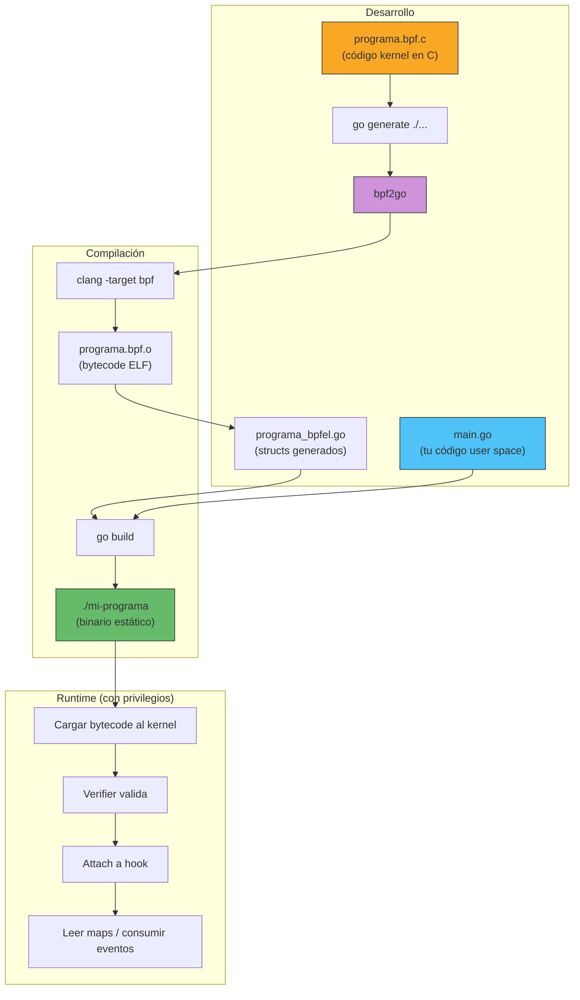
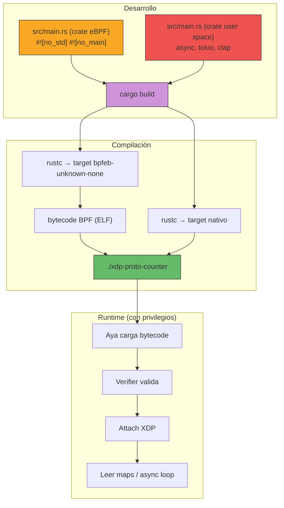

# Capítulo 11: Frameworks en acción — cilium/ebpf, Aya, y el ecosistema

> "La herramienta no escribe el programa. Tú lo escribes. La herramienta decide cuánto sufres en el proceso."

---

## Términos nuevos en este capítulo

- **cilium/ebpf** (sílium i-bi-pi-éf) — Biblioteca Go pura para interactuar con eBPF. Sin CGo, sin dependencias de libbpf. Es lo que usamos en todo este libro como framework principal de user space.
- **bpf2go** (bi-pi-éf-tu-gou) — Herramienta de generación de código del ecosistema cilium/ebpf. Compila tu C a bytecode BPF y genera structs Go type-safe que representan tus programas y maps.
- **Aya** (aya) — Framework eBPF en Rust puro. Permite escribir tanto el lado kernel como el user space en Rust, sin dependencia de libbpf ni clang.
- **libbpf** (lib-bi-pi-éf) — Biblioteca C oficial del kernel para cargar y gestionar programas eBPF. La referencia canónica que otros frameworks reimplementan o wrapean.
- **BCC** (bi-si-si) — BPF Compiler Collection. Toolkit que permite escribir programas BPF embebidos en scripts Python o C++. El abuelo del ecosistema eBPF, hoy semi-obsoleto para producción.
- **CO-RE** (cor) — Compile Once, Run Everywhere. Tecnología que permite que un programa BPF compilado corra en diferentes versiones del kernel sin recompilación. cilium/ebpf y libbpf lo soportan nativamente.
- **bpfeb-unknown-none** — Target de compilación de Rust para generar bytecode BPF. Es lo que Aya usa internamente para compilar el código kernel sin pasar por clang.
- **#![no_std]** (no-está-ndar) — Atributo de Rust que indica "no usar la biblioteca estándar". Obligatorio para código que corre en el kernel, donde no hay allocator ni filesystem.

## Objetivos

Al terminar este capítulo vas a poder:

1. Explicar por qué Go/cilium/ebpf es la elección pragmática para la mayoría de proyectos eBPF
2. Implementar un programa XDP completo con el workflow cilium/ebpf (C + Go + bpf2go)
3. Leer y entender la misma implementación en Aya/Rust
4. Ubicar libbpf y BCC en el ecosistema y saber cuándo (no) usarlos
5. Elegir framework según tu caso de uso con criterio técnico, no con hype

## Prerrequisitos

- Haber implementado programas XDP y usado maps (Capítulos 6 y 10)
- Entender el verifier y bounds checking (Capítulo 7)
- Tener el lab funcional con Go y cilium/ebpf (Capítulo 3)
- Familiaridad básica con la idea de Rust (no necesitas saber Rust para entender la comparación)

---

## 11.1 Por qué Go y cilium/ebpf son el framework principal de este libro

No fue una decisión al azar. No fue por popularidad. No fue porque Go sea "mejor" que Rust. Fue pragmatismo puro.

### El argumento en 30 segundos

El código BPF (lo que corre en el kernel) **siempre es C**. Eso no cambia con ningún framework excepto Aya. Lo que cambia es el **user space** — el loader, el consumer de eventos, la CLI. Y ahí, Go con cilium/ebpf ofrece:

1. **Cero CGo** — puro Go. No necesitas gcc, no linkeas contra libbpf, no peleas con paths de headers
2. **bpf2go genera structs type-safe** — tus maps y programas son tipos Go con autocompletado en el IDE
3. **Un binario estático** — `go build` y tienes un ejecutable que copias a cualquier máquina Linux
4. **Ecosistema de producción probado** — Cilium, Tetragon, Falco, Pixie, Hubble... todos usan esto
5. **Curva de aprendizaje real** — Go es un lenguaje que aprendes en un fin de semana si vienes de C/Python/Java

### Lo que NO estamos diciendo

No estamos diciendo que Go sea el lenguaje ideal para todo. No estamos diciendo que Rust sea malo. Estamos diciendo que para un **libro** que enseña eBPF, necesitas minimizar las batallas con el toolchain para maximizar el aprendizaje de los conceptos.

Si el lector tiene que instalar nightly Rust, configurar cross-compilation targets, y resolver errores del borrow checker antes de ver su primer paquete pasar por XDP... perdimos.

> 🔥 **Advertencia**: No hay un framework "mejor" para eBPF. Hay frameworks que se adaptan mejor a tu contexto: tu equipo, tu stack existente, tus restricciones de deployment. Si tu empresa ya tiene todo en Rust y tu equipo sueña en `impl Trait`, Aya es la respuesta obvia. Si tu equipo hace Go y quiere algo que funcione hoy sin drama, cilium/ebpf. Si eres un veterano de C y quieres control total, libbpf. La decisión es tuya, no nuestra.

### El workflow en cilium/ebpf



Ese es el flujo que has usado desde el Capítulo 4. Escribes C para el kernel, Go para user space, `bpf2go` genera el pegamento, y `go build` te da un binario listo para producción.

---

## 11.2 Programa de referencia en Go — Contador XDP por protocolo

Este es el programa que usaremos como benchmark de comparación entre frameworks. Es suficientemente simple para entenderlo de un vistazo, pero suficientemente real para mostrar las diferencias.

**Qué hace**: recibe paquetes en un hook XDP, parsea Ethernet + IP, clasifica el protocolo L4 (TCP, UDP, ICMP, otro), e incrementa un contador atómico en un array map. El user space lee esos contadores cada 2 segundos y los imprime.

> El código completo está en `code/cap11-frameworks/go/` y `code/cap11-frameworks/bpf/`.

### Lado kernel (C) — Siempre C, sin importar el framework

```c
#include <linux/bpf.h>
#include <linux/if_ether.h>
#include <linux/ip.h>
#include <bpf/bpf_helpers.h>
#include <bpf/bpf_endian.h>

#define PROTO_TCP   0
#define PROTO_UDP   1
#define PROTO_ICMP  2
#define PROTO_OTHER 3
#define MAX_PROTOS  4

// Array map: contadores por protocolo
struct {
    __uint(type, BPF_MAP_TYPE_ARRAY);
    __uint(max_entries, MAX_PROTOS);
    __type(key, __u32);
    __type(value, __u64);
} proto_stats SEC(".maps");

SEC("xdp")
int xdp_proto_counter(struct xdp_md *ctx) {
    void *data = (void *)(long)ctx->data;
    void *data_end = (void *)(long)ctx->data_end;

    // Parsear Ethernet
    struct ethhdr *eth = data;
    if ((void *)(eth + 1) > data_end)
        return XDP_PASS;

    if (eth->h_proto != bpf_htons(ETH_P_IP))
        return XDP_PASS;

    // Parsear IP
    struct iphdr *ip = (void *)(eth + 1);
    if ((void *)(ip + 1) > data_end)
        return XDP_PASS;

    // Clasificar protocolo
    __u32 proto_idx;
    switch (ip->protocol) {
    case 6:  proto_idx = PROTO_TCP;   break;
    case 17: proto_idx = PROTO_UDP;   break;
    case 1:  proto_idx = PROTO_ICMP;  break;
    default: proto_idx = PROTO_OTHER; break;
    }

    // Incrementar contador
    __u64 *count = bpf_map_lookup_elem(&proto_stats, &proto_idx);
    if (count)
        __sync_fetch_and_add(count, 1);

    return XDP_PASS;
}

char LICENSE[] SEC("license") = "GPL";
```

Nada nuevo aquí si vienes del Capítulo 10. Parseo estándar, bounds checking, switch por protocolo, incremento atómico.

### Lado user space (Go) — El loader cilium/ebpf

```go
package main

//go:generate go run github.com/cilium/ebpf/cmd/bpf2go -target amd64 xdpprotocounter xdp_proto_counter.bpf.c

import (
    "fmt"
    "log"
    "net"
    "os"
    "os/signal"
    "syscall"
    "time"

    "github.com/cilium/ebpf/link"
    "github.com/cilium/ebpf/rlimit"
)

var protoNames = [4]string{"TCP", "UDP", "ICMP", "Otro"}

func main() {
    ifaceName := "lo"
    if len(os.Args) > 1 {
        ifaceName = os.Args[1]
    }

    if err := rlimit.RemoveMemlock(); err != nil {
        log.Fatal(err)
    }

    // Cargar objetos BPF generados por bpf2go
    objs := xdpprotocounterObjects{}
    if err := loadXdpprotocounterObjects(&objs, nil); err != nil {
        log.Fatalf("Error cargando objetos BPF: %v", err)
    }
    defer objs.Close()

    // Adjuntar XDP a la interfaz
    iface, err := net.InterfaceByName(ifaceName)
    if err != nil {
        log.Fatalf("Interfaz '%s' no encontrada: %v", ifaceName, err)
    }

    l, err := link.AttachXDP(link.XDPOptions{
        Program:   objs.XdpProtoCounter,
        Interface: iface.Index,
        Flags:     link.XDPGenericMode,
    })
    if err != nil {
        log.Fatalf("Error adjuntando XDP: %v", err)
    }
    defer l.Close()

    fmt.Printf("XDP adjuntado a '%s'. Ctrl+C para salir.\n", ifaceName)

    // Loop: leer stats cada 2 segundos
    sig := make(chan os.Signal, 1)
    signal.Notify(sig, syscall.SIGINT, syscall.SIGTERM)
    ticker := time.NewTicker(2 * time.Second)
    defer ticker.Stop()

    for {
        select {
        case <-sig:
            fmt.Println("\n👋 Adiós.")
            return
        case <-ticker.C:
            printStats(objs)
        }
    }
}

func printStats(objs xdpprotocounterObjects) {
    fmt.Print("📊 ")
    for i := uint32(0); i < 4; i++ {
        var count uint64
        if err := objs.ProtoStats.Lookup(i, &count); err != nil {
            count = 0
        }
        fmt.Printf("%s=%d", protoNames[i], count)
        if i < 3 {
            fmt.Print(" | ")
        }
    }
    fmt.Println()
}
```

### Compilar y ejecutar

```bash
cd code/cap11-frameworks/go/
go generate ./...        # bpf2go compila el C → genera structs Go
go build -o proto-counter .
sudo ./proto-counter lo  # adjuntar a loopback para testing
```

En otra terminal, genera tráfico:

```bash
ping -c 5 127.0.0.1
curl http://127.0.0.1/
```

Resultado esperado:

```
XDP adjuntado a 'lo'. Ctrl+C para salir.
📊 TCP=3 | UDP=0 | ICMP=10 | Otro=0
📊 TCP=6 | UDP=0 | ICMP=10 | Otro=0
```

<!-- [INSERTA IMAGEN AQUI: Captura de pantalla mostrando el programa Go ejecutándose con los contadores incrementando mientras se genera tráfico con ping y curl en otra terminal] -->

### Lo que bpf2go genera por ti

Cuando ejecutas `go generate`, bpf2go:

1. Invoca `clang -target bpf` para compilar tu `.bpf.c` a un objeto ELF
2. Parsea el ELF y extrae los programas, maps, y sus tipos
3. Genera un archivo Go con structs type-safe:

```go
// Generado automáticamente — no editar
type xdpprotocounterObjects struct {
    XdpProtoCounter *ebpf.Program `ebpf:"xdp_proto_counter"`
    ProtoStats      *ebpf.Map     `ebpf:"proto_stats"`
}
```

Eso te da autocompletado en el IDE, type-checking en compile time, y cero reflexión en runtime. Si cambias el nombre del map en C, el código Go deja de compilar inmediatamente. Feedback rápido.

---

## 11.3 El mismo programa en Aya (Rust) — Otro mundo, mismo kernel

Ahora veamos el mismo programa — exactamente la misma lógica — pero con Aya en Rust. La diferencia fundamental: en Aya, **también el código kernel está en Rust**. No hay C.

### Arquitectura de Aya



### Lado kernel (Rust) — BPF sin C

```rust
#![no_std]
#![no_main]

use aya_bpf::{
    bindings::xdp_action,
    macros::{map, xdp},
    maps::Array,
    programs::XdpContext,
};
use core::mem;

const PROTO_TCP: u32 = 0;
const PROTO_UDP: u32 = 1;
const PROTO_ICMP: u32 = 2;
const PROTO_OTHER: u32 = 3;

#[map]
static PROTO_STATS: Array<u64> = Array::with_max_entries(4, 0);

const ETH_P_IP: u16 = 0x0800;

#[repr(C)]
struct EthHdr {
    h_dest: [u8; 6],
    h_source: [u8; 6],
    h_proto: u16,
}

#[repr(C)]
struct IpHdr {
    _version_ihl: u8,
    _tos: u8,
    _tot_len: u16,
    _id: u16,
    _frag_off: u16,
    _ttl: u8,
    protocol: u8,
    _check: u16,
    _saddr: u32,
    _daddr: u32,
}

#[xdp]
pub fn xdp_proto_counter(ctx: XdpContext) -> u32 {
    match try_xdp_proto_counter(&ctx) {
        Ok(action) => action,
        Err(_) => xdp_action::XDP_PASS,
    }
}

fn try_xdp_proto_counter(ctx: &XdpContext) -> Result<u32, ()> {
    let data = ctx.data();
    let data_end = ctx.data_end();

    // Parsear Ethernet
    let eth_size = mem::size_of::<EthHdr>();
    if data + eth_size > data_end {
        return Ok(xdp_action::XDP_PASS);
    }
    let eth = unsafe { &*(data as *const EthHdr) };

    if u16::from_be(eth.h_proto) != ETH_P_IP {
        return Ok(xdp_action::XDP_PASS);
    }

    // Parsear IP
    let ip_offset = data + eth_size;
    let ip_size = mem::size_of::<IpHdr>();
    if ip_offset + ip_size > data_end {
        return Ok(xdp_action::XDP_PASS);
    }
    let ip = unsafe { &*(ip_offset as *const IpHdr) };

    // Clasificar protocolo
    let proto_idx = match ip.protocol {
        6 => PROTO_TCP,
        17 => PROTO_UDP,
        1 => PROTO_ICMP,
        _ => PROTO_OTHER,
    };

    // Incrementar contador
    if let Some(count) = unsafe { PROTO_STATS.get_ptr_mut(proto_idx) } {
        unsafe { *count += 1 };
    }

    Ok(xdp_action::XDP_PASS)
}

#[panic_handler]
fn panic(_info: &core::panic::PanicInfo) -> ! {
    unsafe { core::hint::unreachable_unchecked() }
}
```

### Lado user space (Rust)

```rust
use anyhow::{Context, Result};
use aya::{
    include_bytes_aligned,
    maps::Array,
    programs::{Xdp, XdpFlags},
    Ebpf,
};
use clap::Parser;
use std::time::Duration;
use tokio::{signal, time};

#[derive(Parser)]
struct Args {
    #[arg(short, long, default_value = "lo")]
    iface: String,
}

const PROTO_NAMES: [&str; 4] = ["TCP", "UDP", "ICMP", "Otro"];

#[tokio::main]
async fn main() -> Result<()> {
    let args = Args::parse();

    // Cargar bytecode (embebido en el binario)
    let mut bpf = Ebpf::load(include_bytes_aligned!(
        "../../target/bpfeb-unknown-none/release/xdp-proto-counter"
    ))?;

    // Adjuntar XDP
    let program: &mut Xdp = bpf
        .program_mut("xdp_proto_counter")
        .unwrap()
        .try_into()?;
    program.load()?;
    program.attach(&args.iface, XdpFlags::SKB_MODE)
        .context("Error adjuntando XDP")?;

    println!("XDP adjuntado a '{}'. Ctrl+C para salir.", args.iface);

    // Loop de stats
    let mut interval = time::interval(Duration::from_secs(2));
    loop {
        tokio::select! {
            _ = signal::ctrl_c() => {
                println!("\n👋 Adiós.");
                break;
            }
            _ = interval.tick() => {
                let stats: Array<_, u64> = Array::try_from(
                    bpf.map("PROTO_STATS").unwrap()
                )?;
                print!("📊 ");
                for i in 0u32..4 {
                    let count = stats.get(&i, 0).unwrap_or(0);
                    print!("{}={}", PROTO_NAMES[i as usize], count);
                    if i < 3 { print!(" | "); }
                }
                println!();
            }
        }
    }
    Ok(())
}
```

### Compilar y ejecutar (Aya)

```bash
cd code/cap11-frameworks/rust/
cargo build --release
sudo ./target/release/xdp-proto-counter --iface lo
```

El resultado es idéntico: `📊 TCP=3 | UDP=0 | ICMP=10 | Otro=0`.

<!-- [INSERTA IMAGEN AQUI: Captura mostrando la versión Rust/Aya ejecutándose con output idéntico al de Go] -->

### Observaciones clave de Aya

1. **No hay C**: el código kernel está en Rust. Eso elimina clang del toolchain pero introduce `#![no_std]`, `unsafe`, y la definición manual de headers de red.

2. **`unsafe` por todas partes**: el código kernel en Aya requiere `unsafe` para los casts de punteros. El verifier del kernel sigue validando la seguridad en runtime, pero Rust no puede garantizar nada a nivel de tipos porque estás manipulando memoria cruda.

3. **Sin `bpf_helpers.h`**: no tienes acceso a los helpers de C como `bpf_htons`. Defines tus propios structs de headers y usas `u16::from_be()`.

4. **Patrón Result**: la separación `try_xdp_proto_counter` que retorna `Result` es idiomática en Aya. El handler principal convierte errores en `XDP_PASS`.

5. **`#[panic_handler]`**: obligatorio en `no_std`. Si algo va mal, no hay stack unwinding — es `unreachable_unchecked()` porque en BPF nunca deberías llegar ahí.

---

## 11.4 libbpf y BCC — Los veteranos del ecosistema

No podemos hablar de frameworks eBPF sin mencionar a los dos abuelos. No los usamos en este libro, pero los vas a encontrar en el mundo real.

### libbpf — La referencia canónica

**libbpf** es la biblioteca C oficial del subsistema BPF del kernel Linux. Vive en el repo del kernel (`tools/lib/bpf/`). Es la base sobre la que cilium/ebpf se modeló conceptualmente.

**Cuándo la encuentras:**
- Proyectos C/C++ puros que no quieren dependencias de Go o Rust
- Herramientas del kernel (bpftool usa libbpf internamente)
- Proyectos que necesitan acceso a features BPF del día cero

**Su workflow:**
```
programa.bpf.c → clang → programa.bpf.o → libbpf carga → tu main.c usa la API
```

**Pros:**
- La API de referencia — si algo se puede hacer con BPF, libbpf lo expone
- Soporte CO-RE nativo
- Mínimo overhead, ideal para embebido

**Contras:**
- Es C. Manual memory management, error handling verboso, no type-safety en maps
- Requiere linkear contra libbpf.so o estáticamente contra libbpf.a
- El boilerplate para abrir/cargar/adjuntar es extenso

### BCC — El abuelo que ya se jubiló

**BCC** (BPF Compiler Collection) fue el primer framework que hizo eBPF accesible a mortales. Permite escribir programas BPF como strings de C embebidas en scripts Python.

```python
# Ejemplo BCC — NO uses esto en producción nueva
from bcc import BPF

prog = """
int hello(void *ctx) {
    bpf_trace_printk("Hello BCC!\\n");
    return 0;
}
"""

b = BPF(text=prog)
b.attach_kprobe(event="sys_clone", fn_name="hello")
b.trace_print()
```

**Por qué NO lo usamos:**
- Compila el C **en cada ejecución** — necesitas clang/LLVM instalado en la máquina target
- No soporta CO-RE (estás atado a los headers del kernel local)
- La API Python es frágil y mal documentada
- Los errores de compilación son crípticos (el C está en un string, no un archivo)
- No escala a producción

**Cuándo todavía tiene sentido:**
- Prototyping rápido de un programa BPF en 2 minutos
- Scripts one-shot de debugging (como los tools de Brendan Gregg: `funccount`, `trace`, etc.)
- Enseñanza — si tu único objetivo es mostrar "eBPF existe" sin setup

> 💡 **Analogía**: BCC es como escribir SQL embebido en strings dentro de tu código. Funciona para scripts rápidos, pero nadie construye una aplicación seria así. libbpf es como usar un ORM básico. cilium/ebpf y Aya son como usar un framework full con code generation y type-safety.

---

## 11.5 Tabla comparativa — Los hechos, sin hype

Aquí los datos duros. Sin opiniones, sin "depende". Los hechos:

| Criterio | cilium/ebpf (Go) | Aya (Rust) | libbpf (C) | BCC (Python) |
|----------|:-----------------:|:----------:|:----------:|:------------:|
| **Lenguaje kernel** | C | Rust | C | C (en string) |
| **Lenguaje user space** | Go | Rust | C | Python/C++ |
| **Compilación BPF** | clang (vía bpf2go) | rustc (target BPF) | clang | clang (runtime) |
| **Dependencia de clang en target** | No (bytecode embebido) | No (bytecode embebido) | No (con skeleton) | **Sí** (compila on-the-fly) |
| **CO-RE** | ✅ Sí | ⚠️ Parcial (aya-bpf-macros) | ✅ Sí | ❌ No |
| **Binario estático** | ✅ (go build) | ✅ (cargo build) | ✅ (link estático) | ❌ (requiere Python + clang) |
| **Type-safety maps** | ✅ (structs generados) | ✅ (tipos Rust) | ❌ (void pointers) | ❌ (strings) |
| **Async/event loop** | goroutines | tokio/async | manual (epoll) | callback Python |
| **Madurez** | Producción (2019+) | Producción temprana (2021+) | Referencia (2014+) | Legacy (2015+) |
| **Velocidad de iteración** | Rápida | Media (compile times) | Media (boilerplate) | Rápida (scripting) |
| **Soporte ring buffer** | ✅ | ✅ | ✅ | ⚠️ Limitado |
| **Documentación** | Buena (pkg.go.dev) | Creciendo (aya-rs.dev) | Muy buena (kernel.org) | Variable |
| **Comunidad** | Grande (Cilium ecosystem) | Activa (Discord, GitHub) | Enorme (kernel community) | Declinando |

### Métricas de complejidad del programa de referencia

| Métrica | Go (cilium/ebpf) | Rust (Aya) | C (libbpf) |
|---------|:-----------------:|:----------:|:----------:|
| Archivos fuente (sin generados) | 2 (`.bpf.c` + `main.go`) | 2 (`main.rs` kernel + `main.rs` user) | 3+ (`.bpf.c` + `main.c` + Makefile) |
| Líneas de código kernel | ~50 | ~75 | ~50 |
| Líneas de código user space | ~60 | ~65 | ~120 |
| Dependencias externas | 1 (`cilium/ebpf`) | 5+ (`aya`, `tokio`, `clap`, `anyhow`, `env_logger`) | 1 (`libbpf`) |
| Tiempo de compilación (aprox) | ~3s | ~30s (primer build) | ~1s |
| Tamaño del binario | ~8 MB | ~4 MB | ~200 KB |

> ⚙️ **Nota técnica**: El binario Go es más grande porque incluye el runtime de Go y el garbage collector. El de Rust es más pequeño porque no tiene runtime (pero las dependencias async lo inflan). El de libbpf/C es diminuto pero requiere que libbpf.so esté instalada en el target (o link estático).

---

## 11.6 Guía de decisión — Elige con criterio, no con hype

Aquí no te vamos a decir cuál usar. Te vamos a dar los criterios para que **tú** decidas.

### Diagrama de decisión

```
┌─────────────────────────────────────────────────────────┐
│  ¿Qué lenguaje domina tu equipo?                        │
├─────────────────────────────────────────────────────────┤
│                                                         │
│  Go → cilium/ebpf                                       │
│  Rust → Aya                                             │
│  C/C++ → libbpf                                         │
│  Python → BCC (prototyping) → migra a Go/Rust/C luego  │
│                                                         │
├─────────────────────────────────────────────────────────┤
│  ¿Qué tipo de proyecto es?                              │
├─────────────────────────────────────────────────────────┤
│                                                         │
│  Producción, deploy en fleet → cilium/ebpf o Aya        │
│  Herramienta interna, script → BCC o cilium/ebpf        │
│  Contribución al kernel → libbpf (es la referencia)     │
│  Embebido/IoT → libbpf (mínimo footprint)              │
│  Aprendizaje → cilium/ebpf (menos batallas de setup)   │
│                                                         │
├─────────────────────────────────────────────────────────┤
│  ¿Necesitas features bleeding-edge?                     │
├─────────────────────────────────────────────────────────┤
│                                                         │
│  Features BPF del kernel de esta semana → libbpf        │
│  Features de hace 3-6 meses → cilium/ebpf              │
│  Features de hace 6-12 meses → Aya                     │
│                                                         │
└─────────────────────────────────────────────────────────┘
```

### Preguntas que importan

**"¿Mi equipo sabe Rust?"**
Si la respuesta es "más o menos" o "estamos aprendiendo", no es el momento de introducir Aya en un proyecto eBPF. Ya tienes bastante complejidad con el verifier, bounds checking, y la semántica de BPF. No le sumes el borrow checker, lifetimes, y `unsafe` encima.

**"¿Necesito portabilidad CO-RE?"**
Si tu programa debe correr en kernels 5.4 a 6.8 sin recompilación, necesitas CO-RE. cilium/ebpf y libbpf lo soportan completamente. Aya lo soporta parcialmente y está mejorando. BCC no lo soporta.

**"¿Quiero un solo binario que copiar al servidor?"**
Go y Rust te dan esto nativamente. libbpf requiere trabajo extra (link estático o distribuir libbpf.so). BCC necesita Python + clang en el target — no es una opción real para deployment.

**"¿Cuánto me importa la velocidad del user space?"**
Si tu user space procesa millones de eventos por segundo del ring buffer, Rust puede tener ventaja por la ausencia de GC. Para la mayoría de los casos (10k-100k eventos/s), Go con goroutines es más que suficiente.

**"¿Y si quiero cambiar después?"**
El código kernel en C funciona con cilium/ebpf **y** con libbpf sin cambios. Si empiezas con cilium/ebpf y después quieres migrar a libbpf, solo reescribes el user space. El kernel side es portable. Con Aya, el código kernel es Rust — si migras, lo reescribes en C.

### La no-respuesta honesta

No hay framework "mejor". Hay framework mejor **para ti, hoy, con tu equipo, en tu contexto**. Este libro usa cilium/ebpf porque optimiza para aprendizaje y productividad. Si tu stack es diferente, el conocimiento de eBPF que estás construyendo aplica sin importar el framework.

> ☠️ **Cuidado**: Si alguien te dice "usa X porque es el mejor framework eBPF", desconfía. Pregunta: ¿mejor para qué? ¿Para quién? ¿Con qué restricciones? Las respuestas absolutas en ingeniería son casi siempre mentira.

---

## Ejercicio: Extender el contador con IP destino

📋 **Nivel:** Intermedio
📚 **Conceptos previos:** Hash maps (Cap 6), bounds checking (Cap 7), XDP (Cap 10), cilium/ebpf (este capítulo)
🖥️ **Entorno:** Lab con Docker/Vagrant del Capítulo 3
🎯 **Problema:** Extender el programa de referencia para contar paquetes por IP de destino usando un hash map

### Contexto

El programa de referencia cuenta paquetes por protocolo en un array map. Útil pero limitado. En la vida real quieres saber **quién recibe más tráfico** — conteo por IP de destino.

Tu trabajo: agregar un hash map que cuente paquetes por IP destino, sin romper el conteo por protocolo que ya funciona.

> El esqueleto completo está en `code/cap11-frameworks/ejercicio/esqueleto/`.

### Esqueleto BPF (lo que completas)

```c
// xdp_ip_counter.bpf.c — ESQUELETO
// El proto_stats array ya funciona. Agrega ip_stats hash map.

#include <linux/bpf.h>
#include <linux/if_ether.h>
#include <linux/ip.h>
#include <bpf/bpf_helpers.h>
#include <bpf/bpf_endian.h>

#define PROTO_TCP   0
#define PROTO_UDP   1
#define PROTO_ICMP  2
#define PROTO_OTHER 3
#define MAX_PROTOS  4

struct {
    __uint(type, BPF_MAP_TYPE_ARRAY);
    __uint(max_entries, MAX_PROTOS);
    __type(key, __u32);
    __type(value, __u64);
} proto_stats SEC(".maps");

// TODO 1: Declarar el hash map ip_stats
// Pista: key = __u32 (IP destino), value = __u64 (contador)
// Usa max_entries = 1024

SEC("xdp")
int xdp_ip_counter(struct xdp_md *ctx) {
    void *data = (void *)(long)ctx->data;
    void *data_end = (void *)(long)ctx->data_end;

    struct ethhdr *eth = data;
    if ((void *)(eth + 1) > data_end)
        return XDP_PASS;

    if (eth->h_proto != bpf_htons(ETH_P_IP))
        return XDP_PASS;

    struct iphdr *ip = (void *)(eth + 1);
    if ((void *)(ip + 1) > data_end)
        return XDP_PASS;

    // Clasificar protocolo (ya funciona)
    __u32 proto_idx;
    switch (ip->protocol) {
    case 6:  proto_idx = PROTO_TCP;   break;
    case 17: proto_idx = PROTO_UDP;   break;
    case 1:  proto_idx = PROTO_ICMP;  break;
    default: proto_idx = PROTO_OTHER; break;
    }

    __u64 *count = bpf_map_lookup_elem(&proto_stats, &proto_idx);
    if (count)
        __sync_fetch_and_add(count, 1);

    // TODO 2: Extraer la IP de destino (ip->daddr)
    // TODO 3: Buscar en ip_stats con bpf_map_lookup_elem
    // TODO 4: Si existe, incrementar atómicamente
    //         Si no existe, crear con valor 1 (bpf_map_update_elem)

    return XDP_PASS;
}

char LICENSE[] SEC("license") = "GPL";
```

### Esqueleto Go (lo que completas)

```go
func printStats(objs ipcounterObjects) {
    // Stats por protocolo (ya funciona)
    fmt.Print("  📊 Proto: ")
    for i := uint32(0); i < 4; i++ {
        var count uint64
        objs.ProtoStats.Lookup(i, &count)
        fmt.Printf("%s=%d", protoNames[i], count)
        if i < 3 { fmt.Print(" | ") }
    }
    fmt.Println()

    // TODO 1: Iterar sobre objs.IpStats
    //   var key uint32
    //   var value uint64
    //   iter := objs.IpStats.Iterate()
    //   for iter.Next(&key, &value) { ... }

    // TODO 2: Convertir key (uint32 network byte order) a IP legible
    //   ip := make(net.IP, 4)
    //   binary.BigEndian.PutUint32(ip, key)
    //   fmt.Printf("     %s → %d paquetes\n", ip.String(), value)
}
```

### Criterios de éxito

- [ ] El programa se carga sin errores del verifier
- [ ] Se adjunta a la interfaz de red exitosamente
- [ ] Los contadores por protocolo siguen funcionando (no romper lo existente)
- [ ] Se muestra un conteo de paquetes por IP de destino
- [ ] Las IPs se muestran en formato legible (e.g., "127.0.0.1")
- [ ] El hash map no crece sin límite (max_entries = 1024)

### Caso de prueba

```bash
# Terminal 1
sudo ./ip-counter lo

# Terminal 2
ping -c 5 127.0.0.1
curl http://127.0.0.1/
```

Resultado esperado:

```
  📊 Proto: TCP=3 | UDP=0 | ICMP=10 | Otro=0
  📊 Top IPs destino:
     127.0.0.1 → 13 paquetes
```

<!-- [INSERTA IMAGEN AQUI: Captura mostrando el programa extendido con el conteo por protocolo Y el conteo por IP destino funcionando simultáneamente] -->

> Si te atoras: la solución completa está en `code/cap11-frameworks/ejercicio/solucion/`. Son ~10 líneas extra en el BPF y ~20 en el loader Go.

---

## Resumen

Lo que te llevas de este capítulo:

1. **El código kernel siempre es C** (excepto Aya) — el framework solo cambia cómo cargas, adjuntas, y consumes desde user space
2. **cilium/ebpf = C + Go + bpf2go** — workflow limpio, binario estático, type-safety, cero CGo. Es lo que usa el ecosistema Cilium en producción
3. **Aya = Rust de punta a punta** — sin C, sin clang, pero con `#![no_std]`, `unsafe`, y definición manual de todo lo que en C te dan los headers del kernel
4. **libbpf es la referencia canónica** — máximo control, mínimo overhead, pero es C puro con todo lo que eso implica
5. **BCC ya se jubiló** — útil para scripts rápidos y tools de debugging, pero no para producción
6. **No hay framework "mejor"** — hay framework mejor para tu equipo, tu stack, y tu contexto específico. Elige con datos, no con hype

---

## Para saber más

- 📖 [cilium/ebpf — Getting Started](https://ebpf-go.dev/guides/getting-started/) — Tutorial oficial del framework Go
- 📖 [Aya Book](https://aya-rs.dev/book/) — Guía completa de Aya para Rust
- 📖 [libbpf-bootstrap](https://github.com/libbpf/libbpf-bootstrap) — Templates para empezar con libbpf en C
- 💻 [cilium/ebpf examples](https://github.com/cilium/ebpf/tree/main/examples) — Repositorio de ejemplos oficiales (XDP, tracing, cgroup)
- 💻 [aya-rs examples](https://github.com/aya-rs/aya/tree/main/examples) — Ejemplos oficiales de Aya
- 📝 [Choosing an eBPF library (Isovalent Blog)](https://isovalent.com/blog/post/2022-05-31-whats-new-in-cilium-ebpf-library/) — Perspectiva de los mantenedores de cilium/ebpf
- 📝 [Why we chose Aya (Deepfence Blog)](https://deepfence.io/aya-your-trusty-ebpf-companion/) — Perspectiva de un equipo que eligió Aya
