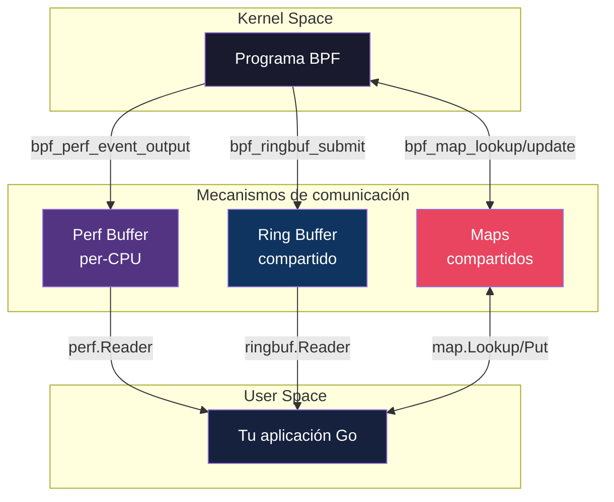
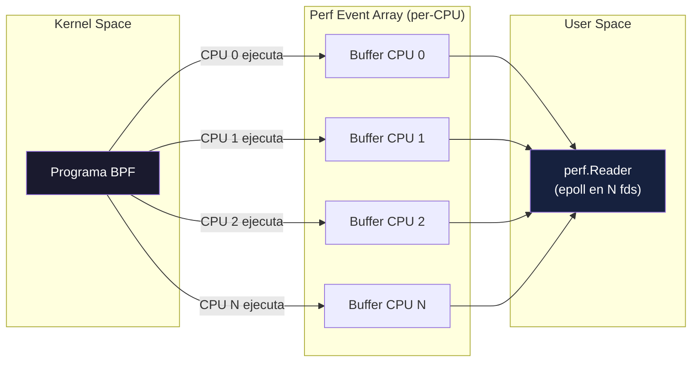
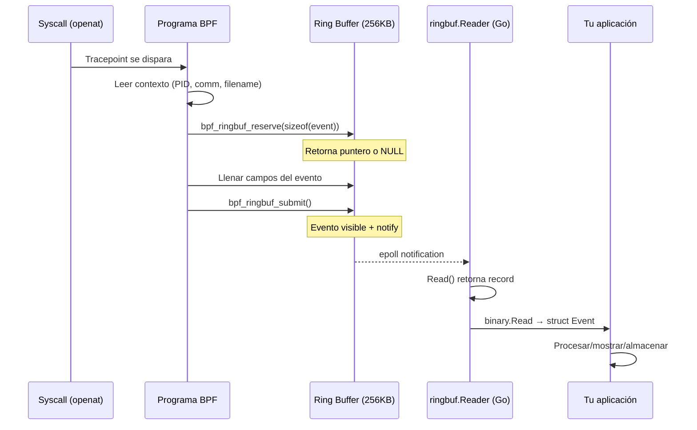
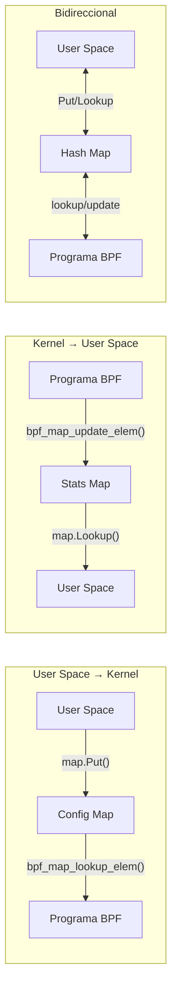
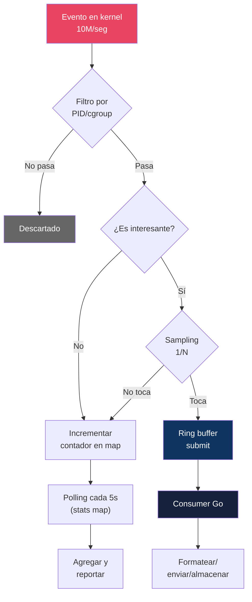

# Capítulo 12: User space ↔ Kernel — La conversación

> "El kernel tiene datos. Tu app los necesita. Aquí aprendes a construir el puente entre ambos mundos sin que se te caigan los paquetes."

---

## Términos nuevos en este capítulo

- **perf buffer** (perf báfer) — buffer circular per-CPU del subsistema perf que permite enviar eventos del kernel a user space. Cada CPU tiene su propio buffer, lo que evita contención pero implica N lecturas en user space. Forma clásica de comunicación, disponible desde kernel 4.x.
- **ring buffer** (ring báfer) — buffer circular compartido entre todas las CPUs para comunicación kernel → user space. Introducido en kernel 5.8. Ofrece orden global de eventos, mejor uso de memoria, y una API más limpia (reserve → fill → submit).
- **back-pressure** (bak-présher) — situación donde el producer (kernel) genera eventos más rápido de lo que el consumer (user space) puede procesarlos. Esto causa pérdida de eventos o saturación del buffer.
- **bpf_perf_event_output** (bi-pi-ef-perf-ivént-áutput) — helper function que envía un chunk de datos desde un programa BPF al perf buffer de la CPU actual. El consumer en user space lo lee de forma asíncrona.
- **bpf_ringbuf_reserve** (bi-pi-ef-ringbuf-risérv) — helper function que reserva espacio en el ring buffer para un evento. Retorna un puntero al espacio reservado o NULL si el buffer está lleno. Parte de la API moderna reserve/submit.
- **bpf_ringbuf_submit** (bi-pi-ef-ringbuf-sóbmit) — helper function que confirma un evento previamente reservado y notifica a los consumers. Después de submit, el evento es visible para user space.
- **sampling** (sámplin) — técnica de reducción de volumen donde solo se procesa 1 de cada N eventos. Fundamental cuando el kernel genera millones de eventos por segundo y user space no puede absorberlos todos.
- **per-CPU** (per-si-pi-iú) — patrón de diseño donde cada CPU tiene su propia copia de un recurso (buffer, contador, map). Elimina contención por locks a costa de mayor uso de memoria y complejidad en la lectura.

## Objetivos

Al terminar este capítulo vas a poder:

1. Enviar eventos estructurados del kernel a user space usando perf events y ring buffer
2. Elegir entre perf buffer y ring buffer según las necesidades de tu programa
3. Implementar comunicación bidireccional kernel ↔ user space con maps compartidos
4. Aplicar patrones de diseño (sampling, buffering, agregación) para manejar altos volúmenes de eventos

## Prerrequisitos

- Saber crear y manipular maps de diferentes tipos (Capítulo 6)
- Conocer helper functions de contexto y maps (Capítulo 8)
- Entender tracepoints y cómo adjuntar programas BPF a ellos (Capítulo 9)

---

## 12.1 El problema — El kernel tiene datos, tu app los necesita

Hasta ahora has escrito programas BPF que viven en kernel space: interceptan eventos, leen contexto, actualizan contadores en maps. Todo bien. Pero un contador en un hash map no es una alerta en Slack. Un evento capturado en el kernel no es una línea en un dashboard. **Necesitas sacar esos datos del kernel y llevarlos a tu aplicación.**

Y aquí empieza el drama.

### Las restricciones

El kernel y user space viven en mundos separados por diseño:

- El kernel ejecuta con privilegios máximos — acceso directo a hardware y memoria
- User space ejecuta restringido — solo ve lo que el kernel le permite
- No pueden compartir memoria directamente (address spaces distintos)
- El kernel no puede "llamar" a tu programa Go — es al revés

Entonces: ¿cómo sacas datos del kernel a tu app?

### Las opciones

Hay tres mecanismos fundamentales:

| Mecanismo | Dirección | Modelo | Kernel mín. |
|-----------|-----------|--------|-------------|
| **Perf events** | Kernel → User | Streaming per-CPU | 4.x |
| **Ring buffer** | Kernel → User | Streaming compartido | 5.8 |
| **Maps compartidos** | Bidireccional | Polling / lookup | 4.x |

Cada uno resuelve un problema diferente:

- **Perf events** y **ring buffer**: para flujos de eventos en tiempo real — "cada vez que pasa X, dime"
- **Maps compartidos**: para estado persistente — "¿cuál es el valor actual de Y?" o "configura Z"



> 💡 **Analogía**: Imagina una oficina del siglo XIX con un sistema de tubos neumáticos. El kernel es la planta de producción en el sótano y tu app es la oficina en el quinto piso. Los **perf events** son como tener un tubo neumático dedicado por cada estación de trabajo (per-CPU) — cada estación envía sus cápsulas por su propio tubo y el receptor tiene que vigilar todos los tubos a la vez. El **ring buffer** es un tubo central compartido — todas las estaciones mandan por el mismo tubo, las cápsulas llegan en orden, y el receptor solo vigila un punto. Los **maps compartidos** son la pizarra de anuncios en la recepción — cualquiera puede ir a leer o escribir, pero tienes que ir a mirar activamente (polling).

---

## 12.2 Perf events — La forma clásica

El perf buffer es el mecanismo original de streaming de eventos de eBPF. Lleva años en producción y funciona en kernels 4.x+. Si necesitas soportar kernels viejos o ya tienes código funcionando con perf, no hay razón para cambiarlo a la fuerza.

### Cómo funciona

1. Se crea un `BPF_MAP_TYPE_PERF_EVENT_ARRAY` — uno por programa BPF
2. El kernel asigna un buffer circular **por cada CPU**
3. El programa BPF llama a `bpf_perf_event_output()` para depositar un evento en el buffer de la CPU actual
4. User space usa `epoll` para leer de todos los buffers per-CPU simultáneamente



### Lado kernel: enviando eventos

```c
// Definición del map
struct {
    __uint(type, BPF_MAP_TYPE_PERF_EVENT_ARRAY);
    __uint(key_size, sizeof(__u32));
    __uint(value_size, sizeof(__u32));
} perf_events SEC(".maps");

// Estructura del evento
struct fork_event {
    __u32 parent_pid;
    __u32 child_pid;
    __u64 timestamp_ns;
    char comm[16];
};

SEC("tracepoint/sched/sched_process_fork")
int trace_fork(struct sched_process_fork_args *ctx) {
    struct fork_event evt = {};

    evt.parent_pid = ctx->parent_pid;
    evt.child_pid = ctx->child_pid;
    evt.timestamp_ns = bpf_ktime_get_ns();
    bpf_get_current_comm(&evt.comm, sizeof(evt.comm));

    // Enviar al buffer de la CPU actual
    bpf_perf_event_output(ctx, &perf_events, BPF_F_CURRENT_CPU,
                          &evt, sizeof(evt));
    return 0;
}
```

Puntos clave:
- `BPF_F_CURRENT_CPU` — envía al buffer de la CPU donde se ejecuta el programa
- El struct **debe tener el mismo layout** en C y en Go (padding incluido)
- Si el buffer está lleno, el evento se **pierde silenciosamente** (o se reporta como "lost samples")

### Lado user space: consumiendo eventos en Go

```go
// Abrir perf reader — lee de todos los buffers per-CPU
perfReader, err := perf.NewReader(objs.PerfEvents, os.Getpagesize()*16)
if err != nil {
    log.Fatalf("Error abriendo perf reader: %v", err)
}
defer perfReader.Close()

// Loop de lectura
for {
    record, err := perfReader.Read()
    if err != nil {
        break
    }

    // Eventos perdidos — el consumer es más lento que el producer
    if record.LostSamples > 0 {
        fmt.Printf("⚠️ %d eventos perdidos\n", record.LostSamples)
        continue
    }

    // Deserializar
    var evt ForkEvent
    if err := binary.Read(
        bytes.NewBuffer(record.RawSample),
        binary.LittleEndian,
        &evt,
    ); err != nil {
        continue
    }

    fmt.Printf("fork: parent=%d child=%d\n", evt.ParentPID, evt.ChildPID)
}
```

El `perf.NewReader` de cilium/ebpf hace todo el trabajo pesado: abre los ring buffers per-CPU, configura epoll, y te da una interfaz limpia de `Read()`.

### Limitaciones del perf buffer

1. **Per-CPU**: en una máquina con 128 cores, tienes 128 buffers. Memoria desperdiciada si no todos los cores están activos.
2. **Sin orden global**: eventos de diferentes CPUs pueden llegar desordenados. Si CPU 0 produce un evento antes que CPU 3, no hay garantía de cuál ves primero.
3. **Desperdicio de espacio**: cada buffer se dimensiona para el peor caso. Si una CPU genera el 90% de los eventos, los otros buffers están mayormente vacíos.
4. **Notificación de pérdida básica**: sabes que perdiste eventos (`LostSamples > 0`), pero no cuáles.

> ⚙️ **Nota técnica**: El segundo argumento de `perf.NewReader` es el tamaño del buffer per-CPU en bytes. Debe ser un múltiplo del page size. `os.Getpagesize()*16` = 64KB por CPU. En una máquina de 64 cores, eso son 4MB solo de buffers. Piensa en cuántos eventos esperas por segundo antes de dimensionar.

---

## 12.3 Ring buffer — La forma moderna y eficiente

El ring buffer (`BPF_MAP_TYPE_RINGBUF`) llegó con kernel 5.8 y es **la forma recomendada** para nuevos proyectos. Resuelve todas las limitaciones del perf buffer:

| Aspecto | Perf Buffer | Ring Buffer |
|---------|-------------|-------------|
| Topología | N buffers (uno per-CPU) | 1 buffer compartido |
| Orden | Per-CPU (sin orden global) | Orden global garantizado |
| Uso de memoria | N × tamaño (desperdicio) | Compartido (eficiente) |
| API kernel | `bpf_perf_event_output` (copy) | `reserve` → `fill` → `submit` (zero-copy posible) |
| Notificación | Wakeup per-CPU | Wakeup centralizado (epoll) |
| Kernel mínimo | 4.x | 5.8 |
| Eventos perdidos | Counter per-CPU | Counter global + BPF sabe si falló |

### La API: reserve → fill → submit

A diferencia de perf events donde pasas un struct completo a `bpf_perf_event_output` (copia), el ring buffer te da un **puntero directo** al espacio reservado:

```c
struct {
    __uint(type, BPF_MAP_TYPE_RINGBUF);
    __uint(max_entries, 256 * 1024);  // 256KB compartido
} events SEC(".maps");

struct file_event {
    __u32 pid;
    __u32 flags;
    __u64 timestamp_ns;
    char comm[16];
    char filename[64];
};

SEC("tracepoint/syscalls/sys_enter_openat")
int trace_openat(struct sys_enter_openat_args *ctx) {
    __u32 pid = bpf_get_current_pid_tgid() >> 32;
    if (pid == 0) return 0;

    // 1. RESERVAR espacio — retorna NULL si buffer lleno
    struct file_event *evt;
    evt = bpf_ringbuf_reserve(&events, sizeof(struct file_event), 0);
    if (!evt) {
        return 0;  // Buffer lleno. Evento descartado.
    }

    // 2. LLENAR — escribir directamente en el buffer (zero-copy)
    evt->pid = pid;
    evt->flags = ctx->flags;
    evt->timestamp_ns = bpf_ktime_get_ns();
    bpf_get_current_comm(&evt->comm, sizeof(evt->comm));
    bpf_probe_read_user_str(&evt->filename, sizeof(evt->filename),
                            ctx->filename);

    // 3. SUBMIT — evento visible para user space
    bpf_ringbuf_submit(evt, 0);

    return 0;
}
```

La diferencia clave con perf: **no hay copia**. Escribes directo al buffer circular. Cuando haces submit, el evento pasa a ser visible para el consumer. Si algo sale mal antes del submit, puedes hacer `bpf_ringbuf_discard(evt, 0)` y el espacio se libera sin que user space vea nada.

### Lado user space: consumer en Go

```go
// Un solo reader — no importa cuántas CPUs tengas
rd, err := ringbuf.NewReader(objs.Events)
if err != nil {
    log.Fatalf("ring buffer: %v", err)
}
defer rd.Close()

// Manejar señales para cierre limpio
sig := make(chan os.Signal, 1)
signal.Notify(sig, syscall.SIGINT)
go func() {
    <-sig
    rd.Close()  // Interrumpe el Read() bloqueante
}()

// Loop de lectura — idéntico al patrón de perf, pero más simple
for {
    record, err := rd.Read()
    if err != nil {
        break  // Reader cerrado (señal o error)
    }

    var evt FileEvent
    if err := binary.Read(
        bytes.NewBuffer(record.RawSample),
        binary.LittleEndian,
        &evt,
    ); err != nil {
        continue
    }

    comm := cString(evt.Comm[:])
    filename := cString(evt.Filename[:])
    fmt.Printf("PID=%-6d comm=%-16s file=%s\n", evt.PID, comm, filename)
}
```

Nota que `ringbuf.NewReader` no necesita tamaño de buffer — lee del buffer que ya definiste en C (`max_entries`). La API de consumo es casi idéntica a la de perf, lo que facilita la migración.

### ¿Cuándo usar ring buffer vs perf events?

**Usa ring buffer cuando:**
- Tu kernel target es 5.8+ (la mayoría de distros 2021+)
- Necesitas orden global de eventos
- Tienes muchas CPUs y quieres eficiencia de memoria
- Estás empezando un proyecto nuevo

**Usa perf events cuando:**
- Necesitas soportar kernels < 5.8
- Ya tienes código funcionando con perf que no quieres migrar
- Quieres buffers aislados por CPU para reducir contención en escenarios extremos (millones de eventos/seg)

> 🔥 **Advertencia — Back-pressure**: Tanto perf buffer como ring buffer tienen un problema compartido: **no hay mecanismo de back-pressure nativo**. Si tu programa BPF genera eventos a 10M/segundo y tu consumer en Go procesa a 1M/segundo, vas a perder eventos. El ring buffer te notifica cuando descarta (`bpf_ringbuf_reserve` retorna NULL), pero no frena al producer. Tu programa BPF sigue ejecutándose y generando eventos que se tiran al piso. La solución no está en el buffer sino en tu diseño: sampling, agregación en kernel, o filtrado agresivo. Lo cubrimos en la sección 12.5.

### El diagrama end-to-end: de evento kernel a log en user space



<!-- [INSERTA IMAGEN AQUI: Captura mostrando el programa de ring buffer ejecutándose con eventos de openat apareciendo en tiempo real] -->

---

## 12.4 Maps compartidos — Comunicación bidireccional

Perf y ring buffer son canales unidireccionales: kernel → user space. Pero a veces necesitas el flujo inverso: que user space le diga algo al kernel. O que ambos lean y escriban.

Para eso usas **maps normales** como canal de comunicación. No es un streaming de eventos — es estado compartido que ambos lados pueden leer y modificar.

### Los tres patrones



### Patrón 1: Configuración dinámica (user space → kernel)

Tu programa BPF se ejecuta en el kernel. No puedes recompilarlo ni recargarlo cada vez que quieres cambiar un parámetro. Pero puedes leer de un map que user space actualiza en caliente:

```c
// En el programa BPF
#define CFG_ENABLED     0
#define CFG_SAMPLE_RATE 1

struct {
    __uint(type, BPF_MAP_TYPE_ARRAY);
    __uint(max_entries, 3);
    __type(key, __u32);
    __type(value, __u64);
} config_map SEC(".maps");

SEC("tracepoint/raw_syscalls/sys_enter")
int configurable_monitor(void *ctx) {
    // Leer si estamos habilitados
    __u32 key = CFG_ENABLED;
    __u64 *enabled = bpf_map_lookup_elem(&config_map, &key);
    if (!enabled || *enabled == 0)
        return 0;  // Deshabilitado desde user space

    // Leer sample rate
    __u32 key_rate = CFG_SAMPLE_RATE;
    __u64 *rate = bpf_map_lookup_elem(&config_map, &key_rate);
    // ... usar rate para sampling ...

    return 0;
}
```

```go
// En tu app Go — cambiar comportamiento SIN recargar el programa BPF
var keyEnabled uint32 = 0
var valEnabled uint64 = 1
objs.ConfigMap.Put(keyEnabled, valEnabled)  // Habilitar

var keySampleRate uint32 = 1
var valSampleRate uint64 = 100  // 1 de cada 100
objs.ConfigMap.Put(keySampleRate, valSampleRate)

// Más tarde, desactivar sin tocar el programa BPF:
objs.ConfigMap.Put(keyEnabled, uint64(0))  // Deshabilitar
```

### Patrón 2: Estadísticas per-CPU (kernel → user space)

Para contadores de alto volumen, usa `BPF_MAP_TYPE_PERCPU_ARRAY`. Cada CPU escribe su propia copia sin locks — user space agrega los valores al leer:

```c
struct {
    __uint(type, BPF_MAP_TYPE_PERCPU_ARRAY);
    __uint(max_entries, 3);
    __type(key, __u32);
    __type(value, __u64);
} stats_map SEC(".maps");

// Incrementar — sin locks, sin contención
__u32 key = STATS_TOTAL;
__u64 *val = bpf_map_lookup_elem(&stats_map, &key);
if (val)
    __sync_fetch_and_add(val, 1);
```

```go
// Leer en Go — cilium/ebpf retorna un slice con valor por CPU
var perCPUValues []uint64
objs.StatsMap.Lookup(uint32(0), &perCPUValues)

// Sumar todas las CPUs
var total uint64
for _, v := range perCPUValues {
    total += v
}
fmt.Printf("Total syscalls: %d\n", total)
```

### Patrón 3: Blocklist/allowlist dinámica (bidireccional)

Un hash map que user space modifica en runtime para controlar qué procesos monitorea el programa BPF:

```c
struct {
    __uint(type, BPF_MAP_TYPE_HASH);
    __uint(max_entries, 1024);
    __type(key, __u32);   // PID
    __type(value, __u8);  // Dummy (presencia = bloqueado)
} blocklist SEC(".maps");

SEC("tracepoint/raw_syscalls/sys_enter")
int filtered_monitor(void *ctx) {
    __u32 pid = bpf_get_current_pid_tgid() >> 32;

    // ¿Está en la blocklist?
    if (bpf_map_lookup_elem(&blocklist, &pid))
        return 0;  // Saltear este PID

    // ... procesar evento ...
    return 0;
}
```

```go
// Agregar PID a la blocklist en runtime
objs.Blocklist.Put(uint32(targetPID), uint8(1))

// Remover PID de la blocklist
objs.Blocklist.Delete(uint32(targetPID))
```

Este es el patrón que usan herramientas como Falco y Tetragon para filtrado dinámico: un control plane en user space decide qué observar, y el data path en kernel ejecuta las decisiones a velocidad de línea.

> ⚙️ **Nota técnica**: Los maps compartidos tienen semántica de **consistencia eventual por entrada**. Una escritura desde user space es atómica a nivel de entrada (una sola key se actualiza de golpe), pero no hay transacciones multi-key. Si tu programa BPF lee `config[0]` y luego `config[1]`, otro thread en user space podría haber actualizado `config[1]` entre las dos lecturas. Para la mayoría de los casos esto no importa. Si importa, usa un solo array entry con una struct que contenga toda la config, o usa generaciones con un flag de "versión".

---

## 12.5 Patrones de diseño — Cuando el volumen te supera

En un sistema de producción, el kernel puede generar **millones de eventos por segundo**. Un proceso hace cientos de syscalls por segundo. Multiplica por miles de procesos. Tu consumer en Go no puede procesar 10 millones de structs por segundo — ni debería intentarlo.

La regla de oro: **reduce en el kernel, no en user space**.

### Patrón 1: Sampling — Procesar 1 de cada N

El patrón más simple. Solo envías un porcentaje de los eventos:

```c
// En el programa BPF
struct {
    __uint(type, BPF_MAP_TYPE_PERCPU_ARRAY);
    __uint(max_entries, 1);
    __type(key, __u32);
    __type(value, __u64);
} counter SEC(".maps");

SEC("tracepoint/raw_syscalls/sys_enter")
int sampled_trace(void *ctx) {
    __u32 key = 0;
    __u64 *count = bpf_map_lookup_elem(&counter, &key);
    if (!count) return 0;

    __u64 current = __sync_fetch_and_add(count, 1);

    // Solo procesar 1 de cada 100 eventos
    if (current % 100 != 0)
        return 0;

    // ... enviar evento al ring buffer ...
    return 0;
}
```

Ventaja: reduces volumen 100x con una línea de código. Desventaja: puedes perder eventos interesantes. Combina con filtrado (solo samplear los eventos que ya pasaron un filtro por PID, syscall type, etc.).

### Patrón 2: Agregación en kernel — Contadores en vez de eventos

En vez de enviar "proceso X hizo read" 50,000 veces, envía "proceso X hizo 50,000 reads":

```c
struct proc_stats {
    __u64 read_count;
    __u64 write_count;
    __u64 total_bytes_read;
    __u64 total_bytes_written;
};

struct {
    __uint(type, BPF_MAP_TYPE_HASH);
    __uint(max_entries, 10240);
    __type(key, __u32);              // PID
    __type(value, struct proc_stats);
} stats SEC(".maps");

SEC("tracepoint/syscalls/sys_exit_read")
int count_read(struct trace_event_raw_sys_exit *ctx) {
    __u32 pid = bpf_get_current_pid_tgid() >> 32;
    long ret = ctx->ret;
    if (ret <= 0) return 0;

    struct proc_stats *s = bpf_map_lookup_elem(&stats, &pid);
    if (s) {
        __sync_fetch_and_add(&s->read_count, 1);
        __sync_fetch_and_add(&s->total_bytes_read, ret);
    } else {
        struct proc_stats new = { .read_count = 1, .total_bytes_read = ret };
        bpf_map_update_elem(&stats, &pid, &new, BPF_NOEXIST);
    }
    return 0;
}
```

User space hace polling cada N segundos, lee los acumulados, y los resetea. En vez de millones de eventos por segundo, manejas miles de entradas en un map.

### Patrón 3: Filtrado agresivo en kernel

No envíes lo que no necesitas. Filtra lo más temprano posible en el programa BPF:

```c
SEC("tracepoint/syscalls/sys_enter_openat")
int filtered_openat(struct sys_enter_openat_args *ctx) {
    // Filtro 1: Solo procesos de un cgroup específico
    // Filtro 2: Solo archivos en /etc/ o /proc/
    // Filtro 3: Solo si el PID no está en la allowlist
    // ...

    // Solo si pasa TODOS los filtros, enviar al ring buffer
    struct file_event *evt = bpf_ringbuf_reserve(&events, sizeof(*evt), 0);
    // ...
}
```

### Patrón 4: Batching temporal

En vez de notificar a user space por cada evento, acumula varios y notifica en batch:

```c
// bpf_ringbuf_submit con flag BPF_RB_NO_WAKEUP
bpf_ringbuf_submit(evt, BPF_RB_NO_WAKEUP);

// Solo despertar al consumer cada N eventos o cuando el buffer está X% lleno
// (el flag BPF_RB_FORCE_WAKEUP fuerza notificación)
```

Esto reduce las interrupciones de epoll en user space. En vez de despertar tu goroutine 1 millón de veces por segundo, la despiertas 10,000 veces con 100 eventos cada vez.

### El flujo end-to-end en producción

Un sistema de observabilidad real combina varios patrones:



La clave es que el camino "caliente" (millones de eventos) se resuelve con un incremento atómico en un map. Solo los eventos que realmente necesitas inspeccionar en detalle llegan al ring buffer. Y aun así, con sampling.

> 💡 **Analogía**: Es como el sistema de seguridad de un aeropuerto. No puedes hacer una entrevista profunda a cada uno de los 50,000 pasajeros diarios (eso sería el equivalente a enviar todos los eventos). Primero filtras por vuelo (cgroup), luego pasas por el scanner automático (contadores/agregación), y solo los que activan la alarma reciben inspección manual (ring buffer → user space). El sistema funciona porque la mayoría se resuelve en los filtros rápidos.

---

## Ejercicio intermedio: Event Logger con Ring Buffer

📋 **Nivel:** Intermedio
📚 **Prerrequisitos:** Maps (Cap 6), Helpers (Cap 8), Ring buffer (sección 12.3)
🎯 **Objetivo:** Implementar un consumer en Go que lea eventos de proceso desde un ring buffer

### El problema

Quieres un event logger que capture eventos de procesos (`execve` y `exit`) en tiempo real usando ring buffer. El programa BPF ya está escrito — tu trabajo es implementar el consumer en Go que lee, deserializa, y muestra los eventos.

### El programa BPF (ya implementado)

El lado kernel captura dos tipos de eventos:

```c
#define EVENT_EXEC 1
#define EVENT_EXIT 2

struct process_event {
    __u32 event_type;    // EVENT_EXEC o EVENT_EXIT
    __u32 pid;
    __u32 ppid;
    __u32 exit_code;
    __u64 timestamp_ns;
    char comm[16];
};

struct {
    __uint(type, BPF_MAP_TYPE_RINGBUF);
    __uint(max_entries, 256 * 1024);
} events SEC(".maps");
```

Se adjunta a:
- `tracepoint/syscalls/sys_enter_execve` → emite `EVENT_EXEC`
- `tracepoint/sched/sched_process_exit` → emite `EVENT_EXIT`

Código completo: `code/cap12-user-kernel/ejercicio/esqueleto/bpf/event_logger.bpf.c`

### Tu trabajo — Consumer en Go

Abre `code/cap12-user-kernel/ejercicio/esqueleto/go/main.go` y completa los TODOs:

```go
// TODO 1: Abrir el ring buffer reader
rd, err := ringbuf.NewReader(objs.Events)
if err != nil {
    log.Fatalf("ring buffer: %v", err)
}
defer rd.Close()

// TODO 2: Loop de lectura
for {
    record, err := rd.Read()
    if err != nil {
        break
    }

    // TODO 3: Deserializar
    var evt Event
    binary.Read(bytes.NewBuffer(record.RawSample),
                binary.LittleEndian, &evt)

    // TODO 4: Mostrar el evento
    printEvent(evt)
}
```

### Criterios de éxito

- [ ] El programa BPF se carga sin errores del verifier
- [ ] Se adjunta a los tracepoints de execve y sched_process_exit
- [ ] El consumer abre el ring buffer y lee eventos
- [ ] Eventos EXEC muestran: PID, PPID, nombre del comando
- [ ] Eventos EXIT muestran: PID, código de salida
- [ ] Cierre limpio con Ctrl+C

### Caso de prueba

```bash
# Terminal 1
cd code/cap12-user-kernel/ejercicio/esqueleto/go/
go generate ./...
go build -o event-logger .
sudo ./event-logger

# Terminal 2
ls; sleep 1; echo hola
```

**Resultado esperado:**

```
═══════════════════════════════════════════════════════════════
  Capítulo 12 — Ejercicio: Event Logger con Ring Buffer
═══════════════════════════════════════════════════════════════

  ✅ Event logger activo. Ctrl+C para salir.

  🟢 [EXEC] PID=12345  PPID=1000   comm=ls
  🟢 [EXEC] PID=12346  PPID=1000   comm=sleep
  🔴 [EXIT] PID=12346  exit_code=0  comm=sleep
  🟢 [EXEC] PID=12347  PPID=1000   comm=echo
  🔴 [EXIT] PID=12347  exit_code=0  comm=echo
```

<!-- [INSERTA IMAGEN AQUI: Captura mostrando el event logger corriendo y capturando eventos de procesos en tiempo real] -->

### Pistas

1. La struct `Event` en Go ya está definida con el layout correcto
2. `rd.Close()` dentro del handler de señales interrumpe el `Read()` bloqueante
3. No necesitas manejar "lost samples" — ring buffer descarta silenciosamente si está lleno

📁 **Esqueleto:** `code/cap12-user-kernel/ejercicio/esqueleto/`
📁 **Solución:** `code/cap12-user-kernel/ejercicio/solucion/`

---

## Resumen

1. **Perf events** es el mecanismo clásico (kernel 4.x+): un buffer per-CPU, simple pero con desperdicio de memoria y sin orden global entre CPUs.
2. **Ring buffer** es la evolución (kernel 5.8+): un buffer compartido con orden global, mejor uso de memoria, y API de zero-copy (reserve/submit). Úsalo por defecto en proyectos nuevos.
3. **Maps compartidos** permiten comunicación bidireccional: user space configura el programa BPF en runtime (array/hash maps) sin recargarlo, y lee estadísticas agregadas (per-CPU maps).
4. **Back-pressure no existe** en estos mecanismos — si el consumer es más lento que el producer, pierdes eventos. La solución es reducir volumen en kernel: sampling, agregación, filtrado.
5. El patrón fundamental en producción es **filtrar → agregar → samplear → transmitir**: resuelve lo que puedas con incrementos atómicos en maps, y solo envía por ring buffer los eventos que realmente necesitas inspeccionar.

## Recursos

- [BPF ring buffer (kernel docs)](https://www.kernel.org/doc/html/latest/bpf/ringbuf.html) — documentación oficial del ring buffer, incluyendo la motivación de diseño
- [cilium/ebpf — perf package](https://pkg.go.dev/github.com/cilium/ebpf/perf) — API de Go para consumir perf events
- [cilium/ebpf — ringbuf package](https://pkg.go.dev/github.com/cilium/ebpf/ringbuf) — API de Go para consumir ring buffer
- [BPF ring buffer (LWN)](https://lwn.net/Articles/825415/) — artículo de Andrii Nakryiko explicando el diseño y las decisiones detrás del ring buffer
- Código de referencia de este capítulo: `code/cap12-user-kernel/`
