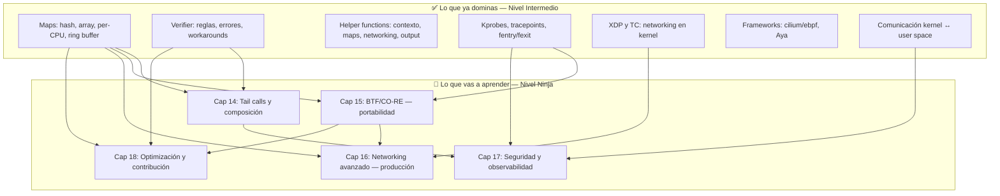
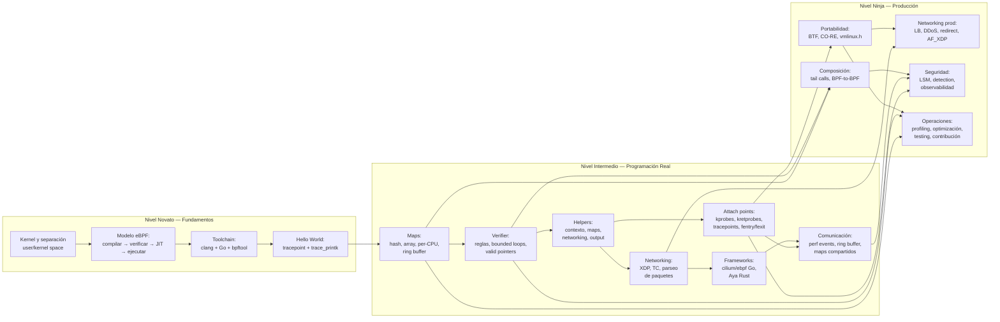
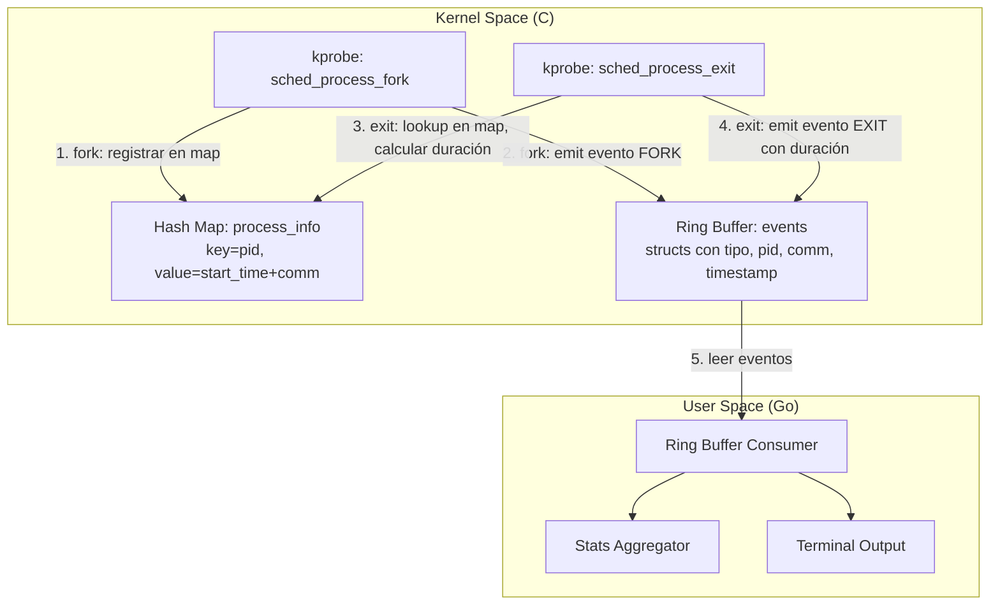

# Capítulo 13: De intermedio a ninja — El puente

> "Tienes el martillo, los clavos, y sabes construir una pared. Ahora toca hacer que la casa aguante un terremoto."

---

## Términos nuevos en este capítulo

Este capítulo no introduce términos nuevos. Es un punto de consolidación y motivación. Todos los términos que aparecen aquí fueron definidos en los capítulos 6-12. Si algo te suena ajeno, vuelve atrás. No hay atajos.

---

## Objetivos

Al terminar este capítulo vas a poder:

1. Articular con claridad las técnicas y herramientas del Nivel Intermedio que ya dominas
2. Identificar las limitaciones concretas que vas a encontrar cuando intentes llevar eBPF a producción
3. Entender qué técnicas avanzadas existen para superar esas limitaciones

## Prerrequisitos

- Haber completado los capítulos 6 al 12 sin saltarte ninguno
- Haber implementado al menos 3 de los ejercicios intermedios (no vale solo leerlos)
- Poder explicar de memoria: qué tipo de map usar para cada caso, cómo pasa un programa el verifier, y cómo fluyen datos del kernel a user space

---

## Lo que ya dominas — Resumen del Nivel Intermedio

Detente. Respira. En 8 capítulos pasaste de "sé qué es eBPF" a "puedo escribir programas eBPF funcionales que resuelven problemas reales". Eso es un salto enorme.

Hagamos inventario de lo que ahora puedes hacer:

### Estado persistente y estructuras de datos

Dominas los maps. Sabes que un hash map es tu diccionario en kernel space, que un array map te da acceso O(1) con índice fijo, que per-CPU elimina contención entre cores, y que el ring buffer es tu canal de streaming para mandar datos estructurados a user space.

Sabes crear maps, hacer lookup, update y delete desde ambos lados — kernel y user space. Sabes que sin cleanup hay memory leaks porque el kernel no tiene garbage collector. Y sabes elegir el tipo de map correcto según tu caso de uso.

### Las reglas del juego

El verifier ya no te da miedo. Bueno, menos. Entiendes por qué existe, conoces sus reglas (bounded loops, valid pointers, stack limits), y tienes un repertorio de trucos para hacerlo feliz. Cuando te rechaza un programa, sabes diagnosticar el error y corregirlo sin entrar en pánico.

### El arsenal de helpers

Conoces las helper functions por categoría: de contexto (`bpf_get_current_pid_tgid`, `bpf_get_current_comm`, `bpf_ktime_get_ns`), de maps (lookup, update, delete), de networking (manipulación de paquetes), y de output (perf events, ring buffer). Sabes que no todas están disponibles en todos los tipos de programa, y sabes consultar la matriz de compatibilidad.

### Instrumentación del kernel

Puedes enganchar programas eBPF en kprobes, kretprobes, tracepoints, y fentry/fexit. Sabes la diferencia entre cada uno: kprobes son dinámicos pero inestables entre versiones, tracepoints son estables pero limitados a puntos predefinidos, y fentry/fexit son la evolución moderna con BTF.

Puedes capturar argumentos de funciones del kernel, valores de retorno, y construir tracers que te dicen exactamente qué está pasando dentro del kernel.

### Networking a velocidad del kernel

XDP y TC ya no son territorios desconocidos. Sabes que XDP procesa paquetes antes del network stack (más rápido, menos funcionalidad) y que TC opera después (más contexto, más lento). Puedes parsear headers de Ethernet, IP, y TCP/UDP byte por byte. Sabes validar bounds antes de cada lectura para que el verifier no te rechace.

### Frameworks y ecosistema

Entiendes por qué Go con cilium/ebpf es nuestro stack principal: ergonomía, comunidad, y un balance entre simplicidad y poder. Conoces Aya como alternativa en Rust para proyectos donde la safety garantizada por el compilador importa más que la velocidad de desarrollo. Y sabes que libbpf y BCC existen para contextos específicos.

### Comunicación real kernel ↔ user space

Dominas los tres mecanismos de comunicación: perf events (clásico, per-CPU), ring buffer (moderno, eficiente, un solo buffer compartido), y maps compartidos para comunicación bidireccional. Sabes que el ring buffer es la opción por defecto para streaming de eventos, y que necesitas pensar en back-pressure cuando el kernel genera datos más rápido de lo que user space consume.

> 💡 **Perspectiva**: Si puedes explicar estos seis bloques a un colega sin abrir el libro, estás en una posición sólida. Si alguno te genera inseguridad, el capítulo correspondiente está a un click de distancia. No avances con deuda técnica conceptual.

---

## Las paredes que vas a golpear — Limitaciones de lo que sabes

Ahora las malas noticias. Todo lo que sabes es suficiente para escribir programas eBPF funcionales. Pero no es suficiente para producción. No es suficiente para sistemas complejos. No es suficiente para el mundo real donde los kernels cambian, el tráfico escala, y las cosas fallan a las 3 AM.

Estas son las paredes:

### Pared 1: Tu programa es un monolito

Hasta ahora, cada programa eBPF que escribiste es una unidad atómica. Una función, un attach point, una lógica. Funciona para problemas simples. Pero ¿qué pasa cuando necesitas:

- Un classifier de paquetes que maneje 8 protocolos distintos, cada uno con lógica diferente?
- Un pipeline de seguridad que primero filtre, luego registre, luego alerte?
- Un programa que reutilice lógica entre diferentes attach points?

No puedes. Tu programa se convierte en un monstruo de `if/else` anidados que roza el límite de instrucciones del verifier (1 millón). El verifier se tarda minutos en analizar esa complejidad. Y cuando algo falla, debuggear es una pesadilla.

**Lo que necesitas:** Tail calls — la capacidad de llamar a otro programa eBPF sin volver. Y BPF-to-BPF function calls para modularizar sin cambiar de programa.

### Pared 2: Estás atado a una versión del kernel

Ese programa que funciona perfecto en tu kernel 6.1 de desarrollo… explota en producción con kernel 5.15. ¿Por qué? Porque `struct task_struct` cambió de layout. Porque el campo que lees en el offset 312 ahora está en el offset 328. Porque una función interna del kernel que instrumentabas con kprobe cambió de nombre.

Este es el infierno de las versiones. Si distribuyes herramientas eBPF, necesitas que funcionen en cualquier kernel soportado sin recompilar para cada uno.

**Lo que necesitas:** BTF (BPF Type Format) y CO-RE (Compile Once, Run Everywhere) — la infraestructura que permite a tus programas adaptarse automáticamente a las diferencias entre kernels.

### Pared 3: "Funciona en mi laptop" no es producción

Tu programa eBPF funciona. Genial. Pero:

- ¿Cuánta latencia agrega a cada paquete procesado?
- ¿Qué pasa cuando procesa 10 millones de eventos por segundo?
- ¿Se puede perfilar? ¿Cuáles son los cuellos de botella?
- ¿Cómo lo testeas sin un kernel de producción?
- ¿Quién puede cargarlo? ¿Con qué privilegios?
- ¿Qué pasa si la NIC no soporta XDP native?

Producción tiene restricciones que tu laptop no tiene. Necesitas medir, optimizar, probar, y asegurar antes de soltar tu programa en un sistema que maneja tráfico real.

**Lo que necesitas:** Técnicas de profiling de programas BPF, optimización (per-CPU maps, batching, inlining), testing con `BPF_PROG_TEST_RUN`, y una comprensión del modelo de seguridad (CAP_BPF, namespaces).

### Pared 4: El mundo real tiene escala

Los ejercicios de este libro manejan docenas de eventos. Producción maneja millones. A esa escala:

- Un lookup extra en un map puede costarte microsegundos que se multiplican por millón
- La agregación en kernel (en vez de mandar raw events a user space) pasa de "nice to have" a "obligatorio"
- Necesitas load balancers que manejen 100k conexiones concurrentes con latencia < 5µs
- Necesitas detección de intrusiones que no agregue overhead medible al sistema

**Lo que necesitas:** Patrones de diseño para alta performance, casos de estudio de sistemas en producción (Katran, Cilium, Falco), y la mentalidad de "medir antes de optimizar".

> 🔥 **Advertencia**: El Nivel Ninja no es "más de lo mismo, pero más difícil". Es un cambio de mentalidad. Dejas de pensar en programas individuales y empiezas a pensar en sistemas. Dejas de pensar en funcionalidad y empiezas a pensar en operabilidad. Si no estás cómodo con todo lo del Nivel Intermedio, el Ninja te va a masticar.

---

## El siguiente nivel — Preview de lo que viene

El Nivel Ninja son 5 capítulos (14 al 18) que te llevan de "puedo escribir programas eBPF funcionales" a "puedo diseñar y operar sistemas eBPF en producción". Esta es la ruta:



### La secuencia tiene lógica

**Capítulo 14 (Tail calls y composición)** va primero porque resuelve la limitación más inmediata: la complejidad. Cuando tu lógica no cabe en un solo programa, necesitas composición. Tail calls te permiten construir pipelines modulares.

**Capítulo 15 (BTF y CO-RE)** va segundo porque una vez que tienes programas complejos, necesitas distribuirlos. Y distribuir significa correr en kernels diferentes. CO-RE hace que un binario funcione en kernels con layouts de structs distintos.

**Capítulo 16 (Networking avanzado)** aplica todo lo anterior a casos de uso reales de infraestructura: load balancing XDP en producción, DDoS mitigation a millones de paquetes por segundo, redirect entre interfaces. Casos de estudio de Meta, Cloudflare, y Cilium.

**Capítulo 17 (Seguridad y observabilidad)** es el otro gran dominio: runtime security con LSM hooks, detección de container escapes, pipelines de observabilidad a escala. Casos de estudio de Falco, Tetragon, y Pixie.

**Capítulo 18 (Optimización y contribución)** cierra el ciclo: cómo perfilar, medir, optimizar, y contribuir de vuelta al ecosistema. El capítulo te prepara para operar después del libro.

### Lo que va a cambiar

A partir del Capítulo 14, los ejercicios ya no tienen esqueleto con TODOs. Se te da:

- Un escenario de producción realista
- Requisitos funcionales concretos
- Restricciones de performance medibles (latencia, throughput, conexiones concurrentes)
- Las técnicas requeridas del capítulo

Tú diseñas la solución. No hay "una respuesta correcta". Hay soluciones que cumplen las restricciones y soluciones que no. Eso es producción.

> ⚙️ **Nota técnica**: El código de referencia del Nivel Ninja sigue disponible en el repositorio del libro. Pero la expectativa es que intentes diseñar tu propia solución antes de consultar la referencia. El aprendizaje está en las decisiones de diseño, no en copiar código.

---

## Diagrama: Mapa completo de conceptos hasta aquí

Este es todo lo que has acumulado en 12 capítulos. Es una base seria.



<!-- [INSERTA IMAGEN AQUI: Versión visual del mapa de conceptos como poster/infografía, mostrando los 3 niveles con íconos y conexiones entre conceptos, apto para imprimir como referencia rápida] -->

---

## Ejercicio: Mini-proyecto integrador — Tool de observabilidad

📋 **Nivel:** Intermedio (consolidación)
📚 **Conceptos previos:** Maps (Cap 6), Helpers (Cap 8), Kprobes (Cap 9), Ring buffer (Cap 12)
🖥️ **Entorno:** Tu laboratorio con kernel 5.15+ y Go instalado

### El reto

Construir un tool de observabilidad completo que combine todas las piezas del Nivel Intermedio. Vas a crear un **process lifecycle monitor** — una herramienta que trackea la creación y destrucción de procesos en tiempo real, reportando estadísticas y eventos al user space.

Este ejercicio es integrador: no introduce nada nuevo. Solo combina lo que ya sabes de formas que no habías combinado. Si puedes completarlo sin consultar los capítulos anteriores, estás listo para el Nivel Ninja.

### Arquitectura del tool



### Requisitos funcionales

Tu tool debe:

1. **Detectar forks** — Engancharse al punto donde el kernel crea procesos nuevos (tracepoint `sched_process_fork` o kprobe equivalente)
2. **Detectar exits** — Engancharse al punto donde un proceso termina (`sched_process_exit`)
3. **Almacenar metadata** — Guardar en un hash map el PID, nombre del proceso (`comm`), y timestamp de creación
4. **Calcular duración** — Cuando un proceso termina, calcular cuánto tiempo vivió (exit_time - start_time)
5. **Emitir eventos estructurados** — Enviar por ring buffer un struct con: tipo de evento (FORK/EXIT), PID, PPID, comm, timestamp, y duración (solo para EXIT)
6. **Consumir en user space** — Un programa Go que lea el ring buffer, imprima eventos en formato legible, y mantenga un contador de procesos activos

### Esqueleto BPF (C)

```c
// process_monitor.bpf.c
#include "vmlinux.h"
#include <bpf/bpf_helpers.h>
#include <bpf/bpf_tracing.h>
#include <bpf/bpf_core_read.h>

#define TASK_COMM_LEN 16
#define EVENT_FORK 1
#define EVENT_EXIT 2

struct process_info {
    __u64 start_time;
    char comm[TASK_COMM_LEN];
};

struct event {
    __u8 type;
    __u32 pid;
    __u32 ppid;
    __u64 timestamp;
    __u64 duration_ns;
    char comm[TASK_COMM_LEN];
};

// TODO: Definir el hash map "process_info_map"
//   - key: __u32 (pid)
//   - value: struct process_info
//   - max_entries: 10240

// TODO: Definir el ring buffer "events"
//   - max_entries: 256 * 1024 (256 KB)

SEC("tp/sched/sched_process_fork")
int handle_fork(struct trace_event_raw_sched_process_fork *ctx)
{
    // TODO:
    // 1. Obtener el PID del proceso hijo (ctx->child_pid)
    // 2. Obtener el timestamp actual con bpf_ktime_get_ns()
    // 3. Obtener el comm del proceso actual con bpf_get_current_comm()
    // 4. Crear un struct process_info y guardarlo en el hash map
    // 5. Reservar espacio en el ring buffer
    // 6. Llenar el struct event con tipo FORK, pid, ppid, comm, timestamp
    // 7. Enviar el evento con bpf_ringbuf_submit()

    return 0;
}

SEC("tp/sched/sched_process_exit")
int handle_exit(struct trace_event_raw_sched_process_template *ctx)
{
    // TODO:
    // 1. Obtener el PID del proceso actual con bpf_get_current_pid_tgid() >> 32
    // 2. Buscar el PID en el hash map (bpf_map_lookup_elem)
    // 3. Si existe: calcular duración = now - start_time
    // 4. Eliminar la entrada del map (bpf_map_delete_elem)
    // 5. Reservar espacio en el ring buffer
    // 6. Llenar el struct event con tipo EXIT, pid, comm, timestamp, duration
    // 7. Enviar el evento
    // 8. Si no existe en el map: el proceso se creó antes de que cargáramos
    //    el programa — ignorar o emitir evento sin duración

    return 0;
}

char LICENSE[] SEC("license") = "GPL";
```

### Esqueleto User Space (Go)

```go
// main.go
package main

import (
    "bytes"
    "encoding/binary"
    "fmt"
    "os"
    "os/signal"
    "syscall"
    "time"

    "github.com/cilium/ebpf/link"
    "github.com/cilium/ebpf/ringbuf"
    "github.com/cilium/ebpf/rlimit"
)

//go:generate go run github.com/cilium/ebpf/cmd/bpf2go -target amd64 monitor process_monitor.bpf.c

const (
    EventFork = 1
    EventExit = 2
)

type Event struct {
    Type       uint8
    _          [3]byte // padding
    Pid        uint32
    Ppid       uint32
    Timestamp  uint64
    DurationNs uint64
    Comm       [16]byte
}

func main() {
    // TODO:
    // 1. Llamar a rlimit.RemoveMemlock()
    // 2. Cargar los objetos BPF con loadMonitorObjects()
    // 3. Adjuntar los programas a los tracepoints:
    //    - link.Tracepoint("sched", "sched_process_fork", objs.HandleFork, nil)
    //    - link.Tracepoint("sched", "sched_process_exit", objs.HandleExit, nil)
    // 4. Abrir un reader del ring buffer: ringbuf.NewReader(objs.Events, nil)
    // 5. En un loop:
    //    - Leer el siguiente record
    //    - Decodificar el struct Event con binary.Read()
    //    - Imprimir según tipo:
    //      FORK: "[FORK] pid=1234 ppid=5678 comm=nginx ts=..."
    //      EXIT: "[EXIT] pid=1234 comm=nginx duration=1.234s"
    // 6. Manejar señales (SIGINT/SIGTERM) para salir limpiamente

    fmt.Println("Process Monitor - Ctrl+C para salir")
    fmt.Println("Esperando eventos...")
}
```

### Criterios de éxito

- [ ] El programa BPF compila sin errores con clang
- [ ] El programa pasa el verifier al cargarse
- [ ] Se adjunta correctamente a ambos tracepoints
- [ ] Detecta la creación de procesos nuevos (ejecutar `ls` o `cat` genera eventos FORK)
- [ ] Detecta la terminación de procesos (los mismos procesos generan eventos EXIT)
- [ ] Los eventos EXIT incluyen la duración correcta (time since fork)
- [ ] El consumer en Go imprime los eventos en tiempo real
- [ ] No hay memory leaks en el hash map (los procesos que terminan se eliminan)

### Pistas

1. Para el tracepoint `sched_process_fork`, el campo `child_pid` te da el PID del proceso hijo
2. `bpf_ktime_get_ns()` retorna nanosegundos desde el boot — úsalo para calcular duración
3. En el ring buffer, siempre verifica que `bpf_ringbuf_reserve()` no retorne NULL
4. En Go, el padding del struct importa — el compilador de C alinea a 4/8 bytes
5. Procesos muy cortos (como `ls`) pueden hacer fork y exit en microsegundos — tu tool debería capturar ambos eventos

### Validación

```bash
# Terminal 1: ejecuta tu tool
sudo ./process-monitor

# Terminal 2: genera actividad
for i in $(seq 1 10); do ls /tmp > /dev/null; done
sleep 2
cat /etc/hostname
```

**Resultado esperado** — algo como:

```
Process Monitor - Ctrl+C para salir
Esperando eventos...
[FORK] pid=4521 ppid=4500 comm=bash         ts=2024-01-15T10:32:01
[FORK] pid=4522 ppid=4521 comm=ls           ts=2024-01-15T10:32:01
[EXIT] pid=4522 comm=ls           duration=1.2ms
[FORK] pid=4523 ppid=4521 comm=ls           ts=2024-01-15T10:32:01
[EXIT] pid=4523 comm=ls           duration=0.9ms
...
[FORK] pid=4531 ppid=4500 comm=cat          ts=2024-01-15T10:32:03
[EXIT] pid=4531 comm=cat          duration=2.1ms
```

<!-- [INSERTA IMAGEN AQUI: Captura de terminal mostrando el process monitor ejecutándose con eventos FORK y EXIT en tiempo real, con colores si es posible] -->

### ¿Por qué este ejercicio importa?

Este mini-proyecto usa:
- **Kprobes/Tracepoints** (Cap 9) para engancharse al scheduler
- **Maps** (Cap 6) para almacenar estado entre fork y exit
- **Helper functions** (Cap 8) para obtener PID, comm, timestamp
- **Ring buffer** (Cap 12) para streaming de eventos a user space
- **Framework** (Cap 11) para el loader y consumer en Go

Si puedes construirlo sin mirar atrás, has integrado el Nivel Intermedio. Si necesitas consultar, está bien — pero anota qué consultaste. Esas son tus áreas a reforzar antes de entrar al Nivel Ninja.

---

## Resumen

Lo que te llevas de este capítulo:

1. **Dominas las herramientas fundamentales** — maps, verifier, helpers, attach points, networking, comunicación kernel↔user, y el framework cilium/ebpf
2. **Hay paredes reales por delante** — programas monolíticos, dependencia de versión de kernel, falta de composición, y los desafíos de producción
3. **Tail calls y composición** resuelven la complejidad — un solo programa no escala a lógica real
4. **BTF y CO-RE** resuelven la portabilidad — un binario, múltiples kernels
5. **Producción requiere una mentalidad nueva** — profiling, optimización, testing, seguridad, y diseño para escala
6. **El Nivel Ninja cambia las reglas** — ejercicios sin esqueleto, restricciones de producción, diseño propio

---

## Para saber más

- 📖 [eBPF — Cilium Documentation](https://docs.cilium.io/en/latest/bpf/) — Referencia técnica completa de eBPF, incluye tail calls, BTF, y features avanzadas
- 📝 [Brendan Gregg — BPF Performance Tools](https://www.brendangregg.com/bpf-performance-tools-book.html) — El libro complementario para observabilidad y performance con eBPF
- 💻 [Isovalent — Learning eBPF](https://isovalent.com/learning-ebpf/) — Recursos de la empresa detrás de Cilium, con labs prácticos
- 📖 [Kernel BPF Documentation](https://docs.kernel.org/bpf/) — Documentación oficial del subsistema BPF en el kernel, para cuando estés listo para contribuir
