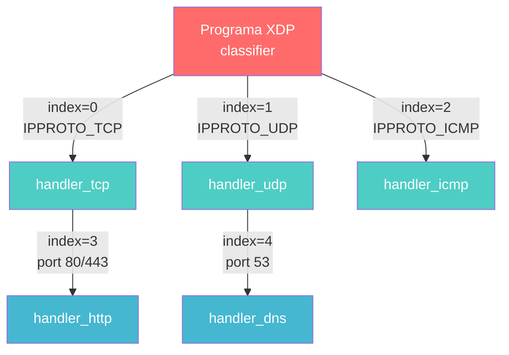
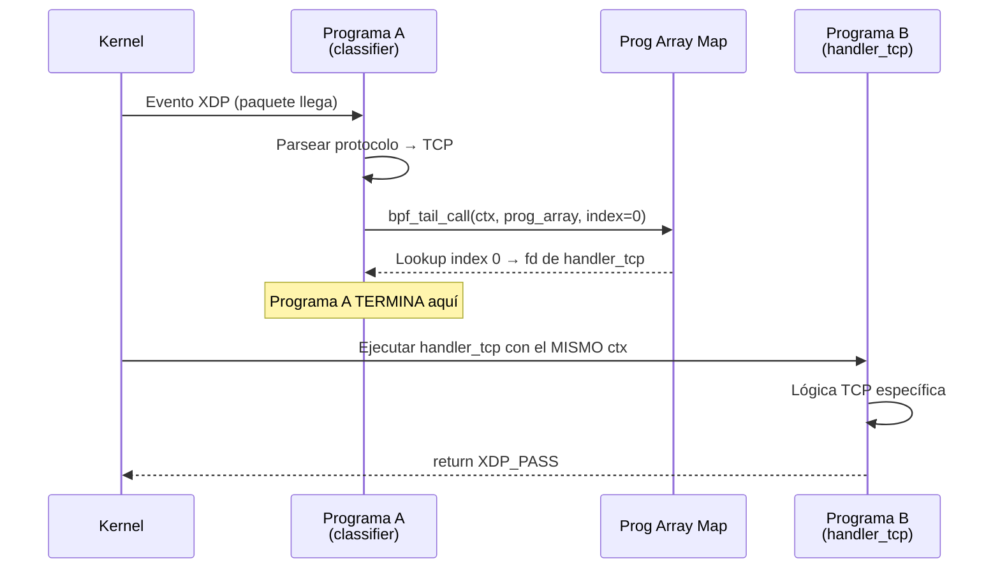
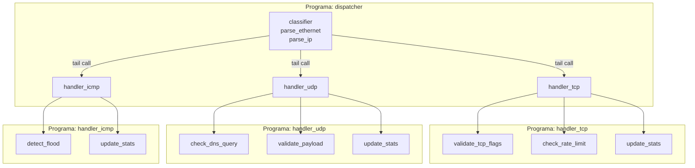
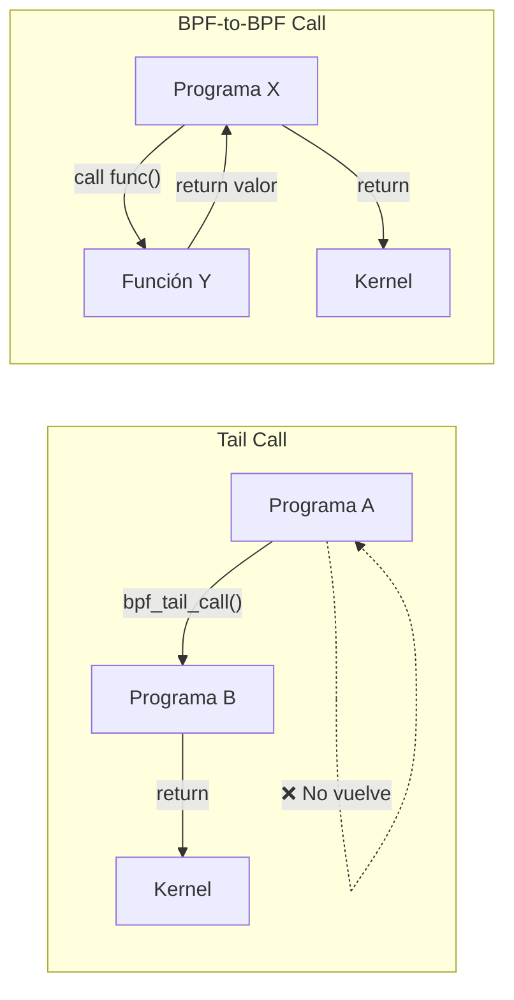
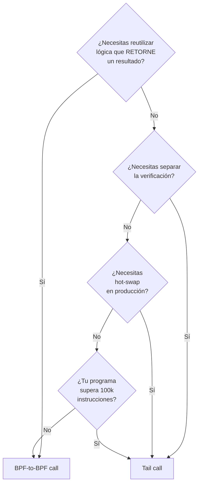

# Capítulo 14: Tail calls, function calls y composición

> "Un programa que hace todo es un programa que hace todo mal. Divide, delega, y que cada parte haga una sola cosa bien."

---

## Términos nuevos en este capítulo

- **tail call** (teil col) — mecanismo que permite a un programa BPF transferir control a otro programa BPF sin volver. El programa llamante termina; el llamado toma su lugar. No es una función — es un reemplazo.
- **BPF_MAP_TYPE_PROG_ARRAY** (prog aréi) — tipo especial de map que almacena file descriptors de programas BPF. Es la tabla de saltos que las tail calls usan para saber a qué programa transferir control.
- **bpf_tail_call** (bi-pi-ef teil col) — helper function que ejecuta la tail call. Recibe el contexto, el prog_array map, y un índice. Si el índice es válido, el control pasa al programa destino. Si falla, la ejecución continúa en la siguiente línea (no hace crash).
- **BPF-to-BPF function call** (bi-pi-ef tu bi-pi-ef) — llamada a función normal dentro del ecosistema BPF. A diferencia de una tail call, la función llamada retorna al punto de llamada. Es el `call` + `return` tradicional.
- **stack depth** (stak depz) — profundidad acumulada del stack entre un programa y sus funciones BPF-to-BPF. El verifier impone un máximo de 512 bytes por programa, y las llamadas anidadas comparten ese presupuesto.
- **prog_array** (prog aréi) — nombre coloquial del map de tipo `BPF_MAP_TYPE_PROG_ARRAY`. Se usa indistintamente con "program array map".

## Objetivos

Al terminar este capítulo vas a poder:

1. Usar tail calls para componer programas eBPF en pipelines modulares
2. Implementar BPF-to-BPF function calls para reutilizar lógica sin cambiar de programa
3. Diseñar arquitecturas de procesamiento que combinan ambas técnicas para problemas complejos

## Prerrequisitos

- Dominar maps en todas sus formas (Capítulo 6) — necesitas entender cómo funciona un map para usar el prog_array
- Entender las reglas del verifier (Capítulo 7) — las tail calls y function calls tienen restricciones específicas que el verifier enforce
- Haber implementado programas XDP o con tracepoints (Capítulos 9-10) — los ejemplos de este capítulo usan XDP como contexto
- Haber completado el ejercicio integrador del Capítulo 13

---

## 14.1 El problema de la complejidad — Por qué un solo programa no basta

En el Capítulo 13 hablamos de las paredes que ibas a golpear. Aquí está la primera: tu programa eBPF es un monolito.

Hasta ahora, cada programa BPF que escribiste vive en una sola función. Una entrada, una lógica, una salida. Eso funciona cuando el problema es simple: contar syscalls, parsear un paquete, registrar un evento.

Pero el mundo real no es simple.

### El escenario: un classifier de paquetes

Imagina que necesitas un programa XDP que clasifique tráfico de red. Tiene que manejar:

- TCP con lógica de rate limiting por IP
- UDP con lógica de filtering por puerto
- ICMP con lógica de flood detection
- DNS (UDP puerto 53) con inspection de queries
- HTTP (TCP puerto 80/443) con extracción de headers
- Todo lo demás: forward sin tocar

Si metes todo en un solo programa, terminas con algo así:

```c
SEC("xdp")
int classifier(struct xdp_md *ctx) {
    // Parsear Ethernet...
    // Parsear IP...
    
    if (ip->protocol == IPPROTO_TCP) {
        __u16 dport = /* parsear TCP */;
        if (dport == 80 || dport == 443) {
            // 100 líneas de lógica HTTP...
        } else {
            // 50 líneas de rate limiting...
        }
    } else if (ip->protocol == IPPROTO_UDP) {
        __u16 dport = /* parsear UDP */;
        if (dport == 53) {
            // 80 líneas de DNS inspection...
        } else {
            // 30 líneas de UDP filtering...
        }
    } else if (ip->protocol == IPPROTO_ICMP) {
        // 40 líneas de flood detection...
    }
    // ... y sigue creciendo
    
    return XDP_PASS;
}
```

### Por qué esto es un problema

1. **Complejidad del verifier**: El verifier analiza todos los caminos posibles. Con 6 ramas de lógica compleja, puede tardar minutos en verificar. Y tiene un límite de complejidad (1 millón de instrucciones verificadas) que este programa puede superar.

2. **Mantenibilidad**: Cada cambio a la lógica de DNS requiere recompilar y recargar todo el classifier. Un bug en ICMP puede afectar el flujo TCP.

3. **Tamaño del programa**: Hay un límite de instrucciones BPF por programa. En kernels modernos es de 1 millón, pero en kernels más viejos era 4096. Un monolito enorme puede excederlo.

4. **Reutilización**: La lógica de parseo de headers se repite. La lógica de rate limiting podría servir para TCP y UDP, pero está hardcoded en una rama.

### La solución: composición

eBPF ofrece dos mecanismos para romper un programa monolítico en piezas:

| Mecanismo | Qué hace | Analogía |
|-----------|----------|----------|
| **Tail calls** | Transfiere control a otro programa BPF completo. No vuelve. | Pasar la pelota a otro jugador — tú sales de la cancha |
| **BPF-to-BPF calls** | Llama a una función dentro del mismo programa. Vuelve. | Llamar a un compañero para que haga una jugada y te devuelva la pelota |

Con tail calls, el classifier se convierte en un dispatcher ligero que delega a handlers especializados:



Cada caja es un programa BPF independiente. Se carga por separado, se verifica por separado, se puede actualizar por separado. El dispatcher solo decide a quién pasar el control.

Con BPF-to-BPF calls, la lógica compartida (parseo de headers, rate limiting) se extrae a funciones reutilizables dentro de un mismo programa.

Veamos cada mecanismo en detalle.

---

## 14.2 Tail calls — Llamando a otro programa BPF sin volver

Una tail call es una transferencia de control irreversible. Cuando un programa BPF ejecuta `bpf_tail_call`, su ejecución termina y el programa destino toma su lugar. No hay retorno al programa original.

### Cómo funciona internamente

El mecanismo requiere tres piezas:

1. **Un prog_array map** — de tipo `BPF_MAP_TYPE_PROG_ARRAY`. Almacena file descriptors de programas BPF indexados por un entero.
2. **La helper `bpf_tail_call`** — recibe el contexto, el map, y el índice del programa destino.
3. **Programas destino** — deben ser del mismo tipo que el programa que hace la tail call (si el caller es XDP, los callees deben ser XDP).

El flujo:



Puntos clave:

- **El contexto (`ctx`) se comparte.** El programa destino recibe el mismo puntero al paquete, la misma metadata. No se copia nada.
- **El stack se resetea.** El programa destino empieza con un stack limpio de 512 bytes. Las variables locales del caller desaparecen.
- **Si la tail call falla, la ejecución continúa.** Si el índice no existe en el map, o el map está vacío en esa posición, `bpf_tail_call` no hace nada y la siguiente instrucción se ejecuta normalmente. No es un error fatal.

### Ejemplo: dispatcher XDP con tail calls

Vamos a implementar el classifier de la sección anterior. Primero, el programa BPF en C:

```c
//go:build ignore

#include <linux/bpf.h>
#include <linux/if_ether.h>
#include <linux/ip.h>
#include <bpf/bpf_helpers.h>

// Map de tipo prog_array: almacena programas BPF indexados por protocolo.
// El user space (Go) va a popular este map con los file descriptors
// de los handlers.
struct {
    __uint(type, BPF_MAP_TYPE_PROG_ARRAY);
    __uint(max_entries, 8);
    __type(key, __u32);
    __type(value, __u32);  // En realidad almacena fd de programa
} prog_array SEC(".maps");

// Handler para TCP — se carga como programa independiente
SEC("xdp")
int handler_tcp(struct xdp_md *ctx) {
    bpf_printk("handler_tcp: procesando paquete TCP");
    // Aquí iría la lógica de rate limiting, inspección, etc.
    return XDP_PASS;
}

// Handler para UDP
SEC("xdp")
int handler_udp(struct xdp_md *ctx) {
    bpf_printk("handler_udp: procesando paquete UDP");
    // Aquí iría la lógica de filtering, DNS inspection, etc.
    return XDP_PASS;
}

// Handler para ICMP
SEC("xdp")
int handler_icmp(struct xdp_md *ctx) {
    bpf_printk("handler_icmp: procesando paquete ICMP");
    // Aquí iría la lógica de flood detection
    return XDP_PASS;
}

// Programa principal: el dispatcher.
// Este es el que se adjunta a la interfaz de red.
SEC("xdp")
int classifier(struct xdp_md *ctx) {
    void *data = (void *)(long)ctx->data;
    void *data_end = (void *)(long)ctx->data_end;

    // Parsear Ethernet header
    struct ethhdr *eth = data;
    if ((void *)(eth + 1) > data_end)
        return XDP_PASS;

    // Solo procesamos IPv4
    if (eth->h_proto != __constant_htons(ETH_P_IP))
        return XDP_PASS;

    // Parsear IP header
    struct iphdr *ip = (void *)(eth + 1);
    if ((void *)(ip + 1) > data_end)
        return XDP_PASS;

    // Tail call al handler según el protocolo.
    // Si el protocolo no tiene handler (no hay entrada en el map),
    // bpf_tail_call no hace nada y seguimos con el return XDP_PASS.
    bpf_tail_call(ctx, &prog_array, ip->protocol);

    // Si llegamos aquí, no había handler para este protocolo.
    // Dejamos pasar el paquete sin tocar.
    return XDP_PASS;
}

char LICENSE[] SEC("license") = "GPL";
```

Observaciones:

- **Todos los programas comparten el mismo archivo .c.** Esto es una conveniencia — también podrían estar en archivos separados. Lo importante es que cada `SEC("xdp")` es un programa independiente.
- **El prog_array usa `ip->protocol` como índice directo.** TCP es 6, UDP es 17, ICMP es 1. Los handlers se registran en esos índices.
- **El fallback es silencioso.** Si no hay handler para un protocolo, `bpf_tail_call` falla silenciosamente y el dispatcher retorna `XDP_PASS`.

### El loader en Go

El user space necesita:
1. Cargar todos los programas BPF
2. Popular el prog_array con los file descriptors de los handlers
3. Adjuntar el programa `classifier` a la interfaz de red

```go
package main

//go:generate go run github.com/cilium/ebpf/cmd/bpf2go -target amd64 tailcall tailcall.bpf.c

import (
	"fmt"
	"log"
	"net"
	"os"
	"os/signal"
	"syscall"

	"github.com/cilium/ebpf"
	"github.com/cilium/ebpf/link"
)

func main() {
	iface := "eth0"
	if len(os.Args) > 1 {
		iface = os.Args[1]
	}

	// Cargar todos los objetos BPF.
	objs := tailcallObjects{}
	if err := loadTailcallObjects(&objs, nil); err != nil {
		log.Fatalf("Error cargando objetos BPF: %v", err)
	}
	defer objs.Close()

	// Popular el prog_array con los handlers.
	// La clave es el número de protocolo IP (IPPROTO_TCP=6, UDP=17, ICMP=1).
	// El valor es el file descriptor del programa handler.
	handlers := map[uint32]*ebpf.Program{
		6:  objs.HandlerTcp,  // IPPROTO_TCP
		17: objs.HandlerUdp,  // IPPROTO_UDP
		1:  objs.HandlerIcmp, // IPPROTO_ICMP
	}

	for proto, prog := range handlers {
		if err := objs.ProgArray.Put(proto, prog); err != nil {
			log.Fatalf("Error registrando handler para proto %d: %v", proto, err)
		}
		fmt.Printf("  Handler registrado: protocolo %d → %s\n", proto, prog)
	}

	// Adjuntar el classifier (dispatcher) a la interfaz de red.
	ifaceObj, err := net.InterfaceByName(iface)
	if err != nil {
		log.Fatalf("Interfaz %s no encontrada: %v", iface, err)
	}

	l, err := link.AttachXDP(link.XDPOptions{
		Program:   objs.Classifier,
		Interface: ifaceObj.Index,
	})
	if err != nil {
		log.Fatalf("Error adjuntando XDP a %s: %v", iface, err)
	}
	defer l.Close()

	fmt.Printf("\n🤘 Classifier XDP con tail calls activo en %s\n", iface)
	fmt.Println("   Ctrl+C para detener.")

	sig := make(chan os.Signal, 1)
	signal.Notify(sig, syscall.SIGINT, syscall.SIGTERM)
	<-sig

	fmt.Println("\n👋 Cleanup completo.")
}
```

Lo que el loader hace es conceptualmente simple: carga los programas, llena la tabla de saltos (el prog_array), y adjunta el dispatcher. Cuando llega un paquete TCP, el dispatcher hace la tail call al handler_tcp. El handler procesa el paquete y retorna una acción XDP.

<!-- [INSERTA IMAGEN AQUI: Captura de terminal mostrando la ejecución del loader con los handlers registrados y el classifier activo, junto con la salida de bpf_printk en trace_pipe mostrando los distintos handlers procesando paquetes de diferentes protocolos] -->

### Pasar contexto entre tail calls con maps

Un problema: cuando haces una tail call, el stack se resetea. Las variables locales del caller desaparecen. Si el dispatcher calculó algo que el handler necesita (como un offset ya parseado o un resultado parcial), ¿cómo lo pasas?

La respuesta: maps. Específicamente, un hash map o per-CPU array que sirve como "memoria compartida" entre los programas de la cadena.

```c
// Map para pasar contexto entre programas de la cadena.
// Usamos per-CPU array para evitar contención (cada CPU tiene su copia).
struct call_context {
    __u32 src_ip;
    __u32 dst_ip;
    __u16 src_port;
    __u16 dst_port;
    __u16 ip_header_offset;
};

struct {
    __uint(type, BPF_MAP_TYPE_PERCPU_ARRAY);
    __uint(max_entries, 1);
    __type(key, __u32);
    __type(value, struct call_context);
} ctx_map SEC(".maps");
```

El dispatcher escribe en `ctx_map` antes de la tail call. El handler lee de `ctx_map` al iniciar. Es la técnica estándar para pasar estado — recuerda del Capítulo 6 que los maps per-CPU eliminan la contención entre cores.

> 🔥 **Advertencia**: Los tail calls no son recursión infinita. Hay un límite de 33 saltos (definido como `MAX_TAIL_CALL_CNT` en el kernel). Si tu pipeline tiene más de 33 tail calls encadenadas, la llamada 34 falla silenciosamente. Diseña tu pipeline con eso en mente. Si necesitas más de 33 niveles de despacho, tu arquitectura tiene un problema de diseño, no un problema del límite.

### Actualización en caliente (hot-swap)

Una de las ventajas más poderosas de las tail calls: puedes actualizar un handler sin detener el dispatcher.

Como el prog_array es un map normal, el user space puede hacer `map.Put(index, newProgram)` en cualquier momento. La siguiente tail call que el dispatcher haga para ese índice ejecutará el nuevo programa. Sin downtime, sin recargar el dispatcher.

Esto es especialmente valioso en producción: puedes deployar una nueva versión de la lógica de TCP sin tocar ICMP ni UDP. Si el nuevo handler tiene un bug, lo reemplazas de vuelta. Zero-downtime updates para programas BPF.

---

## 14.3 BPF-to-BPF function calls — Modularización real

Las tail calls resuelven el problema de la composición entre programas. Pero tienen un costo: no vuelven. Si necesitas ejecutar una pieza de lógica compartida y continuar con tu flujo, necesitas otra herramienta.

BPF-to-BPF function calls son exactamente eso: funciones normales dentro del mundo BPF. Las defines con la keyword `static` (o como funciones globales en kernels >= 5.6), las llamas, te retornan un valor, y sigues ejecutando. Como cualquier función en C.

### ¿Qué problema resuelven?

Sin function calls, si tienes lógica repetida entre dos programas (o dos ramas del mismo programa), tu única opción era copiar/pegar o usar macros. Eso infla el bytecode, complica el mantenimiento, y puede superar los límites del verifier porque cada instancia inlined se verifica por separado.

Con function calls:

```c
// Función BPF-to-BPF: parsea IP header y retorna el protocolo.
// Se puede llamar desde múltiples programas o ramas.
static __always_inline int parse_ip_protocol(struct xdp_md *ctx) {
    void *data = (void *)(long)ctx->data;
    void *data_end = (void *)(long)ctx->data_end;

    struct ethhdr *eth = data;
    if ((void *)(eth + 1) > data_end)
        return -1;

    if (eth->h_proto != __constant_htons(ETH_P_IP))
        return -1;

    struct iphdr *ip = (void *)(eth + 1);
    if ((void *)(ip + 1) > data_end)
        return -1;

    return ip->protocol;
}
```

### Ejemplo: funciones de utilidad compartidas

Veamos un programa que usa BPF-to-BPF calls para modularizar la lógica de parseo y estadísticas:

```c
//go:build ignore

#include <linux/bpf.h>
#include <linux/if_ether.h>
#include <linux/ip.h>
#include <linux/tcp.h>
#include <linux/udp.h>
#include <bpf/bpf_helpers.h>
#include <bpf/bpf_endian.h>

// Map de estadísticas por protocolo
struct {
    __uint(type, BPF_MAP_TYPE_PERCPU_ARRAY);
    __uint(max_entries, 256);  // Un slot por cada valor de protocolo IP
    __type(key, __u32);
    __type(value, __u64);
} stats SEC(".maps");

// --- BPF-to-BPF function: incrementar contador ---
static __noinline void increment_stats(__u32 protocol) {
    __u64 *count = bpf_map_lookup_elem(&stats, &protocol);
    if (count) {
        __sync_fetch_and_add(count, 1);
    }
}

// --- BPF-to-BPF function: validar y parsear ethernet ---
static __noinline struct iphdr *parse_ipv4(void *data, void *data_end) {
    struct ethhdr *eth = data;
    if ((void *)(eth + 1) > data_end)
        return NULL;

    if (eth->h_proto != bpf_htons(ETH_P_IP))
        return NULL;

    struct iphdr *ip = (void *)(eth + 1);
    if ((void *)(ip + 1) > data_end)
        return NULL;

    return ip;
}

// --- BPF-to-BPF function: extraer puerto destino ---
static __noinline __u16 get_dst_port(struct iphdr *ip, void *data_end) {
    if (ip->protocol == IPPROTO_TCP) {
        struct tcphdr *tcp = (void *)ip + (ip->ihl * 4);
        if ((void *)(tcp + 1) > data_end)
            return 0;
        return bpf_ntohs(tcp->dest);
    }
    
    if (ip->protocol == IPPROTO_UDP) {
        struct udphdr *udp = (void *)ip + (ip->ihl * 4);
        if ((void *)(udp + 1) > data_end)
            return 0;
        return bpf_ntohs(udp->dest);
    }
    
    return 0;
}

// Programa principal
SEC("xdp")
int packet_stats(struct xdp_md *ctx) {
    void *data = (void *)(long)ctx->data;
    void *data_end = (void *)(long)ctx->data_end;

    // Usar la función de parseo
    struct iphdr *ip = parse_ipv4(data, data_end);
    if (!ip)
        return XDP_PASS;

    // Contar por protocolo
    increment_stats(ip->protocol);

    // Extraer puerto destino si aplica
    __u16 dport = get_dst_port(ip, data_end);
    if (dport > 0) {
        bpf_printk("proto=%d dport=%d", ip->protocol, dport);
    }

    return XDP_PASS;
}

char LICENSE[] SEC("license") = "GPL";
```

Cada función (`parse_ipv4`, `increment_stats`, `get_dst_port`) es una BPF-to-BPF call. El verifier las analiza una vez y reutiliza el resultado en cada punto de llamada.

### `__noinline` vs `__always_inline`

Dos estrategias:

| Atributo | Qué hace | Cuándo usar |
|----------|----------|-------------|
| `__always_inline` | El compilador copia el cuerpo de la función en cada punto de llamada | Funciones pequeñas (< 10 instrucciones). Evita overhead de llamada. |
| `__noinline` | Genera una llamada real. El verifier verifica la función una sola vez. | Funciones grandes o compartidas entre muchos call sites. Reduce bytecode total. |

Si no pones ninguno, el compilador decide. Con `-O2` generalmente inlinea funciones pequeñas. Para funciones que explícitamente quieres como unidades separadas (para reducir complejidad del verifier), usa `__noinline`.

### Funciones globales (kernel >= 5.6)

A partir del kernel 5.6, puedes declarar funciones BPF como "globales" (sin `static`). Esto permite:

- Que el verifier las analice de forma independiente
- Que puedan ser llamadas desde programas en diferentes archivos .o (después de link)
- Verificación separada: si la firma de la función es correcta, el verifier no necesita re-analizar su cuerpo en cada call site

```c
// Función global: verificada independientemente.
// El verifier confía en la firma sin re-analizar el cuerpo en cada call site.
int parse_ipv4_global(struct xdp_md *ctx) {
    // ... lógica de parseo ...
    return 0;
}
```

Esto es un avance significativo para programas grandes: reduce drásticamente el tiempo de verificación porque cada función se analiza solo una vez.

---

## 14.4 Combinando ambos — Arquitectura de programas complejos

En la práctica, los sistemas eBPF complejos usan ambas técnicas juntas. Tail calls para la composición de alto nivel (pipeline de programas) y BPF-to-BPF calls para la modularización dentro de cada programa.

### El patrón: dispatcher + handlers modulares



Cada handler es un programa independiente (separado por tail call), pero internamente usa BPF-to-BPF calls para organizar su lógica. Las funciones como `update_stats` se pueden compartir entre handlers si están en el mismo archivo de compilación (o como funciones globales en kernels modernos).

### Ejemplo combinado: pipeline con funciones compartidas

```c
//go:build ignore

#include <linux/bpf.h>
#include <linux/if_ether.h>
#include <linux/ip.h>
#include <linux/tcp.h>
#include <bpf/bpf_helpers.h>
#include <bpf/bpf_endian.h>

// --- Maps ---
struct {
    __uint(type, BPF_MAP_TYPE_PROG_ARRAY);
    __uint(max_entries, 8);
    __type(key, __u32);
    __type(value, __u32);
} jmp_table SEC(".maps");

struct {
    __uint(type, BPF_MAP_TYPE_PERCPU_ARRAY);
    __uint(max_entries, 256);
    __type(key, __u32);
    __type(value, __u64);
} pkt_count SEC(".maps");

struct {
    __uint(type, BPF_MAP_TYPE_HASH);
    __uint(max_entries, 10000);
    __type(key, __u32);    // IP source
    __type(value, __u64);  // packet count
} rate_map SEC(".maps");

// Índices en el prog_array
#define PROG_TCP_HANDLER  0
#define PROG_UDP_HANDLER  1

// --- Funciones compartidas (BPF-to-BPF) ---

// Contabilidad por protocolo — usada por todos los handlers
static __noinline void count_packet(__u32 proto) {
    __u64 *cnt = bpf_map_lookup_elem(&pkt_count, &proto);
    if (cnt)
        __sync_fetch_and_add(cnt, 1);
}

// Rate limiting por IP — retorna 1 si excede el límite
static __noinline int check_rate(__u32 src_ip, __u64 limit) {
    __u64 *count = bpf_map_lookup_elem(&rate_map, &src_ip);
    if (!count) {
        __u64 initial = 1;
        bpf_map_update_elem(&rate_map, &src_ip, &initial, BPF_ANY);
        return 0;  // Primer paquete, no excede
    }
    
    __sync_fetch_and_add(count, 1);
    return (*count > limit) ? 1 : 0;
}

// --- Handler TCP ---
SEC("xdp")
int handler_tcp(struct xdp_md *ctx) {
    void *data = (void *)(long)ctx->data;
    void *data_end = (void *)(long)ctx->data_end;

    struct ethhdr *eth = data;
    if ((void *)(eth + 1) > data_end)
        return XDP_PASS;
    
    struct iphdr *ip = (void *)(eth + 1);
    if ((void *)(ip + 1) > data_end)
        return XDP_PASS;

    // Usar función compartida: contar
    count_packet(IPPROTO_TCP);

    // Usar función compartida: rate limit
    if (check_rate(ip->saddr, 1000)) {
        bpf_printk("TCP rate limit exceeded for IP %x", ip->saddr);
        return XDP_DROP;
    }

    return XDP_PASS;
}

// --- Handler UDP ---
SEC("xdp")
int handler_udp(struct xdp_md *ctx) {
    void *data = (void *)(long)ctx->data;
    void *data_end = (void *)(long)ctx->data_end;

    struct ethhdr *eth = data;
    if ((void *)(eth + 1) > data_end)
        return XDP_PASS;
    
    struct iphdr *ip = (void *)(eth + 1);
    if ((void *)(ip + 1) > data_end)
        return XDP_PASS;

    // Usar funciones compartidas
    count_packet(IPPROTO_UDP);

    if (check_rate(ip->saddr, 5000)) {
        bpf_printk("UDP rate limit exceeded for IP %x", ip->saddr);
        return XDP_DROP;
    }

    return XDP_PASS;
}

// --- Dispatcher principal ---
SEC("xdp")
int dispatcher(struct xdp_md *ctx) {
    void *data = (void *)(long)ctx->data;
    void *data_end = (void *)(long)ctx->data_end;

    struct ethhdr *eth = data;
    if ((void *)(eth + 1) > data_end)
        return XDP_PASS;

    if (eth->h_proto != bpf_htons(ETH_P_IP))
        return XDP_PASS;

    struct iphdr *ip = (void *)(eth + 1);
    if ((void *)(ip + 1) > data_end)
        return XDP_PASS;

    // Tail call al handler apropiado
    if (ip->protocol == IPPROTO_TCP)
        bpf_tail_call(ctx, &jmp_table, PROG_TCP_HANDLER);
    else if (ip->protocol == IPPROTO_UDP)
        bpf_tail_call(ctx, &jmp_table, PROG_UDP_HANDLER);

    // Protocolo sin handler: contar y pasar
    count_packet(ip->protocol);
    return XDP_PASS;
}

char LICENSE[] SEC("license") = "GPL";
```

Y el loader en Go que lo orquesta:

```go
package main

//go:generate go run github.com/cilium/ebpf/cmd/bpf2go -target amd64 pipeline pipeline.bpf.c

import (
	"fmt"
	"log"
	"net"
	"os"
	"os/signal"
	"syscall"
	"time"

	"github.com/cilium/ebpf"
	"github.com/cilium/ebpf/link"
)

func main() {
	iface := "eth0"
	if len(os.Args) > 1 {
		iface = os.Args[1]
	}

	objs := pipelineObjects{}
	if err := loadPipelineObjects(&objs, nil); err != nil {
		log.Fatalf("Error cargando objetos BPF: %v", err)
	}
	defer objs.Close()

	// Registrar handlers en la jump table
	if err := objs.JmpTable.Put(uint32(0), objs.HandlerTcp); err != nil {
		log.Fatalf("Error registrando handler TCP: %v", err)
	}
	if err := objs.JmpTable.Put(uint32(1), objs.HandlerUdp); err != nil {
		log.Fatalf("Error registrando handler UDP: %v", err)
	}

	// Adjuntar dispatcher a la interfaz
	ifaceObj, err := net.InterfaceByName(iface)
	if err != nil {
		log.Fatalf("Interfaz %s no encontrada: %v", iface, err)
	}

	l, err := link.AttachXDP(link.XDPOptions{
		Program:   objs.Dispatcher,
		Interface: ifaceObj.Index,
	})
	if err != nil {
		log.Fatalf("Error adjuntando XDP: %v", err)
	}
	defer l.Close()

	fmt.Printf("🤘 Pipeline XDP activo en %s\n", iface)
	fmt.Println("   TCP handler → rate limit 1000 pkts/IP")
	fmt.Println("   UDP handler → rate limit 5000 pkts/IP")

	// Mostrar stats periódicamente
	go printStats(objs.PktCount)

	sig := make(chan os.Signal, 1)
	signal.Notify(sig, syscall.SIGINT, syscall.SIGTERM)
	<-sig
	fmt.Println("\n👋 Pipeline detenido.")
}

func printStats(m *ebpf.Map) {
	ticker := time.NewTicker(5 * time.Second)
	defer ticker.Stop()

	for range ticker.C {
		var (
			key     uint32
			values  []uint64  // per-CPU values
		)
		
		entries := m.Iterate()
		fmt.Println("\n--- Packet Stats ---")
		for entries.Next(&key, &values) {
			total := uint64(0)
			for _, v := range values {
				total += v
			}
			if total > 0 {
				fmt.Printf("  proto %3d: %d pkts\n", key, total)
			}
		}
	}
}
```

<!-- [INSERTA IMAGEN AQUI: Captura mostrando el pipeline en ejecución con stats periódicas de paquetes TCP, UDP e ICMP procesados, demostrando que cada handler funciona de forma independiente] -->

### Diagrama: tail call vs function call — comparación directa



| Aspecto | Tail call | BPF-to-BPF call |
|---------|-----------|-----------------|
| **Retorno** | No vuelve al caller | Vuelve al caller |
| **Stack** | Se resetea (512 bytes frescos) | Comparte stack del caller |
| **Contexto** | Mismo `ctx`, pero variables locales perdidas | Acceso a todo el scope del caller |
| **Verificación** | Cada programa se verifica por separado | La función se verifica como parte del programa |
| **Actualización** | Hot-swap sin recargar el dispatcher | Requiere recompilar todo el programa |
| **Uso típico** | Pipeline de procesamiento, dispatch por tipo | Lógica compartida, helpers reutilizables |
| **Límite** | 33 tail calls encadenadas máximo | 8 niveles de anidación de llamadas |

---

## 14.5 Limitaciones y trade-offs — Stack depth, verifier complexity

Toda herramienta poderosa viene con restricciones. Las tail calls y function calls no son la excepción. Antes de diseñar tu arquitectura, necesitas conocer los límites.

### Limitaciones de tail calls

**1. Máximo 33 saltos encadenados**

El kernel define `MAX_TAIL_CALL_CNT = 33`. Si un programa A hace tail call a B, B a C, C a D… la cadena puede tener como máximo 33 programas. El salto 34 falla silenciosamente.

Esto no es un bug — es una protección contra loops infinitos. Si un programa A tail-calls a B que tail-calls de vuelta a A, el kernel no puede detectar eso estáticamente (el prog_array se llena en runtime). El contador de 33 es la protección.

**Implicación de diseño:** Tu pipeline debe ser un grafo dirigido acíclico (DAG) con profundidad máxima 33. Si tienes un diseño con más de 33 niveles, refactoriza — usa function calls para la lógica interna y reserva tail calls para la composición de alto nivel.

**2. Todos los programas deben ser del mismo tipo**

Si tu dispatcher es `BPF_PROG_TYPE_XDP`, todos los handlers en el prog_array deben ser `BPF_PROG_TYPE_XDP`. No puedes hacer tail call de un programa XDP a un programa de tracepoint. El kernel verifica esto al momento de insertar en el prog_array.

**3. El contexto compartido es opaco**

Los programas en una cadena de tail calls comparten el `ctx`, pero no pueden pasar parámetros arbitrarios. El stack se resetea. Si necesitas pasar datos, tienes que usar maps (como vimos con `ctx_map`). Esto añade un lookup de map por cada transición — un costo en latencia.

**4. Debugging es más complejo**

Cuando un programa falla o produce un resultado inesperado en una cadena de tail calls, no tienes un stack trace unificado. Cada programa es independiente desde la perspectiva del verifier y del profiling. Necesitas instrumentar explícitamente (con maps o `bpf_printk`) para saber por qué handler pasó un paquete y qué hizo.

### Limitaciones de BPF-to-BPF function calls

**1. Stack depth acumulada: 512 bytes total**

El stack de 512 bytes es compartido entre el programa principal y todas las funciones que llama. Si tu programa usa 256 bytes de stack y llama a una función que usa 300 bytes, el verifier rechaza el programa.

**Implicación:** Funciones BPF-to-BPF deben ser ligeras en uso de stack. Variables locales grandes deben vivir en maps, no en stack.

**2. Máximo 8 niveles de anidación**

Puedes tener funciones que llaman funciones que llaman funciones… pero hasta 8 niveles de profundidad. Si A llama a B, B llama a C, y así hasta H que llama a I — el verifier rechaza la llamada a I.

**3. Incompatibilidad histórica con tail calls**

En kernels anteriores al 5.10, **no podías combinar BPF-to-BPF calls con tail calls** en el mismo programa. El verifier lo rechazaba. A partir del kernel 5.10, esta restricción se eliminó y puedes usar ambas sin problemas.

Si tu target de producción incluye kernels < 5.10, necesitas elegir uno u otro para cada programa. En ese caso: tail calls para composición inter-programa, inline functions para modularización interna.

> ⚙️ **Nota técnica**: La restricción existía porque el JIT necesitaba inyectar un prólogo especial para las function calls que era incompatible con el mecanismo de tail call. A partir del 5.10, los JIT de x86_64 y ARM64 resolvieron este conflicto. Si usas una arquitectura menos común (MIPS, RISC-V), verifica el soporte en tu versión de kernel.

**4. Verificación puede ser más costosa**

Si una función es llamada desde 10 puntos diferentes, el verifier (en kernels < 5.6, sin funciones globales) tenía que verificarla en el contexto de cada call site. Esto podía explotar la complejidad del análisis.

Con funciones globales (kernel >= 5.6), el verifier las analiza una vez y confía en la firma. Es la solución si tienes funciones compartidas en programas grandes.

### Trade-offs: ¿cuándo usar qué?



**Usa tail calls cuando:**
- Quieres un pipeline de procesamiento modular
- Necesitas actualizar handlers individuales sin recargar todo
- Tu programa monolítico supera los límites del verifier
- Quieres separar equipos de desarrollo por handler

**Usa BPF-to-BPF calls cuando:**
- Necesitas una función que retorne un valor
- Tienes lógica repetida dentro del mismo programa
- Quieres reducir el tamaño del bytecode (vs inline)
- Necesitas acceso al stack del caller

**Combina ambas cuando:**
- Tienes un pipeline complejo (tail calls para dispatch)
- Cada handler tiene lógica interna modular (function calls)
- Kernel >= 5.10 es tu mínimo soportado

### Alternativa sin eBPF

Si tu problema es "necesito procesar paquetes con lógica que cambia por protocolo", hay alternativas que no involucran la complejidad de tail calls:

- **Netfilter/iptables con nftables**: Para lógica de filtrado simple, nftables tiene su propio lenguaje de reglas con clasificación por protocolo. No tiene el rendimiento de XDP, pero es más fácil de operar y debuggear.
- **DPDK**: Si tu problema es puramente rendimiento de networking y no necesitas correr en el kernel, DPDK te da user-space networking con acceso directo al NIC. Sin limitaciones de verifier ni stack.

La ventaja de eBPF + tail calls es el balance: rendimiento de kernel-space con la flexibilidad de actualizar lógica sin reiniciar servicios ni descargar módulos.

---

## Ejercicio: Classifier multi-protocolo con tail calls

📋 **Nivel:** Ninja
📚 **Conceptos previos:** XDP (Cap 10), Maps (Cap 6), Verifier (Cap 7), Tail calls y function calls (este capítulo)
🖥️ **Entorno:** Lab del libro con kernel >= 5.10 y al menos 2 interfaces de red (o veth pairs)

### Escenario

Trabajas en un ISP que necesita clasificar y aplicar políticas diferenciadas al tráfico entrante en un gateway de borde. El volumen es alto (100k+ paquetes por segundo por interfaz), la lógica por protocolo es diferente, y necesitas poder actualizar las políticas de un protocolo sin afectar a los demás.

Tu tarea: diseñar e implementar un classifier XDP que use tail calls para delegar a handlers especializados por tipo de protocolo, con BPF-to-BPF calls para la lógica compartida.

### Requisitos funcionales

1. Un programa dispatcher que parsee hasta la capa IP y despache via tail call según `ip->protocol`
2. Handlers independientes para al menos 4 protocolos: TCP, UDP, ICMP, y uno más a tu elección (GRE, SCTP, etc.)
3. El handler TCP debe implementar rate limiting por IP source usando un map compartido
4. El handler UDP debe inspeccionar si el puerto destino es 53 (DNS) y, si lo es, hacer una segunda tail call a un handler DNS dedicado
5. Cada handler debe actualizar estadísticas globales (paquetes procesados, bytes, drops) accesibles desde user space
6. El user space (Go con cilium/ebpf) debe: cargar todos los programas, popular el prog_array, adjuntar el dispatcher, y mostrar estadísticas cada 5 segundos

### Restricciones

- Latencia máxima: < 2 µs por paquete en el hot path (dispatcher → handler → return)
- La cadena de tail calls no debe exceder 3 niveles de profundidad (dispatcher → handler → sub-handler como máximo)
- Debe funcionar en kernel >= 5.10
- El hot-swap de un handler individual no debe causar pérdida de paquetes
- La lógica compartida (parseo, stats) debe usar BPF-to-BPF calls, no copiar/pegar

### Técnicas requeridas

- Tail calls con `BPF_MAP_TYPE_PROG_ARRAY` para composición de programas
- BPF-to-BPF function calls para modularización interna
- Maps per-CPU para estadísticas sin contención
- Maps compartidos para pasar contexto entre tail calls
- User space en Go que demuestre hot-swap de un handler

### Nota

No hay una sola solución correcta. Diseña, implementa, y mide. Algunas preguntas para guiar tu diseño:

- ¿Pones el parseo de headers en el dispatcher o en cada handler? (trade-off: duplicación vs costo de pasar contexto via map)
- ¿Cómo manejas protocolos sin handler? (¿DROP, PASS, default handler?)
- ¿Cómo demuestras el hot-swap sin perder paquetes? (necesitas generar tráfico mientras actualizas)
- ¿Qué pasa si el rate limiter necesita reset periódico? ¿Lo hace el kernel o user space?

---

## Resumen

Lo que te llevas de este capítulo:

1. **Los programas eBPF monolíticos no escalan.** Cuando la complejidad crece, necesitas composición. Las tail calls y BPF-to-BPF function calls son tus dos herramientas para romper el monolito.

2. **Tail calls transfieren control sin retorno.** Un programa termina y otro toma su lugar con el mismo contexto. Requieren un `BPF_MAP_TYPE_PROG_ARRAY` y la helper `bpf_tail_call`. Permiten pipelines modulares y hot-swap de handlers.

3. **BPF-to-BPF function calls son funciones normales.** Se llaman, retornan un valor, y el flujo continúa. Reducen duplicación y organizan la lógica interna de un programa. Comparten el stack del caller (512 bytes totales).

4. **El límite de 33 tail calls es absoluto.** Diseña pipelines con profundidad acotada. Si necesitas más de 33 niveles, tu arquitectura necesita refactoring.

5. **La combinación de ambas requiere kernel >= 5.10.** En kernels anteriores no puedes mezclarlas en el mismo programa. Si tu target incluye kernels viejos, elige una u otra por programa.

6. **Pasar contexto entre tail calls requiere maps.** El stack se resetea en cada tail call. Usa per-CPU arrays para compartir estado sin contención.

7. **Los trade-offs importan.** Tail calls para composición y hot-swap. Function calls para modularización y reutilización. Conoce los límites de stack, anidación, y compatibilidad de kernel antes de elegir tu arquitectura.

---

## Para saber más

- 📖 [BPF tail calls documentation (kernel.org)](https://docs.kernel.org/bpf/map_prog_array.html) — Documentación oficial del kernel sobre `BPF_MAP_TYPE_PROG_ARRAY` y el mecanismo de tail calls.
- 📖 [BPF-to-BPF calls design (cilium.io)](https://docs.cilium.io/en/latest/bpf/architecture/#bpf-to-bpf-calls) — Explicación detallada de cómo funcionan las function calls BPF-to-BPF en el contexto de Cilium.
- 💻 [cilium/ebpf tail call example](https://github.com/cilium/ebpf/tree/main/examples/tailcall) — Ejemplo funcional de tail calls con cilium/ebpf en Go. Código mínimo y ejecutable.
- 📝 [Combining tail calls and BPF-to-BPF calls (LWN)](https://lwn.net/Articles/834157/) — Artículo sobre la eliminación de la restricción de combinar ambas técnicas a partir del kernel 5.10.
- 📖 [XDP tutorial — tail calls section](https://github.com/xdp-project/xdp-tutorial/tree/master/advanced03-AF_XDP) — Tutorial práctico del proyecto XDP con ejemplos de tail calls en contexto de networking.
