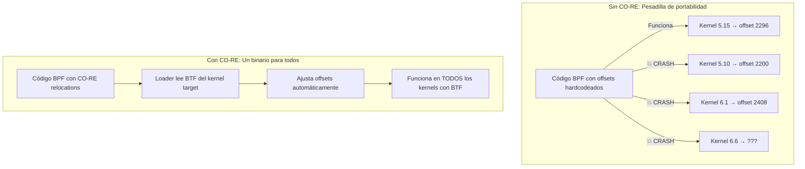
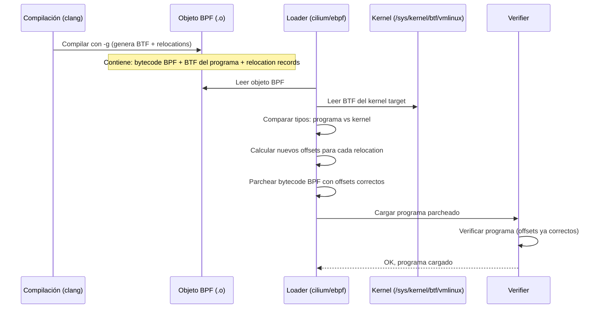
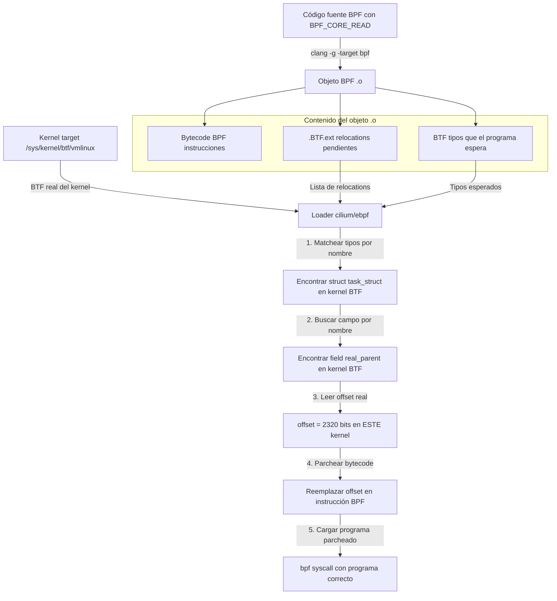

# Capítulo 15: BTF y CO-RE — Escribe una vez, corre en todos lados

> "El kernel cambia. Tus binarios no deberían."

---

## Términos nuevos en este capítulo

- **BTF** (bi-ti-éf) — BPF Type Format. Formato compacto de metadata que describe todos los tipos (structs, enums, typedefs) del kernel. Es como un DWARF minimalista que viaja embebido en el binario del kernel y en los objetos BPF.
- **CO-RE** (kór) — Compile Once, Run Everywhere. Mecanismo que permite compilar un programa BPF una sola vez y ejecutarlo en kernels con diferentes layouts de estructuras, resolviendo offsets en tiempo de carga.
- **vmlinux.h** — Header generado automáticamente desde el BTF del kernel que contiene las definiciones de TODAS las estructuras, enums y typedefs del kernel. Reemplaza la necesidad de instalar kernel headers.
- **relocation** (ri-lou-kéi-shon) — Ajuste de offsets de campos dentro de estructuras del kernel que CO-RE realiza en tiempo de carga del programa BPF. Permite que un mismo binario funcione aunque `task_struct` tenga layout diferente.
- **BPF_CORE_READ** (bi-pi-éf kor ríd) — Macro que realiza lectura de campos de estructuras del kernel con soporte de relocations CO-RE. El compilador emite metadata para que el loader pueda ajustar los offsets.
- **__builtin_preserve_access_index** — Intrínseco del compilador clang que instruye a emitir información de relocation para cada acceso a campos de estructuras. Es el mecanismo de bajo nivel que habilita CO-RE.
- **field offset** (fíld ófset) — Posición en bytes de un campo dentro de una estructura. Puede cambiar entre versiones del kernel cuando se agregan, remueven o reordenan campos.
- **type encoding** (taip en-kóu-ding) — Representación compacta de la información de un tipo (nombre, tamaño, campos, offsets) en formato BTF. Cada tipo tiene un ID único dentro del BTF del kernel.

## Objetivos

Al terminar este capítulo vas a poder:

1. Entender por qué la portabilidad entre versiones de kernel es un problema fundamental para programas eBPF
2. Usar BTF para acceso type-safe a estructuras internas del kernel sin depender de kernel headers
3. Implementar programas CO-RE que funcionen en múltiples versiones de kernel sin recompilación
4. Generar y usar `vmlinux.h` como reemplazo universal de kernel headers

## Prerrequisitos

- Haber usado kprobes y fentry/fexit para interceptar funciones del kernel (Capítulo 9)
- Saber acceder a estructuras del kernel desde programas BPF (Capítulo 9, sección fentry)
- Conocer cilium/ebpf y su workflow de compilación (Capítulo 11)
- Entender cómo se carga un programa BPF en el kernel (Capítulo 4)

---

## 15.1 El infierno de las versiones — Por qué struct task_struct cambia entre kernels

Imagina esto: escribes un programa BPF que lee el PID del proceso padre accediendo a `task->real_parent->tgid`. Funciona perfecto en tu máquina con kernel 5.15. Lo despliegas en producción con kernel 6.1. Explota.

¿Por qué? Porque `struct task_struct` es una de las estructuras más modificadas del kernel. Entre kernel 5.10 y 6.1 se agregaron, movieron y eliminaron campos. El offset de `real_parent` ya no es el mismo.

### El problema concreto

Veamos un programa que NO usa CO-RE — el approach "clásico" de hardcoded offsets:

```c
#include <linux/bpf.h>
#include <bpf/bpf_helpers.h>

// ¡PELIGRO! Offset hardcodeado para kernel 5.15 específico
#define TASK_REAL_PARENT_OFFSET 2296
#define TASK_TGID_OFFSET 2292

SEC("kprobe/do_exit")
int trace_exit(struct pt_regs *ctx) {
    struct task_struct *task = (void *)bpf_get_current_task();

    // Leer el PPID con offsets mágicos
    struct task_struct *parent;
    bpf_probe_read_kernel(&parent, sizeof(parent),
                          (void *)task + TASK_REAL_PARENT_OFFSET);

    __u32 ppid;
    bpf_probe_read_kernel(&ppid, sizeof(ppid),
                          (void *)parent + TASK_TGID_OFFSET);

    __u32 pid = bpf_get_current_pid_tgid() >> 32;
    bpf_printk("pid=%d ppid=%d exiting", pid, ppid);
    return 0;
}

char LICENSE[] SEC("license") = "GPL";
```

Este programa tiene un problema fatal: los números `2296` y `2292` son offsets específicos de **una** compilación particular del kernel. Cambia la versión, cambia la configuración, o incluso cambia la distro — y esos números son basura.

### ¿Qué cambia y por qué?

`struct task_struct` en Linux tiene más de 200 campos. Entre versiones:

- Se agregan campos nuevos (mitigaciones de seguridad, features nuevos)
- Se eliminan campos deprecados
- Se reordenan campos por rendimiento (cache line alignment)
- Se mueven campos a sub-estructuras
- Se cambian tipos (`int` a `unsigned long`, por ejemplo)

```bash
# Tamaño de task_struct en diferentes kernels:
# Kernel 5.4:   ~6400 bytes
# Kernel 5.10:  ~6784 bytes
# Kernel 5.15:  ~7168 bytes
# Kernel 6.1:   ~7680 bytes
# Kernel 6.6:   ~8192 bytes
```

Cada vez que el kernel agrega un campo antes del que tú usas, **todos los offsets se desplazan**. Tu programa que leía `real_parent` del byte 2296 ahora está leyendo memoria incorrecta — o peor, datos de otro campo.

### Las "soluciones" pre-CO-RE

Antes de CO-RE, la gente resolvía esto de formas dolorosas:

1. **Recompilar en cada máquina** — instalar kernel headers y compilar el programa BPF en el target. Funciona, pero destruye la idea de distribuir binarios.

2. **BCC y compilación en runtime** — BCC compila el programa BPF en cada ejecución usando los headers del kernel local. Requiere LLVM/clang instalado en producción. Lento al arrancar. Consume memoria.

3. **Múltiples binarios** — un binario por versión de kernel soportada. Pesadilla de mantenimiento.

4. **Offsets hardcodeados con tabla de versiones** — una lookup table gigante de offsets por kernel. Frágil y tedioso.



<!-- [INSERTA IMAGEN AQUI: Diagrama comparativo mostrando el enfoque sin CO-RE (múltiples binarios o compilación en runtime) vs con CO-RE (un solo binario que se adapta)] -->

> 💡 **Analogía**: Imagina que escribes una carta con la instrucción "ve al edificio de la calle 5, piso 3, puerta 7". Si la ciudad reordena los edificios, tu carta lleva a la persona al lugar equivocado. CO-RE es como escribir "ve a la oficina de Juan García" — el sistema postal sabe la dirección actual de Juan sin importar si se mudó. Usas el nombre del campo, no su posición.

---

## 15.2 BTF — Metadata de tipos para el kernel

BTF es la pieza fundamental que hace posible CO-RE. Sin BTF, no hay relocations. Sin relocations, no hay portabilidad.

### ¿Qué es BTF?

BTF (BPF Type Format) es un formato compacto de metadata que describe **todos los tipos del kernel**: structs, unions, enums, typedefs, funciones, y sus relaciones. Es conceptualmente similar a DWARF (la información de debug), pero:

- **Mucho más compacto** — BTF del kernel ocupa ~3-5 MB vs ~400+ MB de DWARF
- **Diseñado para BPF** — solo contiene lo que el subsistema BPF necesita
- **Viaja con el kernel** — está embebido en `/sys/kernel/btf/vmlinux`
- **También en objetos BPF** — los `.o` compilados con clang llevan su propio BTF

### ¿Dónde está el BTF del kernel?

```bash
# Verificar que tu kernel tiene BTF habilitado:
ls -la /sys/kernel/btf/vmlinux

# Si existe, tu kernel soporta CO-RE.
# Si no existe, necesitas un kernel compilado con CONFIG_DEBUG_INFO_BTF=y

# Ver la configuración del kernel:
cat /boot/config-$(uname -r) | grep CONFIG_DEBUG_INFO_BTF
# CONFIG_DEBUG_INFO_BTF=y  ← esto necesitas
```

### Estructura interna de BTF

BTF usa un sistema de IDs para identificar tipos. Cada tipo tiene un ID único y describe su estructura:

```bash
# Inspeccionar BTF con bpftool:
bpftool btf dump file /sys/kernel/btf/vmlinux format raw | head -50

# Buscar un tipo específico:
bpftool btf dump file /sys/kernel/btf/vmlinux | grep -A5 "struct task_struct {"

# Ver los campos de task_struct con sus offsets:
bpftool btf dump file /sys/kernel/btf/vmlinux format c | grep -A20 "struct task_struct {"
```

La salida de `bpftool btf dump` te muestra exactamente lo que el kernel sabe sobre sus propios tipos:

```
[1] INT 'long unsigned int' size=8 bits_offset=0 nr_bits=64 encoding=(none)
[2] CONST '(anon)' type_id=1
...
[568] STRUCT 'task_struct' size=9472 vlen=249
        'thread_info' type_id=569 bits_offset=0
        'state' type_id=16 bits_offset=192
        'stack' type_id=7 bits_offset=256
        'usage' type_id=170 bits_offset=320
        'flags' type_id=10 bits_offset=352
        ...
        'real_parent' type_id=571 bits_offset=18560
        'parent' type_id=571 bits_offset=18624
        'pid' type_id=230 bits_offset=19008
        'tgid' type_id=230 bits_offset=19040
```

Esos `bits_offset` son exactamente lo que CO-RE usa para resolver accesos a campos. El loader lee este BTF, compara con el BTF embebido en tu programa BPF, y ajusta los offsets.

### BTF en tu programa BPF

Cuando compilas tu programa BPF con clang (con `-g` para debug info), el compilador genera BTF embebido en el objeto `.o`. Este BTF describe los tipos que **tu programa espera encontrar** en el kernel:

```bash
# Compilar con BTF:
clang -O2 -g -target bpf -c programa.bpf.c -o programa.bpf.o

# Ver el BTF del objeto compilado:
bpftool btf dump file programa.bpf.o

# Las secciones BTF en el ELF:
readelf -S programa.bpf.o | grep -i btf
# .BTF           (tipos)
# .BTF.ext       (relocations, line info)
```

### El flujo: BTF del kernel + BTF del programa = relocations



> 🔥 **Advertencia**: BTF requiere que el kernel esté compilado con `CONFIG_DEBUG_INFO_BTF=y`. Sin esta opción, `/sys/kernel/btf/vmlinux` no existe, y CO-RE no funciona. La mayoría de distros modernas (Ubuntu 20.10+, Fedora 31+, RHEL 9+, Debian 11+) ya lo incluyen. Si tu kernel de producción NO tiene BTF, necesitas un plan B: recompilar el kernel con BTF, o usar BCC para compilar en runtime con kernel headers locales.

### ¿Qué distros ya tienen BTF por defecto?

| Distribución | Kernel con BTF desde | Notas |
|---|---|---|
| Ubuntu | 20.10 (kernel 5.8+) | Todas las versiones LTS recientes |
| Fedora | 31 (kernel 5.3+) | Siempre ha sido early adopter |
| RHEL/CentOS | 9.0 (kernel 5.14+) | RHEL 8 NO lo tiene por defecto |
| Debian | 11 "Bullseye" (kernel 5.10+) | Backports disponibles |
| Amazon Linux | 2023 (kernel 6.1+) | AL2 tiene soporte parcial |
| Arch Linux | Siempre (rolling) | `linux` package incluye BTF |

```bash
# Script rápido para verificar soporte:
if [ -f /sys/kernel/btf/vmlinux ]; then
    echo "✅ BTF disponible — CO-RE va a funcionar"
    echo "   Tamaño BTF: $(du -h /sys/kernel/btf/vmlinux | cut -f1)"
else
    echo "❌ BTF NO disponible — necesitas CONFIG_DEBUG_INFO_BTF=y"
    echo "   Tu kernel: $(uname -r)"
fi
```

---

## 15.3 CO-RE — Compile Once, Run Everywhere

CO-RE es el mecanismo completo que resuelve el problema de portabilidad. Usa BTF como su fuente de verdad, pero involucra todo el stack: compilador, formato del objeto, loader, y kernel.

### Los tres pilares de CO-RE

1. **Compilador (clang)** — emite relocation records que dicen "aquí accedo al campo X de struct Y"
2. **Loader (libbpf/cilium/ebpf)** — lee el BTF del kernel target, compara con los relocations, y parchea el bytecode
3. **Kernel** — provee su BTF en `/sys/kernel/btf/vmlinux` y valida el programa parcheado

### Tu primer programa CO-RE

Reescribamos el ejemplo del inicio del capítulo, ahora con CO-RE:

```c
//go:build ignore

#include "vmlinux.h"
#include <bpf/bpf_helpers.h>
#include <bpf/bpf_tracing.h>
#include <bpf/bpf_core_read.h>

struct exit_event {
    __u32 pid;
    __u32 ppid;
    char  comm[16];
};

struct {
    __uint(type, BPF_MAP_TYPE_RINGBUF);
    __uint(max_entries, 256 * 1024);
} events SEC(".maps");

SEC("kprobe/do_exit")
int trace_exit(struct pt_regs *ctx) {
    struct task_struct *task = (struct task_struct *)bpf_get_current_task();

    struct exit_event *e = bpf_ringbuf_reserve(&events, sizeof(*e), 0);
    if (!e)
        return 0;

    e->pid = bpf_get_current_pid_tgid() >> 32;

    // CO-RE: lee task->real_parent->tgid con relocations automáticos
    // Si el offset de real_parent cambió entre kernels, CO-RE lo resuelve
    e->ppid = BPF_CORE_READ(task, real_parent, tgid);

    bpf_get_current_comm(&e->comm, sizeof(e->comm));
    bpf_ringbuf_submit(e, 0);
    return 0;
}

char LICENSE[] SEC("license") = "GPL";
```

Compara esto con la versión hardcodeada del principio:

| Aspecto | Sin CO-RE | Con CO-RE |
|---------|-----------|-----------|
| Acceso a campo | `bpf_probe_read_kernel` + offset numérico | `BPF_CORE_READ(task, real_parent, tgid)` |
| Portabilidad | Solo funciona en UN kernel | Funciona en cualquier kernel con BTF |
| Mantenimiento | Actualizar offsets manualmente | Zero mantenimiento |
| Seguridad de tipos | Ninguna (todo es void*) | Type-safe (el compilador verifica) |
| Legibilidad | Ofuscado | Claro y declarativo |

### La macro BPF_CORE_READ

`BPF_CORE_READ` es tu herramienta principal. Hace dos cosas:

1. Emite una lectura `bpf_probe_read_kernel` del campo
2. Genera un relocation record que dice "este acceso es al campo `nombre` de `struct X`"

```c
// Lectura simple de un campo:
__u32 pid = BPF_CORE_READ(task, tgid);

// Lectura encadenada (seguir punteros):
__u32 ppid = BPF_CORE_READ(task, real_parent, tgid);
// Equivale a: task->real_parent->tgid
// Pero con 2 bpf_probe_read_kernel y 2 relocations

// Lectura de campo de campo (sin puntero intermedio):
__u64 start_time = BPF_CORE_READ(task, start_boottime);

// Leer un string:
char comm[16];
BPF_CORE_READ_STR_INTO(&comm, task, comm);
```

### El loader en Go con soporte BTF

cilium/ebpf maneja BTF y CO-RE de forma transparente. No necesitas hacer nada especial — el loader detecta los relocations en el objeto y los resuelve:

```go
package main

import (
    "bytes"
    "encoding/binary"
    "fmt"
    "log"
    "os"
    "os/signal"

    "github.com/cilium/ebpf/link"
    "github.com/cilium/ebpf/ringbuf"
    "github.com/cilium/ebpf/rlimit"
)

//go:generate go run github.com/cilium/ebpf/cmd/bpf2go -target amd64 exitTracer exit_tracer.bpf.c

type ExitEvent struct {
    PID  uint32
    PPID uint32
    Comm [16]byte
}

func main() {
    if err := rlimit.RemoveMemlock(); err != nil {
        log.Fatal(err)
    }

    // cilium/ebpf resuelve CO-RE relocations automáticamente al cargar.
    // Lee /sys/kernel/btf/vmlinux y parchea los offsets en el bytecode.
    objs := exitTracerObjects{}
    if err := loadExitTracerObjects(&objs, nil); err != nil {
        log.Fatalf("cargando objetos (¿kernel sin BTF?): %v", err)
    }
    defer objs.Close()

    kp, err := link.Kprobe("do_exit", objs.TraceExit, nil)
    if err != nil {
        log.Fatalf("kprobe: %v", err)
    }
    defer kp.Close()

    rd, err := ringbuf.NewReader(objs.Events)
    if err != nil {
        log.Fatalf("ringbuf: %v", err)
    }
    defer rd.Close()

    sig := make(chan os.Signal, 1)
    signal.Notify(sig, os.Interrupt)
    go func() {
        <-sig
        rd.Close()
    }()

    fmt.Println("Tracing procesos que terminan (CO-RE)... Ctrl+C para salir")
    fmt.Printf("%-8s %-8s %s\n", "PID", "PPID", "COMM")

    for {
        record, err := rd.Read()
        if err != nil {
            break
        }

        var event ExitEvent
        if err := binary.Read(bytes.NewReader(record.RawSample), binary.LittleEndian, &event); err != nil {
            continue
        }

        comm := string(bytes.TrimRight(event.Comm[:], "\x00"))
        fmt.Printf("%-8d %-8d %s\n", event.PID, event.PPID, comm)
    }
}
```

**Resultado esperado (idéntico en kernels 5.10, 5.15 y 6.1):**

```
Tracing procesos que terminan (CO-RE)... Ctrl+C para salir
PID      PPID     COMM
4521     1832     ls
4522     1832     cat
4523     1        nginx
4524     4520     sh
```

<!-- [INSERTA IMAGEN AQUI: Captura de terminal mostrando el programa CO-RE ejecutándose, con la salida mostrando procesos que terminan con PID, PPID y nombre] -->

### CO-RE con fentry (la versión más limpia)

Si el kernel target soporta fentry/fexit (>= 5.5 con BTF), puedes combinar CO-RE con fentry para el código más limpio posible:

```c
//go:build ignore

#include "vmlinux.h"
#include <bpf/bpf_helpers.h>
#include <bpf/bpf_tracing.h>
#include <bpf/bpf_core_read.h>

SEC("fentry/do_exit")
int BPF_PROG(trace_exit_fentry, long code) {
    struct task_struct *task = (struct task_struct *)bpf_get_current_task();

    __u32 pid = BPF_CORE_READ(task, tgid);
    __u32 ppid = BPF_CORE_READ(task, real_parent, tgid);

    char comm[16];
    BPF_CORE_READ_STR_INTO(&comm, task, comm);

    bpf_printk("exit: pid=%d ppid=%d comm=%s code=%ld", pid, ppid, comm, code);
    return 0;
}

char LICENSE[] SEC("license") = "GPL";
```

Fentry + CO-RE es la combinación definitiva: acceso type-safe a argumentos (fentry) + portabilidad entre kernels (CO-RE). Es el estado del arte en 2024.

---

## 15.4 vmlinux.h — El header que contiene todo el kernel

¿Notaste el `#include "vmlinux.h"` en los ejemplos anteriores? Ese archivo es una pieza clave de CO-RE.

### ¿Qué es vmlinux.h?

Es un header generado automáticamente desde el BTF del kernel que contiene **todas** las definiciones de tipos del kernel: structs, unions, enums, typedefs. Todo. Las más de 100,000 definiciones de tipos del kernel Linux en un solo archivo.

```bash
# Generar vmlinux.h desde tu kernel actual:
bpftool btf dump file /sys/kernel/btf/vmlinux format c > vmlinux.h

# ¿Cuántas líneas tiene?
wc -l vmlinux.h
# ~180,000 - 250,000 líneas dependiendo del kernel

# ¿Cuántos structs?
grep -c "^struct " vmlinux.h
# ~8,000 - 12,000 structs
```

### ¿Por qué no usar los kernel headers normales?

| Aspecto | Kernel Headers (`linux/*.h`) | vmlinux.h |
|---------|------------------------------|-----------|
| Instalación | Requiere `linux-headers-$(uname -r)` en el target | Se genera una vez o se incluye en el proyecto |
| Completitud | Parcial (no todas las structs internas están expuestas) | 100% completo (todo lo que tiene BTF) |
| Portabilidad | Específico de UNA versión de kernel | Funciona con cualquier kernel que tenga BTF |
| Conflictos | Headers del kernel pueden conflictuar con headers de user space | Autocontenido, sin conflictos |
| Tamaño | Miles de archivos | Un solo archivo |
| CO-RE | No emite relocations correctamente | Diseñado para CO-RE |

### El workflow con vmlinux.h

```bash
# 1. Generar vmlinux.h (una vez, en tu máquina de desarrollo):
bpftool btf dump file /sys/kernel/btf/vmlinux format c > vmlinux.h

# 2. Compilar tu programa BPF con vmlinux.h:
clang -O2 -g -target bpf \
    -D__TARGET_ARCH_x86 \
    -c programa.bpf.c -o programa.bpf.o

# 3. Distribuir el .o (o embebido en tu binario Go)
# ¡No necesitas vmlinux.h en el target!
```

El truco clave: **vmlinux.h se usa solo en compilación**. El binario resultante lleva su BTF embebido, y el loader lo compara contra el BTF del kernel target en runtime. No importa si generaste vmlinux.h desde un kernel 5.15 — el programa funcionará en un kernel 6.1 siempre que los campos que accedes sigan existiendo.

### ¿Qué vmlinux.h usar para compilar?

Puedes usar cualquiera. El vmlinux.h solo necesita tener la **definición** de las structs que tu programa usa. Los offsets reales los resuelve CO-RE en runtime.

En la práctica, usa el vmlinux.h de un kernel relativamente nuevo (6.x) para tener las definiciones más completas. Si accedes a un campo que no existe en un kernel target viejo, CO-RE puede manejarlo con `bpf_core_field_exists()`.

### Verificando existencia de campos

CO-RE te permite chequear en runtime si un campo existe en el kernel target:

```c
#include "vmlinux.h"
#include <bpf/bpf_helpers.h>
#include <bpf/bpf_core_read.h>

SEC("kprobe/do_exit")
int trace_exit(struct pt_regs *ctx) {
    struct task_struct *task = (struct task_struct *)bpf_get_current_task();

    // Campo que existe en todos los kernels:
    __u32 pid = BPF_CORE_READ(task, tgid);

    // Campo que podría no existir en kernels muy viejos:
    if (bpf_core_field_exists(task->loginuid)) {
        __u32 loginuid = BPF_CORE_READ(task, loginuid.val);
        bpf_printk("pid=%d loginuid=%d", pid, loginuid);
    } else {
        bpf_printk("pid=%d (loginuid no disponible)", pid);
    }

    return 0;
}

char LICENSE[] SEC("license") = "GPL";
```

`bpf_core_field_exists()` se resuelve en tiempo de carga (no en runtime). El loader elimina el branch muerto si el campo no existe. Zero overhead.

### vmlinux.h vs headers selectivos

Si tu programa solo accede a 2-3 structs, puedes optar por definir solo esas structs manualmente en vez de incluir todo vmlinux.h. Esto es útil para reducir tiempos de compilación:

```c
// Alternativa minimalista: definir solo lo que necesitas
// (los offsets reales se resuelven via CO-RE de todas formas)

struct task_struct {
    int pid;
    int tgid;
    struct task_struct *real_parent;
    char comm[16];
} __attribute__((preserve_access_index));

// El __attribute__((preserve_access_index)) es CRUCIAL:
// le dice a clang que emita relocations para estos campos
```

Pero en general, usar vmlinux.h completo es más práctico. El compilador solo procesa las definiciones que realmente usas.

> ⚙️ **Nota técnica**: El atributo `__attribute__((preserve_access_index))` en vmlinux.h es lo que diferencia a este header de uno normal. Cada struct en vmlinux.h lleva este atributo, que instruye a clang a emitir relocation records para cada acceso a campos. Sin este atributo, clang calcula los offsets en compilación y los hardcodea — exactamente lo que queremos evitar.

---

## 15.5 Relocations y field access — Cómo CO-RE resuelve offsets en runtime

Ahora entremos en el mecanismo interno. ¿Cómo funciona la magia de que un binario compilado una vez funcione en múltiples kernels?

### El flujo de relocations paso a paso



### Tipos de relocations

CO-RE define varios tipos de relocations que el loader debe resolver:

| Tipo | Qué resuelve | Ejemplo |
|------|-------------|---------|
| FIELD_BYTE_OFFSET | Offset en bytes de un campo | `task->tgid` → offset 2292 |
| FIELD_BYTE_SIZE | Tamaño en bytes de un campo | `sizeof(task->tgid)` → 4 |
| FIELD_EXISTS | Si un campo existe (0 o 1) | `bpf_core_field_exists(task->loginuid)` |
| TYPE_EXISTS | Si un tipo existe (0 o 1) | `bpf_core_type_exists(struct bpf_timer)` |
| TYPE_SIZE | Tamaño total de un tipo | `bpf_core_type_size(struct task_struct)` |
| ENUM_VALUE_EXISTS | Si un valor de enum existe | `bpf_core_enum_value_exists(enum cgroup_subsys_id, ...)` |

### El mecanismo __builtin_preserve_access_index

Debajo de las macros como `BPF_CORE_READ`, el compilador usa un intrínseco llamado `__builtin_preserve_access_index`. Este es el mecanismo de bajo nivel:

```c
// Lo que TÚ escribes:
__u32 tgid = BPF_CORE_READ(task, tgid);

// Lo que el preprocesador expande (simplificado):
__u32 tgid;
bpf_probe_read_kernel(&tgid, sizeof(tgid),
    __builtin_preserve_access_index(&task->tgid));

// Lo que clang genera en el bytecode:
// Instrucción: ldx [r1 + OFFSET], r0
// + Relocation record: "OFFSET es el byte offset de 'tgid' en 'struct task_struct'"
```

El `__builtin_preserve_access_index` le dice a clang: "no calcules el offset ahora — emite un relocation para que se resuelva después".

### Ejemplo: viendo relocations con bpftool

```bash
# Compilar un programa CO-RE:
clang -O2 -g -target bpf -D__TARGET_ARCH_x86 \
    -c core_example.bpf.c -o core_example.bpf.o

# Ver los relocations pendientes:
bpftool btf dump file core_example.bpf.o

# Output (simplificado):
# [1] STRUCT 'task_struct' size=0 vlen=3
#     'tgid' type_id=2 bits_offset=0
#     'real_parent' type_id=3 bits_offset=0
#     'comm' type_id=4 bits_offset=0
#
# Note: bits_offset=0 porque los offsets REALES se resuelven en carga
```

### ¿Qué pasa cuando un campo se renombra?

CO-RE matchea campos **por nombre**. Si entre kernel 5.15 y 6.1 un campo se renombra de `state` a `__state`, CO-RE no puede resolverlo automáticamente.

Para estos casos, existe `bpf_core_field_exists` combinado con un fallback:

```c
SEC("kprobe/schedule")
int trace_schedule(struct pt_regs *ctx) {
    struct task_struct *task = (struct task_struct *)bpf_get_current_task();

    long state;

    // En kernel >= 6.0, task_struct.state se renombró a __state
    if (bpf_core_field_exists(task->__state)) {
        state = BPF_CORE_READ(task, __state);
    } else {
        state = BPF_CORE_READ(task, state);
    }

    bpf_printk("task state: %ld", state);
    return 0;
}
```

Este patrón — check existence + fallback — es la forma idiomática de manejar campos que cambiaron de nombre entre versiones.

### Relocations encadenadas

Cuando haces `BPF_CORE_READ(task, real_parent, tgid)`, CO-RE genera **dos** relocations:

1. Resolver el offset de `real_parent` en `struct task_struct`
2. Leer el puntero, seguirlo, y resolver el offset de `tgid` en la `struct task_struct` apuntada

Cada dereferencía de puntero en la cadena genera una lectura `bpf_probe_read_kernel` separada (porque estás cruzando punteros del kernel que podrían ser en distinta dirección de memoria).

```c
// Una cadena larga:
__u32 ns_inum = BPF_CORE_READ(task, nsproxy, pid_ns_for_children, ns.inum);

// Esto genera 3 relocations + 3 bpf_probe_read_kernel:
// 1. task->nsproxy (offset relocation + read)
// 2. nsproxy->pid_ns_for_children (offset relocation + read)
// 3. pid_ns_for_children->ns.inum (offset relocation + read)
```

> ⚙️ **Nota técnica**: Cada `bpf_probe_read_kernel` en la cadena puede fallar si un puntero intermedio es NULL. En programas robustos, deberías verificar cada nivel. `BPF_CORE_READ` NO verifica NULLs — asume que la estructura está bien formada. Si necesitas safety, usa las variantes manuales con checks explícitos.

---

## 15.6 Limitaciones — Cuándo CO-RE no puede salvarte

CO-RE es poderoso, pero no es magia. Tiene limitaciones reales que necesitas entender antes de asumir que resuelve todos tus problemas de portabilidad.

### Limitación 1: Requiere kernel con BTF (>= 5.2, compilado con CONFIG_DEBUG_INFO_BTF)

Esta es la más obvia y la más dolorosa. Si tu kernel target no tiene BTF habilitado, CO-RE simplemente **no funciona**. No hay workaround parcial — o tienes BTF o no tienes CO-RE.

Kernels afectados:
- RHEL/CentOS 7 y 8 (kernel 3.10 y 4.18 sin BTF)
- Ubuntu 18.04 y 20.04 LTS versiones iniciales (kernel 4.15 y 5.4 sin BTF por defecto)
- Amazon Linux 2 (kernel 4.14/5.10 sin BTF en configuración default)
- Cualquier kernel custom compilado sin `CONFIG_DEBUG_INFO_BTF=y`

**Plan B para kernels sin BTF:**

1. **BCC (compilar en runtime)** — requiere clang + kernel headers en cada máquina
2. **BTFHub** — repositorio con BTFs pre-generados para kernels populares que el loader puede usar como fallback
3. **Recompilar el kernel** — agregar `CONFIG_DEBUG_INFO_BTF=y` y redistribuir

```go
// cilium/ebpf: intentar CO-RE, fallback a BTFHub
import "github.com/cilium/ebpf/btf"

func loadWithFallback() error {
    objs := myObjects{}
    err := loadMyObjects(&objs, nil)
    if err != nil {
        // Si falla por falta de BTF, intentar con BTF externo
        spec, _ := btf.LoadSpec("/path/to/btfhub/kernel-version.btf")
        err = loadMyObjects(&objs, &ebpf.CollectionOptions{
            Programs: ebpf.ProgramOptions{
                KernelTypes: spec,
            },
        })
    }
    return err
}
```

### Limitación 2: No maneja cambios semánticos, solo estructurales

CO-RE resuelve **offsets** — la posición de campos en memoria. Pero no puede manejar cambios en el **significado** de un campo.

Ejemplo real: en kernel 5.14, el campo `task_struct.state` (que representaba el estado del proceso con valores como `TASK_RUNNING`, `TASK_INTERRUPTIBLE`) se renombró a `__state` y algunos bits cambiaron de significado. CO-RE puede encontrar el campo, pero no sabe que el valor `2` ahora significa algo diferente.

Otros cambios semánticos que CO-RE no maneja:
- Un campo cambió de `unsigned int` a `enum` con los mismos valores pero diferente interpretación
- Una flag bitmask donde los bits se reordenaron
- Un campo que antes contenía nanosegundos ahora contiene microsegundos
- Una función del kernel que cambió su contrato (misma firma, diferente comportamiento)

**Mitigación:** documentar las versiones de kernel soportadas y los cambios semánticos conocidos. Testing en múltiples versiones.

### Limitación 3: Funciones inline no son instrumentables

Si una función del kernel se declara como `inline` (o el compilador decide inlinearla), no existe como símbolo en `/proc/kallsyms`. No puedes adjuntar un kprobe ni fentry a ella. CO-RE no ayuda aquí — el problema no es de tipos, es que la función no existe como punto de enganche.

### Limitación 4: Overhead de tamaño

El BTF embebido en tu objeto BPF agrega peso. Para programas que acceden a muchos tipos del kernel, el `.o` puede crecer significativamente:

```bash
# Programa simple sin CO-RE:
ls -la simple.bpf.o
# 4.2 KB

# Mismo programa con CO-RE + BTF embebido:
ls -la simple_core.bpf.o
# 12.8 KB

# Programa complejo con muchos tipos:
ls -la complex_core.bpf.o
# 45+ KB
```

Para la mayoría de los casos esto no importa. Pero si estás distribuyendo cientos de programas BPF, el tamaño acumulado es consideración.

### Trade-offs principales

| Dimensión | CO-RE | Sin CO-RE (BCC/compilar en target) |
|-----------|-------|------------------------------------|
| Portabilidad | Excelente (un binario) | Perfecta (compila para cada target) |
| Requisitos en target | Kernel con BTF | clang + kernel headers |
| Tiempo de carga | Rápido (microsegundos para relocations) | Lento (segundos compilando) |
| Memoria en runtime | Baja | Alta (LLVM en memoria) |
| Mantenimiento | Bajo (un solo binario) | Alto (headers en cada máquina) |
| Debugging | Más complejo (offsets resueltos dinámicamente) | Más directo (todo estático) |
| Kernels viejos | No soportados | Soportados |

### Alternativa sin eBPF: SystemTap y kernel modules versionados

Si tu problema de portabilidad es más limitado — por ejemplo, solo necesitas soportar 2-3 versiones específicas de kernel — existen alternativas más simples:

**SystemTap:**
- Script-based, compila módulos del kernel bajo demanda
- No requiere BTF — usa DWARF debug info (más universalmente disponible)
- Overhead mayor que eBPF pero funciona en kernels muy antiguos
- Ideal para troubleshooting one-shot, no para producción permanente

**Kernel modules versionados:**
- Un módulo `.ko` por versión de kernel soportada
- Máximo control y rendimiento
- Pesadilla de mantenimiento con más de 3 versiones
- No tiene las restricciones del verifier (más peligroso)

**¿Cuándo usar la alternativa?**
- Si solo necesitas soportar 2-3 versiones exactas de kernel
- Si esos kernels no tienen BTF y no puedes recompilarlos
- Si la herramienta es para debugging temporal, no producción permanente
- Si ya tienes expertise en SystemTap o kernel modules

> ☠️ **Cuidado**: SystemTap y kernel modules no tienen verifier. Un bug en tu código puede causar kernel panic. eBPF con CO-RE es más restrictivo pero infinitamente más seguro. Elige CO-RE siempre que puedas.

---

## Ejercicio Ninja: Programa portable entre kernels 5.10, 5.15 y 6.1

### Requisitos

Diseña e implementa un programa de observabilidad que cumpla las siguientes restricciones:

**Funcionalidad:**
1. Detectar cuando un proceso realiza `execve` y reportar: PID, PPID, UID, nombre del ejecutable, y el namespace PID del proceso
2. Detectar cuando un proceso termina y reportar: PID, exit code, tiempo de vida del proceso (desde exec hasta exit)
3. Emitir eventos a user space via ring buffer

**Restricciones de portabilidad:**
1. El programa BPF debe compilarse UNA sola vez y funcionar **sin modificación ni recompilación** en kernels 5.10, 5.15 y 6.1
2. Debe manejar que el campo `task_struct.state` se renombró a `task_struct.__state` en kernel 5.14+ (usar `bpf_core_field_exists` para el fallback)
3. Debe acceder al PID namespace via `task->nsproxy->pid_ns_for_children->ns.inum` usando CO-RE relocations
4. El programa debe funcionar tanto con fentry (si el kernel lo soporta) como con kprobes clásicos como fallback

**Restricciones de diseño:**
1. User space en Go con cilium/ebpf
2. Usar `vmlinux.h` — no kernel headers
3. El loader debe detectar si el kernel target tiene soporte fentry y elegir el programa BPF adecuado en runtime
4. Imprimir un warning al arrancar si el BTF del kernel no está disponible

**Criterios de éxito:**
1. El mismo binario Go (con los objetos BPF embebidos) funciona sin cambios en una VM con kernel 5.10, otra con 5.15, y otra con 6.1
2. La salida es idéntica en las tres VMs (misma información, mismo formato)
3. El programa NO crasha si un campo opcional no existe — debe degradar gracefully

**Pistas:**
- Usa `bpf_core_field_exists()` para campos que podrían no existir
- Revisa qué campos de `task_struct` cambiaron entre 5.10 y 6.1 con `bpftool btf diff`
- cilium/ebpf permite especificar `KernelTypes` en `CollectionOptions` para BTF externo
- El campo `nsproxy` existe en todas las versiones target, pero verifica los niveles intermedios

---

## Resumen

1. **El problema de portabilidad es real**: `struct task_struct` y otras estructuras del kernel cambian constantemente de layout. Un programa BPF con offsets hardcodeados se rompe al cambiar de kernel.

2. **BTF es la fuente de verdad**: metadata compacta que describe todos los tipos del kernel. Viaja en `/sys/kernel/btf/vmlinux` y es requisito absoluto para CO-RE.

3. **CO-RE resuelve offsets en tiempo de carga**: compilas una vez con `vmlinux.h`, distribuyes el binario, y el loader (cilium/ebpf) parchea los offsets usando el BTF del kernel target.

4. **vmlinux.h reemplaza kernel headers**: un solo archivo con todas las definiciones de tipos del kernel. Se usa solo en compilación — no es necesario en el target.

5. **Los relocations son el corazón de CO-RE**: cada acceso con `BPF_CORE_READ` genera un relocation record que el loader resuelve contra el BTF del kernel real.

6. **CO-RE no es magia**: requiere BTF en el kernel target (>= 5.2 con config específica), no maneja cambios semánticos, y no resuelve funciones inline desaparecidas.

## Para saber más

- 📖 [BPF CO-RE Reference Guide](https://nakryiko.com/posts/bpf-core-reference-guide/) — La referencia definitiva por Andrii Nakryiko, autor principal de CO-RE en libbpf
- 📝 [BTF deduplication and CO-RE](https://nakryiko.com/posts/btf-dedup/) — Deep dive en cómo funciona la deduplicación de tipos BTF
- 💻 [cilium/ebpf CO-RE documentation](https://ebpf-go.dev/concepts/core/) — Documentación oficial del soporte CO-RE en cilium/ebpf para Go
- 💻 [BTFHub](https://github.com/aquasecurity/btfhub) — Repositorio de BTFs pre-generados para kernels sin BTF nativo, mantenido por Aqua Security
