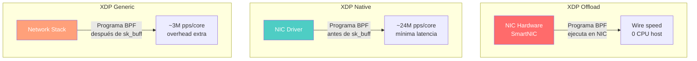
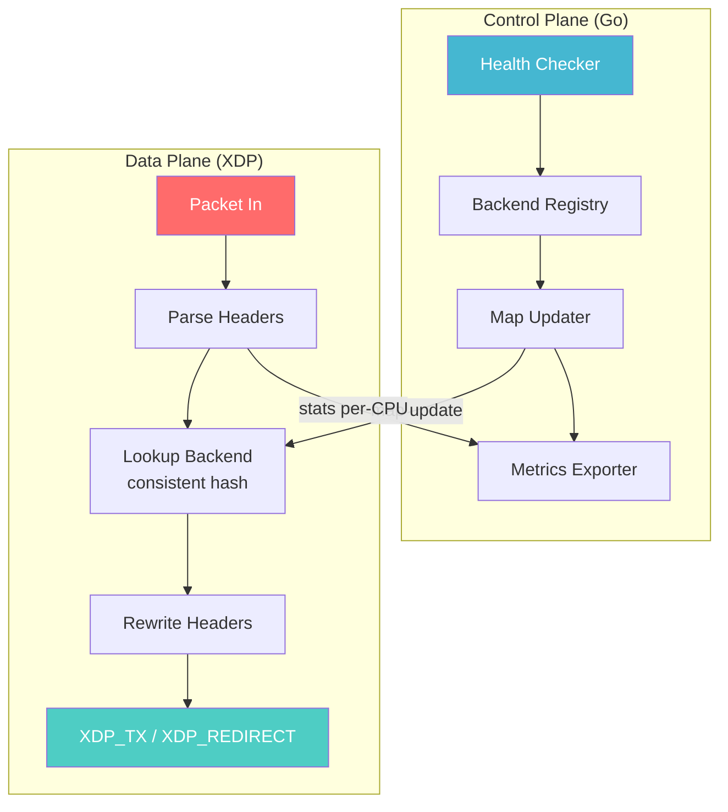
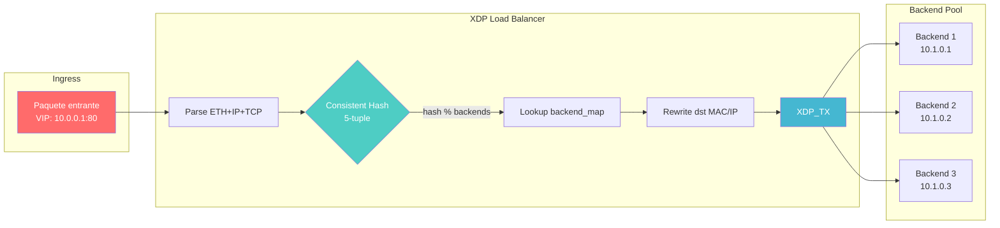
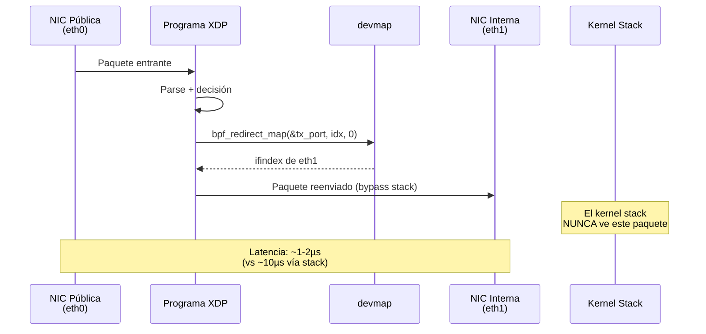
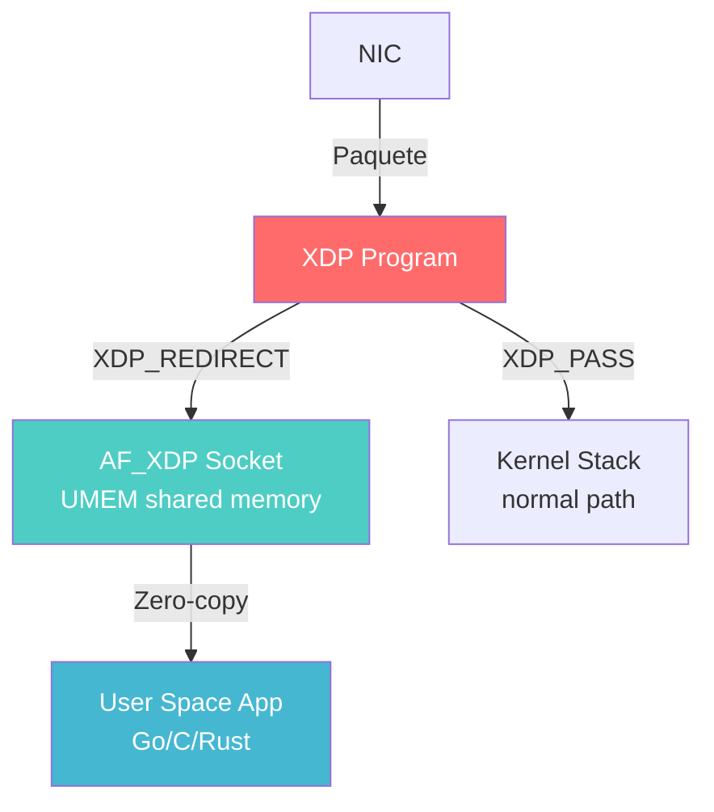

# Capítulo 16: Networking avanzado — XDP en producción

> "Cualquiera puede filtrar un paquete. Filtrar diez millones por segundo sin que se entere nadie — eso es ingeniería."

---

## Términos nuevos en este capítulo

- **XDP native mode** (natív moud) — modo de ejecución donde el programa XDP corre directamente en el driver de la NIC, antes de que el kernel aloque un `sk_buff`. Es el modo más rápido pero requiere soporte explícito del driver. Si tu driver no lo soporta, estás jodido — cae a generic mode.
- **XDP offload** (ófloud) — modo donde el programa XDP se ejecuta directamente en el hardware de la NIC (SmartNIC). El paquete nunca toca la CPU del host. Reservado para NICs especializadas como Netronome/Agilio.
- **consistent hashing** (consístent jáshing) — algoritmo de distribución de carga que minimiza la redistribución cuando se agregan o eliminan backends. Si tienes 10 servidores y cae uno, solo el 10% del tráfico se redistribuye (no el 100% como en hash módulo N).
- **IPVS** (ai-pi-ví-es) — IP Virtual Server. El load balancer L4 del kernel Linux implementado como módulo de netfilter. Funciona bien pero opera más arriba en el stack — ya se creó el `sk_buff`. Es la alternativa "sin eBPF" para balanceo L4.
- **devmap** (dév-map) — map de tipo `BPF_MAP_TYPE_DEVMAP` que almacena interfaces de red indexadas por ifindex. Permite a un programa XDP redirigir paquetes a otra interfaz con `bpf_redirect_map()` a velocidad wire-speed.
- **AF_XDP** (ei-ef eks-di-pi) — socket de tipo `Address Family XDP`. Permite desviar paquetes directamente desde XDP al user space sin pasar por el stack de red del kernel. Ideal para aplicaciones que necesitan procesamiento custom de paquetes a alta velocidad.
- **XDP_REDIRECT** — acción XDP que envía el paquete a otra interfaz de red o a un socket AF_XDP. No lo procesa localmente, no lo descarta — lo manda a otro lado.

## Objetivos

Al terminar este capítulo vas a poder:

1. Diseñar e implementar un load balancer L4 basado en XDP con consistent hashing
2. Implementar mitigación de DDoS a velocidad de línea usando XDP
3. Usar `bpf_redirect_map()` con devmaps para reenviar paquetes entre interfaces
4. Entender AF_XDP y cuándo es la herramienta correcta para bypass del kernel stack
5. Analizar casos reales de XDP en producción (Katran, Cilium, Cloudflare)

## Prerrequisitos

- Dominar XDP y TC del Capítulo 10 — necesitas parseo de paquetes, acciones XDP, bounds checking
- Entender tail calls (Capítulo 14) — los load balancers reales usan tail calls para pipelines complejos
- Manejar maps avanzados (Capítulo 6) — per-CPU arrays, LRU hash maps, devmaps
- CO-RE y BTF (Capítulo 15) — los ejemplos de este capítulo asumen programas portables

---

## 16.1 XDP en producción — Del laboratorio al data center

En el Capítulo 10 aprendiste a escribir programas XDP simples: parsear un paquete, decidir si pasa o se descarta. Eso está bien para un firewall de juguete. Pero el mundo real es otro animal.

### ¿Qué cambia cuando pasas a producción?

| Aspecto | Laboratorio | Producción |
|---------|-------------|------------|
| **Tráfico** | 100 pps (packets/sec) | 10M+ pps |
| **Latencia** | "funciona" | < 5µs por paquete o te comen |
| **Fallos** | reinicia y ya | zero downtime, hot-swap |
| **Backends** | 1-2 servidores | 100-10,000 servidores |
| **Actualizaciones** | recompila y recarga | atomic map update |
| **Monitoreo** | `trace_pipe` | métricas exportadas a Prometheus |

Lo que hacen compañías como Meta, Cloudflare, y Cilium es llevar XDP al extremo. No usan `XDP_GENERIC` (modo emulado). Usan **XDP native** — el programa corre en el driver de la NIC, antes de que se aloque un `sk_buff`. Esto elimina la overhead más cara del networking path del kernel.

> 🔥 **Advertencia**: XDP native mode requiere soporte explícito del driver de tu NIC. No todos los drivers lo implementan. Antes de diseñar tu sistema alrededor de XDP native, verifica que tu hardware lo soporta. Drivers con soporte completo: `i40e` (Intel XL710), `mlx5` (Mellanox ConnectX-4+), `ixgbe` (Intel 10GbE), `virtio_net` (VMs KVM). Si tu driver no está en la lista, caes a `XDP_GENERIC` que sigue pasando por el stack normal — pierdes la ventaja principal.

### Los tres modos de XDP



En producción, native mode es el estándar. Offload solo si tienes SmartNICs. Generic es para desarrollo y testing.

### La arquitectura de un servicio XDP en producción

Un deployment real de XDP no es un solo programa BPF. Es un sistema:

1. **Control plane** (Go/user space): gestiona backends, health checks, actualiza maps
2. **Data plane** (XDP/BPF): procesa paquetes a velocidad de línea
3. **Observability**: métricas per-CPU exportadas a sistemas de monitoreo
4. **Hot reload**: actualizaciones atómicas vía map swap (no recarga del programa)



Este patrón — control plane en Go que actualiza maps, data plane en XDP que procesa paquetes — es el estándar de la industria. Lo usa Meta (Katran), Cilium, Cloudflare, y básicamente cualquiera que opere XDP a escala.

---

## 16.2 Load balancing con XDP — Consistent hashing a velocidad de línea

Un load balancer L4 basado en XDP es el caso de uso más común de XDP en producción. La idea es simple: recibir un paquete, decidir a qué backend va, reescribir los headers, y reenviar — todo sin que el paquete suba al stack del kernel.

### ¿Por qué XDP para load balancing?

Los load balancers tradicionales (HAProxy, nginx L4, IPVS) operan dentro del stack de red del kernel. Eso significa:

1. El paquete pasa por la cadena de netfilter
2. Se aloca un `sk_buff` (~240 bytes de metadata por paquete)
3. Se procesan hooks de conntrack, NAT, etc.
4. Recién ahí llega a tu lógica de balanceo

Con XDP, interceptas el paquete **antes** de todo eso. El resultado: 10-20x más paquetes por segundo por core, con latencia sub-microsegundo.

### La arquitectura del load balancer



### Consistent hashing: por qué no usar módulo

Si tienes 3 backends y haces `hash(5-tuple) % 3`, funciona — hasta que cae un backend. Si mueres de 3 a 2 backends, el 66% de las conexiones existentes se redistribuyen. Eso rompe sesiones TCP, mata conexiones HTTP keep-alive, y genera una tormenta de re-handshakes.

Consistent hashing (el que usa Katran) resuelve esto:

- Cada backend se mapea a múltiples puntos en un anillo virtual
- El hash del paquete se mapea a un punto del anillo
- El paquete va al backend más cercano en sentido horario
- Si un backend cae, solo sus paquetes se redistribuyen (~1/N del total)

En la implementación BPF, esto se traduce a una lookup table pre-calculada por el control plane:

```c
// El control plane pre-calcula la tabla de consistent hashing.
// Cada posición del array apunta a un backend_id.
// El programa XDP solo hace: hash → index → lookup → forward
struct {
    __uint(type, BPF_MAP_TYPE_ARRAY);
    __uint(max_entries, 65537);  // Ring size (prime para mejor distribución)
    __type(key, __u32);
    __type(value, __u32);        // backend_id
} ch_ring SEC(".maps");

// Backends: indexed por backend_id
struct backend_info {
    __u32 ip;
    __u8  mac[6];
    __u16 pad;
};

struct {
    __uint(type, BPF_MAP_TYPE_ARRAY);
    __uint(max_entries, 1024);
    __type(key, __u32);
    __type(value, struct backend_info);
} backends SEC(".maps");
```

La función de hash en el data plane es extremadamente simple — esa es la belleza del diseño:

```c
static __always_inline __u32 hash_packet(struct iphdr *ip, void *l4, void *data_end) {
    __u32 src = ip->saddr;
    __u32 dst = ip->daddr;
    __u16 sport = 0, dport = 0;

    if (ip->protocol == IPPROTO_TCP) {
        struct tcphdr *tcp = l4;
        if ((void *)(tcp + 1) > data_end)
            return src ^ dst;
        sport = tcp->source;
        dport = tcp->dest;
    } else if (ip->protocol == IPPROTO_UDP) {
        struct udphdr *udp = l4;
        if ((void *)(udp + 1) > data_end)
            return src ^ dst;
        sport = udp->source;
        dport = udp->dest;
    }

    // jhash-style: mezclar los 5 campos
    __u32 hash = src ^ dst;
    hash ^= ((__u32)sport << 16) | dport;
    hash ^= ip->protocol;
    
    // Finalización: multiplicar por golden ratio
    hash *= 0x9e3779b9;
    hash ^= hash >> 16;
    
    return hash;
}
```

Y el programa XDP principal:

```c
SEC("xdp")
int xdp_lb(struct xdp_md *ctx) {
    void *data = (void *)(long)ctx->data;
    void *data_end = (void *)(long)ctx->data_end;

    // Parsear Ethernet
    struct ethhdr *eth = data;
    if ((void *)(eth + 1) > data_end)
        return XDP_PASS;

    if (eth->h_proto != bpf_htons(ETH_P_IP))
        return XDP_PASS;

    // Parsear IP
    struct iphdr *ip = (void *)(eth + 1);
    if ((void *)(ip + 1) > data_end)
        return XDP_PASS;

    // Solo balancear TCP y UDP
    if (ip->protocol != IPPROTO_TCP && ip->protocol != IPPROTO_UDP)
        return XDP_PASS;

    // Layer 4 header
    void *l4 = (void *)ip + (ip->ihl * 4);
    if (l4 + 4 > data_end)
        return XDP_PASS;

    // Hash del paquete → posición en el ring
    __u32 hash = hash_packet(ip, l4, data_end);
    __u32 ring_idx = hash % 65537;

    // Lookup: ring → backend_id → backend_info
    __u32 *backend_id = bpf_map_lookup_elem(&ch_ring, &ring_idx);
    if (!backend_id)
        return XDP_PASS;

    struct backend_info *backend = bpf_map_lookup_elem(&backends, backend_id);
    if (!backend)
        return XDP_PASS;

    // Reescribir headers
    ip->daddr = backend->ip;
    ip->check = 0;  // Recalcular checksum (simplificado)
    ip->check = compute_ip_checksum(ip);

    __builtin_memcpy(eth->h_dest, backend->mac, 6);

    // Reenviar por la misma interfaz (XDP_TX) o redirect a otra
    return XDP_TX;
}
```

> ⚙️ **Nota técnica**: El recálculo de checksum IP en producción usa `bpf_csum_diff()` o csum incremental — no se recalcula todo el header desde cero. El ejemplo simplificado de arriba es para claridad. En el código del repositorio verás la implementación correcta con csum incremental.

### Connection tracking para DSR (Direct Server Return)

En un esquema DSR, el load balancer solo toca el tráfico de ida (cliente → backend). La respuesta va directamente del backend al cliente sin pasar por el LB. Esto reduce a la mitad el tráfico que procesa el balanceador.

Para que DSR funcione, necesitas que el backend responda con la IP del VIP como source. Eso requiere configuración en los backends (loopback con la VIP). El LB solo necesita reescribir el MAC destino.

---

## 16.3 DDoS mitigation — Filtrado a velocidad de línea

XDP es la herramienta perfecta para mitigación de DDoS porque opera antes de cualquier procesamiento costoso del kernel. Si un paquete es malicioso, lo descartas antes de gastar CPU en él.

### Patrones de mitigación

**1. Rate limiting por IP source**

```c
struct {
    __uint(type, BPF_MAP_TYPE_LRU_HASH);
    __uint(max_entries, 1000000);  // 1M IPs tracked
    __type(key, __u32);            // IP source
    __type(value, __u64);          // packet count (window)
} rate_limit SEC(".maps");

// Configuración inyectada por control plane
struct {
    __uint(type, BPF_MAP_TYPE_ARRAY);
    __uint(max_entries, 1);
    __type(key, __u32);
    __type(value, __u64);  // max packets per window
} config SEC(".maps");

static __always_inline int check_rate(__u32 src_ip) {
    __u64 *count = bpf_map_lookup_elem(&rate_limit, &src_ip);
    if (!count) {
        __u64 initial = 1;
        bpf_map_update_elem(&rate_limit, &src_ip, &initial, BPF_ANY);
        return 0;  // Primer paquete, pasa
    }
    
    __u32 cfg_key = 0;
    __u64 *max_pps = bpf_map_lookup_elem(&config, &cfg_key);
    __u64 limit = max_pps ? *max_pps : 10000;
    
    __sync_fetch_and_add(count, 1);
    return (*count > limit) ? 1 : 0;
}
```

**2. SYN flood protection con SYN cookies**

En lugar de mantener estado para cada SYN entrante (lo que agota la tabla de conntrack), generas un SYN cookie — un número de secuencia que codifica la información de la conexión. Si el cliente responde con el ACK correcto, sabes que es legítimo sin haber almacenado nada.

```c
static __always_inline __u32 generate_syn_cookie(
    __u32 src_ip, __u32 dst_ip,
    __u16 src_port, __u16 dst_port,
    __u32 timestamp
) {
    // Hash criptográfico (simplificado — en producción usa siphash)
    __u32 hash = src_ip ^ dst_ip;
    hash ^= ((__u32)src_port << 16) | dst_port;
    hash ^= timestamp;
    hash *= 0x9e3779b9;
    hash ^= hash >> 13;
    hash *= 0xbf58476d;
    return hash;
}
```

**3. Blocklist dinámica con LPM trie**

Para bloquear rangos CIDR completos (redes de botnets), un `BPF_MAP_TYPE_LPM_TRIE` es ideal:

```c
struct lpm_key {
    __u32 prefixlen;
    __u32 addr;
};

struct {
    __uint(type, BPF_MAP_TYPE_LPM_TRIE);
    __uint(max_entries, 100000);
    __type(key, struct lpm_key);
    __type(value, __u8);  // 1 = blocked
    __uint(map_flags, BPF_F_NO_PREALLOC);
} blocklist SEC(".maps");

static __always_inline int is_blocked(__u32 src_ip) {
    struct lpm_key key = {
        .prefixlen = 32,
        .addr = src_ip,
    };
    return bpf_map_lookup_elem(&blocklist, &key) != NULL;
}
```

El control plane actualiza la blocklist en tiempo real basándose en inteligencia de amenazas. Los paquetes de IPs bloqueadas se descartan en XDP — ni siquiera llegan al stack TCP.

### Caso Cloudflare: Magic Transit

Cloudflare procesa **>50 Tbps** de tráfico de mitigación DDoS usando XDP. Su arquitectura:

1. **Anuncio BGP**: atraen el tráfico del cliente a su red
2. **XDP en el edge**: cada servidor ejecuta programas XDP que filtran tráfico malicioso
3. **Múltiples capas**: reglas estáticas + heurísticas + ML (el ML corre en user space, las decisiones se inyectan como maps)
4. **Sin estado**: no mantienen conntrack para tráfico filtrado — todo es stateless en XDP

El resultado: pueden absorber ataques de 1+ Tbps sin degradación del servicio protegido.

> 💡 **Analogía**: Si el network stack del kernel es un aeropuerto con security, check-in, y boarding, XDP es un dron que intercepta el avión antes de aterrizar. Si el avión es hostil, lo desvías sin que nadie en el aeropuerto se entere.

---

## 16.4 XDP redirect y devmap — Reenvío entre interfaces

`XDP_REDIRECT` es la acción XDP que permite enviar un paquete a otra interfaz de red sin subirlo al stack del kernel. Combinado con `devmap` (un map que almacena interfaces de destino), crea un forwarding path extremadamente rápido.

### ¿Por qué redirect en vez de XDP_TX?

`XDP_TX` reenvía el paquete por la **misma** interfaz por donde entró. Útil para responder directamente (como en un LB que usa la misma NIC para ingress y egress). Pero si necesitas enviar el paquete a **otra** interfaz — por ejemplo, de una NIC pública a una interna — necesitas `XDP_REDIRECT`.

### devmap: la tabla de destinos

```c
// Devmap: almacena interfaces de destino indexadas por posición
struct {
    __uint(type, BPF_MAP_TYPE_DEVMAP);
    __uint(max_entries, 64);
    __type(key, __u32);      // index
    __type(value, __u32);    // ifindex destino
} tx_port SEC(".maps");

SEC("xdp")
int xdp_redirect_prog(struct xdp_md *ctx) {
    void *data = (void *)(long)ctx->data;
    void *data_end = (void *)(long)ctx->data_end;

    struct ethhdr *eth = data;
    if ((void *)(eth + 1) > data_end)
        return XDP_DROP;

    if (eth->h_proto != bpf_htons(ETH_P_IP))
        return XDP_PASS;

    struct iphdr *ip = (void *)(eth + 1);
    if ((void *)(ip + 1) > data_end)
        return XDP_DROP;

    // Decisión de routing: basada en IP destino
    // En producción esto sería una lookup en un map de rutas
    __u32 dest_idx = 0;  // Interfaz 0 del devmap
    
    // Redirect al destino usando el devmap
    return bpf_redirect_map(&tx_port, dest_idx, 0);
}
```

### Flujo de XDP redirect



### DEVMAP_HASH para lookup por ifindex directo

Si prefieres usar el ifindex real como clave (en vez de un índice posicional), usa `BPF_MAP_TYPE_DEVMAP_HASH`:

```c
struct {
    __uint(type, BPF_MAP_TYPE_DEVMAP_HASH);
    __uint(max_entries, 64);
    __type(key, __u32);    // ifindex directo
    __type(value, struct bpf_devmap_val);
} tx_port_hash SEC(".maps");
```

### Programa XDP en el destino (egress program)

A partir del kernel 5.8, el devmap puede tener un programa XDP de egress asociado. Este programa se ejecuta en la interfaz de destino antes de transmitir, permitiendo modificar headers en el último momento:

```c
// Este programa se ejecuta en la interfaz de DESTINO después del redirect.
// Útil para reescribir MAC source con la MAC de la interfaz de salida.
SEC("xdp")
int xdp_egress(struct xdp_md *ctx) {
    void *data = (void *)(long)ctx->data;
    void *data_end = (void *)(long)ctx->data_end;

    struct ethhdr *eth = data;
    if ((void *)(eth + 1) > data_end)
        return XDP_DROP;

    // Reescribir MAC source con la de esta interfaz
    // (el control plane inyecta la MAC correcta en un map)
    __u32 key = 0;
    struct mac_addr *src_mac = bpf_map_lookup_elem(&local_mac, &key);
    if (src_mac)
        __builtin_memcpy(eth->h_source, src_mac->addr, 6);

    return XDP_PASS;  // En egress, PASS = transmitir
}
```

### Caso de uso: bridge XDP entre interfaces

Un bridge L2 completo usando XDP y devmap. El control plane aprende MACs y llena un map de forwarding. El data plane solo hace lookup y redirect:

```c
// FDB (Forwarding Database): MAC destino → interfaz
struct {
    __uint(type, BPF_MAP_TYPE_HASH);
    __uint(max_entries, 10000);
    __type(key, __u8[6]);      // MAC address
    __type(value, __u32);       // devmap index
} fdb SEC(".maps");

SEC("xdp")
int xdp_bridge(struct xdp_md *ctx) {
    void *data = (void *)(long)ctx->data;
    void *data_end = (void *)(long)ctx->data_end;

    struct ethhdr *eth = data;
    if ((void *)(eth + 1) > data_end)
        return XDP_DROP;

    // Lookup la MAC destino en la FDB
    __u32 *dest_port = bpf_map_lookup_elem(&fdb, eth->h_dest);
    if (!dest_port) {
        // MAC desconocida: flood a todos los puertos (o drop)
        return XDP_PASS;  // Subir al stack para flooding
    }

    // Redirect a la interfaz correcta
    return bpf_redirect_map(&tx_port, *dest_port, 0);
}
```

> ☠️ **Cuidado**: `bpf_redirect_map()` requiere que la interfaz destino esté activa (UP) y tenga un programa XDP cargado (aunque sea un `XDP_PASS`). Si el destino no tiene XDP, el redirect falla silenciosamente y el paquete se descarta. Siempre verifica que tu devmap apunta a interfaces válidas.

---

## 16.5 AF_XDP — Bypass total del kernel stack

AF_XDP es el escape hatch definitivo. Cuando ni siquiera XDP native es suficiente — cuando necesitas procesar paquetes con lógica arbitraria en user space pero sin la overhead del socket tradicional — AF_XDP te da acceso directo a los paquetes desde tu aplicación.

### ¿Cómo funciona?



El mecanismo:

1. **UMEM**: región de memoria compartida entre kernel y user space (mmap). Los paquetes se escriben aquí directamente.
2. **Rings**: cuatro ring buffers (FILL, COMPLETION, RX, TX) que coordinan la entrega sin locks.
3. **XDP program**: decide qué paquetes enviar al socket AF_XDP (basado en cualquier criterio).
4. **Zero-copy** (opcional): en NICs que lo soportan, el DMA escribe directamente en UMEM. Cero copias entre NIC y aplicación.

### ¿Cuándo usar AF_XDP?

| Escenario | ¿AF_XDP? | Alternativa |
|-----------|----------|-------------|
| Load balancer puro | No | XDP nativo (todo en kernel) |
| Procesamiento custom de protocolos | **Sí** | Nada comparable |
| Capture de paquetes a alta velocidad | **Sí** | DPDK (pero requiere dedicar la NIC) |
| IDS/IPS con lógica compleja | **Sí** | Suricata con AF_PACKET |
| Telemetría de red (sampling) | Depende | XDP + ring buffer puede bastar |

### Ejemplo: programa XDP que alimenta AF_XDP

```c
#include <linux/bpf.h>
#include <bpf/bpf_helpers.h>

// XSKMAP: referencia a los sockets AF_XDP registrados
struct {
    __uint(type, BPF_MAP_TYPE_XSKMAP);
    __uint(max_entries, 64);
    __type(key, __u32);
    __type(value, __u32);
} xsks_map SEC(".maps");

SEC("xdp")
int xdp_to_xsk(struct xdp_md *ctx) {
    __u32 index = ctx->rx_queue_index;

    // Redirigir al socket AF_XDP de esta queue
    if (bpf_map_lookup_elem(&xsks_map, &index))
        return bpf_redirect_map(&xsks_map, index, 0);

    // Si no hay socket registrado para esta queue, pasar al stack
    return XDP_PASS;
}

char LICENSE[] SEC("license") = "GPL";
```

En el lado Go, la librería `github.com/cilium/ebpf` no tiene soporte directo para AF_XDP sockets — para eso se usa `github.com/asavie/xdp` o la API de raw sockets. El patrón típico:

```go
// Pseudocódigo — la API real depende de la librería AF_XDP
sock, err := xdp.NewSocket(ifaceIndex, queueID, &xdp.SocketOptions{
    NumFrames:      4096,
    FrameSize:      2048,
    FillRingSize:   2048,
    CompletionSize: 2048,
    RxRingSize:     2048,
    TxRingSize:     2048,
})

// Registrar el socket en el XSKMAP
xsksMap.Put(uint32(queueID), uint32(sock.FD()))

// Loop de recepción — zero-copy desde la NIC
for {
    n, err := sock.Receive(frames)
    for i := 0; i < n; i++ {
        pkt := frames[i]
        // Procesar paquete con lógica arbitraria en user space
        processPacket(pkt)
    }
}
```

### Rendimiento AF_XDP vs alternativas

| Método | PPS (64-byte) | Latencia | Dedicación NIC |
|--------|---------------|----------|----------------|
| AF_PACKET | ~1M | ~50µs | No |
| AF_XDP (copy mode) | ~5M | ~10µs | No |
| AF_XDP (zero-copy) | ~20M | ~2µs | No |
| DPDK | ~25M | ~1µs | **Sí** (NIC completa) |
| XDP nativo (kernel only) | ~24M | ~1µs | No |

AF_XDP te da rendimiento cercano a DPDK sin tener que dedicar la NIC entera. El kernel sigue manejando el tráfico que no necesitas procesar.

> ⚙️ **Nota técnica**: AF_XDP zero-copy requiere soporte del driver (los mismos que soportan XDP native generalmente soportan AF_XDP zero-copy). En copy mode funciona con cualquier driver pero añade ~2µs de latencia extra por la copia a UMEM.

---

## 16.6 Casos de estudio — XDP en las trincheras

### Caso 1: Katran (Meta/Facebook)

**Katran** es el load balancer L4 de Meta. Maneja todo el tráfico entrante a los data centers de Facebook, Instagram, WhatsApp, y Messenger. Es open source y está basado enteramente en XDP.

**Arquitectura:**

- **Data plane**: programa XDP con consistent hashing (Maglev hash)
- **Control plane**: daemon en C++ que gestiona backends y health checks
- **Encapsulación**: usa IPIP o GUE (Generic UDP Encapsulation) para enviar paquetes a backends
- **DSR**: el backend responde directamente al cliente (no pasa por Katran de vuelta)

**Números:**

- Procesa **millones de conexiones por segundo** por servidor
- Latencia de procesamiento: **<1µs por paquete**
- Corre en modo XDP native en NICs Mellanox ConnectX
- Cada servidor maneja **~10M pps** con un solo core dedicado al XDP program

**Decisiones de diseño interesantes:**

1. **Maglev hashing** (no consistent hashing genérico): garantiza que con N backends, máximo 1/N del tráfico se redistribuye cuando un backend cae
2. **No usa conntrack**: todo es stateless en el data plane. La persistencia de conexión viene del hash determinístico
3. **Quic support**: extiende el hashing para soportar connection IDs de QUIC (no depende de 5-tuple)

**Código clave** (simplificado del repo real):

```c
// Katran-style: encapsulación IPIP después del hash
static __always_inline int encap_ipip(struct xdp_md *ctx, 
                                       struct backend_info *backend) {
    // Agregar IP header externo para IPIP tunnel
    if (bpf_xdp_adjust_head(ctx, -(int)sizeof(struct iphdr)))
        return XDP_DROP;
    
    void *data = (void *)(long)ctx->data;
    void *data_end = (void *)(long)ctx->data_end;
    
    struct iphdr *outer_ip = data;
    if ((void *)(outer_ip + 1) > data_end)
        return XDP_DROP;
    
    outer_ip->version = 4;
    outer_ip->ihl = 5;
    outer_ip->protocol = IPPROTO_IPIP;
    outer_ip->saddr = VIP_ADDR;
    outer_ip->daddr = backend->ip;
    outer_ip->ttl = 64;
    outer_ip->tot_len = bpf_htons(data_end - data);
    
    return XDP_TX;
}
```

### Caso 2: Cilium — Networking para Kubernetes

**Cilium** usa XDP y TC para implementar todo el networking de un cluster Kubernetes: load balancing, network policies, encryption, observability.

**Cómo usa XDP:**

- **NodePort/LoadBalancer services**: XDP load balancer reemplaza kube-proxy
- **Host firewall**: XDP filtra tráfico antes de que entre al stack del host
- **DSR para services**: tráfico de respuesta bypass el nodo de entrada
- **Maglev hashing**: misma técnica que Katran para balanceo estable

**Diferencia con Katran**: Cilium es un sistema completo de networking, no solo un LB. Usa XDP para la primera línea de defensa y TC para el resto (policies, NAT, encapsulación VXLAN).

**Impacto medido:**

- **10x reducción** en latencia vs kube-proxy (iptables) para NodePort services
- **~5x más throughput** en scenarios de alta conexión
- Eliminación de las cadenas de iptables que crecen O(N) con el número de services

### Caso 3: Cloudflare — DDoS mitigation global

**Cloudflare** procesa >50 Tbps de tráfico y usa XDP como primera línea de defensa en cada servidor de su red global.

**Arquitectura de mitigación:**

1. **L3/L4 filtering (XDP)**: reglas estáticas + rate limiting + blocklists. Descarta el 99% del tráfico de ataque antes de que toque el stack.
2. **L7 analysis (user space)**: para ataques que pasan el filtro L4, análisis a nivel HTTP/DNS.
3. **Adaptive rules**: el sistema de ML genera reglas que se inyectan como maps en los programas XDP.

**Números publicados:**

- Un solo servidor puede mitigar **~100 Gbps** de ataque volumétrico
- Latencia añadida por la mitigación: **<1µs**
- Zero packet loss para tráfico legítimo durante ataque

**Innovación técnica**: Cloudflare desarrolló `flowtrackd` — un daemon que hace connection tracking parcial en XDP para detectar ataques stateful (TCP out-of-state) sin el costo de conntrack completo.

<!-- [INSERTA IMAGEN AQUI: Diagrama comparativo de arquitecturas Katran vs Cilium vs Cloudflare, mostrando dónde opera XDP en cada caso y qué problema específico resuelve] -->

---

## Limitaciones y alternativas

### Limitaciones de XDP en producción

| Limitación | Impacto | Mitigación |
|------------|---------|------------|
| Requiere driver support (native mode) | No funciona en cualquier hardware | Verificar lista de drivers soportados antes de diseñar |
| No puede fragmentar paquetes | Limita MTU de encapsulación | Usar GSO/GRO antes de XDP o ajustar MTU |
| Sin acceso a connection state | No puedes hacer NAT stateful puro | Combinar con conntrack vía TC hook |
| Programa ejecuta por-paquete | No hay contexto de "flujo" nativo | Mantener estado en maps (LRU hash) |
| Debugging es difícil | `bpf_printk` tiene overhead | Usar per-CPU maps de debug con toggle |
| Stack depth limitado (512 bytes) | Limita complejidad de funciones | Tail calls + maps para compartir estado |

### Alternativa sin eBPF: IPVS + HAProxy

Si no puedes usar XDP (hardware incompatible, equipo sin experiencia BPF, regulaciones), las alternativas son:

**IPVS (kernel):**
- Load balancer L4 en el kernel (módulo netfilter)
- Soporta consistent hashing, round robin, least connections
- Opera después del sk_buff — 3-5x más lento que XDP
- Pero: zero código custom, configuración vía `ipvsadm`, estable y probado

**HAProxy (user space):**
- Load balancer L4/L7 maduro y confiable
- Rendimiento: ~1M conexiones/sec (vs ~10M con XDP)
- Ventaja: L7 features (SSL termination, HTTP routing, health checks sofisticados)
- Desventaja: todo pasa por user space — mínimo 2 context switches por paquete

**¿Cuándo elegir cada uno?**

| Criterio | XDP | IPVS | HAProxy |
|----------|-----|------|---------|
| PPS máximo | 10M+/core | 2-3M/core | 500K/core |
| Latencia | <1µs | ~5µs | ~50µs |
| L7 features | No | No | **Sí** |
| Complejidad operacional | Alta | Baja | Media |
| Hardware requirement | Driver support | Cualquier Linux | Cualquier OS |
| Debugging | Difícil | Medium | Fácil |

> 🔥 **Advertencia**: No uses XDP solo porque es más rápido. Si tu tráfico no justifica la complejidad (< 1M pps), IPVS o HAProxy son soluciones más sensatas. XDP brilla cuando necesitas procesar millones de paquetes por segundo con latencia sub-microsegundo. Para 10K conexiones por segundo, estás sobre-ingenieriando.

---

## Ejercicio ninja: Load balancer L4 con XDP

### El desafío

Implementar un load balancer L4 completo basado en XDP que cumpla:

**Requisitos funcionales:**
1. Balancear tráfico TCP y UDP entre N backends configurables
2. Usar consistent hashing para persistencia de conexión
3. Soportar health checks (el control plane marca backends como down)
4. Estadísticas per-CPU: paquetes procesados, bytes, drops, por backend

**Requisitos de rendimiento:**
- **Latencia**: < 5µs por paquete (medido con `BPF_PROG_TEST_RUN`)
- **Throughput**: soportar 100K conexiones simultáneas sin degradación
- **Hot reload**: actualizar backends sin perder conexiones existentes

**Restricciones:**
- Data plane en C (XDP)
- Control plane en Go (cilium/ebpf)
- Consistent hashing pre-calculado en user space, inyectado como map
- Sin conntrack — todo stateless en el data plane
- Usar per-CPU maps para evitar contención en stats

**Pistas:**

1. El ring de consistent hashing es un array map. El control plane lo llena con backend IDs.
2. Cuando un backend cae, el control plane recalcula solo las posiciones afectadas del ring.
3. Para stats per-CPU, usa `BPF_MAP_TYPE_PERCPU_ARRAY` — el control plane suma los valores de todos los CPUs.
4. El hash de 5-tuple debe ser determinístico: mismo paquete → mismo backend siempre.
5. Usa `XDP_TX` para reenviar (asume que backends están en la misma L2).

**Criterio de éxito:**
- El programa pasa el verifier
- `BPF_PROG_TEST_RUN` muestra < 5µs de latencia con paquetes sintéticos
- El control plane puede agregar/remover backends sin restart
- Las stats se exportan correctamente (verificable con `bpftool map dump`)

**Archivos de referencia:** `code/cap16-networking-avanzado/ejercicio/`

---

## Resumen

- **XDP native** ejecuta programas BPF en el driver de la NIC, antes del `sk_buff`. Es el modo más rápido pero requiere soporte del driver.
- **Consistent hashing** distribuye tráfico entre backends minimizando redistribución cuando un backend cae. La tabla se pre-calcula en el control plane e inyecta como map.
- **DDoS mitigation** con XDP opera a velocidad de línea: rate limiting, SYN cookies, y blocklists LPM sin que los paquetes maliciosos toquen el stack.
- **XDP_REDIRECT + devmap** permite reenviar paquetes entre interfaces sin pasar por el kernel stack. Latencia de ~1-2µs.
- **AF_XDP** bypasea el kernel completamente — paquetes van directo a user space vía shared memory. Rendimiento cercano a DPDK sin dedicar la NIC.
- **En producción**: Katran (Meta) hace load balancing, Cilium reemplaza kube-proxy, Cloudflare mitiga DDoS a 50+ Tbps. Todos usan XDP native + control plane en user space + consistent hashing.
- **La alternativa**: IPVS es simple y funcional si no necesitas >3M pps. HAProxy si necesitas L7. No uses XDP si tu problema no lo justifica.

## Para saber más

- 💻 [Katran — GitHub (Meta)](https://github.com/facebookincubator/katran) — Load balancer L4 open source basado en XDP
- 📖 [XDP Tutorial — xdp-project.net](https://github.com/xdp-project/xdp-tutorial) — Tutorial hands-on con ejercicios incrementales
- 📖 [Cilium XDP acceleration](https://docs.cilium.io/en/stable/network/kubernetes/kubeproxy-free/) — Documentación de Cilium sobre reemplazo de kube-proxy
- 📖 [AF_XDP — kernel.org](https://www.kernel.org/doc/html/latest/networking/af_xdp.html) — Documentación oficial de AF_XDP
- 📝 [Cloudflare blog — XDP DDoS mitigation](https://blog.cloudflare.com/l4drop-xdp-ebpf-based-ddos-mitigations/) — Post técnico sobre mitigación con XDP
