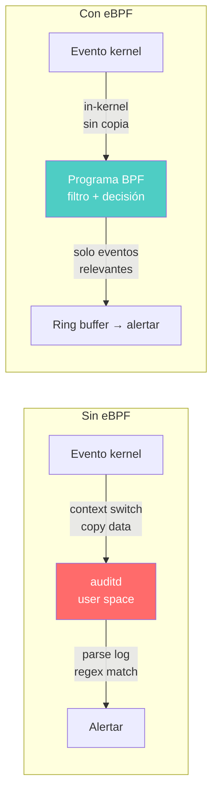
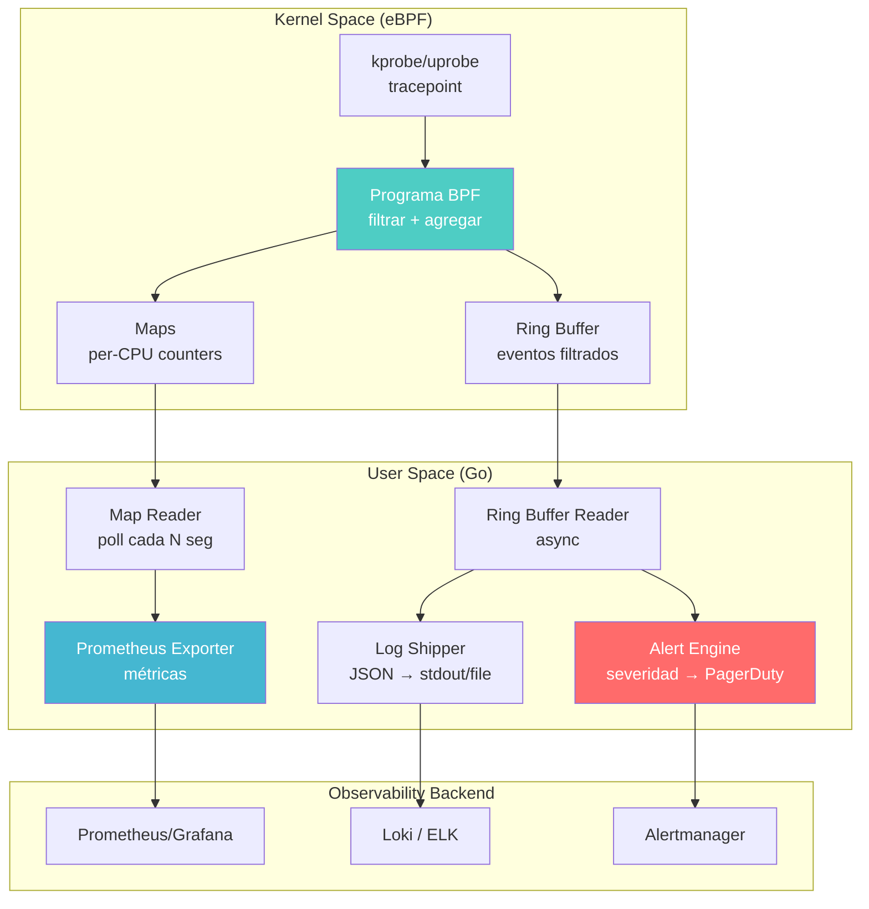

# Capítulo 17: Seguridad y observabilidad — eBPF en las trincheras

> "La seguridad no es un producto. Es un proceso que vive en el kernel — y eBPF te da la llave."

---

## Términos nuevos en este capítulo

- **LSM hook** (el-es-em juk) — Linux Security Module hook. Punto de intercepción en el kernel donde un módulo de seguridad puede aprobar o denegar una operación *antes* de que ocurra. eBPF puede adjuntar programas a estos hooks desde kernel 5.7. Es enforcement, no solo observación.
- **BPF LSM** (bi-pi-ef el-es-em) — el framework que permite adjuntar programas eBPF a LSM hooks. Funciona como un LSM más (al lado de SELinux, AppArmor), pero es programable en runtime. No necesitas recompilar el kernel ni escribir un módulo.
- **runtime security** (ránt-aim secúriti) — detección y/o prevención de amenazas durante la ejecución de un sistema, en tiempo real. A diferencia de análisis estático o escaneo de imágenes, observa lo que realmente pasa — no lo que podría pasar.
- **CAP_BPF** (cap bi-pi-ef) — capability del kernel (desde 5.8) que otorga permiso para cargar programas BPF. Antes se necesitaba `CAP_SYS_ADMIN` (root total). `CAP_BPF` es un permiso más fino — puedes cargar programas sin ser root completo.
- **BPF token** (bi-pi-ef tóken) — mecanismo (kernel 6.9+) que permite delegar permisos BPF a procesos en namespaces no privilegiados. Es la pieza que faltaba para que containers puedan usar eBPF de forma segura sin root en el host.
- **ring buffer** (ring báfer) — estructura de datos circular compartida entre kernel y user space para comunicación eficiente de eventos. Ya lo viste en el Capítulo 6, aquí es el canal de alertas de seguridad.
- **namespace** (néim-speis) — abstracción del kernel que aísla recursos (PIDs, red, mounts, usuarios). Los containers son colecciones de namespaces. Un escape de container es básicamente salir de un namespace.

## Objetivos

Al terminar este capítulo vas a poder:

1. Implementar políticas de seguridad runtime usando BPF LSM hooks
2. Construir un monitor de syscalls que detecte comportamiento anómalo en containers
3. Diseñar pipelines de observabilidad a escala con eBPF como fuente de datos
4. Entender el modelo de permisos de eBPF (CAP_BPF, tokens, namespaces) y sus implicaciones

## Prerrequisitos

- Programas con tracepoints y kprobes (Capítulo 9) — los monitores de syscalls usan tracepoints
- Ring buffers y comunicación kernel→user space (Capítulo 12) — el canal de alertas
- Tail calls para composición de programas (Capítulo 14) — los pipelines de seguridad combinan múltiples programas
- CO-RE y BTF (Capítulo 15) — los programas de seguridad *deben* ser portables entre kernels

---

## 17.1 eBPF para seguridad — Runtime security sin overhead

Hay dos formas de hacer seguridad en un sistema:

1. **Estática**: escanear imágenes, revisar configuraciones, analizar código. Encuentras lo que *podría* pasar.
2. **Runtime**: observar lo que *realmente* pasa. En tiempo real. Mientras el sistema corre.

La seguridad estática es necesaria pero insuficiente. Un container puede pasar todos los escaneos del mundo y aun así ser comprometido por un zero-day en runtime. La pregunta no es "¿esta imagen es segura?" sino "¿este proceso está haciendo algo que no debería?"

### El problema clásico

Antes de eBPF, runtime security en Linux tenía dos opciones:

| Herramienta | Qué hace | Problema |
|-------------|----------|----------|
| **auditd** | Registra eventos del kernel en logs | Overhead alto, no bloquea, logs inmanejables a escala |
| **SELinux/AppArmor** | Políticas estáticas de acceso | Complejas de configurar, no programables en runtime |
| **seccomp** | Filtra syscalls por proceso | Granularidad limitada, no tiene contexto de la operación |
| **ptrace** | Intercepta syscalls de un proceso | Overhead brutal, no escala, solo para debugging |

Todas tienen el mismo trade-off: o tienes visibilidad pero matas performance, o tienes performance pero estás ciego.

### eBPF cambia la ecuación

eBPF rompe ese trade-off porque opera *dentro* del kernel con overhead cercano a cero:



La diferencia es dónde ocurre la lógica:

- **auditd**: el kernel genera eventos brutos → los copia a user space → un daemon los parsea → decide si importan. Todo ese viaje por cada syscall.
- **eBPF**: la decisión se toma *dentro del kernel*. Solo los eventos que importan cruzan la frontera kernel→user space. El filtrado pesa nanosegundos, no milisegundos.

### Dos modos: detección vs enforcement

eBPF para seguridad opera en dos modos fundamentales:

| Modo | Qué hace | Cómo |
|------|----------|------|
| **Detección** | Observa y alerta sobre actividad sospechosa | Tracepoints, kprobes → ring buffer → alerta |
| **Enforcement** | Bloquea operaciones no autorizadas | LSM hooks → retorna -EPERM → operación denegada |

Detección es como una cámara de seguridad: ve todo, no toca nada. Enforcement es como un guardia: si no tienes permiso, no pasas.

En este capítulo implementamos ambos. Primero enforcement con LSM hooks (sección 17.2), después detección con syscall monitoring (sección 17.3). En la práctica, un sistema de seguridad completo combina los dos — detecta lo que no puede prevenir, previene lo que es crítico.

---

## 17.2 LSM hooks — Security policies programables

Linux Security Modules es el framework del kernel que permite interceptar operaciones sensibles y decidir si permitirlas o bloquearlas. SELinux, AppArmor y TOMOYO son LSMs. Desde kernel 5.7, eBPF es otro LSM — pero programable en runtime.

### ¿Qué puedes interceptar?

La lista de LSM hooks es extensa. Algunos ejemplos:

| Hook | Cuándo se dispara | Uso típico |
|------|-------------------|------------|
| `file_open` | Antes de abrir un archivo | Proteger archivos sensibles |
| `bprm_check_security` | Antes de ejecutar un binario | Bloquear ejecuciones no autorizadas |
| `socket_connect` | Antes de conectar un socket | Controlar conexiones de red |
| `task_alloc` | Antes de crear un proceso | Limitar creación de procesos |
| `sb_mount` | Antes de montar un filesystem | Prevenir mounts maliciosos |

La diferencia clave con tracepoints: un LSM hook puede *denegar* la operación retornando un código de error negativo. Un tracepoint solo observa.

### Requisitos del sistema

Para usar BPF LSM necesitas:

1. Kernel >= 5.7
2. `CONFIG_BPF_LSM=y` en la configuración del kernel
3. `lsm=bpf` (o `lsm=lockdown,capability,bpf`) en la línea de comandos del kernel
4. `CAP_BPF` + `CAP_MAC_ADMIN` para el proceso que carga el programa

Puedes verificar si BPF LSM está activo:

```bash
cat /sys/kernel/security/lsm
# Debe incluir "bpf" en la lista, e.g.:
# lockdown,capability,landlock,bpf
```

### Ejemplo: Protección de archivos con LSM file_open

Vamos a implementar una política que deniega acceso a archivos sensibles (`/etc/shadow`, `/etc/sudoers`) a procesos no autorizados. Es una versión simplificada de lo que hace Tetragon para file integrity monitoring.

El código completo está en `code/cap17-seguridad-observabilidad/bpf/lsm_file_open.bpf.c`. Veamos las partes más importantes:

```c
// Maps: ring buffer para eventos + hash map como policy engine
struct {
    __uint(type, BPF_MAP_TYPE_RINGBUF);
    __uint(max_entries, 1 << 20); // 1MB
} security_events SEC(".maps");

struct {
    __uint(type, BPF_MAP_TYPE_HASH);
    __uint(max_entries, MAX_PROTECTED_PATHS);
    __type(key, char[MAX_FILENAME_LEN]);
    __type(value, struct protected_path);
} protected_files SEC(".maps");

SEC("lsm/file_open")
int BPF_PROG(lsm_file_open, struct file *file)
{
    stats_inc(0); // total checks

    __u32 pid = bpf_get_current_pid_tgid() >> 32;
    __u32 uid = bpf_get_current_uid_gid() & 0xFFFFFFFF;

    // Leer nombre del archivo desde dentry (CO-RE portable)
    struct dentry *dentry = BPF_CORE_READ(file, f_path.dentry);
    if (!dentry)
        return 0;

    char filename[MAX_FILENAME_LEN] = {};
    const unsigned char *name = BPF_CORE_READ(dentry, d_name.name);
    if (!name)
        return 0;
    bpf_probe_read_kernel_str(filename, sizeof(filename), name);

    // Buscar en la tabla de paths protegidos
    struct protected_path *policy = bpf_map_lookup_elem(&protected_files, filename);
    if (!policy)
        return 0; // No protegido — permitir

    // Emitir evento al user space via ring buffer
    struct security_event *evt;
    evt = bpf_ringbuf_reserve(&security_events, sizeof(*evt), 0);
    if (evt) {
        evt->timestamp_ns = bpf_ktime_get_ns();
        evt->pid = pid;
        evt->uid = uid;
        evt->action = policy->enforce ? 0 : 1;
        bpf_get_current_comm(evt->comm, sizeof(evt->comm));
        __builtin_memcpy(evt->filename, filename, MAX_FILENAME_LEN);
        bpf_ringbuf_submit(evt, 0);
    }

    // Enforce: denegar acceso si la política lo dice
    if (policy->enforce)
        return -EPERM;

    return 0;
}
```

### Anatomía del programa

Desglosemos las piezas:

**1. La macro `BPF_PROG`**

```c
SEC("lsm/file_open")
int BPF_PROG(lsm_file_open, struct file *file)
```

`BPF_PROG` es una macro de `bpf_tracing.h` que simplifica la firma del programa LSM. Sin ella, tendrías que lidiar con el raw context pointer. La sección `lsm/file_open` le dice al kernel a qué hook adjuntarse.

**2. Lectura del filename con CO-RE**

```c
struct dentry *dentry = BPF_CORE_READ(file, f_path.dentry);
const unsigned char *name = BPF_CORE_READ(dentry, d_name.name);
bpf_probe_read_kernel_str(filename, sizeof(filename), name);
```

Usamos `BPF_CORE_READ` (del Capítulo 15) para navegar las estructuras del kernel de forma portable. El nombre del archivo está en `file->f_path.dentry->d_name.name` — el componente final del path.

**3. El map como policy engine**

El map `protected_files` es la configuración. El user space (Go) lo llena con los archivos a proteger y si el modo es enforce o audit. El programa BPF solo consulta. Esto permite cambiar políticas en caliente sin recompilar nada.

**4. Deny vs audit**

Si `policy->enforce == 1`, retorna `-EPERM` → la operación falla. El proceso que intentó abrir el archivo recibe "Permission denied". Si es audit-only, retorna 0 (permitir) pero emite el evento igual — para visibilidad sin impacto.

<!-- [INSERTA IMAGEN AQUI: Captura de terminal mostrando la compilación del programa LSM con el Makefile, seguida de la verificación de que BPF LSM está habilitado en el kernel con cat /sys/kernel/security/lsm] -->

### El patrón dual: audit-first, enforce-after

En producción, nunca arrancas en modo enforce. Siempre:

1. Deploy en modo audit → observas qué se bloquearía
2. Revisas los logs → confirmas que no hay falsos positivos
3. Switch a enforce → cambias el flag en el map, sin recargar el programa

Este patrón es idéntico a lo que hace Tetragon con sus TracingPolicies y Falco con sus reglas. La diferencia es que aquí lo construiste tú.

---

## 17.3 Detección de comportamiento anómalo — Syscall monitoring

LSM hooks son enforcement — bloquean. Pero no todo se puede (ni se debe) bloquear proactivamente. A veces necesitas *detectar* comportamiento sospechoso y alertar. Aquí entran los monitores de syscalls.

### ¿Qué estamos buscando?

Un atacante que compromete un container típicamente hace una secuencia de operaciones predecible:

1. **Ejecución de herramientas** (`execve`): corre `nsenter`, `mount`, `chroot`, o descarga binarios
2. **Manipulación de namespaces** (`setns`, `unshare`): intenta salir del namespace del container
3. **Escalación de privilegios**: cambia capabilities, UIDs, o mounts

Cada una de estas operaciones es una syscall. Y cada syscall se puede observar con un tracepoint.

### Ejemplo: Monitor de execve + setns + unshare

El código completo está en `code/cap17-seguridad-observabilidad/bpf/syscall_monitor.bpf.c`. Las piezas clave:

```c
// Alerta emitida al user space
struct syscall_alert {
    __u64 timestamp_ns;
    __u32 pid;
    __u32 tgid;
    __u32 uid;
    __u32 event_type;
    __u32 severity;
    __u32 namespace_id;
    char  comm[16];
    char  filename[MAX_BIN_LEN];
};

// Ring buffer para alertas + hash map de binarios sospechosos
struct {
    __uint(type, BPF_MAP_TYPE_RINGBUF);
    __uint(max_entries, 1 << 20);
} alerts SEC(".maps");

struct {
    __uint(type, BPF_MAP_TYPE_HASH);
    __uint(max_entries, 32);
    __type(key, char[MAX_BIN_LEN]);
    __type(value, __u32); // severidad
} suspicious_bins SEC(".maps");
```

**El monitor de execve** — detecta ejecución de binarios sospechosos y señala si viene de un container:

```c
SEC("tracepoint/syscalls/sys_enter_execve")
int trace_execve(struct trace_event_raw_sys_enter_execve *ctx) {
    __u32 pid = bpf_get_current_pid_tgid() >> 32;
    __u32 uid = bpf_get_current_uid_gid() & 0xFFFFFFFF;

    // Leer filename del execve
    char filename[MAX_BIN_LEN] = {};
    bpf_probe_read_user_str(filename, sizeof(filename), ctx->filename);

    // ¿Es un binario en la lista de sospechosos?
    __u32 *sev = bpf_map_lookup_elem(&suspicious_bins, filename);
    __u32 event_type = 0;
    __u32 severity = SEVERITY_INFO;

    if (sev) {
        event_type = EVENT_SUSPICIOUS_EXEC;
        severity = *sev;
    }

    // ¿Está en un container? (namespace distinto al host)
    __u32 ns_id = get_pid_namespace();
    if (ns_id != 0 && event_type == 0) {
        event_type = EVENT_EXECVE_CONTAINER;
    }

    // Binario sospechoso + container = CRITICAL
    if (sev && ns_id != 0)
        severity = SEVERITY_CRITICAL;

    if (event_type == 0)
        return 0; // Nada interesante

    // Emitir alerta
    struct syscall_alert *alert;
    alert = bpf_ringbuf_reserve(&alerts, sizeof(*alert), 0);
    if (!alert)
        return 0;

    alert->timestamp_ns = bpf_ktime_get_ns();
    alert->pid = pid;
    alert->uid = uid;
    alert->event_type = event_type;
    alert->severity = severity;
    alert->namespace_id = ns_id;
    bpf_get_current_comm(alert->comm, sizeof(alert->comm));
    __builtin_memcpy(alert->filename, filename, MAX_BIN_LEN);

    bpf_ringbuf_submit(alert, 0);
    return 0;
}
```

**El monitor de setns** — cualquier proceso que intente cambiar de namespace es sospechoso. Si viene de un container, es una señal fuerte de escape:

```c
SEC("tracepoint/syscalls/sys_enter_setns")
int trace_setns(struct trace_event_raw_sys_enter_setns *ctx) {
    __u32 pid = bpf_get_current_pid_tgid() >> 32;
    __u32 uid = bpf_get_current_uid_gid() & 0xFFFFFFFF;
    __u32 ns_id = get_pid_namespace();

    // setns siempre es sospechoso — WARNING mínimo
    __u32 severity = SEVERITY_WARNING;

    // Desde un container → CRITICAL (posible escape)
    if (ns_id != 0)
        severity = SEVERITY_CRITICAL;

    struct syscall_alert *alert;
    alert = bpf_ringbuf_reserve(&alerts, sizeof(*alert), 0);
    if (!alert)
        return 0;

    alert->timestamp_ns = bpf_ktime_get_ns();
    alert->pid = pid;
    alert->uid = uid;
    alert->event_type = EVENT_SETNS;
    alert->severity = severity;
    alert->namespace_id = ns_id;
    bpf_get_current_comm(alert->comm, sizeof(alert->comm));

    bpf_ringbuf_submit(alert, 0);
    return 0;
}
```

### Detección de namespace del proceso

La función auxiliar `get_pid_namespace` usa CO-RE para leer el PID namespace del proceso actual:

```c
static __always_inline __u32 get_pid_namespace() {
    struct task_struct *task = (void *)bpf_get_current_task();
    __u32 ns_id = 0;

    struct nsproxy *nsproxy = BPF_CORE_READ(task, nsproxy);
    if (nsproxy) {
        struct pid_namespace *pid_ns = BPF_CORE_READ(nsproxy, pid_ns_for_children);
        if (pid_ns) {
            ns_id = BPF_CORE_READ(pid_ns, ns.inum);
        }
    }
    return ns_id;
}
```

Esto navega `task_struct→nsproxy→pid_ns_for_children→ns.inum` — el identificador único del PID namespace. Si es distinto al del host, probablemente estamos en un container. Es la misma técnica que usa Tetragon para etiquetar eventos con contexto de Kubernetes.

### El control plane en Go — Consumer de alertas

El programa Go (`code/cap17-seguridad-observabilidad/go/main.go`) orquesta todo: carga ambos programas BPF, configura las políticas vía maps, y consume eventos de ambos ring buffers.

Las piezas clave del loader:

```go
// Configurar binarios sospechosos via map — reconfigurable en runtime
suspiciousBins := map[string]uint32{
    "nsenter":    2, // CRITICAL
    "mount":      2,
    "unshare":    1, // WARNING
    "chroot":     1,
    "pivot_root": 2,
}
for name, severity := range suspiciousBins {
    var key [64]byte
    copy(key[:], name)
    monObjs.SuspiciousBins.Put(key, severity)
}

// Adjuntar tracepoints
tpExecve, _ := link.Tracepoint("syscalls", "sys_enter_execve",
    monObjs.TraceExecve, nil)
defer tpExecve.Close()

tpSetns, _ := link.Tracepoint("syscalls", "sys_enter_setns",
    monObjs.TraceSetns, nil)
defer tpSetns.Close()
```

Y el consumidor de alertas (simplificado — el código completo maneja ambos ring buffers en goroutines separadas):

```go
// Consumir alertas del ring buffer
reader, _ := ringbuf.NewReader(monObjs.Alerts)
defer reader.Close()

go func() {
    for {
        record, err := reader.Read()
        if err != nil {
            return
        }
        var alert syscallAlert
        binary.Read(bytes.NewReader(record.RawSample),
            binary.LittleEndian, &alert)

        ts := time.Duration(alert.TimestampNs) * time.Nanosecond
        fmt.Printf("[%s] severity=%d type=%d pid=%d comm=%s\n",
            ts.Truncate(time.Millisecond),
            alert.Severity, alert.EventType,
            alert.PID, nullTermStr(alert.Comm[:]))
    }
}()
```

El programa Go completo está en `code/cap17-seguridad-observabilidad/go/main.go` — incluye manejo de flags, configuración de archivos protegidos, adjuntar el LSM hook, y consumers para ambos ring buffers con formateo de alertas por severidad.

### Compilación y ejecución

```bash
# Compilar programas BPF
cd code/cap17-seguridad-observabilidad/bpf
make

# Generar bindings Go y compilar
cd ../go
go generate ./...
go build -o security-monitor .

# Ejecutar (requiere root)
sudo ./security-monitor --protect "/etc/shadow,/etc/sudoers" --enforce
```

### Resultado esperado

```
═══════════════════════════════════════════════════════════════
  Capítulo 17 — Runtime Security Monitor
  LSM File Protection + Syscall Monitoring
═══════════════════════════════════════════════════════════════

  📁 Archivos protegidos:
    ✅ /etc/shadow → enforce
    ✅ /etc/sudoers → enforce

  🔍 Binarios sospechosos monitoreados:
    ✅ nsenter → 🚨 CRITICAL
    ✅ mount → 🚨 CRITICAL
    ✅ unshare → ⚠️  WARNING
    ✅ chroot → ⚠️  WARNING

  🔒 LSM file_open hook adjuntado
  👁️  Syscall monitors adjuntados (execve, setns, unshare)

─────────────────────────────────────────────────────────────
  Monitoreando... Ctrl+C para detener
─────────────────────────────────────────────────────────────

  [12.445s] 🚫 DENIED │ LSM file_open │ pid=4521 uid=1000 comm=cat file=shadow
  [14.221s] 🚨 CRITICAL │ SUSPICIOUS_EXEC │ pid=4530 uid=0 comm=bash bin=nsenter ns=4026532198
  [14.223s] 🚨 CRITICAL │ SETNS │ pid=4530 uid=0 comm=nsenter ns=4026532198
```

<!-- [INSERTA IMAGEN AQUI: Captura mostrando la ejecución real del security monitor detectando un intento de acceso a /etc/shadow (denied) y la ejecución de nsenter desde un container (critical alert)] -->

### La lógica de clasificación por severidad

La severidad no es un número arbitrario. Tiene semántica:

| Severidad | Significado | Acción sugerida |
|-----------|-------------|-----------------|
| `INFO` | Actividad normal en un container — observar | Log, métricas |
| `WARNING` | Operación sospechosa pero podría ser legítima | Alerta, investigar |
| `CRITICAL` | Alta probabilidad de compromiso o escape | Alerta inmediata, posible kill |

El pattern matching es: **contexto + operación = severidad**. `nsenter` desde el host podría ser un admin. `nsenter` desde dentro de un container es casi seguro un escape. El namespace ID proporciona ese contexto.

---

## 17.4 Observabilidad a escala — Métricas, logs y traces con eBPF

Seguridad es un caso de uso, pero eBPF es la herramienta de observabilidad definitiva. No solo para seguridad — para todo. Métricas de latencia, distributed tracing, profiling, network monitoring.

### Los tres pilares con eBPF

| Pilar | Qué captura | Cómo lo captura eBPF |
|-------|-------------|---------------------|
| **Métricas** | Contadores, histogramas, gauges | Maps per-CPU con agregación en kernel |
| **Logs** | Eventos estructurados | Ring buffer con filtrado en kernel |
| **Traces** | Request flow entre servicios | uprobe/kprobe en puntos de tracing |

La ventaja sobre instrumentación tradicional: eBPF no requiere modificar la aplicación. No hay SDK, no hay agent en el proceso, no hay overhead de serialización. El kernel ya tiene los datos — eBPF solo los extrae.

### Pipeline de observabilidad con eBPF

Un sistema de observabilidad basado en eBPF tiene esta arquitectura:



### Métricas: agregación en kernel

El patrón es simple y poderoso:

1. El programa BPF incrementa un counter per-CPU en un map (overhead: ~1ns)
2. El user space lee el map cada N segundos y suma los valores de todos los CPUs
3. Expone el resultado como métrica de Prometheus

No hay lock contention porque cada CPU tiene su propia copia. No hay comunicación kernel→user space por cada evento — solo una lectura periódica del map.

### Logs: el ring buffer como filtro inteligente

Sin eBPF, capturar eventos del kernel genera un volumen insano de datos. Con eBPF, filtras *en el kernel*:

- Millones de syscalls por segundo → solo las que matchean tu regla llegan al ring buffer
- El user space solo procesa los eventos relevantes
- Reducción típica: 1000:1 o más

### Traces: uprobes para visibilidad sin SDK

Con uprobes puedes instrumentar funciones de una aplicación compilada *sin modificar su código*:

- Attach a la función `net/http.(*Transport).roundTrip` de un binario Go → captura cada request HTTP
- Attach a `SSL_write` de OpenSSL → captura bytes antes de la encripción
- Attach a cualquier función exportada de cualquier lenguaje compilado

Esto es lo que hace Pixie para observabilidad de Kubernetes sin sidecars y sin SDKs.

### Limitaciones de observabilidad con eBPF

No todo es perfecto:

| Limitación | Impacto | Workaround |
|------------|---------|------------|
| uprobes en binarios stripped | No puedes instrumentar funciones sin símbolos | Compilar con `-ldflags="-s=false"` o usar DWARF |
| Overhead de uprobes | ~1µs por invocación (vs ~1ns para kprobes) | Usar tracepoints cuando existan |
| Lenguajes interpretados | JIT dificulta attach a funciones | Usar USDT probes si el runtime los expone |
| Agregación limitada en kernel | No puedes hacer percentiles en BPF (no hay sort) | Usar histogramas log2 como aproximación |

---

## 17.5 El modelo de seguridad de eBPF — CAP_BPF, namespaces, BPF tokens

eBPF es poderoso. Y con gran poder viene un modelo de seguridad que ha evolucionado significativamente.

### La evolución de los permisos

| Kernel | Modelo | Problema |
|--------|--------|----------|
| < 5.8 | Requiere `CAP_SYS_ADMIN` (root total) | Todo o nada — demasiado privilegio |
| 5.8+ | `CAP_BPF` + capabilities específicas | Más granular, pero sigue necesitando privilegio en el host |
| 6.9+ | BPF tokens + delegation | Permite a containers usar BPF sin root en el host |

### CAP_BPF y sus amigos

`CAP_BPF` sola permite cargar programas BPF y crear maps. Pero dependiendo de lo que haga tu programa, necesitas capabilities adicionales:

| Capability | Permite |
|-----------|---------|
| `CAP_BPF` | Cargar programas, crear maps, usar helpers básicos |
| `CAP_PERFMON` | Usar kprobes, tracepoints, perf events |
| `CAP_NET_ADMIN` | Adjuntar programas XDP, TC, socket filters |
| `CAP_MAC_ADMIN` | Adjuntar programas LSM (security enforcement) |
| `CAP_SYS_ADMIN` | Acceso completo (legacy, evitar si es posible) |

Para nuestro programa de seguridad del cap 17 necesitamos: `CAP_BPF` + `CAP_PERFMON` (tracepoints) + `CAP_MAC_ADMIN` (LSM).

### El problema de los containers

El modelo de capabilities funciona para procesos en el host. Pero en containers, la historia es diferente:

1. Un container corre en namespaces aislados
2. Las capabilities dentro de un container solo aplican dentro de su user namespace
3. `CAP_BPF` dentro de un container *no* permite cargar programas en el kernel del host (por diseño)

Esto significa que herramientas de observabilidad que corren en containers (Falco, Tetragon, Pixie) necesitan:
- Correr como privileged containers, o
- Tener capabilities específicas en el host namespace, o
- Usar el nuevo sistema de BPF tokens

### BPF tokens (kernel 6.9+)

> 🔥 **Advertencia**: BPF tokens son un feature *muy* nuevo (kernel 6.9, estable desde 2024). La API puede cambiar. Los toolchains (cilium/ebpf, libbpf) todavía están agregando soporte completo. Lo incluimos aquí porque es el futuro, pero no lo uses en producción sin verificar el soporte de tu stack.

Los BPF tokens permiten que un proceso privilegiado (en el host) delegue permisos BPF específicos a un proceso en un container. El flujo:

1. Un daemon privilegiado crea un BPF token con permisos específicos (e.g., "puede cargar programas de tipo tracing, puede crear ring buffers")
2. Pasa el token al container via un file descriptor
3. El proceso dentro del container usa ese token para cargar sus programas BPF
4. El kernel verifica que las operaciones estén dentro de los permisos del token

Es como una tarjeta de acceso: no te da la llave maestra, te da acceso a una puerta específica.

### Implicaciones para diseño de sistemas

| Escenario | Modelo recomendado |
|-----------|-------------------|
| Agent de seguridad en el host | `CAP_BPF` + `CAP_PERFMON` + `CAP_MAC_ADMIN` (sin full root) |
| Agent en DaemonSet (K8s) | Container privileged o con host PID/NET namespace + caps |
| Observabilidad multitenant | BPF tokens (cuando tu kernel lo soporte) |
| Desarrollo local | sudo / CAP_SYS_ADMIN (está bien para dev) |

### La alternativa sin eBPF: auditd

Si tu kernel es demasiado viejo o no puedes habilitar BPF LSM, `auditd` sigue siendo la alternativa:

```bash
# Configurar auditd para monitorear acceso a /etc/shadow
auditctl -w /etc/shadow -p rwa -k shadow-access

# Monitorear ejecuciones sospechosas
auditctl -a always,exit -F arch=b64 -S execve -F key=exec-monitor

# Ver logs
ausearch -k shadow-access --format text
```

Funciona. Pero tiene los problemas que mencionamos al inicio: overhead alto, no filtra en kernel, genera volúmenes de logs inmanejables, y no puede bloquear operaciones (solo registrar).

---

## 17.6 Casos de estudio — Falco, Tetragon y Pixie

Tres proyectos que llevan eBPF para seguridad y observabilidad a producción. No son juguetes — están en clusters de producción manejando tráfico real.

### Falco — Runtime threat detection

**Qué es**: Motor de detección de amenazas runtime de Sysdig. Originalmente basado en un kernel module, ahora usa eBPF como backend principal.

**Cómo funciona**:
- Adjunta programas eBPF a syscall tracepoints (similar a nuestro syscall_monitor)
- Consume eventos en user space con un motor de reglas (Falco Rules)
- Las reglas están en YAML con condiciones tipo: "si un container ejecuta una shell interactiva, alerta"

**Ejemplo de regla Falco**:
```yaml
- rule: Terminal shell in container
  desc: Detecta una shell interactiva dentro de un container
  condition: >
    spawned_process and container and
    proc.name in (bash, sh, zsh) and
    proc.tty != 0
  output: >
    Shell spawned in container
    (user=%user.name container=%container.name shell=%proc.name)
  priority: WARNING
```

**Limitación**: Falco es solo detección — no bloquea. Si necesitas enforcement, necesitas combinarlo con otra herramienta o usar su integration con response engines.

### Tetragon — Security observability + enforcement

**Qué es**: El proyecto de seguridad runtime de Cilium/Isovalent. Va más allá de detección — puede *bloquear* operaciones usando LSM hooks y signal kills.

**Cómo funciona**:
- Usa LSM hooks para enforcement (como nuestro ejemplo, pero más completo)
- TracingPolicies definen qué monitorear y qué acción tomar
- Integrado con Kubernetes: entiende pods, namespaces, labels
- Puede matar procesos (`SIGKILL`) cuando detecta una violación

**Ejemplo de TracingPolicy**:
```yaml
apiVersion: cilium.io/v1alpha1
kind: TracingPolicy
metadata:
  name: block-container-escape
spec:
  kprobes:
  - call: "sys_setns"
    syscall: true
    selectors:
    - matchNamespaces:
      - namespace: Pid
        operator: NotIn
        values: ["host_ns"]
    matchActions:
    - action: Sigkill
```

**Ventaja sobre Falco**: Tetragon puede bloquear *inline* (sin latencia de user space→kernel→kill). La decisión se toma en el kernel mismo.

### Pixie — Kubernetes observability sin instrumentación

**Qué es**: Plataforma de observabilidad para Kubernetes que usa eBPF para capturar métricas, traces y logs *sin modificar las aplicaciones*.

**Cómo funciona**:
- Deploya agents como DaemonSet en cada nodo
- Usa uprobes para interceptar llamadas HTTP, gRPC, SQL, Redis, etc.
- Captura request/response payloads sin sidecars ni SDKs
- Almacena datos in-cluster (no envía a un SaaS externo)

**Qué puede ver sin tocar tu código**:
- Latencia HTTP por endpoint (p50, p90, p99)
- Queries SQL y su tiempo de ejecución
- Flujos de red entre servicios
- Flamegraphs de CPU

**Limitación**: uprobes tienen overhead (~1µs por invocación). En funciones hot-path llamadas millones de veces, ese overhead se nota. Pixie usa sampling para mitigar.

### Comparación

| Aspecto | Falco | Tetragon | Pixie |
|---------|-------|----------|-------|
| **Foco** | Detección de amenazas | Enforcement + observability | Observabilidad de aplicaciones |
| **Mecanismo** | Tracepoints + reglas | LSM + kprobes + kill | uprobes + tracepoints |
| **¿Bloquea?** | No (solo alerta) | Sí (Sigkill, deny) | No (solo observa) |
| **K8s aware** | Sí | Sí (nativo) | Sí (nativo) |
| **Overhead** | Bajo | Bajo-medio | Medio (uprobes) |
| **Comunidad** | CNCF Incubating | CNCF (Cilium ecosystem) | CNCF Sandbox → New Relic |

---

## 🤘 Ejercicio ninja: Detector de escape de containers

Este ejercicio combina todo lo que vimos: LSM enforcement, syscall monitoring, y alerting. Vas a construir un sistema que detecta y previene intentos de escape de containers.

### Requisitos

Tu sistema debe:

1. **Detectar ejecución de binarios de escape** (`nsenter`, `mount`, `unshare`, `chroot`, `pivot_root`) desde dentro de un container
2. **Monitorear syscalls de manipulación de namespaces** (`setns`, `unshare`) — alertar si vienen de un container
3. **Enforcement vía LSM**: bloquear `file_open` de archivos críticos del host desde procesos containerizados (e.g., `/proc/1/ns/*`, archivos de configuración del runtime)
4. **Clasificar alertas por severidad** (INFO, WARNING, CRITICAL) con la heurística:
   - `execve` de binario sensible desde container → CRITICAL
   - `setns`/`unshare` desde container → CRITICAL
   - `execve` desde container sin match en lista → INFO
   - Operación desde host → WARNING (puede ser legítima)
5. **Emitir alertas al user space** con: timestamp, PID, UID, namespace ID, nombre del proceso, binario ejecutado (si aplica), severidad
6. **Exponer métricas** per-CPU: total events, por tipo de evento, denials, audit hits

### Constraints

- Kernel side: C puro, usando tracepoints + LSM hook (no kprobes — queremos estabilidad de API)
- User space: Go con cilium/ebpf
- Comunicación: ring buffer para alertas, maps per-CPU para métricas
- El user space debe poder *reconfigurar* las listas de binarios sospechosos y archivos protegidos *sin recargar* los programas BPF (vía maps)
- Los programas BPF deben ser CO-RE portables (usar `BPF_CORE_READ`, no hardcode offsets)
- El LSM hook debe soportar modo audit-only y enforce (configurado via map, switchable en runtime)

### Criterios de éxito

- Ejecutar `nsenter -t 1 -m -p` desde un container genera alerta CRITICAL
- Intentar `cat /etc/shadow` desde un container en modo enforce recibe `EPERM`
- Las métricas per-CPU son accesibles y se actualizan correctamente
- Cambiar de audit a enforce no requiere recompilar ni recargar

### Estructura del ejercicio

```
code/cap17-seguridad-observabilidad/ejercicio/
├── esqueleto/   # Puntos de partida con TODOs
└── solucion/    # Implementación completa
```

---

## Resumen

1. **eBPF rompe el trade-off clásico** entre visibilidad y performance para seguridad runtime — filtra y decide dentro del kernel, no en user space.

2. **BPF LSM** permite escribir políticas de seguridad programables que se adjuntan a hooks del kernel y pueden *denegar* operaciones en tiempo real, sin recompilar módulos ni reiniciar.

3. **Syscall monitoring con tracepoints** detecta patrones de comportamiento malicioso (ejecuciones sospechosas, manipulación de namespaces) con contexto de container/namespace.

4. **El patrón audit-first, enforce-after** es crítico en producción: observas qué se bloquearía, confirmas cero falsos positivos, luego activas enforcement — todo sin recargar programas.

5. **El modelo de permisos de eBPF** ha evolucionado de "necesitas root" a un sistema granular de capabilities (`CAP_BPF`, `CAP_PERFMON`, `CAP_MAC_ADMIN`) y hacia delegation con BPF tokens para containers.

6. **Falco, Tetragon y Pixie** son implementaciones production-grade de los patrones que construimos en este capítulo — desde detección pura hasta enforcement inline.

7. **La observabilidad con eBPF** (métricas en maps per-CPU, logs filtrados vía ring buffer, traces vía uprobes) es la base de la próxima generación de herramientas de monitoreo que no requieren SDKs ni instrumentación de código.

---

## Para saber más

- 📖 [BPF LSM: Extending the Linux Security Module Framework](https://docs.kernel.org/bpf/prog_lsm.html) — documentación oficial del kernel sobre BPF LSM, requisitos y API
- 📝 [Tetragon: eBPF-based Security Observability and Runtime Enforcement](https://tetragon.io/docs/) — documentación completa de Tetragon con ejemplos de TracingPolicies para detección y enforcement
- 💻 [Falco: Cloud-native Runtime Security](https://falco.org/docs/) — documentación de Falco incluyendo el backend eBPF, motor de reglas, y ejemplos de detección de amenazas
- 📖 [CAP_BPF and BPF Token](https://lwn.net/Articles/964822/) — artículos de LWN sobre la evolución del modelo de permisos de eBPF, desde CAP_SYS_ADMIN hasta BPF tokens
- 💻 [Pixie: Instant Kubernetes Observability](https://docs.px.dev/) — documentación de Pixie explicando cómo usa eBPF para capturar traces HTTP/gRPC/SQL sin instrumentación
- 📝 [Security Observability with eBPF (Isovalent)](https://isovalent.com/labs/security-observability-with-ebpf-and-tetragon/) — lab hands-on de Isovalent combinando Tetragon con Kubernetes para runtime security
