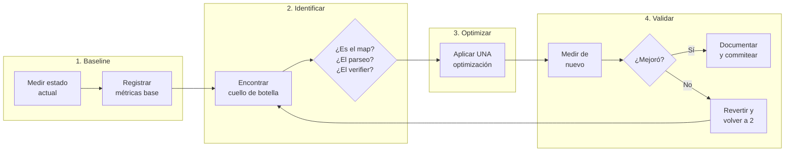
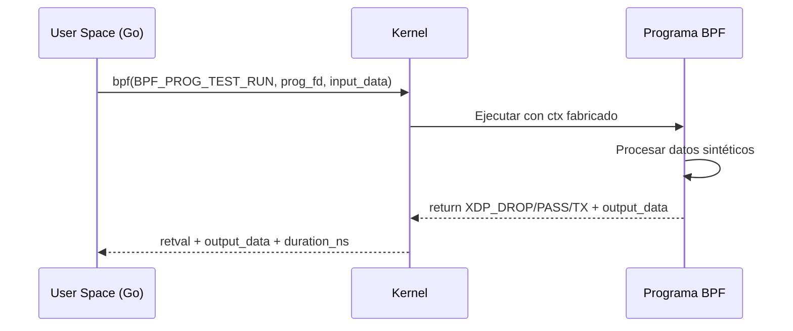
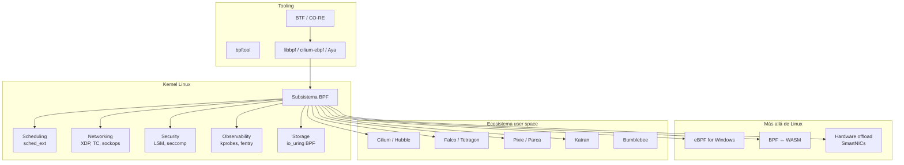

# Capítulo 18: Optimización y el camino del contribuidor

> "No optimices lo que no has medido. Y si ya mediste, no optimices lo que no duele."

---

## Términos nuevos en este capítulo

- **BPF_PROG_TEST_RUN** (bi-pi-ef prog test ran) — comando del syscall `bpf()` que permite ejecutar un programa BPF cargado contra datos sintéticos sin necesidad de tráfico real ni hooks activos. Es tu unit test para programas BPF.
- **per-CPU map** (per si-pi-iu map) — variante de map donde cada CPU tiene su propia copia de los valores. Elimina contención entre cores porque cada uno escribe en su propia línea de caché. El trade-off: leer desde user space requiere sumar todas las copias.
- **batching** (baching) — técnica de agrupar múltiples operaciones de map en una sola llamada al kernel. En vez de N llamadas `bpf_map_lookup_elem`, una sola `bpf_map_lookup_batch` trae N entradas. Reduce el overhead de transición user/kernel.
- **inlining** (in-láining) — directiva del compilador que copia el cuerpo de una función en cada punto de llamada, eliminando el overhead de la llamada misma. En BPF, `__always_inline` es casi obligatorio para funciones hot.
- **BPF profiling** (bi-pi-ef profáiling) — técnicas para medir el rendimiento de programas BPF: cuántas instrucciones ejecutan, cuánto tiempo toman, cuántas veces se invocan. Incluye `bpf_prog_test_run` para microbenchmarks y `bpftool prog profile` para métricas en producción.
- **contributor** (contribiútor) — persona que envía parches al subsistema BPF del kernel Linux. El proceso involucra mailing lists, revisión de código, y un sistema de votación con tags como `Acked-by` y `Reviewed-by`.

## Objetivos

Al terminar este capítulo vas a poder:

1. Perfilar un programa BPF para identificar cuellos de botella reales con datos medidos
2. Aplicar técnicas de optimización (per-CPU maps, batching, inlining) con criterio informado por métricas
3. Escribir tests reproducibles para programas BPF usando `BPF_PROG_TEST_RUN`
4. Entender el proceso de contribución al subsistema BPF del kernel Linux

## Prerrequisitos

- Dominar tail calls y function calls (Capítulo 14) — la optimización requiere saber cuándo inline vs cuándo separar
- Entender BTF y CO-RE (Capítulo 15) — los programas portables tienen consideraciones de performance distintas
- Haber implementado programas XDP en producción (Capítulo 16) — el profiling cobra sentido cuando hay tráfico real
- Conocer LSM hooks y observabilidad (Capítulo 17) — los programas de seguridad son especialmente sensibles a latencia

---

## 18.1 Profiling de programas BPF — Medir antes de tocar

Este es el mandamiento más importante de este capítulo:

> 🔥 **Advertencia**: Medir antes de optimizar. Si no tienes números, no tienes problema — tienes una corazonada. Y las corazonadas no sobreviven al contacto con la realidad. Toda optimización sin medición previa es superstición disfrazada de ingeniería.

### El problema del "se siente lento"

Tienes un programa XDP que procesa paquetes. Alguien dice "se siente lento". Tu instinto dice "voy a cambiar el hash map por un array". ¿Pero realmente es el map el cuello de botella? ¿O es el parseo de headers? ¿O es que el verifier te obligó a un bound check que se ejecuta 4 veces por paquete?

Sin medición, cualquier cambio es un tiro al aire.

### Herramientas de profiling para BPF

**1. `bpftool prog profile`** — Métricas de hardware

```bash
# Perfil de instrucciones y ciclos de un programa BPF por ID
sudo bpftool prog profile id 42 duration 5s

# Output típico:
#          42 run_cnt                  1523847
#          42 run_time_ns            285719234
#          42 avg_run_time_ns              187
```

Esto te dice:
- Cuántas veces se ejecutó (`run_cnt`)
- Cuánto tiempo total gastó en nanosegundos (`run_time_ns`)
- Promedio por ejecución (`avg_run_time_ns`)

**2. `bpf_ktime_get_ns()` manual** — Instrumentación interna

Cuando `bpftool` no es suficiente, instrumentas el programa directamente:

```c
//go:build ignore

#include <linux/bpf.h>
#include <bpf/bpf_helpers.h>

struct {
    __uint(type, BPF_MAP_TYPE_PERCPU_ARRAY);
    __uint(max_entries, 4);
    __type(key, __u32);
    __type(value, __u64);
} latency_stats SEC(".maps");

#define STAT_TOTAL_NS  0
#define STAT_COUNT     1
#define STAT_MAX_NS    2
#define STAT_PARSE_NS  3

SEC("xdp")
int profiled_prog(struct xdp_md *ctx) {
    __u64 start = bpf_ktime_get_ns();
    
    // --- Tu lógica aquí ---
    void *data = (void *)(long)ctx->data;
    void *data_end = (void *)(long)ctx->data_end;
    
    __u64 parse_start = bpf_ktime_get_ns();
    // ... parseo de headers ...
    __u64 parse_end = bpf_ktime_get_ns();
    
    // Registrar tiempo de parseo
    __u32 key = STAT_PARSE_NS;
    __u64 *val = bpf_map_lookup_elem(&latency_stats, &key);
    if (val)
        __sync_fetch_and_add(val, parse_end - parse_start);
    
    // --- Fin de lógica ---
    
    __u64 end = bpf_ktime_get_ns();
    __u64 elapsed = end - start;
    
    // Actualizar estadísticas
    key = STAT_TOTAL_NS;
    val = bpf_map_lookup_elem(&latency_stats, &key);
    if (val)
        __sync_fetch_and_add(val, elapsed);
    
    key = STAT_COUNT;
    val = bpf_map_lookup_elem(&latency_stats, &key);
    if (val)
        __sync_fetch_and_add(val, 1);
    
    key = STAT_MAX_NS;
    val = bpf_map_lookup_elem(&latency_stats, &key);
    if (val && elapsed > *val)
        *val = elapsed;  // No atómico — aceptable para max aproximado
    
    return XDP_PASS;
}

char LICENSE[] SEC("license") = "GPL";
```

**3. perf + BPF** — Profiling a nivel de instrucciones

```bash
# Capturar eventos de performance del programa BPF
sudo perf stat -e instructions,cycles,cache-misses \
    -b 42 -- sleep 5

# Ver el programa BPF descompilado con anotaciones de ciclos
sudo perf annotate --stdio bpf_prog_<tag>
```

### Pipeline de profiling completo



La regla de oro: **un cambio a la vez, medición después de cada cambio.** Si cambias tres cosas y la latencia mejora, no sabes cuál de las tres hizo efecto. Peor: dos podrían haberte empeorado y una compensó el daño. Vas a tener un programa "optimizado" con dos minas enterradas.

### Loader en Go para leer métricas de profiling

```go
package main

//go:generate go run github.com/cilium/ebpf/cmd/bpf2go -target amd64 profiled profiled.bpf.c

import (
	"fmt"
	"log"
	"net"
	"os"
	"os/signal"
	"syscall"
	"time"

	"github.com/cilium/ebpf/link"
)

func main() {
	iface := "eth0"
	if len(os.Args) > 1 {
		iface = os.Args[1]
	}

	objs := profiledObjects{}
	if err := loadProfiledObjects(&objs, nil); err != nil {
		log.Fatalf("Error cargando objetos BPF: %v", err)
	}
	defer objs.Close()

	ifaceObj, err := net.InterfaceByName(iface)
	if err != nil {
		log.Fatalf("Interfaz %s no encontrada: %v", iface, err)
	}

	l, err := link.AttachXDP(link.XDPOptions{
		Program:   objs.ProfiledProg,
		Interface: ifaceObj.Index,
	})
	if err != nil {
		log.Fatalf("Error adjuntando XDP: %v", err)
	}
	defer l.Close()

	fmt.Printf("🔬 Profiling activo en %s — Ctrl+C para stats finales\n", iface)

	sig := make(chan os.Signal, 1)
	signal.Notify(sig, syscall.SIGINT, syscall.SIGTERM)

	ticker := time.NewTicker(3 * time.Second)
	defer ticker.Stop()

	for {
		select {
		case <-ticker.C:
			printLatencyStats(objs)
		case <-sig:
			fmt.Println("\n--- Stats Finales ---")
			printLatencyStats(objs)
			return
		}
	}
}

func printLatencyStats(objs profiledObjects) {
	var totalNs, count, maxNs, parseNs []uint64

	keys := []uint32{0, 1, 2, 3}
	vals := []*[]uint64{&totalNs, &count, &maxNs, &parseNs}

	for i, key := range keys {
		var percpuValues []uint64
		if err := objs.LatencyStats.Lookup(key, &percpuValues); err != nil {
			continue
		}
		*vals[i] = percpuValues
	}

	sumTotal := sumSlice(totalNs)
	sumCount := sumSlice(count)
	sumMax := maxSlice(maxNs)
	sumParse := sumSlice(parseNs)

	if sumCount == 0 {
		fmt.Println("  (sin datos aún)")
		return
	}

	avgNs := sumTotal / sumCount
	avgParse := sumParse / sumCount

	fmt.Printf("  Invocaciones: %d\n", sumCount)
	fmt.Printf("  Latencia avg: %d ns\n", avgNs)
	fmt.Printf("  Latencia max: %d ns\n", sumMax)
	fmt.Printf("  Parseo avg:   %d ns (%.1f%% del total)\n",
		avgParse, float64(avgParse)/float64(avgNs)*100)
}

func sumSlice(s []uint64) uint64 {
	var total uint64
	for _, v := range s {
		total += v
	}
	return total
}

func maxSlice(s []uint64) uint64 {
	var m uint64
	for _, v := range s {
		if v > m {
			m = v
		}
	}
	return m
}
```

<!-- [INSERTA IMAGEN AQUI: Captura mostrando la salida del profiler con métricas de latencia promedio, máxima, y porcentaje de tiempo en parseo de headers] -->

---

## 18.2 Optimización — Per-CPU maps, batching, inlining

Ya mediste. Ya sabes dónde duele. Ahora sí, hablemos de las técnicas que mueven la aguja.

### Técnica 1: Per-CPU maps — Eliminar contención

El problema más común en programas BPF de alto rendimiento: **contención de caché entre CPUs**.

Cuando dos cores actualizan el mismo valor en un map "normal" (no per-CPU), necesitan sincronizar sus cachés L1/L2. Esto se llama *cache bouncing* y puede costar 50-100 ns por acceso en un sistema con múltiples sockets NUMA.

**Antes (map normal con contención):**

```c
// Map normal — todos los CPUs escriben a la misma entrada
struct {
    __uint(type, BPF_MAP_TYPE_HASH);
    __uint(max_entries, 65536);
    __type(key, __u32);    // IP source
    __type(value, __u64);  // packet count
} pkt_count SEC(".maps");

SEC("xdp")
int count_packets(struct xdp_md *ctx) {
    // ... parseo ...
    __u64 *cnt = bpf_map_lookup_elem(&pkt_count, &src_ip);
    if (cnt)
        __sync_fetch_and_add(cnt, 1);  // Atómico = contención
    return XDP_PASS;
}
```

**Después (per-CPU — zero contención):**

```c
// Per-CPU hash — cada CPU tiene su propia copia
struct {
    __uint(type, BPF_MAP_TYPE_PERCPU_HASH);
    __uint(max_entries, 65536);
    __type(key, __u32);    // IP source
    __type(value, __u64);  // packet count (por CPU)
} pkt_count_percpu SEC(".maps");

SEC("xdp")
int count_packets_fast(struct xdp_md *ctx) {
    // ... parseo ...
    __u64 *cnt = bpf_map_lookup_elem(&pkt_count_percpu, &src_ip);
    if (cnt)
        (*cnt)++;  // Sin atómico — este CPU es dueño exclusivo
    else {
        __u64 initial = 1;
        bpf_map_update_elem(&pkt_count_percpu, &src_ip, &initial, BPF_ANY);
    }
    return XDP_PASS;
}
```

**Impacto medido:** En un sistema de 16 cores con 1M paquetes/segundo, pasar de hash map normal a per-CPU hash reduce la latencia promedio de ~180 ns a ~45 ns por paquete. El `__sync_fetch_and_add` desaparece y con él la contención.

**Trade-off:** Leer desde user space requiere sumar `NR_CPUS` valores por entrada. Si tienes 10k entradas y 64 CPUs, eso son 640k lecturas para un snapshot completo. Si necesitas lecturas rápidas desde user space, considera agregar en el kernel antes de emitir.

### Técnica 2: Batching — Reducir transiciones user/kernel

Cada llamada al syscall `bpf()` para leer o escribir un map tiene overhead: transición user→kernel, validaciones de seguridad, copia de datos. Si lees 10,000 entradas una por una, pagas ese overhead 10,000 veces.

**Antes (lectura entry-by-entry):**

```go
// Lento: una syscall por entrada
for key := uint32(0); key < 10000; key++ {
    var value uint64
    err := objs.StatsMap.Lookup(key, &value)
    if err != nil {
        continue
    }
    results[key] = value
}
```

**Después (lectura en batch):**

```go
// Rápido: una syscall para muchas entradas
var (
    keys    = make([]uint32, 256)
    values  = make([]uint64, 256)
    cursor  ebpf.MapBatchCursor
)

for {
    count, err := objs.StatsMap.BatchLookup(
        &cursor, keys, values, nil,
    )
    
    for i := 0; i < count; i++ {
        results[keys[i]] = values[i]
    }
    
    if errors.Is(err, ebpf.ErrKeyNotExist) {
        break // No más entradas
    }
    if err != nil {
        log.Printf("Error en batch lookup: %v", err)
        break
    }
}
```

**Impacto medido:** Para un map con 50k entradas, batch lookup es ~20x más rápido que iteración individual. El overhead del syscall se amortiza sobre cientos de entradas por llamada.

> ⚙️ **Nota técnica**: Las operaciones batch requieren kernel >= 5.6. Los métodos disponibles son: `BatchLookup`, `BatchUpdate`, `BatchLookupAndDelete`, y `BatchDelete`. No todos los tipos de map soportan todas las operaciones batch — consulta la documentación de tu kernel.

### Técnica 3: Inlining — Eliminar overhead de llamadas

En BPF, las llamadas a funciones no son gratis. Cada BPF-to-BPF call tiene overhead de:
- Guardar el frame pointer
- Alocar stack para la función llamada
- Hacer la llamada indirecta (branch prediction miss la primera vez)

Para funciones que se ejecutan en el hot path (millones de veces por segundo), ese overhead se acumula.

```c
// Función small — debería ser inline
static __always_inline int parse_eth_header(
    void *data, void *data_end, struct ethhdr **eth_out) {
    
    struct ethhdr *eth = data;
    if ((void *)(eth + 1) > data_end)
        return -1;
    *eth_out = eth;
    return 0;
}

// Función medium — puede ser inline o no según el contexto
static __always_inline __u16 get_dst_port(
    void *transport, void *data_end, __u8 protocol) {
    
    if (protocol == IPPROTO_TCP) {
        struct tcphdr *tcp = transport;
        if ((void *)(tcp + 1) > data_end)
            return 0;
        return tcp->dest;
    }
    if (protocol == IPPROTO_UDP) {
        struct udphdr *udp = transport;
        if ((void *)(udp + 1) > data_end)
            return 0;
        return udp->dest;
    }
    return 0;
}

// Función grande — NO inline, usar __noinline para reducir bytecode
static __noinline int complex_rate_limit_logic(
    __u32 src_ip, __u32 dst_ip, __u16 dst_port) {
    
    // 50+ líneas de lógica compleja...
    // Múltiples lookups de maps, cálculos, decisiones...
    return 0;
}
```

**Regla práctica:**
- < 10 instrucciones BPF → `__always_inline`
- 10-50 instrucciones, llamada desde 1-2 sitios → `__always_inline`
- 10-50 instrucciones, llamada desde 3+ sitios → `__noinline` (reduce bytecode total)
- > 50 instrucciones → `__noinline` (el verifier te lo agradece)

### Resumen de técnicas

| Técnica | Cuándo usar | Ganancia típica | Trade-off |
|---------|-------------|-----------------|-----------|
| Per-CPU maps | Contadores, stats, cualquier escritura frecuente | 3-5x menos latencia | Lecturas user space más costosas |
| Batching | Lectura/escritura masiva de maps desde user space | 10-30x menos syscalls | Requiere kernel >= 5.6 |
| Inlining | Funciones pequeñas en hot path | 5-15 ns por llamada evitada | Bytecode más grande |
| Loop unrolling | Iteraciones con bound fijo pequeño (< 8) | Variable | Bytecode explota si el bound es grande |
| Constant propagation | Configuración que no cambia en runtime | Reduce branches | Requiere recompilar para cambiar config |

> 💡 **Analogía**: Optimizar un programa BPF es como afinar un motor de carreras. No cambias el carburador porque "parece viejo" — primero pones el motor en el dyno, mides los HP reales, identificas dónde pierde potencia, cambias UNA pieza, y vuelves al dyno. Si no mejoró, la devuelves. Si mejoró, documentas cuánto y pasas a la siguiente pieza.

---

## 18.3 Testing de programas BPF — BPF_PROG_TEST_RUN

Los programas BPF son código que corre en el kernel. Tradicionalmente, probarlos requería tráfico real o un entorno de producción simulado. Eso es lento, flaky, y difícil de automatizar.

`BPF_PROG_TEST_RUN` cambia el juego: ejecuta un programa BPF cargado contra datos de entrada sintéticos, dentro del kernel, sin necesidad de hooks ni tráfico real.

### Cómo funciona



### Ejemplo: test de un programa XDP

El programa BPF que queremos testear:

```c
//go:build ignore

#include <linux/bpf.h>
#include <linux/if_ether.h>
#include <linux/ip.h>
#include <linux/tcp.h>
#include <bpf/bpf_helpers.h>
#include <bpf/bpf_endian.h>

// Bloquear todo tráfico TCP al puerto 4444 (backdoor típico)
SEC("xdp")
int block_backdoor(struct xdp_md *ctx) {
    void *data = (void *)(long)ctx->data;
    void *data_end = (void *)(long)ctx->data_end;

    struct ethhdr *eth = data;
    if ((void *)(eth + 1) > data_end)
        return XDP_PASS;
    
    if (eth->h_proto != bpf_htons(ETH_P_IP))
        return XDP_PASS;

    struct iphdr *ip = (void *)(eth + 1);
    if ((void *)(ip + 1) > data_end)
        return XDP_PASS;

    if (ip->protocol != IPPROTO_TCP)
        return XDP_PASS;

    struct tcphdr *tcp = (void *)ip + (ip->ihl * 4);
    if ((void *)(tcp + 1) > data_end)
        return XDP_PASS;

    if (bpf_ntohs(tcp->dest) == 4444)
        return XDP_DROP;

    return XDP_PASS;
}

char LICENSE[] SEC("license") = "GPL";
```

Y el test en Go usando `cilium/ebpf`:

```go
package main_test

//go:generate go run github.com/cilium/ebpf/cmd/bpf2go -target amd64 blocker block_backdoor.bpf.c

import (
	"encoding/binary"
	"net"
	"testing"

	"github.com/cilium/ebpf"
)

func TestBlockBackdoor(t *testing.T) {
	objs := blockerObjects{}
	if err := loadBlockerObjects(&objs, nil); err != nil {
		t.Fatalf("Error cargando programa: %v", err)
	}
	defer objs.Close()

	tests := []struct {
		name     string
		dstPort  uint16
		protocol uint8
		wantRet  uint32
	}{
		{
			name:     "TCP puerto 4444 → DROP",
			dstPort:  4444,
			protocol: 6, // IPPROTO_TCP
			wantRet:  1, // XDP_DROP
		},
		{
			name:     "TCP puerto 80 → PASS",
			dstPort:  80,
			protocol: 6,
			wantRet:  2, // XDP_PASS
		},
		{
			name:     "UDP puerto 4444 → PASS (solo bloquea TCP)",
			dstPort:  4444,
			protocol: 17, // IPPROTO_UDP
			wantRet:  2,
		},
	}

	for _, tt := range tests {
		t.Run(tt.name, func(t *testing.T) {
			pkt := buildPacket(tt.protocol, tt.dstPort)

			ret, _, err := objs.BlockBackdoor.Test(pkt)
			if err != nil {
				t.Fatalf("BPF_PROG_TEST_RUN falló: %v", err)
			}

			if ret != tt.wantRet {
				t.Errorf("Esperaba retval=%d, obtuve=%d", tt.wantRet, ret)
			}
		})
	}
}

// buildPacket construye un paquete Ethernet+IP+TCP/UDP sintético
func buildPacket(protocol uint8, dstPort uint16) []byte {
	pkt := make([]byte, 14+20+20) // eth + ip + tcp/udp header

	// Ethernet header
	copy(pkt[0:6], net.HardwareAddr{0xde, 0xad, 0xbe, 0xef, 0x00, 0x01})
	copy(pkt[6:12], net.HardwareAddr{0xde, 0xad, 0xbe, 0xef, 0x00, 0x02})
	binary.BigEndian.PutUint16(pkt[12:14], 0x0800) // ETH_P_IP

	// IP header
	pkt[14] = 0x45             // version=4, ihl=5
	pkt[23] = protocol         // protocol
	binary.BigEndian.PutUint16(pkt[16:18], 40) // total length
	copy(pkt[26:30], net.IPv4(192, 168, 1, 100).To4())
	copy(pkt[30:34], net.IPv4(10, 0, 0, 1).To4())

	// TCP/UDP header — dst port en offset 2-3 del transport header
	binary.BigEndian.PutUint16(pkt[34:36], 12345) // src port
	binary.BigEndian.PutUint16(pkt[36:38], dstPort)

	// TCP: data offset (necesario para bounds check)
	if protocol == 6 {
		pkt[46] = 0x50 // data offset = 5 (20 bytes)
	}

	return pkt
}
```

Ejecución:

```bash
# Generar el código Go desde el programa BPF
go generate ./...

# Ejecutar los tests
go test -v -run TestBlockBackdoor

# Output esperado:
# === RUN   TestBlockBackdoor
# === RUN   TestBlockBackdoor/TCP_puerto_4444_→_DROP
# === RUN   TestBlockBackdoor/TCP_puerto_80_→_PASS
# === RUN   TestBlockBackdoor/UDP_puerto_4444_→_PASS_(solo_bloquea_TCP)
# --- PASS: TestBlockBackdoor (0.03s)
# PASS
```

<!-- [INSERTA IMAGEN AQUI: Captura mostrando la ejecución exitosa de go test con los 3 test cases pasando, demostrando BPF_PROG_TEST_RUN en acción] -->

### Benchmarking con BPF_PROG_TEST_RUN

No solo testeas correctitud — también mides rendimiento de forma reproducible:

```go
func BenchmarkBlockBackdoor(b *testing.B) {
	objs := blockerObjects{}
	if err := loadBlockerObjects(&objs, nil); err != nil {
		b.Fatalf("Error cargando programa: %v", err)
	}
	defer objs.Close()

	pkt := buildPacket(6, 4444) // TCP a puerto 4444

	b.ResetTimer()
	for i := 0; i < b.N; i++ {
		_, _, err := objs.BlockBackdoor.Test(pkt)
		if err != nil {
			b.Fatal(err)
		}
	}
}
```

```bash
go test -bench=BenchmarkBlockBackdoor -benchtime=5s

# BenchmarkBlockBackdoor-8   523847   2287 ns/op
```

> ⚙️ **Nota técnica**: El `ns/op` de `BPF_PROG_TEST_RUN` incluye overhead del syscall. La latencia real del programa BPF en el hot path (cuando está attached a un hook XDP) es menor porque no hay transición user/kernel. Usa estos números para comparaciones relativas (antes/después), no como predicción de latencia en producción.

### Limitaciones de BPF_PROG_TEST_RUN

1. **No todos los tipos de programa lo soportan.** XDP, TC, cgroup, y flow dissector tienen buen soporte. Kprobes y tracepoints no — sus contextos dependen de estado del kernel que no puedes fabricar.

2. **Los maps están vacíos.** Si tu programa depende de datos pre-cargados en un map, tienes que llenarlos antes de ejecutar el test.

3. **Sin side effects reales.** `bpf_redirect`, `bpf_clone_redirect`, y helpers que afectan el stack de red no ejecutan realmente. El test solo mide la lógica y te da el `retval`.

---

## 18.4 Contribuir al kernel — El camino del parche

Este es el capítulo donde dejamos de ser consumidores de eBPF y hablamos de ser creadores. El subsistema BPF del kernel Linux es software open source activamente desarrollado. Cualquier persona puede contribuir. Pero el proceso tiene sus reglas.

### Caso de estudio: revisión de un parche real al subsistema BPF

Vamos a analizar un parche real que agregó funcionalidad al subsistema BPF. No es un ejercicio teórico — es un commit que existe en el árbol de Linus.

**El parche: `bpf: Add batch ops to all htab bpf map`**

- **Autor:** Brian Vazquez (Google)
- **Commit:** `cb4d03ab499d4c040f4ab6fd4389d2b49f42b5a5`
- **Kernel:** 5.6
- **Qué hace:** Agrega operaciones batch (lookup, update, delete) a los hash maps BPF

**El problema que resolvía:**

Antes del kernel 5.6, leer 100k entradas de un hash map requería 100k llamadas individuales al syscall `bpf()`. Para herramientas de monitoreo que leían maps grandes cada segundo, esto era inaceptablemente lento.

**La solución:**

El parche agrega 4 operaciones nuevas al syscall `bpf()`:
- `BPF_MAP_LOOKUP_BATCH`
- `BPF_MAP_LOOKUP_AND_DELETE_BATCH`
- `BPF_MAP_UPDATE_BATCH`
- `BPF_MAP_DELETE_BATCH`

**Anatomía del parche:**

```
 include/linux/bpf.h       |  11 +++
 include/uapi/linux/bpf.h  |  23 +++++
 kernel/bpf/hashtab.c      | 198 +++++++++++++++++++++++++++++++++
 kernel/bpf/syscall.c      |  89 +++++++++++++++
 4 files changed, 321 insertions(+)
```

**Lo que podemos aprender:**

1. **El scope es acotado.** Un parche = una feature. No intenta cambiar 15 cosas. Agrega batch ops y nada más.

2. **Toca las capas correctas.** Modifica la definición de la API (`uapi/linux/bpf.h`), la interfaz interna (`include/linux/bpf.h`), la implementación (`hashtab.c`), y el dispatcher del syscall (`syscall.c`).

3. **Incluye tests.** El parche viene acompañado de un parche hermano que agrega tests en `tools/testing/selftests/bpf/`.

4. **El cover letter explica el "por qué".** No solo dice qué hace — explica el problema de rendimiento que resuelve con números medidos.

### El proceso de contribución

```
1. Identificar problema/mejora
   │
2. Discutir en bpf@vger.kernel.org (opcional pero recomendado)
   │
3. Escribir el parche contra bpf-next tree
   │
4. Enviar con git send-email a:
   │  - bpf@vger.kernel.org
   │  - Maintainers (Alexei Starovoitov, Daniel Borkmann)
   │
5. Revisión pública en la mailing list
   │  - Feedback, pedidos de cambios, discusión
   │
6. Iterar (enviar v2, v3, ...) hasta aprobación
   │
7. Merge a bpf-next por un maintainer
   │
8. bpf-next → net-next → mainline (Linus tree)
```

### Reglas del juego

- **Formato del parche:** Un commit por cambio lógico. Subject: `bpf: <descripción corta>`. Body: explica el problema y la solución.
- **Sign-off obligatorio:** `Signed-off-by: Tu Nombre <tu@email.com>` — certificas que tienes derecho a enviar el código bajo la licencia del kernel.
- **Tests obligatorios:** Si agregas funcionalidad, agregas tests en `tools/testing/selftests/bpf/`. Si arreglas un bug, agregas un test que lo reproduzca.
- **No romper backwards compatibility:** La API de userspace (`uapi/`) es sagrada. Una vez publicada, no se puede cambiar de forma incompatible.
- **CI verde:** El bot de CI (`bpf CI`) corre los selftests automáticamente. Si falla, tu parche no avanza.

### Tipos de contribución accesibles para empezar

No necesitas agregar una feature nueva al subsistema BPF como primera contribución:

| Tipo | Dificultad | Ejemplo |
|------|-----------|---------|
| Fix de typo/documentación | Trivial | Corregir un comentario en `kernel/bpf/` |
| Fix de warning del compilador | Baja | Resolver un `-Wunused-variable` |
| Agregar test | Media | Cubrir un caso edge en selftests/bpf/ |
| Fix de bug | Media-Alta | Resolver un issue reportado |
| Feature nueva | Alta | Nuevo helper, nuevo tipo de map |

> 📜 **Historia**: El subsistema BPF fue originalmente mantenido como parte del networking stack. En 2022, BPF se convirtió en su propio subsistema de primer nivel (`/kernel/bpf/`) con sus propios maintainers. Esto refleja cuánto ha crecido: de un filtro de paquetes a una plataforma de programación del kernel.

### Herramientas que necesitas

```bash
# Clonar el tree correcto
git clone https://git.kernel.org/pub/scm/linux/kernel/git/bpf/bpf-next.git

# Configurar git send-email
git config sendemail.to "bpf@vger.kernel.org"
git config sendemail.cc "ast@kernel.org, daniel@iogearbox.net"

# Verificar formato del parche
./scripts/checkpatch.pl --strict 0001-bpf-tu-cambio.patch

# Ejecutar BPF selftests
cd tools/testing/selftests/bpf
make -j$(nproc)
sudo ./test_verifier
sudo ./test_progs
```

---

## 18.5 El ecosistema 2024+ — Hacia dónde va esto

eBPF dejó de ser "esa cosa rara del kernel Linux". En 2024, es una plataforma que se expande en múltiples direcciones simultáneas.

### Mapa del ecosistema



### Las fronteras que se están moviendo

**1. sched_ext — Scheduling programable con BPF**

El patch más disruptivo de 2024: permite escribir schedulers de CPU como programas BPF. En vez de elegir entre CFS y EEVDF, puedes escribir tu propio scheduler que entienda tu carga de trabajo específica.

- Meta usa `scx_rusty` (scheduler en Rust via BPF) para optimizar datacenters
- Google experimenta con schedulers BPF para latencia de tail en microservicios
- Implicación: el scheduler del kernel deja de ser un monolito hardcoded

**2. eBPF for Windows**

Microsoft portó el runtime de eBPF a Windows. No es un emulador — es un subsistema nativo que usa programas BPF compilados con el mismo toolchain (clang) y los ejecuta en el kernel de Windows.

Está en estado early pero funcional para networking. El verifier es una implementación independiente basada en abstract interpretation (diferente al verifier de Linux).

**3. Hardware offload — SmartNICs**

NICs como Netronome/Corigine y Mellanox/NVIDIA pueden ejecutar programas XDP directamente en el hardware de la tarjeta de red. El paquete nunca llega al CPU del host.

Limitación: solo un subconjunto de BPF es offloadable. Sin tail calls, sin maps complejos, sin helpers que necesiten acceso al kernel.

**4. io_uring + BPF — Storage programable**

La combinación de io_uring (async I/O) con programas BPF permite implementar lógica de I/O storage directamente en el kernel sin context switches. Imagine un caching layer que decide en kernel space qué datos servir de caché y cuáles leer de disco.

**5. BPF token y seguridad granular**

El modelo de seguridad evoluciona de "necesitas CAP_BPF" a tokens granulares que permiten a containers y pods cargar programas BPF con permisos acotados. Esto abre eBPF a workloads no-root en producción.

### Lo que no ha cambiado (y probablemente no cambiará)

- El verifier sigue siendo obligatorio. Ninguna cantidad de "confianza" elimina la verificación estática.
- El stack sigue siendo de 512 bytes. El hardware no va a cambiar esto.
- C sigue siendo el lenguaje del kernel side. Rust está entrando al kernel, pero los programas BPF se siguen compilando con clang desde C.
- Los helpers siguen siendo la API estable. Kfuncs complementan pero no reemplazan.

---

## 18.6 El siguiente paso — Farewell

Este es el último capítulo técnico del libro.

Si llegaste hasta aquí — si leíste los 18 capítulos, si compilaste los programas, si peleaste con el verifier, si perfilaste tu código y lo optimizaste con números reales — ya no eres un novato. Ya no eres un intermedio.

Eres alguien que entiende cómo programar el kernel de Linux sin destrozarlo.

### Lo que construiste

Mirá hacia atrás:

1. **Entendiste el kernel** — no como una caja negra sino como una plataforma programable
2. **Escribiste programas BPF** — desde Hello World hasta load balancers y sistemas de seguridad
3. **Domaste al verifier** — ese guardia paranoico que rechaza tu código, pero que te protege de ti mismo
4. **Aprendiste a medir** — porque optimizar sin datos es superstición
5. **Conociste el ecosistema** — Cilium, Falco, Katran, y la comunidad que construye el futuro

### Lo que viene para vos

El camino se bifurca desde aquí. Algunos posibles destinos:

**Si te apasiona networking:**
- Contribuye a Cilium o al proyecto XDP
- Implementa tu propia solución de DDoS mitigation con XDP
- Experimenta con AF_XDP para user-space networking

**Si te apasiona seguridad:**
- Contribuye a Tetragon o Falco
- Implementa detección de intrusiones con LSM hooks
- Experimenta con seccomp-BPF para sandboxing custom

**Si te apasiona observabilidad:**
- Construye herramientas de tracing con fentry/fexit
- Implementa profiling continuo estilo Parca/Pyroscope
- Experimenta con eBPF para distributed tracing

**Si te apasiona el kernel:**
- Suscribite a bpf@vger.kernel.org y lee los parches
- Empieza con contribuciones pequeñas (tests, docs, fixes)
- Implementa un helper o un tipo de map nuevo

### Un último consejo

No te quedes solo leyendo. El conocimiento de eBPF se solidifica cuando lo usas para resolver problemas reales — tus problemas. El programa más valioso que puedes escribir es el que necesitás mañana en tu infraestructura.

El kernel no muerde. Ya lo sabés. Ahora andá y hacelo tuyo.

> 🤘 *"El código es punk: hacelo vos, hacelo bien, y que funcione."*

---

## Ejercicio: Perfilar y optimizar un programa previo

📋 **Nivel:** Ninja
📚 **Conceptos previos:** Profiling (este capítulo), Maps (Cap 6), XDP (Cap 10 y 16), Per-CPU maps, batching, inlining
🖥️ **Entorno:** Lab del libro con kernel >= 5.10, traffic generator (iperf3 o pktgen)

### Escenario

Elegí cualquier programa XDP o de tracing que hayas implementado en capítulos anteriores (el firewall del Cap 10, el load balancer del Cap 16, o el event logger del Cap 12). Ese programa fue escrito para funcionalidad correcta, no para performance.

Tu tarea: tomarlo, medirlo, identificar dónde pierde tiempo, optimizarlo, y demostrar la mejora con números.

### Requisitos funcionales

1. Instrumentar el programa original con profiling (bpf_ktime_get_ns o bpftool prog profile)
2. Generar carga sintética reproducible (mínimo 100k eventos/segundo durante 30 segundos)
3. Registrar métricas baseline: latencia promedio, latencia P99, throughput total
4. Identificar al menos 2 cuellos de botella con evidencia medida (no intuición)
5. Aplicar optimizaciones de este capítulo (per-CPU maps, inlining, batching, u otra técnica justificada)
6. Medir de nuevo con la misma carga y demostrar mejora cuantificable
7. Documentar un reporte con formato: baseline → cambio → resultado → por qué mejoró

### Restricciones

- Cada optimización se aplica de a una — no cambiar 3 cosas en un solo commit
- El programa optimizado debe mantener la misma funcionalidad (mismos tests pasan)
- Los números deben ser reproducibles (documentar comando exacto de generación de carga)
- Mejora mínima esperada: 20% en latencia promedio o throughput (si el programa ya es eficiente, explica por qué)
- Si una optimización NO mejora o empeora: documentar eso también con análisis de por qué

### Técnicas requeridas

- Profiling con `bpf_ktime_get_ns()` o `bpftool prog profile`
- Al menos una técnica de optimización de este capítulo
- `BPF_PROG_TEST_RUN` para validar correctitud post-optimización
- Reporte con métricas before/after

### Nota

Este ejercicio es tan valioso por los fracasos como por los éxitos. Si una optimización no ayudó, analizá por qué. Tal vez el cuello de botella estaba en otro lado. Tal vez el overhead que eliminaste era insignificante comparado con otro costo que no mediste.

El reporte con "intenté X, no mejoró porque Y" es tan válido como "apliqué X y ganó 35%". Lo que no es válido es "cambié cosas sin medir".

---

## Resumen

Lo que te llevas de este capítulo — y de este libro:

1. **Medir antes de optimizar es innegociable.** Sin métricas baseline, no sabés si tu cambio mejoró algo. `bpftool prog profile` y `bpf_ktime_get_ns()` son tus dos herramientas principales. Usá una o ambas.

2. **Per-CPU maps eliminan contención.** Si tus contadores están en un hash map normal y tenés muchos cores, estás pagando cache bouncing en cada escritura. Per-CPU maps resuelven esto con zero overhead de sincronización.

3. **Batching reduce syscalls dramáticamente.** Leer 50k entradas una por una es 50k transiciones user/kernel. Con batch ops es un puñado. La mejora es 10-30x para maps grandes.

4. **Inlining elimina overhead de llamadas.** Funciones pequeñas en el hot path deben ser `__always_inline`. Funciones grandes o compartidas pueden ser `__noinline` para reducir bytecode.

5. **BPF_PROG_TEST_RUN es tu unit test.** Ejecuta programas BPF contra datos sintéticos sin hooks ni tráfico. Ideal para CI y para validar que la optimización no rompió la funcionalidad.

6. **Contribuir al kernel es accesible.** El proceso es público, documentado, y empieza con cosas pequeñas. Un test, un fix, una mejora de documentación. git send-email y la mailing list son tus herramientas.

7. **El ecosistema no para de crecer.** sched_ext, eBPF for Windows, hardware offload, BPF tokens. La plataforma se expande en todas las direcciones. Lo que aprendiste en este libro es la base sólida para cualquiera de esos caminos.

---

## Para saber más

- 📖 [BPF Performance Tools (Brendan Gregg)](https://www.brendangregg.com/bpf-performance-tools-book.html) — El libro de referencia para profiling y observabilidad con BPF. Complementa este capítulo con decenas de herramientas y técnicas avanzadas.
- 📖 [Kernel BPF selftests](https://git.kernel.org/pub/scm/linux/kernel/git/torvalds/linux.git/tree/tools/testing/selftests/bpf) — Los tests oficiales del subsistema BPF. Son la mejor documentación de cómo usar `BPF_PROG_TEST_RUN` y la referencia de lo que se puede y no se puede testear.
- 💻 [bpf-next tree](https://git.kernel.org/pub/scm/linux/kernel/git/bpf/bpf-next.git/) — El tree donde se desarrolla la próxima versión del subsistema BPF. Acá aterrizan los parches antes de ir a mainline.
- 📝 [Submitting patches to BPF (kernel docs)](https://docs.kernel.org/bpf/bpf_devel_QA.html) — Guía oficial de cómo contribuir al subsistema BPF. Proceso, herramientas, formato, y maintainers.
- 📖 [eBPF Foundation](https://ebpf.io/) — El sitio central del ecosistema eBPF. Noticias, documentación, y el mapa de proyectos que usan eBPF.
- 💻 [sched_ext documentation](https://docs.kernel.org/scheduler/sched-ext.html) — Documentación del framework de schedulers programables con BPF. La frontera más reciente de lo que BPF puede hacer.
